# Comando, iconografía, abreviaturas, definiciones y tipos de archivo

## Herramientas y comandos de AutoCAD

### Modificación 

|                                        Ícono                                         | Herramienta              | Comando / Atajo                                                                                                  | Descripción                                                                                                                                                                                             |
|:------------------------------------------------------------------------------------:|:-------------------------|:-----------------------------------------------------------------------------------------------------------------|:--------------------------------------------------------------------------------------------------------------------------------------------------------------------------------------------------------|
|          | Move                     | [MOVE](https://help.autodesk.com/view/ACD/2026/ENU/?guid=GUID-47CE7325-84C0-4414-80A3-29DC98392709)  `M`      | Mover elementos del dibujo.                                                                                                                                                                             |
|        | Rotate                   | [ROTATE](https://help.autodesk.com/view/ACD/2026/ENU/?guid=GUID-1C265537-FBAC-48D5-B448-B72E777071E5)  `RO`       | Rotar elementos del dibujo.                                                                                                                                                                             |
|          | Trim                     | [TRIM](https://help.autodesk.com/view/ACD/2026/ENU/?guid=GUID-B1A185EF-07C6-4C53-A76F-05ADE11F5C32)  `TR`         | Recortar elementos a partir de otros elementos.                                                                                                                                                         |
|        | Extend                   | [EXTEND](https://help.autodesk.com/view/ACD/2026/ENU/?guid=GUID-89DD7B0F-F4F1-410D-9A3A-5847CA5F8744)  `EX`       | Extender elementos. Esta herramienta se encuentra en el expansor de Trim.                                                                                                                               |
|         | Erase / Delete])         | [ERASE](https://help.autodesk.com/view/ACD/2026/ENU/?guid=GUID-040C580C-63A2-4C98-9964-4573EF8C9514) `E`         | Remueve o elimina elementos del dibujo.                                                                                                                                                                 |
|          | Copy                     | [COPY](https://help.autodesk.com/view/ACD/2026/ENU/?guid=GUID-1CF9287F-06E8-4D03-8377-2E130862FE02) `CP` `CO`    | Copia elementos a una distancia o dirección específica.                                                                                                                                                 |
|        | Mirror                   | [MIRROR](https://help.autodesk.com/view/ACD/2026/ENU/?guid=GUID-595277C8-9B87-4CFB-A3AF-769537A22F3D) `MI`       | Crea una copia espejo de un elemento seleccionado.                                                                                                                                                      |
|        | Fillet                   | [FILLET](https://help.autodesk.com/view/ACD/2026/ENU/?guid=GUID-64F8B700-23B3-4BD6-8C03-66121AA13E8F) `F`        | Redondea o filetea las aristas de objetos, p. ej., la esquina de una manzana urbana.                                                                                                                    |
|       | Chamfer                  | [CHAMFER](https://help.autodesk.com/view/ACD/2026/ENU/?guid=GUID-B1DCF991-90A7-4DB0-96FC-BDA3FB76337C) `CHA`     | Bisela las aristas de objetos.                                                                                                                                                                          |
|         | Blend curves             | [BLEND](https://help.autodesk.com/view/ACD/2026/ENU/?guid=GUID-9EF74C66-88CA-4C16-B761-CB1119C0F897)             | Crea una tangente o una línea suaviza espiral entre los puntos finales de dos curvas abiertas.                                                                                                          |
|       | Explode                  | [EXPLODE](https://help.autodesk.com/view/ACD/2026/ENU/?guid=GUID-E98BCEF4-DED6-48A6-87EB-10FE87188083) / BREAKUP | Separa un objeto compuesto en la partes que lo componen, p. ej., al explotar un rectángulo se obtienen sus 4 lados.                                                                                     |
|       | Stretch                  | [STRETCH](https://help.autodesk.com/view/ACD/2026/ENU/?guid=GUID-F000A502-D39E-4D31-A8E2-4A626473FB72)           | Extiende objetos a partir de una selección de caja o polígono.                                                                                                                                          |
|         | Scale                    | [SCALE](https://help.autodesk.com/view/ACD/2026/ENU/?guid=GUID-D4E17E51-5000-4AB6-8D6A-6D2AB4863C75) `SC`        | Escala un objeto, valores superiores a 1 agrandan el objeto en proporción al valor ingresado, valores menores a 1 reducen el objeto.                                                                    |
|  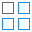   | Rectangular Array        | [ARRAYRECT](https://help.autodesk.com/view/ACD/2026/ENU/?guid=GUID-BB3DA888-0C3A-4C68-A3ED-E0E528781205)         | Crea un arreglo de objetos o copia múltiple de objetos en una secuencia rectangular.                                                                                                                    |
|     | Path Array               | [ARRAYPATH](https://help.autodesk.com/view/ACD/2026/ENU/?guid=GUID-D36C46CD-4E17-4A16-A387-C0B158EA5A9E)         | Crea un arreglo de objetos o copia múltiple de objetos a lo largo de una trayectoria definida.                                                                                                          |
|  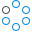  | Polar Array              | [ARRAYPOLAR](https://help.autodesk.com/view/ACD/2026/ENU/?guid=GUID-A6E74297-2CB3-4B1C-A07B-69CD08630052)        | Crea un arreglo de objetos o copia múltiple de objetos al rededor de una circunferencia.                                                                                                                |
|        | Offset                   | [OFFSET](https://help.autodesk.com/view/ACD/2026/ENU/?guid=GUID-C0E4246D-C420-42BD-A6FC-8B1852EFD005) `O`        | Crea lineas paralelas a un objeto, distancias positivas indican que la paralela se traza fuera del objeto cuando este es una polilínea cerrada.                                                         |
|  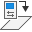  | Set To ByLayer           | [SETBYLAYER](https://help.autodesk.com/view/ACD/2026/ENU/?guid=GUID-A9D9FF14-4EF6-4A25-B0F4-506C6B792E9E)        | Permite restablecer la propiedades de capa de un objeto.                                                                                                                                                |
|   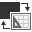    | Change Space             | [CHSPACE](https://help.autodesk.com/view/ACD/2026/ENU/?guid=GUID-343F7917-6CED-4823-8E38-90895FF740EB)           | Permite transferir un objeto entre el espacio de modelado o el espacio de dibujo de impresión.                                                                                                          |
|      | Lengthen                 | [LENGTHEN](https://help.autodesk.com/view/ACD/2026/ENU/?guid=GUID-76C74C62-DBAA-41E7-8422-F0EE7E769638)          | Alargar un objeto estableciendo un valor o porcentaje.                                                                                                                                                  |
|         | Edit Polyline            | [PEDIT](https://help.autodesk.com/view/ACD/2026/ENU/?guid=GUID-0C422AA9-23DD-4650-AD66-68E9D7989E3F) `PE`        | Editar una polilínea, p. ej., para cerrarla.                                                                                                                                                            |
|     | Edit Spline              | [SPLINEDIT](https://help.autodesk.com/view/ACD/2026/ENU/?guid=GUID-5530922C-6828-48B1-804C-EDD9053535BD)         | Editar líneas espirales.                                                                                                                                                                                |
|     | Edit Hatch               | [HATCHEDIT](https://help.autodesk.com/view/ACD/2026/ENU/?guid=GUID-2424838A-4B9D-4577-84E7-AE7949DA31AF)         | Editar achurados o rellenos.                                                                                                                                                                            |
|  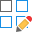   | Edit Array               | [ARRAYEDIT](https://help.autodesk.com/view/ACD/2026/ENU/?guid=GUID-BD2D21A1-ED66-4A1A-B1DE-551D41C5D7E3)         | Editar arreglos de objetos.                                                                                                                                                                             |
|         | Align                    | [ALIGN](https://help.autodesk.com/view/ACD/2026/ENU/?guid=GUID-D0FA10D5-76EE-4B80-A285-43C7F39916DB) `AL`        | Alinear un objeto con otro.                                                                                                                                                                             |
|    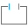     | Break                    | [BREAK](https://help.autodesk.com/view/ACD/2026/ENU/?guid=GUID-36A1CDE0-3871-4B25-AC98-93235FA83863)             | Partir un objeto entre dos puntos.                                                                                                                                                                      |
| 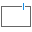 | Break at Point           | [BREAKATPOINT](https://help.autodesk.com/view/ACD/2026/ENU/?guid=GUID-E0439DE0-B2C3-4233-BB4D-5A574A00694B)      | Partir un objeto en un punto especificado.                                                                                                                                                              |
|     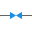     | Join                     | [JOIN](https://help.autodesk.com/view/ACD/2026/ENU/?guid=GUID-4D2A28C3-3E7F-4830-BE6A-7C9907C95488) `J`          | Unir objetos para crear un único objeto.                                                                                                                                                                |
|   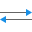    | Reverse                  | [REVERSE](https://help.autodesk.com/view/ACD/2026/ENU/?guid=GUID-EAE8C2C3-B780-4501-9CBD-C06346CC9F2E)           | Cambiar el sentido vectorial de dibujo de un objeto, p. ej., al digitalizar un río, este puede haber sido digitalizado en el sentido inverso del flujo y con este comando podrá cambiar su sentido.     |
|    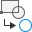     | Copy Nested Objects      | [NCOPY](https://help.autodesk.com/view/ACD/2026/ENU/?guid=GUID-12FCCFDF-9B3B-48D0-AC46-DF1D3519B0E5)             | Copia objetos embebidos dentro de bloques o archivos de dibujo de referencias externas.                                                                                                                 |
|   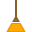   | Delete Duplicate Objects | [OVERKILL](https://help.autodesk.com/view/ACD/2026/ENU/?guid=GUID-44B9ECFC-752C-4CC5-9DA3-84DBF3B17CA6)          | Elimina elementos duplicados idénticos.                                                                                                                                                                 |
|     | Bring To - Draw order    | [DRAWORDER](https://help.autodesk.com/view/ACD/2026/ENU/?guid=GUID-3DC76D6E-8F81-4803-8D0A-AA7541D6357E)         | Cambia el orden o posición de dibujo de un objeto con respecto a otro, p. ej., una columna que se encuentra en la capa S-COLS puede ser colocada encima o debajo de un muro dibujado en la capa A-WALL. |

### Generales

|                                         Ícono                                         | Herramienta              | Comando                                                                                                                                                                                                                                                              | Utilidad                                                                                                                                                                                                                                                             |
|:-------------------------------------------------------------------------------------:|:-------------------------|:---------------------------------------------------------------------------------------------------------------------------------------------------------------------------------------------------------------------------------------------------------------------|:---------------------------------------------------------------------------------------------------------------------------------------------------------------------------------------------------------------------------------------------------------------------|
|                                                                                       | Activar Command          | <kbd>ctrl</kbd> + <kbd>0</kbd>, COMMANDLINE                                                                                                                                                                                                                          | Reabre la barra de línea de comandos. Utilice COMMANDLINEHIDE para cerrarla.                                                                                                                                                                                         |
|                                                                                       | Properties               | <kbd>ctrl</kbd> + <kbd>1</kbd>                                                                                            | Muestra el panel de propiedades y las propiedades asociadas a un objeto seleccionado.                                                                                                                                                                                |
|                                                                                       | 3D orbit                 | <kbd>Shift</kbd> + Mouse Wheeler click                                                                                    | Activa el modo Orbit 3D.                                                                                                                                                                                                                                             |
|                                                                                       | Cargar App               | [APPLOAD](https://help.autodesk.com/view/ACD/2026/ENU/?guid=GUID-47621BB1-F29D-4A69-9C99-A6E1495FBA38), AP                | Cargar y remover herramientas complementarias de AutoCAD, p. ej., archivos LISP.                                                                                                                                                                                     |
|                                                                                       | Customize user interface | [CUI](https://help.autodesk.com/view/ACD/2026/ENU/?guid=GUID-7F8F4B26-EFAF-4033-B7B7-CA39FC4E104A)                        | Administra la interfaz de usuario personalizada. (;) al final de una sentencia en CUI corresponde a Enter en el teclado. (^C) al final de una sentencia en CUI corresponde a ESC en el teclado.                                                                      |
|                                                                                       | Delobj                   | [DELOBJ](https://help.autodesk.com/view/ACD/2026/ENU/?guid=GUID-CB64587F-611E-441E-AB07-14B415BF535F) (System Variable)   | Variable de sistema para definir si al crear un elemento 3D a partir de un objeto, este se elimina o se mantiene. 3: elimina el objeto inicial luego de la extrusión. 0: se mantiene el objeto original. -1: AutoCAD solicita si se elimina o no el objeto original. |
|                                                                                       | JPEG export              | [JPGOUT](https://help.autodesk.com/view/ACD/2026/ENU/?guid=GUID-1A2C1CB7-2323-456E-AF23-1FBA900E5EFC)                     | Guarda el objeto seleccionado en un archivo con formato JPEG.                                                                                                                                                                                                        |
|                                                                                       | Layer                    | [LAYER](https://help.autodesk.com/view/ACD/2026/ENU/?guid=GUID-9123091A-2DCB-4DE8-983C-F7CA38FA67BE), LA                  | Acceso a definición y configuración de capas.                                                                                                                                                                                                                        |
|                                                                                       | Limits                   | [LIMITS](https://help.autodesk.com/view/ACD/2026/ENU/?guid=GUID-6CF82FC7-E1BC-4A8C-A23D-4396E3D99632)                     | Establece un área rectangular invisible como límite de dibujo. Con el comando GRIDDISPLAY establecido en cero (0), podrá visualizar sú límite a partir de la grilla de usuario (3 corresponde a grilla en todo el espacio de modelado).                              |
|                                                                                       | Line scale               | [LTSCALE](https://help.autodesk.com/view/ACD/2026/ENU/?guid=GUID-47B3793A-37BF-45FC-94CB-670433ADD366)                    | Establece el factor global de escala en la representación de líneas con patrón.                                                                                                                                                                                      |
|                                                                                       | Propiedades de masa      | [MASSPROP](https://help.autodesk.com/view/ACD/2026/ENU/?guid=GUID-CAA51229-293E-4A0C-BFF3-93226252CF13)                   | Calcula las propiedades de masa de una región 2D o de un sólido 3D.                                                                                                                                                                                                  |
|                                                                                       | Reflejar texto           | [MIRRTEXT](https://help.autodesk.com/view/ACD/2026/ENU/?guid=GUID-D55D2D18-B26E-4525-B5E4-03A2A07FB5F6) (System Variable) | Variable de sistema para establecer si el texto es reflejado usando el comando MIRROR.                                                                                                                                                                               |
|                                                                                       | Model view               | [MVIEW](https://help.autodesk.com/view/ACD/2026/ENU/?guid=GUID-731B2752-B9E2-443E-816A-9B4851296455), MV                  | Crea una ventana de visualización al espacio de modelado en el espacio de papel.                                                                                                                                                                                     |
|                                                                                       | Point type               | [PTYPE](https://help.autodesk.com/view/ACD/2026/ENU/?guid=GUID-2ECD656C-989D-40EE-8D1A-AF010A5CD2A2)                      | Establece el tipo y tamaño de representación visual a usar en puntos.                                                                                                                                                                                                |
|                                                                                       | Redraw                   | [REDRAW](https://help.autodesk.com/view/ACD/2026/ENU/?guid=GUID-6AD77E11-D549-47E7-AE4C-EFE372A0F0C4)                     | Refresca la pantalla en el viewport actual eliminando elementos que ya han sido eliminados.                                                                                                                                                                          |
|                                                                                       | Regen                    | [REGEN](https://help.autodesk.com/view/ACD/2026/ENU/?guid=GUID-CC98095F-B4C4-4B25-9097-A7B6EF4260B2)                      | Regenera todo el dibujo contenido en el espacio de modelado de un viewport, permitiendo visualizar arcos con mayor precisión.                                                                                                                                        |
|      | Surface sculpture        | [SURFSCULPT](https://help.autodesk.com/view/ACD/2026/ENU/?guid=GUID-0436666E-08CB-40CA-81B3-F79BD3447006)                 | Corta y combina un conjunto de superficies o mallados que encierran un espacio determinado, en un sólido 3D.                                                                                                                                                         |
|    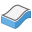    | Thicken                  | [THICKEN](https://help.autodesk.com/view/ACD/2026/ENU/?guid=GUID-50CAFB97-22BA-4224-9B48-60D6E7ABFCF1)                    | Convierte una superficie en un sólido 3D con un espesor definido.                                                                                                                                                                                                    |
|                                                                                       | Text to Mtext            | [TXT2MTXT](https://help.autodesk.com/view/ACD/2026/ENU/?guid=GUID-1E68C8B2-520F-4084-BD20-51DC4A32A7E5)                   | Convierte objetos de textos de líneas sencillas en un objeto de texto multilínea.                                                                                                                                                                                    |
|                                                                                       | Units                    | [UNITS](https://help.autodesk.com/view/ACD/2026/ENU/?guid=GUID-1DAE2080-84E4-413E-BB4E-F5D2A96CB14A), UN                  | Configuración de unidades de dibujo.                                                                                                                                                                                                                                 |
|                                                                                       | DWG units                | DWGUNITS                                                                                                                  |                                                                                                                                                                                                                                                                      |
|                                                                                       |                          |                                                                                                                           |                                                                                                                                                                                                                                                                      |

## Iconografía [^1]

|           Ícono            | shortcode                    | Utilidad                                                                                             |
|:--------------------------:|:-----------------------------|:-----------------------------------------------------------------------------------------------------|
|          :house:           | `:house:`                    | Ir al inicio de la documentación wiki o del catálogo general de actividades del curso o del proyecto |
|         :beginner:         | `:beginner:`                 | Solicitar a través de discusiones: ayuda, soporte, enviar preguntas o respuestas, ideas...           |
|       :mortar_board:       | `:mortar_board:`             | Referenciar otra actividad previa o indicar como aprender.                                           |
|     :open_file_folder:     | `:open_file_folder:`         | Elemento descargable mediante uno o varios enlaces.                                                  |
|           :new:            | `:new:`                      | Elemento nuevo en cualquier sección, actividad o en documentación.                                   |
|       :lady_beetle:        | `:lady_beetle:`              | Solución de errores o bugs.                                                                          |
|         :pencil2:          | `:pencil2:`                  | Actividades complementarias a desarrollar por el estudiante.                                         |
|           :bulb:           | `:bulb:`                     | Idea o forma alternativa de realizar un procedimiento o una subactividad.                            |
|           :hook:           | `:hook:`                     | Hiperenlace directo a otra actividad o sección.                                                      |
|     :1st_place_medal:      | `:1st_place_medal:`          | Actividad requerida para obtener la certificación.                                                   |
|      :sun_with_face:       | `:sun_with_face:`            | Iniciar el curso.                                                                                    |
|         :infinity:         | `:infinity:`                 | Ver otros cursos.                                                                                    |
|         :notebook:         | `:notebook:`                 | Referencias generales.                                                                               |
|          :label:           | `:label:`                    | Abreviaturas o definiciones generales.                                                               |
|           :star:           | `:star:`                     | Seguir este repositorio.                                                                             |
|        :blue_heart:        | `:blue_heart:`               | Consejo o buena práctica.                                                                            |
|   :globe_with_meridians:   | `:globe_with_meridians:`     | Localización geográfica.                                                                             |
|         :compass:          | `:compass:`                  | Mapa digital impreso requerido.                                                                      |
|     :triangular_ruler:     | `:triangular_ruler:`         | Actividad de proyecto                                                                                |
|       :closed_book:        | `:closed_book:`              | Documento digital en Adobe Acrobat.                                                                  |
|   :busts_in_silhouette:    | `:busts_in_silhouette:`      | Grupo de proyecto                                                                                    |
|     :man_technologist:     | `:man_technologist:`         | Usuario                                                                                              |
|           :mag:            | `:mag:`                      | Caso de estudio / Case Study                                                                         |
|           :fire:           | `:fire:`                     | Riesgo natural / Alerta                                                                              |
|  :vertical_traffic_light:  | `:vertical_traffic_light:`   | Network Analyst                                                                                      |
|          :rocket:          | `:rocket:`                   | Fotogrametría                                                                                        |
|      :round_pushpin:       | `:round_pushpin:`            | Capa geográfica vectorial (punto, línea, polígono)                                                   |
|        :satellite:         | `:satellite:`                | Ráster o imagen                                                                                      |
| :chart_with_upwards_trend: | `:chart_with_upwards_trend:` | Gráfica o chart                                                                                      |
|           :date:           | `:date:`                     | Libro de Microsoft Excel                                                                             |

Markdown emojis: https://gist.github.com/rxaviers/7360908

## Abreviaturas

| Abreviatura                                                                                   | Significado                                                                                                                                                                                                                                                                                                                                                                                                                                                                                |
|:----------------------------------------------------------------------------------------------|:-------------------------------------------------------------------------------------------------------------------------------------------------------------------------------------------------------------------------------------------------------------------------------------------------------------------------------------------------------------------------------------------------------------------------------------------------------------------------------------------|
| N/A                                                                                           | No aplica                                                                                                                                                                                                                                                                                                                                                                                                                                                                                  |
| N/D                                                                                           | No disponible                                                                                                                                                                                                                                                                                                                                                                                                                                                                              |
| POT                                                                                           | [Plan de Ordenamiento Territorial](http://www.secretariasenado.gov.co/senado/basedoc/ley_0388_1997.html), Ley 388 de 1997 Colombia - Suramérica                                                                                                                                                                                                                                                                                                                                            |
| EOT                                                                                           | [Esquema de Ordenamiento Territorial](http://www.secretariasenado.gov.co/senado/basedoc/ley_0388_1997.html), Ley 388 de 1997 Colombia - Suramérica                                                                                                                                                                                                                                                                                                                                         |
| PBOT                                                                                          | [Plan Básico de Ordenamiento Territorial](http://www.secretariasenado.gov.co/senado/basedoc/ley_0388_1997.html), Ley 388 de 1997 Colombia - Suramérica                                                                                                                                                                                                                                                                                                                                     |
| PDM                                                                                           | Plan de desarrollo municipal                                                                                                                                                                                                                                                                                                                                                                                                                                                               |
| SO, OS                                                                                        | [Sistema operativo.](https://en.wikipedia.org/wiki/Operating_system)                                                                                                                                                                                                                                                                                                                                                                                                                       |
| CMD                                                                                           | [Command o intérprete de comandos del SO.](https://en.wikipedia.org/wiki/Cmd.exe)                                                                                                                                                                                                                                                                                                                                                                                                          |
| GUI                                                                                           | [Graphical user interface. Interfaz gráfica de usuario.](https://en.wikipedia.org/wiki/Graphical_user_interface)                                                                                                                                                                                                                                                                                                                                                                           |
| WMO                                                                                           | [World Meteorological Organization.](https://public.wmo.int/en)                                                                                                                                                                                                                                                                                                                                                                                                                            |
| OMM                                                                                           | [Organización Meteorológica Mundial.](https://public.wmo.int/es)                                                                                                                                                                                                                                                                                                                                                                                                                           |
| IDEAM                                                                                         | [Instituto de Hidrología, Meteorología y Estudios Ambientales - IDEAM](http://www.ideam.gov.co/) de Colombia - Suramérica                                                                                                                                                                                                                                                                                                                                                                  |
| NASA                                                                                          | [National Aeronautics and Space Administration](https://www.nasa.gov/) de Estados Unidos de América                                                                                                                                                                                                                                                                                                                                                                                        |
| DEM                                                                                           | [Digital elevation model. Modelo digital de elevación.](https://pro.arcgis.com/en/pro-app/2.8/tool-reference/spatial-analyst/exploring-digital-elevation-models.htm)                                                                                                                                                                                                                                                                                                                       |
| CRS                                                                                           | [Coordinate reference system.](https://docs.qgis.org/3.22/en/docs/gentle_gis_introduction/coordinate_reference_systems.html)                                                                                                                                                                                                                                                                                                                                                               |
| ASTER                                                                                         | [Advanced Spaceborne Thermal Emission and Reflection Radiometer ](https://asterweb.jpl.nasa.gov/gdem.asp)                                                                                                                                                                                                                                                                                                                                                                                  |
| ALOS                                                                                          | [Advanced Land Observing Satellite](https://asf.alaska.edu/data-sets/sar-data-sets/alos-palsar/)                                                                                                                                                                                                                                                                                                                                                                                           |
| PALSAR                                                                                        | [Phased Array type L-band Synthetic Aperture Radar ](https://asf.alaska.edu/data-sets/sar-data-sets/alos-palsar/)                                                                                                                                                                                                                                                                                                                                                                          |
| LIDAR                                                                                         | [Light Detection And Ranging](https://en.wikipedia.org/wiki/Lidar)                                                                                                                                                                                                                                                                                                                                                                                                                         |
| EPSG                                                                                          | [Geodetic Parameter Dataset](https://en.wikipedia.org/wiki/EPSG_Geodetic_Parameter_Dataset)                                                                                                                                                                                                                                                                                                                                                                                                |
| SIG                                                                                           | [Sistema de información geográfica](https://www.esri.com/es-es/what-is-gis/overview)                                                                                                                                                                                                                                                                                                                                                                                                       |
| GIS                                                                                           | [Geographical information system](https://www.esri.com/en-us/what-is-gis/overview)                                                                                                                                                                                                                                                                                                                                                                                                         |
| m.s.n.m                                                                                       | Elevación inversa o cota en metros sobre el nivel del mar                                                                                                                                                                                                                                                                                                                                                                                                                                  |
| GNSS                                                                                          | Sistema global de navegación por satélite. Representa todos los sistemas satelitales que se utilizan actualmente en todo el mundo, como GPS, GLONASS y Galileo                                                                                                                                                                                                                                                                                                                             |
| GPS                                                                                           | Sistema de posicionamiento global. Sistema satelital que se utiliza habitualmente en Norteamérica                                                                                                                                                                                                                                                                                                                                                                                          |
| NMEA                                                                                          | National Marine and Electronics Association de los Estados Unidos de América                                                                                                                                                                                                                                                                                                                                                                                                               |
| GLONASS                                                                                       | Es un Sistema Global de Navegación por Satélite (GNSS) desarrollado por la Unión Soviética, siendo hoy administrado por la Federación de Rusia y que constituye el homólogo del GPS estadounidense y del Galileo europeo                                                                                                                                                                                                                                                                   |
| Galileo                                                                                       | Es el sistema europeo de radionavegación y posicionamiento por satélite desarrollado por la Agencia Espacial Europea (ESA) y financiado por la Comisión Europea, estando operado por la Agencia de la Unión Europea para el Programa Espacial (EUSPA)                                                                                                                                                                                                                                      |
| QZSS                                                                                          | El Sistema por Satélite Cuasicenital (Quasi-Zenith Satellite System), es un sistema de corrección de señales de navegación global por satélite o SBAS, propuesto para uso complementario del GPS estadounidense en Japón                                                                                                                                                                                                                                                                   |
| BeiDou                                                                                        | El sistema de navegación por satélite BeiDou  es un sistema de navegación por satélite chino                                                                                                                                                                                                                                                                                                                                                                                               |
| NavIC                                                                                         | El sistema de navegación regional por satélite (IRNSS), cuyo nombre operacional es NavIC (acrónimo de Navegación con Constelaciones de la India), es un sistema autónomo de navegación por satélite que provee posicionamiento preciso en tiempo real y servicios horarios                                                                                                                                                                                                                 |
| [CRS](https://en.wikipedia.org/wiki/Spatial_reference_system)                                 | Coordinate reference system                                                                                                                                                                                                                                                                                                                                                                                                                                                                |
| [SRS](https://en.wikipedia.org/wiki/Spatial_reference_system)                                 | Spatial reference system                                                                                                                                                                                                                                                                                                                                                                                                                                                                   |
| [EPSG](https://en.wikipedia.org/wiki/EPSG_Geodetic_Parameter_Dataset)                         | Geodetic Parameter Dataset (also EPSG registry) is a public registry of geodetic datums, spatial reference systems, Earth ellipsoids, coordinate transformations and related units of measurement, originated by a member of the European Petroleum Survey Group (EPSG) in 1985.                                                                                                                                                                                                           |
| [ITRF](https://en.wikipedia.org/wiki/International_Terrestrial_Reference_System_and_Frame)    | The International Terrestrial Reference System (ITRS) describes procedures for creating reference frames suitable for use with measurements on or near the Earth's surface.                                                                                                                                                                                                                                                                                                                |
| [UTM](https://es.wikipedia.org/wiki/Sistema_de_coordenadas_universal_transversal_de_Mercator) | El sistema de coordenadas universal transversal de Mercator (en inglés Universal Transverse Mercator, UTM) es un sistema de coordenadas basado en la proyección cartográfica transversa de Mercator, que se construye como la proyección de Mercator normal, pero en vez de hacerla tangente al Ecuador, se la hace secante a un meridiano. A diferencia del sistema de coordenadas geográficas, expresadas en longitud y latitud, las magnitudes en el sistema UTM se expresan en metros. |
| SGR                                                                                           | Sistema general de regalías                                                                                                                                                                                                                                                                                                                                                                                                                                                                |
|                                                                                               |                                                                                                                                                                                                                                                                                                                                                                                                                                                                                            |

## Definiciones

| Definición                                                                                                                             | Descripción                                                                                                                                                                                                                                                                                                                                                                                                                                                                            |
|:---------------------------------------------------------------------------------------------------------------------------------------|:---------------------------------------------------------------------------------------------------------------------------------------------------------------------------------------------------------------------------------------------------------------------------------------------------------------------------------------------------------------------------------------------------------------------------------------------------------------------------------------|
| [Standalone](https://en.wikipedia.org/wiki/Standalone_software)                                                                        | Instalación independiente                                                                                                                                                                                                                                                                                                                                                                                                                                                              |
| [Datum](https://en.wikipedia.org/wiki/Geodetic_datum)                                                                                  | Un sistema de referencia geodésico es un recurso matemático que permite asignar coordenadas a puntos sobre la superficie terrestre                                                                                                                                                                                                                                                                                                                                                     |
| [Dispositivo (ubicación)](https://pro.arcgis.com/es/pro-app/latest/help/mapping/device-location/gnss-and-location-devices.htm)         | Equipo, ya sea móvil o de escritorio, que se utiliza para rastrear la posición global                                                                                                                                                                                                                                                                                                                                                                                                  |
| [Zona de influencia de precisión](https://pro.arcgis.com/es/pro-app/latest/help/mapping/device-location/gnss-and-location-devices.htm) | Contorno circular que rodea la ubicación del dispositivo. La zona de influencia representa la probabilidad de que, si el dispositivo no está exactamente en la ubicación especificada, esté dentro de esta área                                                                                                                                                                                                                                                                        |
| [Seguimiento](https://pro.arcgis.com/es/pro-app/latest/help/mapping/device-location/gnss-and-location-devices.htm)                     | Término utilizado en la navegación global que se refiere a cuando la dirección hacia la que se dirige en un mapa siempre se encuentra en la parte superior de la pantalla. Lo contrario es Norte hacia arriba o el ángulo de rotación establecido del mapa                                                                                                                                                                                                                             |
| [Cartografía](https://support.esri.com/es-es/gis-dictionary/surveying)                                                                 | Registro y mediciones del terreno, relieve y formas del terreno de la superficie de la tierra, los planetas y las lunas                                                                                                                                                                                                                                                                                                                                                                |
| [Reseña](https://definicion.com/resena-historica/)                                                                                     | Se denomina así al escrito que se usa para informar sobre algo al mismo tiempo que lo valora. Una de sus características principales es que, una reseña, describe y emite un juicio sobre una obra, un fenómeno o una situación; ya sea a favor o en contra de la misma. Como valoración de algo, la reseña es puramente descriptiva y siempre está acompañada de argumentos sólidos. En este sentido, es un modo de presentar o evaluar un objeto o una situación, de manera crítica. |
| [Histórica](https://definicion.com/resena-historica/)                                                                                  | Palabra relativa a historia, por tanto, refiere a algo que ha tenido existencia en el pasado reciente o lejano y que, además, se caracteriza por haber sido algo real y comprobado. Generalmente, abarca un periodo de tiempo, el cual se describe y se analiza.                                                                                                                                                                                                                       |
|                                                                                                                                        |                                                                                                                                                                                                                                                                                                                                                                                                                                                                                        |

## Extensiones y tipos de archivos

| Extensión                                  | Descripción                                                                      |
|:-------------------------------------------|----------------------------------------------------------------------------------|
| [.dwg](https://fileinfo.com/extension/dwg) | AutoCAD Drawing                                                                  |
| [.dxf](https://fileinfo.com/extension/dxf) | Drawing Exchange Format File                                                     |
| [.lsp](https://fileinfo.com/extension/lsp) | Lisp Program Source Code File                                                    |
| [.md](https://fileinfo.com/extension/md)   | Markdown file                                                                    |
| [.shp](https://fileinfo.com/extension/shp) | Esri Shapefile vector                                                            |
| [.shx](https://fileinfo.com/extension/shx) | Esri Shapefile vector index                                                      |
| [.dbf](https://fileinfo.com/extension/dbf) | DBase file                                                                       |
| .prj                                       | File coordinates projection system in GIS systems HEC-RAS projec file         |
| [.sh](https://fileinfo.com/extension/sh)   | Bash shell script for Linux                                                      |
| [.hgt](https://fileinfo.com/extension/hgt) | Shuttle Radar Topography Mission (SRTM) file                                     |
| [.mxd](https://fileinfo.com/extension/mxd) | Esri map document ArcGIS for Desktop                                             |
| [.sxd](https://fileinfo.com/extension/sxd) | Esri scene ArcGIS for Desktop                                                    |
| [.qgz](https://fileinfo.com/extension/qgz) | QGIS map                                                                         |
| .gdb                                       | Esri geodatabase                                                                 |
| .aprx                                      | Esri ArcGIS Pro map project                                                      |
| [.tif](https://fileinfo.com/extension/tif) | GeoTIFF raster file                                                              |
| .ovr                                       | Raster pyramid format for raster files in a GIS                                  |
| [.xml](https://fileinfo.com/extension/xml) | Extensible Markup Language for Application programming interface                 |
| .vrt                                       | [Format driver for GDAL -  XML schema](https://gdal.org/drivers/raster/vrt.html) |
| [.py](https://fileinfo.com/extension/py)   | Python script files                                                              |
| [.pyc](https://fileinfo.com/extension/pyc) | Compiled Python Files                                                            |
| [.tfw](https://fileinfo.com/extension/tfw) | TIFF world file                                                                  |
| [.csv](https://fileinfo.com/extension/csv) | Comma separated values file                                                      |

_R.HCMC es de uso libre para fines académicos, conoce nuestra licencia, cláusulas, condiciones de uso y como referenciar los contenidos publicados en este repositorio, dando [clic aquí](LICENSE.md)._

_¡Encontraste útil este repositorio!, apoya su difusión marcando este repositorio con una ⭐ o síguenos dando clic en el botón Follow de [rcfdtools](https://github.com/rcfdtools) en GitHub._

| [:house: Inicio](README.md) |
|-----------------------------|

[^1]: https://github.com/ikatyang/emoji-cheat-sheet