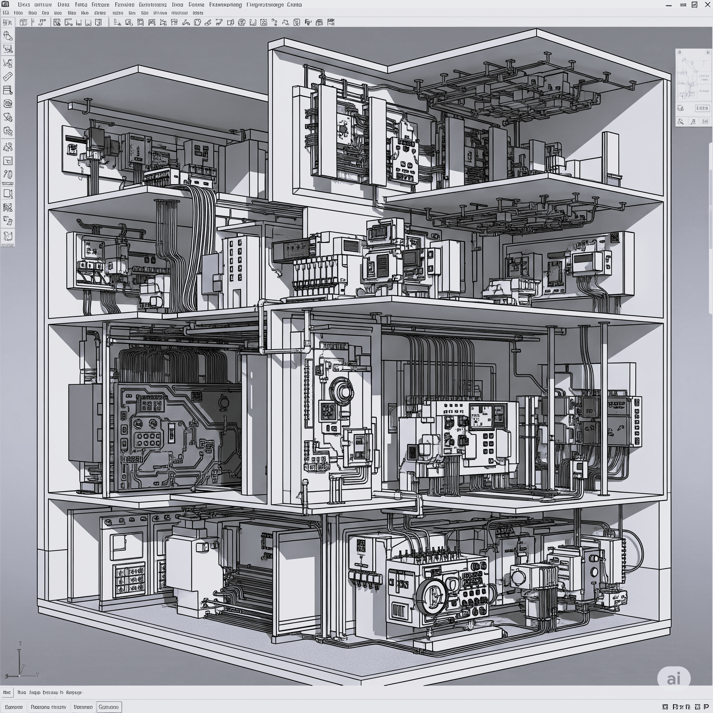

# Dibujo asistido por computador - DAPC
Keywords: `cad` `computed-aidded-design` `autodesk` `autocad` `revit` `bim` `qgis` `mapping-system`

La ingeniería eléctrica contemporánea implica un trabajo multidisciplinario que requiere una comprensión integral de diversos campos y la adopción constante de tecnologías avanzadas para enfrentar los desafíos actuales y futuros. El estudio del dibujo gráfico por computador brinda a los estudiantes la capacidad de visualizar de manera avanzada proyectos eléctricos antes de su implementación, así como la integración de los sistemas eléctricos en el contexto de una construcción o un entorno geográfico definido. La incorporación del dibujo gráfico por computador con herramientas actualizadas de diseño gráfico, sistemas de información geográfica y modelado de información para la construcción en la formación de estudiantes de ingeniería eléctrica promueve una perspectiva integral, mejora las capacidades técnicas y prepara a los futuros ingenieros para enfrentar los desafíos de una industria en evolución. 

 Generado con: <a href="https://gemini.google.com/app/aeeb9a71c799bdf7">https://gemini.google.com</a>  

## Participantes, metodología y requerimientos

El contenido del curso está dirigido a estudiantes de pregrado que se encuentren cursando estudios de ingeniería eléctrica. Como prerrequisito, los estudiantes requieren de conocimientos básicos en programación de computadores.

**Metodología académica**

* Mediante el desarrollo de talleres prácticos, presentar a los participantes, diferentes conceptos y aplicaciones del dibujo asistido por computador en la ingeniería.
* Al inicio de cada clase, el tutor realizará una presentación y demostración general de los conceptos y las herramientas computacionales a utilizar y luego los estudiantes desarrollarán los contenidos de cada taller, actividad o ejercicio.
* Proyecto de clase: se desarrolla en grupos y se evalúan los conocimientos adquiridos en los talleres prácticos; consta de 3 componentes: CAD, GIS y BIM.
* Antes de cada clase, es recomendable que los participantes den lectura a las guías de clase para así comprender mejor las explicaciones recibidas en aula.

**Evaluación**

La evaluación del desempeño de los estudiantes valora el cumplimiento de los objetivos propuestos y los compromisos adquiridos en la asignatura. Se realiza el seguimiento del avance de cada estudiante, verificando tanto los conocimientos adquiridos como las competencias desarrolladas. Las calificaciones de los estudiantes como expresión cuantitativa de la evaluación del aprendizaje, considera tres calificaciones, una por cada tercio con los siguientes porcentajes: primer tercio 30%, segundo tercio 30% y tercer tercio 40 %. En el último tercio se realiza un examen final obligatorio que comprende todos los temas tratados durante el semestre.

* Asistencia: se evalúa individualmente.
* Quices: se presentan individualmente.
* [Ejercicios por actividad](activity/Readme.md ): se evalúan en grupo.
* [Proyecto CAD](activity/M01A06/Readme.md): se evalúa en grupo.
* [Proyecto GIS](file/table/DAPC_ProyectoGIS.xlsx): se evalúa en grupo.
* [Proyecto BIM](file/table/DAPC_ProyectoBIM.xlsx): se evalúa en grupo.

> Estudiantes con calificación inferior a 3.0 en el tercio académico, presentan examen y será computado con las demás calificaciones obtenidas en cada cohorte.  

## Software requerido, repositorio de proyecto y estructura de directorios

Para el desarrollo del curso y las actividades del proyecto final, son requeridas las siguientes herramientas, estructura de directorios y reportar su repositorio de archivos:

| Requerimiento                                                                      | Descripción                                                                                                                                                                                                                |
|:-----------------------------------------------------------------------------------|:---------------------------------------------------------------------------------------------------------------------------------------------------------------------------------------------------------------------------|
| [:toolbox:Herramienta](https://www.office.com/)                                    | Microsoft 365 (Word, Excel, OneDrive, Teams).                                                                                                                                                                              |
| [:toolbox:Herramienta](https://notepad-plus-plus.org/)                             | Notepad++ (editor de texto).                                                                                                                                                                                               |
| [:toolbox:Herramienta](https://qgis.org/)                                          | QGIS 3.44 o superior.                                                                                                                                                                                                      |
| [:toolbox:Herramienta](https://www.autodesk.com/products/autocad)                  | Autodesk Autocad 2026 o superior (english version).                                                                                                                                                                        |
| [:toolbox:Herramienta](https://www.autodesk.com/products/revit)                    | Autodesk Revit 2026 o superior (english version).                                                                                                                                                                          |
| [:open_file_folder:Repositorio de proyecto](https://forms.office.com/r/gVg8DjvVFh) | Para la revisión de los avances del proyecto y calificación de los ejercicios prácticos, crear y compartir un repositorio de archivos (p. ej., en OneDrive de Campus) con los integrantes de su grupo y con el instructor. |
| [:open_file_folder:Estructura de directorios](file/Readme.md)                      | Estructura requerida para el desarrollo del proyecto.                                                                                                                                                                      |

> :blue_heart: El repositorio de proyecto deberá mantenerse durante la duración del curso, estableciendo permisos de escritura para los integrantes de su grupo y lectura para el instructor.

## :globe_with_meridians:Módulo 1: Dibujo asistido por computadora con AutoCAD

En este módulo abordaremos: Conceptos básicos, Usos y aplicaciones de AutoCAD, Entorno gráfico e interfaz de AutoCAD, Comandos básicos, Dibujo de elementos básicos, Presentación de elementos básicos, Achurado y sombreado, Dimensionamiento de elementos, Herramientas de acotado, Rotulado, Herramientas de edición y dibujo en 3D, Creación y estructurado de un plano, Manejo de ventanas de impresión, Capas, Viewports: manejo de escalas, plantas, perfiles y secciones transversales.

> Las horas definidas en la columna _Duración_ de las diferentes actividades por módulo, corresponden a horas en aula. Por cada hora de clase, el estudiante dedicará al menos 1 hora de trabajo en casa. Con respecto a los ejercicios y actividades de proyecto que son presentados y evaluados en grupo, la dedicación corresponde al número de horas indicadas multiplicado por el número de integrantes.

| Actividad                                                                                          | Descripción                                                                                                                                                                                                                                                                                                                                                                                                                                                                                                        | Duración (hr) |
|----------------------------------------------------------------------------------------------------|--------------------------------------------------------------------------------------------------------------------------------------------------------------------------------------------------------------------------------------------------------------------------------------------------------------------------------------------------------------------------------------------------------------------------------------------------------------------------------------------------------------------|:-----------------:|
| [1.1. Conceptos básicos de diseño asistido por computador - CAD](activity/M01A01/Readme.md)        | Usos y aplicaciones de herramientas computacionales. Barra de menús. Comandos LINE, GRID y SNAP.  Quices individuales: [Quiz M01A01-1 Líneas 2D](https://forms.office.com/r/t1CnxzjqZZ) [Quiz M01A01-2 Isométrico con líneas](https://forms.office.com/r/NPq6b8z9xC).                                                                                                                                                                                                                                  |        4.5        |
| [1.2.a. Elementos básicos de dibujo / Creación de capas o layers](activity/M01A02a/Readme.md)      | Normas para definición de nombres y creación de capas o Layers.                                                                                                                                                                                                                                                                                                                                                                                                                                                    |        1.0        |
| [1.2.b. Elementos básicos de dibujo / UCS y Geometrías](activity/M01A02b/Readme.md)                | Sistema de coordenadas de usuario - UCS. Barra de herramientas de puntos de convergencia. Comandos de dibujo POLYLINE, CIRCLE, ARC, RECTANGLE, POLYGON, POINT, DONUT, HELIX... Comandos de modificación: FILLET, CHAMFER, ARRAY, OFFSET, TRIM, MIRROR...  Quices individuales: [Quiz M01A02b-1 Curvas simples](https://forms.office.com/r/qBK7cN5j1C) [Quiz M01A02b-2 Espiral](https://forms.office.com/r/TGfFgj4iw0) [Quiz M01A02b-3 Isométrico con arcos](https://forms.office.com/r/RcE7MtZ8ms). |        4.5        |
| [1.2.c. Elementos básicos de dibujo / Curvas especiales](activity/M01A02c/Readme.md)               | Dibujo de elipse, óvalo, parábola, hipérbola y funciones trigonométricas.  Quices individuales: [Quiz M01A02c-1 Curvas especiales / Conocimiento](https://forms.office.com/r/5uAeK0ckgH) [Quiz M01A02c-2 Curvas especiales / Ovoide](https://forms.office.com/r/wmMFi58peF).                                                                                                                                                                                                                           |        3.0        |
| [1.2.d. Dibujo en 3D](activity/M01A02d/Readme.md)                                                  | Creación de superficies y sólidos tridimensionales.  Quices individuales: [Quiz M01A02d-1 Objetos 3D / Piñon](https://forms.office.com/r/h933h2FrK6).                                                                                                                                                                                                                                                                                                                                                     |        4.5        |
| [1.3. Bloques - Achurados- Viewports](activity/M01A03/Readme.md)                                   | Diseño de bloques. Achurados y/o sombras. Figuras rellenas. Mosaico de vistas. Vistas fijas - espacio modelo. Vistas flotantes - espacio papel. Comandos: BLOCK, HATCH, SOLID, VPORTS, MVIEW, PSPACE, VPLAYER.                                                                                                                                                                                                                                                                                                     |        3.0        |
| [1.4. Textos, anotaciones y dimensionamiento](activity/M01A04/Readme.md)                           | Texto simple, multilínea y de anotación. Estilo de la dimensión. Acotado de líneas rectas, círculos, arcos y ángulos. Editar dimensiones. Superficies normales, inclinadas y oblicuas. Visibilidad de aristas.                                                                                                                                                                                                                                                                                                     |        2.0        |
| [1.5. Layout e Impresión](activity/M01A05/Readme.md)                                               | Creación de plantillas. Espacio papel y espacio modelo. Asignación de escala. Configuración de impresora y trazadores (plotter). Configuración del trazado. Impresión. Comandos MVSETUP, PRINT, ZOOM, SCALE.                                                                                                                                                                                                                                                                                                       |        3.0        |
| [1.6. Proyecto de dibujo asistido por computadora con Autodesk AutoCAD](activity/M01A06/Readme.md) | Aplicando los conceptos vistos durante el módulo 1 del curso, desarrollar un proyecto aplicado para el diseño de una bodega para el almacenamiento y distribución de transformadores eléctricos industriales.  [Autoevaluación individual de proyecto](https://forms.office.com/r/pBZtqhfHXY).                                                                                                                                                                                                               |        3.0        |

## :globe_with_meridians:Módulo 2: Sistemas de información geográfica GIS

En este módulo abordaremos: Fundamentos de los sistemas de información geográfica, Definición y edición de elementos de un SIG, Digitalización y entrada de entidades, Creación y edición de tablas relacionales, Mapas y cartografía, Elaboración de planos, Imágenes en SIG, Manejo y manipulación.

| Actividad                                                                                                                       | Descripción                                                                                                                                                                                                                                                                       | Duración (hr) |
|---------------------------------------------------------------------------------------------------------------------------------|-----------------------------------------------------------------------------------------------------------------------------------------------------------------------------------------------------------------------------------------------------------------------------------|:-----------------:|
| [2.1.a. Introducción y fundamentos](activity/M02A01a/Readme.md)                                                                 | Sistemas de información geográfica. Fundamentos. Proyecciones y origen de coordenadas.  Quices individuales: [Quiz M02A01a Introducción y fundamentos de GIS](https://forms.office.com/r/q3aqqd0pan)                                                                     |        1.0        |
| [2.1.b. Conceptos aplicados / Análisis de luminarias por UPZ en Bogotá D.C.](activity/M02A01b/Readme.md)                        | Simbología y estadísticas generales. Tablas relacionales.  Quices individuales: [Quiz M02A01b Estudio de luminarias Bogotá](https://forms.office.com/r/AGTRr8FpSp)                                                                                                       |        3.5        |
| [2.2.a. Definición y edición de elementos / Digitalización de campus](activity/M02A02a/Readme.md)                               | Bases de datos y su manejo en SIG. Definición de elementos de un SIG (shapes, raster, vectores, etc.). Edición de elementos. Digitalización y entrada de entidades.  Quices individuales: [Quiz M02A02a Digitalización de campus](https://forms.office.com/r/JZ14vQawZc) |        3.0        |
| [2.2.b. Definición y edición de elementos / Potencial fotovoltáico campus](activity/M02A02b/Readme.md)                          | Bases de datos y su manejo en SIG. Creación y edición de tablas relacionales. Generación de entidades geográficas.  Quices individuales: [Quiz M02A02b Potencial fotovoltáico campus](https://forms.office.com/r/SBEzvviFwA)                                             |        3.0        |
| [2.3.a. Mapas e imágenes / Red de interconexión energética nacional 2D y aislamientos RETIE](activity/M02A03a/Readme.md)        | Mapas y cartografía. Elaboración de planos. Procesamiento e integración de vectores con análisis de aferencias.  Quices individuales: [Quiz M02A03a Red de interconexión energética nacional 2D y aislamientos RETIE](https://forms.office.com/r/iFk9h9qeWy)             |        3.0        |
| [2.3.b. Mapas e imágenes / Modelos digitales de elevación DEM - Red de interconexión energética 3D](activity/M02A03b/Readme.md) | Mapas y cartografía. Elaboración de planos. Imágenes en SIG. Manejo y manipulación de imágenes. Procesamiento de modelos digitales de elevación.  Quices individuales: [Quiz M02A03b Red de interconexión energética 3D](https://forms.office.com/r/exiXxcvF7L)          |        3.0        |
| 2.3.c. Mapas e imágenes / Identificación de zonas con materiales ferrosos                                                       | Mapas y cartografía. Elaboración de planos. Imágenes en SIG. Manejo y manipulación de imágenes. Procesamiento de imagenes satelitales.                                                                                                                                            |        3.0        |
| 2.3.d. Mapas e imágenes / Análisis de potencial energético usando ERA5 Land Monthly                                             | Mapas y cartografía. Elaboración de planos. Imágenes en SIG. Manejo y manipulación de imágenes. Procesamiento de datos de reanálisis ERA5 con Radiación solar y velocidad del viento.                                                                                             |        3.0        |
| 2.4. Proyecto de sistemas de información geográfica - GIS                                                                       | Ejercicio de aplicación - proyecto GIS aplicado en ingeniería eléctrica.                                                                                                                                                                                                          |      3.0          |

## :globe_with_meridians:Módulo 3: Metodología de modelado de información para la construcción (BIM) con REVIT

En este módulo abordaremos: Introducción a los conceptos BIM, Uso de plantillas, Manejo básico del software REVIT, Configuración, Creación de vista de plantas, niveles de fondo, filtros y manipulación de elementos, Control de visualización, Láminas de ploteo, Metrados, Creación de WorkSets, Creación de un archivo local y Relinquish all mine, Introducción a Revit familias, Creación de perfiles y Concepto de familias Revit, Creación de planos de trabajo, Convertir líneas en símbolos y Controles de visibilidad. 

| Actividad                                                                                                               | Descripción                                                                                                                                                                                                                   | Duración (hr) |
|-------------------------------------------------------------------------------------------------------------------------|-------------------------------------------------------------------------------------------------------------------------------------------------------------------------------------------------------------------------------|:-----------------:|
| [3.1. Introducción](activity/M03A01/Readme.md)                                                                          | Conceptos de la metodología BIM. Generalidades del trabajo colaborativo. Taller conceptual.                                                                                                                                   |        3.0        |
| [3.2. Herramientas para la aplicación de la metodología BIM. Introducción al software Revit](activity/M03A02/Readme.md) | Uso de plantillas (templates). Fundamentos del software Revit. Configuración de Revit (Options). Creación de vista de plantas (Plan views), Niveles de fondo (Underlay).                                                      |        1.5        |
| [3.3.a. Creación y manipulación de elementos en Revit - Estructural](activity/M03A03a/Readme.md)                        | Control de visualización (Visibility graphics). Láminas de ploteo (Sheets). Creación de WorkSets, Creación de un archivo local y Relinquish all mine.                                                                         |       10.5        |
| [3.3.b. Creación y manipulación de elementos en Revit - Arquitectónico](activity/M03A03b/Readme.md)                     | Creación de vista de plantas (Plan views), Niveles de fondo (Underlay). Control de visualización (Visibility graphics). Láminas de ploteo (Sheets). Creación de WorkSets, Creación de un archivo local y Relinquish all mine. |       10.5        |
| 3.4. Familias de Revit - Eléctrico                                                                                      | Concepto de familias de Revit. Creación de perfiles. Creación de planos de trabajo. Convertir líneas en símbolos (Convert lines) y Controles de visibilidad.                                                                  |         3         |
| 3.5. Proyecto BIM con Autodesk Revit                                                                                    | Ejercicio de aplicación - proyecto aplicado en ingeniería eléctrica.                                                                                                                                                          |         3         |

##

_:beginner: **Ayuda / Colabora**: a través de la pestaña _[Discussions](https://github.com/rcfdtools/R.DAPC/discussions)_ localizada en la parte superior de esta ventana, podrás encontrar y participar en los [_anuncios o noticias_](https://github.com/rcfdtools/R.SIGE/discussions/categories/announcements) publicados, enviarnos tus [_ideas_](https://github.com/rcfdtools/R.SIGE/discussions/categories/ideas) para actividades complementarias, participar en preguntas, respuestas y consultas específicas [_Q&A_](https://github.com/rcfdtools/R.SIGE/discussions/categories/q-a) y realizar [_publicaciones o consultas generales_](https://github.com/rcfdtools/R.SIGE/discussions/categories/general) públicas._

_R.DAPC es de uso libre para fines académicos, conoce nuestra licencia, cláusulas, condiciones de uso y como referenciar los contenidos publicados en este repositorio, dando [clic aquí](LICENSE.md)._

_Clonación: para compatibilidad completa de las rutas utilizadas en los scripts y herramientas de R.DAPC, en Microsoft Windows clonar y/o descomprimir en _D:\R.DAPC_. Enlace para clonación https://github.com/rcfdtools/R.DAPC.git._

_¡Encontraste útil este repositorio!, apoya su difusión marcando este repositorio con una ⭐ o síguenos dando clic en el botón Follow de [rcfdtools](https://github.com/rcfdtools) en GitHub._

| [:sun_with_face: Iniciar curso](activity/M01A01/Readme.md) | [:infinity: Otros cursos y herramientas](https://github.com/rcfdtools) | [:beginner: Ayuda / Colabora](https://github.com/rcfdtools/R.DAPC/discussions/1) | [:notebook: Referencias](file/ref/Readme.md) | [:label: Comandos, iconografía, abreviaturas y definiciones](Definitions.md) |
|------------------------------------------------------------|------------------------------------------------------------------------|----------------------------------------------------------------------------------|----------------------------------------------|------------------------------------------------------------------------------|

