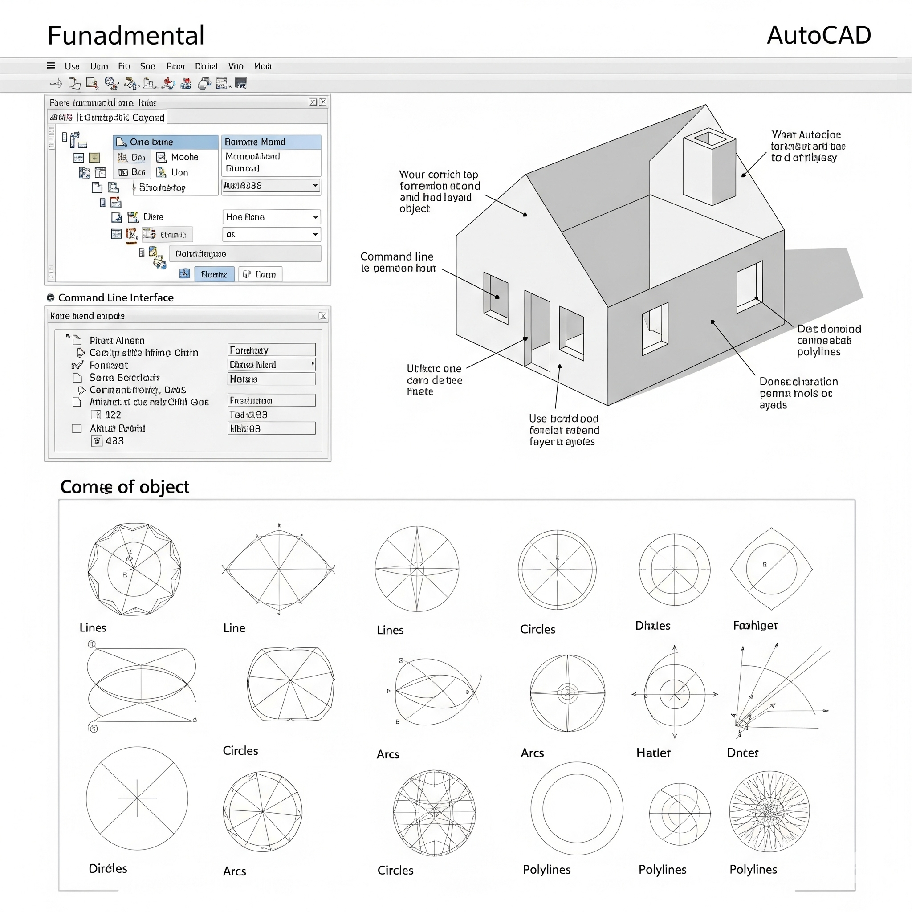
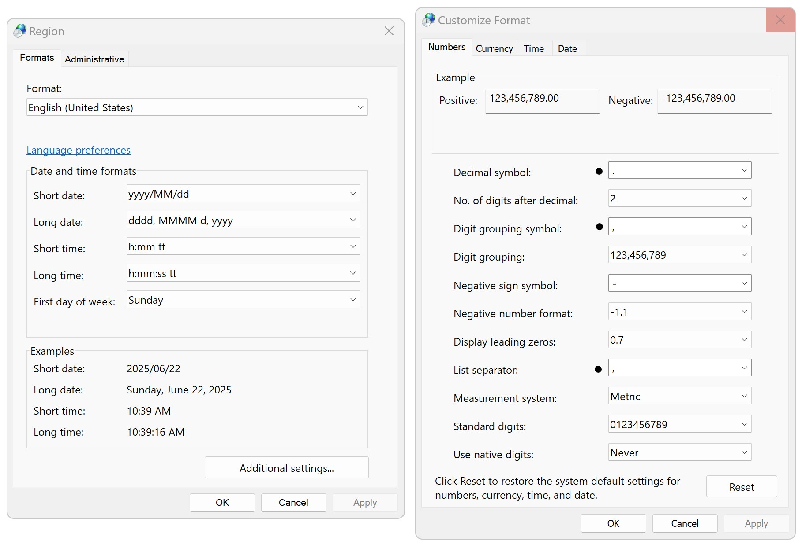
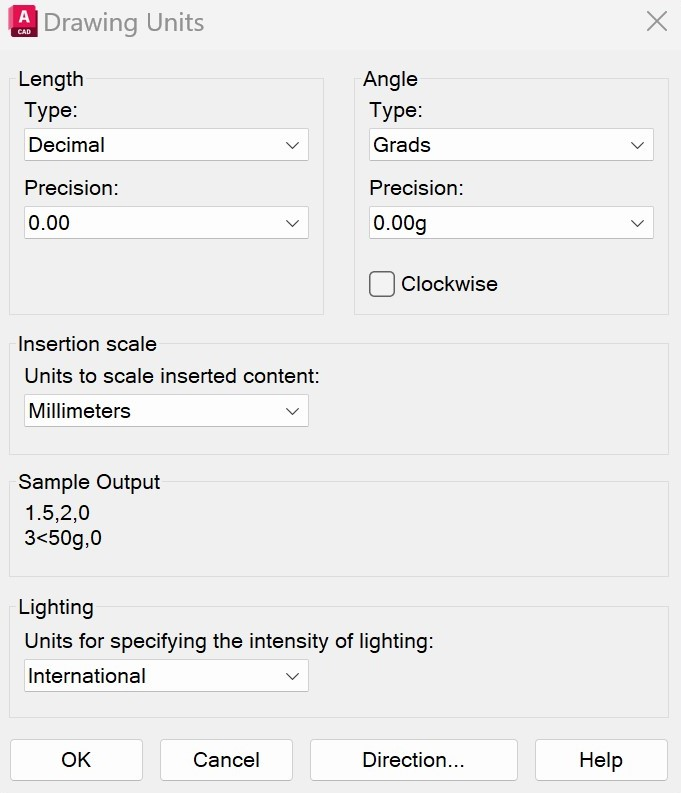
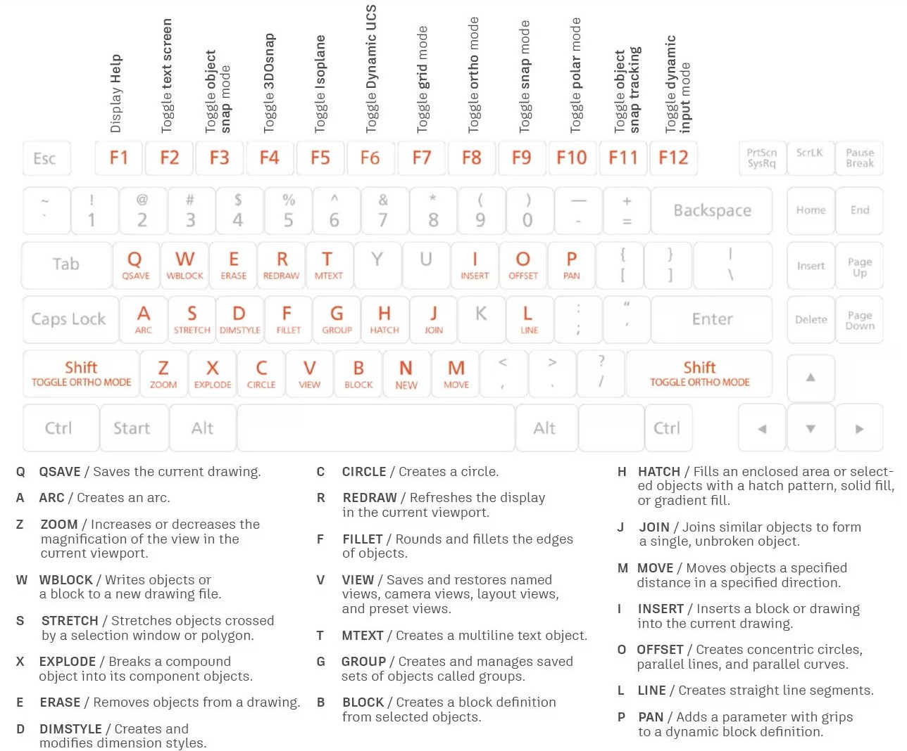

# 1.1. Conceptos básicos de diseño asistido por computador - CAD
Keywords: `CAD` `AutoCAD` `Model` `Layout` `m01a00`

Usos y aplicaciones de herramientas computacionales. Barra de menús. Comandos LINE, GRID y SNAP.

  Generado con: <a href="https://gemini.google.com/app/470770e00e95fe53">https://gemini.google.com</a>  

## Objetivos

Al finalizar esta unidad el estudiante:

* Realiza ejercicios de práctica en los que demuestra que puede iniciar un dibujo nuevo en AutoCAD.
* Realizar configuraciones básicas del entorno de trabajo CAD.
* Identificar comandos y utilizar cuadros de diálogo en CAD. 

## Requerimientos

Archivos, actividades previas, lecturas y herramientas requeridas para el desarrollo de esta actividad:

| Requerimiento                                                                                           | Descripción                                                                                                                      |
|:--------------------------------------------------------------------------------------------------------|:---------------------------------------------------------------------------------------------------------------------------------|
| [:toolbox:Herramienta](https://www.autodesk.com/products/autocad)                                       | Autodesk Autocad 3D 2026 o superior.                                                                                             |

> Para los diferentes avances de proyecto, es necesario guardar y publicar las diferentes versiones generadas del (los) libro (s) de Microsoft Excel y reportes o informes, agregando al final la fecha de control documental en formato aaaammdd, p. ej. _R.HydroTools.DisenoCaucesParametros.20250528.xlsx_.

## 1. Usos y aplicaciones de herramientas computacionales

Las herramientas computacionales abarcan una amplia gama de aplicaciones en diversos campos, desde la gestión de datos (planos, datos relacionales, organización y manejo) en proyectos de ingeniería, hasta la creación de modelos y la automatización de procesos. Estas herramientas, ya sean de hardware (equipos) o software (programas), simplifican tareas, mejoran la eficiencia y facilitan la innovación en diferentes áreas. El uso de software de automatización de tareas repetitivas o complejas, como scripts y macros, liberan tiempo para actividades estratégicas de un proyecto.

En resumen, las herramientas computacionales son elementos clave para la productividad, la innovación, el trabajo con enfoque colaborativo y la eficiencia en una amplia gama de aplicaciones profesionales. 

## 2. Primeros pasos en AutoCAD y configuración general

1. Antes de iniciar con el uso de herramientas computacionales en los campos de la ingeniería, es recomendable definir la siguiente configuración regional de su sistema operativo:

> El uso de la notación numérica del sistema inglés, facilitará el intercambio de datos entre sistemas CAD y sistemas GIS, además de otras herramientas de modelado cuyos núcleos de ejecución utilizan este sistema.

En Microsoft Windows y desde el menú _Inicio_, acceda al _Panel de Control (Control Panel)_ y diríjase a la opción _Region_.

En _Region_, de clic en el botón con _Configuración adicional... (Aditional settings...)_ y en la ventana de personalización de formatos, establezca:

* Separador decimal: punto (.)
* Símbolo de agrupación de miles: coma (,)
* Separador de listas: coma (,)
* Sistema de medida: Metros

> Si bien, la notación numérica en Colombia utiliza comas como separador decimal y punto como separador de miles, es recomendable configurar el sistema operativo con la notación indicada y luego dentro de AutoCAD, establecer antes de la impresión definitiva de planos de proyecto, la notación a utilizar.

2. Desde el menú _Inicio_ de Windows, ingrese a AutoCAD y seleccione la opción _New_ que se encuentra en la barra de menús superior o desde el botón de AutoCAD (botón rojo arriba a la izquierda de la ventana).

3. Como observa, aparece una nueva ventana solicitando seleccionar la plantilla a utilizar en la creación del dibujo, seleccione _**acadiso.dwt**_.

> Para dibujos en sistema imperial (en Colombia frecuentemente mencionando como sistema inglés) en los que se presupone que las unidades son pulgadas, utilice _**acad.dwt**_ o _**acadlt.dwt**_.
>
> :blue_heart: Para dibujos en unidades métricas en las que se presupone que las unidades son metros, utilice _**acadiso.dwt**_ o _**acadltiso.dwt**_.

4. Explore el espacio de trabajo, podrá observar lo siguiente:

* En la parte superior se encuentra la cinta de opciones que dinámicamente es asociada a cada uno de los menús visibles en AutoCAD.
* En la parte central se encuentra el espacio de dibujo o _Model_ que inicialmente presenta visible la grilla de referencia de dibujo. Observará además en la parte superior derecha, el visualizador del sistema global de coordenadas correspondiente a la vista superior (Top) del dibujo y en la parte inferior izquierda, el actual sistema de coordenadas correspondiente al plano XY. En la parte inferior del espacio de dibujo encontrará la barra de comandos o _Command_, que le permitirá ejecutar acciones sin tener que usar la cinta superior.
* En la parte inferior y debajo del espacio de dibujo encontrará una barra con las pestañas del espacio de modelado, hojas de impresión y herramientas adicionales para facilitar el trazado de dibujos con precisión.

5. Desde el botón _AutoCAD / Drawing Utilities / Units_, defina las unidades de longitud en _Decimal_, ángulos en _Grads_, precisión usando dos decimales y unidades de escala para inserción de elementos externos (tales como bloques) en milímetros.    

## 3. Uso de comandos

Los comandos asociados directamente al teclado en AutoCAD son los siguientes:

 Tomado de: <a href="https://www.autodesk.com/shortcuts/autocad">https://www.autodesk.com/shortcuts/autocad</a>  

> Consulte la lista completa de los [comandos de AutoCAD](https://www.autodesk.com/shortcuts/autocad).

## Actividades de proyecto :triangular_ruler:

Utilizando la [plantilla suministrada](../../file/report/R.DAPC.PlantillaSoporteDesarrollo.docx), cree un documento soporte mostrando las actividades desarrolladas en el orden presentado en esta actividad, junto con los análisis y recomendaciones realizadas, convierta a Adobe Acrobat (.pdf) y guarde en la carpeta _/activity_ del repositorio de datos del proyecto; nombre el archivo con el código de la actividad agregando al final la fecha de control documental en formato aaaammdd (p. ej. M01A00_20250531.pdf).

En la siguiente tabla se listan las actividades que deben ser desarrolladas y documentadas por cada estudiante o grupo de proyecto.

| Actividad | Alcance                                                                                                                                                                                                                                                                                                                                                                                                                                                                                                                                              |
|:----------|:-----------------------------------------------------------------------------------------------------------------------------------------------------------------------------------------------------------------------------------------------------------------------------------------------------------------------------------------------------------------------------------------------------------------------------------------------------------------------------------------------------------------------------------------------------|
| M01A00    | Descargar el archivo [R.HydroTools.DisenoCaucesParametros.xlsx](https://github.com/rcfdtools/R.HydroTools/blob/main/tool/DisenoCaucesParametros/R.HydroTools.DisenoCaucesParametros.xlsx) disponible en GitHub, e incluirlo en el repositorio.                                                                                                                                                                                                                                                                                                       | 
| M01A00    | Investigar, verificar y registrar en el libro de Excel, los parámetros técnicos, hidráulicos e hidrológicos indicados en esta actividad.  Para el grupo de parámetros normativos, ambientales / sociales y territoriales, revisar los parámetros actualmente reportados, investigar, registrar y actualizar.                                                                                                                                                                                                                                   | 
| M01A00    | Registrar los valores obtenidos en el [libro de parámetros generales](https://github.com/rcfdtools/R.HydroTools/tree/main/tool/DisenoCaucesParametros) requeridos para el diseño y la modelación. Guardar en la carpeta _/file/table_.                                                                                                                                                                                                                                                                                                               |
| M01A00    | Opcional: verificar la formulación correcta de los libros de cálculo suministrados. En las notas de la ficha de control documental indicar el método de verificación y si se requieren o no ajustes.                                                                                                                                                                                                                                                                                                                                                 |
| M01A00    | En una tabla y al final del informe de avance de esta entrega, indique el detalle de las actividades realizadas por cada integrante de su grupo; utilice las siguientes columnas: `Nombre del integrante`, `Actividades realizadas`, `Tiempo dedicado en horas` (si presenta la entrega individualmente, no es necesaria la presentación de esta tabla).  Para actividades que no requieren del desarrollo de elementos de avance, indicar si realizo la lectura de la guía de clase y las lecturas indicadas al inicio en los requerimientos. | 

> Nota 1: para la revisión del proyecto final, guarde los libros cálculo de Microsoft Excel y los archivos generados en esta actividad, en las localizaciones indicadas en cada numeral.
>
> Nota 2: una vez el instructor realice la revisión y el estudiante presente las correcciones o ajustes solicitados, será necesario cargar una nueva versión de los archivos en el repositorio del proyecto, incluyendo o actualizando al final del nombre del archivo, la fecha de presentación en formato aaaammdd y manteniendo las versiones anteriores presentadas.
>

## Referencias

* 

## Control de versiones

| Versión    | Descripción        | Autor                                      | Horas |
|------------|:-------------------|--------------------------------------------|:-----:|
| 2025.06.22 | Versión inicial.   | [rcfdtools](https://github.com/rcfdtools)  |  18   |

##

_R.DAPC es de uso libre para fines académicos, conoce nuestra licencia, cláusulas, condiciones de uso y como referenciar los contenidos publicados en este repositorio, dando [clic aquí](../../LICENSE.md)._

_¡Encontraste útil este repositorio!, apoya su difusión marcando este repositorio con una ⭐ o síguenos dando clic en el botón Follow de [rcfdtools](https://github.com/rcfdtools) en GitHub._

| [:arrow_backward: Anterior](../M01A00/Readme.md) | [:house: Inicio](../../README.md) | [:beginner: Ayuda / Colabora](https://github.com/rcfdtools/R.DAPC/discussions/99999) | [Siguiente :arrow_forward:](../M01A02/Readme.md) |
|--------------------------------------------------|-----------------------------------|--------------------------------------------------------------------------------------|--------------------------------------------------|

[^1]: 