# 1.1. Conceptos básicos de diseño asistido por computador - CAD
Keywords: `CAD` `AutoCAD` `Model` `Layout` `dwgunits` `line` `drawing-commands` `commandline` `status-bar` `m01a01`

Usos y aplicaciones de herramientas computacionales. Barra de menús. Comandos LINE, GRID y SNAP.

<div align="center">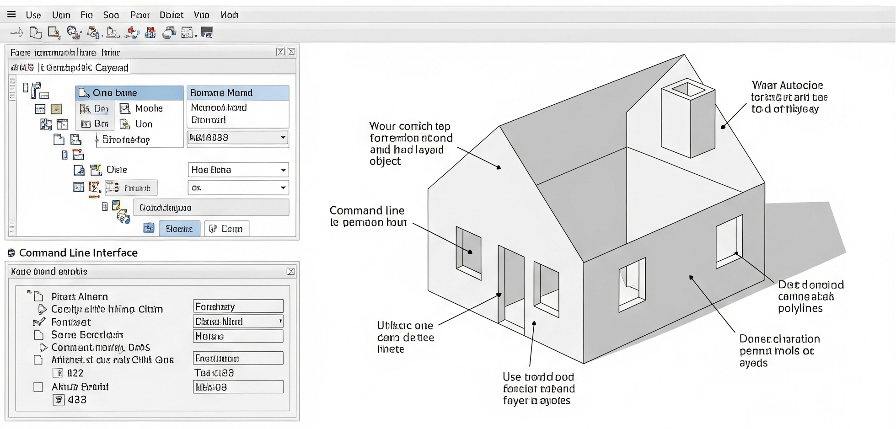<sub><br> Generado con: <a href="https://gemini.google.com/app/470770e00e95fe53">https://gemini.google.com</a></sub><br><br></div>


## Objetivos

Al finalizar esta actividad, el estudiante:

* Realiza ejercicios de práctica en los que demuestra que puede iniciar un dibujo nuevo en AutoCAD.
* Realizar configuraciones básicas del entorno de trabajo CAD.
* Identificar comandos y utilizar cuadros de diálogo en CAD. 


## Requerimientos

Archivos, actividades previas, lecturas y herramientas requeridas para el desarrollo de esta actividad:

<div align="center">

| Requerimiento                                                                      | Descripción                                                                                                                                                                                                                                                                                                                                                                                                                              |
|:-----------------------------------------------------------------------------------|:-----------------------------------------------------------------------------------------------------------------------------------------------------------------------------------------------------------------------------------------------------------------------------------------------------------------------------------------------------------------------------------------------------------------------------------------|
| [:toolbox:Herramienta](https://www.autodesk.com/products/autocad)                  | Autodesk Autocad 3D 2026 o superior.                                                                                                                                                                                                                                                                                                                                                                                                     |
| [:toolbox:Herramienta](https://notepad-plus-plus.org/)                             | Notepad++.                                                                                                                                                                                                                                                                                                                                                                                                                               |
| [:toolbox:Herramienta](https://www.microsoft.com/es/microsoft-365/excel?market=bz) | Microsoft Excel 365.                                                                                                                                                                                                                                                                                                                                                                                                                     |
| [:notebook:Lectura](https://es.wikipedia.org/wiki/Proyecci%C3%B3n_isom%C3%A9trica) | Wikipedia / Proyección isométrica: una proyección isométrica es un método de representación gráfica, más específicamente una axonométrica, cilíndrica, ortogonal. Constituye en una representación visual de un objeto tridimensional que se reduce en dos dimensiones, en la que los tres ejes ortogonales principales, al proyectarse, forman ángulos de 120°, y las dimensiones paralelas a dichos ejes se miden en una misma escala. |
| [:date:DAPC_Teorema Pitagoras.xlsx](../../file/table/DAPC_TeoremaPitagoras.xlsx)   | Libro de cálculo para la estimación de longitud y ángulo de inclinación en lineas CAD.                                                                                                                                                                                                                                                                                                                                                   |
 
</div>

> Para los diferentes avances de proyecto, es necesario guardar y publicar las diferentes versiones generadas del (los) libro (s) de Microsoft Excel, reportes o informes y dibujos generados, agregando al final la fecha de control documental en formato aaaammdd, p. ej., _M01A01_20250710.dwg_.


## 1. Usos y aplicaciones de herramientas computacionales

Las herramientas computacionales abarcan una amplia gama de aplicaciones en diversos campos, desde la gestión de datos (planos, datos relacionales, organización y manejo) en proyectos de ingeniería, hasta la creación de modelos y la automatización de procesos. Estas herramientas, ya sean de hardware (equipos) o software (programas), simplifican tareas, mejoran la eficiencia y facilitan la innovación en diferentes áreas. El uso de software de automatización de tareas repetitivas o complejas, como scripts y macros, liberan tiempo para actividades estratégicas de un proyecto.

En resumen, las herramientas computacionales son elementos clave para la productividad, la innovación, el trabajo con enfoque colaborativo y la eficiencia en una amplia gama de aplicaciones profesionales. 


### ¿Qué es dibujo o diseño asistido por computador o CAD?

CAD, en el contexto de diseño y tecnología, significa Diseño Asistido por Computadora (Computer-Aided Design, por sus siglas en inglés). Es una tecnología que utiliza software para crear, modificar, analizar u optimizar un diseño. Se utiliza ampliamente en ingeniería, arquitectura, diseño de productos y muchas otras disciplinas que requieren diseño técnico y visualización precisa. 

Existen software CAD 2D y 3D, cada uno con sus propias características y aplicaciones, CAD es una tecnología que ha revolucionado el proceso de diseño al permitir a los profesionales crear, analizar y modificar diseños de manera más eficiente y precisa, utilizando herramientas digitales. 

Hay muchas herramientas CAD disponibles, tanto gratuitas como de pago, para diferentes propósitos y niveles de experiencia. Algunas de las más populares son:

| Herramienta CAD                                                     | Descripción                                                                                                                                                                                                                                                                                                                                           |
|:--------------------------------------------------------------------|:------------------------------------------------------------------------------------------------------------------------------------------------------------------------------------------------------------------------------------------------------------------------------------------------------------------------------------------------------|
| [AutoCAD](https://www.autodesk.com/products/autocad)                | Un estándar de la industria para diseño 2D y 3D, utilizado en arquitectura, ingeniería y construcción.                                                                                                                                                                                                                                                |
| [AutoCAD LT](https://www.autodesk.com/products/autocad-lt)          | Una versión más ligera de AutoCAD para dibujo 2D.                                                                                                                                                                                                                                                                                                     |
| [SolidWorks](https://www.solidworks.com/)                           | Un software de modelado 3D paramétrico ampliamente utilizado en ingeniería mecánica                                                                                                                                                                                                                                                                   |
| [Fusion](https://www.autodesk.com/education/edu-software/fusion)    | Una plataforma CAD/CAM basada en la nube con capacidades de modelado 3D, simulación y fabricación.                                                                                                                                                                                                                                                    |
| [FreeCAD](https://www.freecad.org/)                                 | Un software CAD 3D de código abierto y gratuito, adecuado para modelado paramétrico y diseño mecánico.                                                                                                                                                                                                                                                |
| [TinkerCAD](https://www.tinkercad.com/)                             | Una herramienta CAD online gratuita, ideal para principiantes y proyectos sencillos.                                                                                                                                                                                                                                                                  |
| [LibreCAD](https://librecad.org/) o [FreeCAD](https://freecad.org/) | Un software CAD 2D de código abierto y gratuito, similar a AutoCAD LT.                                                                                                                                                                                                                                                                                |
| [Blender](https://www.blender.org/)                                 | Un software gratuito para modelado 3D, animación y renderizado, utilizado en diversas industrias.                                                                                                                                                                                                                                                     |
| [Creo](https://www.ptc.com/en/products/creo)                        | Un software CAD/CAM de alta gama con funciones avanzadas de modelado, simulación y diseño generativo.                                                                                                                                                                                                                                                 |
| [Onshape](https://www.onshape.com/en/)                              | Un software CAD 3D basado en la nube, con enfoque en la colaboración en tiempo real.                                                                                                                                                                                                                                                                  |
| [ArchiCAD](https://www.graphisoft.com/plans-and-products/archicad/) | Archicad es un software de Modelado de Información de Construcción (BIM, por sus siglas en inglés) desarrollado por Graphisoft para arquitectos y profesionales de la construcción. Permite crear modelos 3D detallados de edificios, generar planos y documentación automáticamente, y facilita la colaboración entre diferentes equipos de trabajo. |
| [QCAD](https://www.qcad.org/en/)                                    | QCAD es un software de diseño asistido por computadora (CAD) 2D de código abierto. Está diseñado para crear dibujos técnicos como planos de edificios, interiores y piezas mecánicas. Es gratuito y funciona en Windows, macOS y Linux.                                                                                                               |
| [ZWCAD](https://www.zwsoft.com/product/zwcad)                       | ZWCAD es un software de diseño asistido por computadora (CAD) 2D, rápido y potente, conocido por su alta compatibilidad con el formato de archivo DWG y su interfaz familiar. Es una alternativa a AutoCAD, utilizada por arquitectos, ingenieros y diseñadores para crear y editar dibujos en 2D.                                                    |

Consideraciones al elegir una herramienta CAD:

| Consideración            | Alcance                                                                           |
|:-------------------------|:----------------------------------------------------------------------------------|
| Necesidades del proyecto | ¿Es un proyecto 2D o 3D? ¿Qué nivel de complejidad requiere?                      |
| Experiencia del usuario  | ¿Es principiante o usuario avanzado?                                              |
| Presupuesto              | ¿Herramientas gratuitas o de pago?                                                |
| Plataforma               | ¿Windows, MacOS, Linux o navegador?                                               |
| Formato de archivo       | ¿Qué formatos de archivo necesita para importar o exportar?                       |
| Trabajo colaborativo     | Repositorios integrados de datos fuentes, tales como bloques y objetos de dibujo. |
| Integración BIM          | Modelado de información para construcción de proyectos que requieren diseños CAD. |

> Para el desarrollo del curso DAPC, utilizaremos la herramienta AutoCAD.


### ¿Qué es AutoCAD?

AutoCAD es un software de diseño asistido por computadora (CAD) desarrollado por Autodesk, utilizado para crear dibujos y modelos 2D y 3D precisos. Es una herramienta esencial en diversas industrias, como arquitectura, ingeniería y diseño industrial, para la creación de planos, diseños técnicos y modelos tridimensionales. 

AutoCAD es una herramienta versátil que facilita el proceso de diseño y dibujo en diversas disciplinas, permitiendo a los profesionales crear diseños precisos, visualizar sus ideas y colaborar eficientemente en proyectos. 


### ¿Para qué sirve AutoCAD?

| Alcance                        | Detalle                                                                                                                            |
|--------------------------------|------------------------------------------------------------------------------------------------------------------------------------|
| Diseño y dibujo                | Permite crear dibujos y modelos 2D y 3D con mayor precisión y eficiencia que a mano.                                               |
| Automatización de tareas       | Automatiza tareas repetitivas de dibujo, lo que aumenta la productividad.                                                          |
| Colaboración                   | Facilita la colaboración entre equipos y dispositivos, permitiendo el acceso y la edición de diseños desde diferentes ubicaciones. |
| Visualización                  | Ofrece potentes herramientas de navegación y visualización 3D, como orbitar, recorrer, pivotar y volar sobre modelos 3D.           |
| Compatibilidad                 | Garantiza la compatibilidad con otros programas de diseño y permite la importación y exportación de archivos.                      |
| Planificación y presentaciones | Permite crear planos, diagramas y presentaciones de diseños.                                                                       |


### Industrias que utilizan AutoCAD

* Arquitectura: Diseño de planos de edificios, planos de planta, vistas en perspectiva y modelos 3D de edificios. 
* Ingeniería: Diseño de puentes, carreteras, maquinaria, sistemas eléctricos y otros componentes. 
* Diseño industrial: Diseño de productos, piezas y maquinarias. 
* Manufactura: Creación de planos para la fabricación de productos. 
* Construcción: Planificación y gestión de proyectos de construcción. 


## 2. Primeros pasos en AutoCAD y configuración general

1. Antes de iniciar con el uso de herramientas computacionales en los campos de la ingeniería, es recomendable definir la siguiente configuración regional de su sistema operativo:

> El uso de la notación numérica del sistema inglés, facilitará el intercambio de datos entre sistemas CAD y sistemas GIS, además de otras herramientas de modelado cuyos núcleos de ejecución utilizan este sistema.

En Microsoft Windows y desde el menú _Inicio_, acceda al _Panel de Control (Control Panel)_ y diríjase a la opción _Region_.

<div align="center">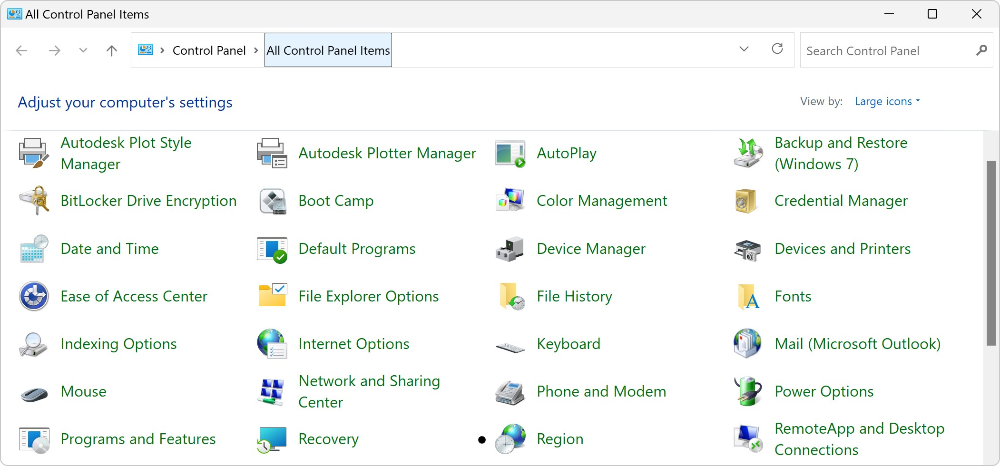</div>

En _Region_, de clic en el botón con _Configuración adicional... (Aditional settings...)_ y en la ventana de personalización de formatos, establezca:

* Separador decimal: punto (.)
* Símbolo de agrupación de miles: coma (,)
* Separador de listas: coma (,)
* Sistema de medida: Metros

<div align="center"></div>

> Si bien, la notación numérica en Colombia utiliza comas como separador decimal y punto como separador de miles, es recomendable configurar el sistema operativo con la notación indicada y luego dentro de AutoCAD, establecer antes de la impresión definitiva de planos de proyecto, la notación a utilizar.

2. Desde el menú _Inicio_ de Windows, ingrese a AutoCAD y seleccione la opción _New_ que se encuentra en la barra de menús superior o desde el botón de AutoCAD (botón rojo arriba a la izquierda de la ventana).

<div align="center">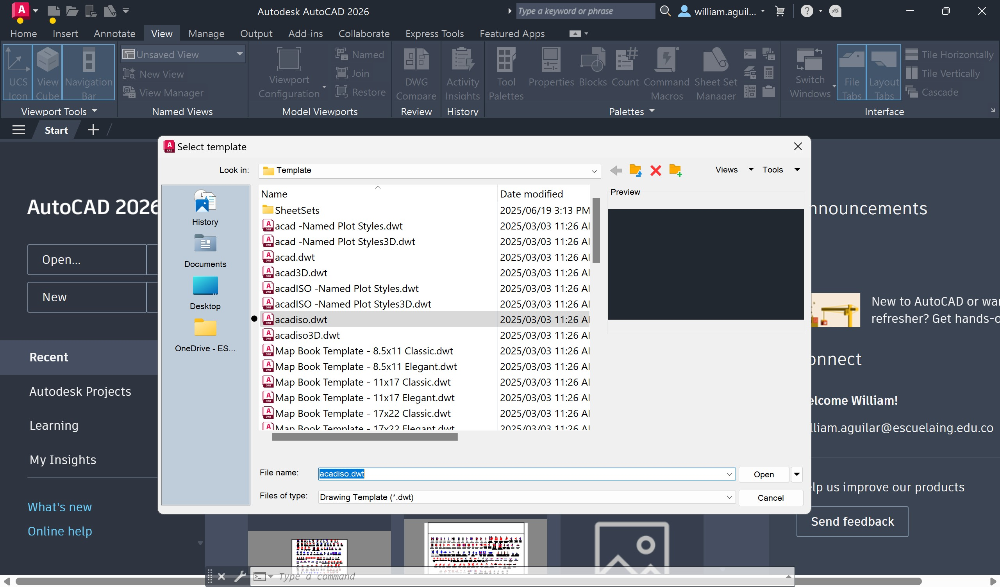</div>

3. Como observa, aparece una nueva ventana solicitando seleccionar la plantilla a utilizar en la creación del dibujo, seleccione _**acadiso.dwt**_.

> Para dibujos en sistema imperial (en Colombia frecuentemente mencionando como sistema inglés) en los que se presupone que las unidades son pulgadas, utilice _**acad.dwt**_ o _**acadlt.dwt**_.
>
> :blue_heart: Para dibujos en unidades métricas en las que se presupone que las unidades son metros, utilice _**acadiso.dwt**_ o _**acadltiso.dwt**_.

4. Explore el espacio de trabajo, podrá observar lo siguiente:

* En la parte superior se encuentra la cinta de opciones que dinámicamente es asociada a cada uno de los menús visibles en AutoCAD. Debajo de esta barra podrá encontrar los dibujos abiertos, en este caso _Drawing1*_.
* En la parte central se encuentra el espacio de dibujo o _Model_ que inicialmente presenta visible la grilla de referencia de dibujo. Observará además en la parte superior derecha, el visualizador del sistema global de coordenadas correspondiente a la vista superior (Top) del dibujo y en la parte inferior izquierda, el actual sistema de coordenadas correspondiente al plano XY. En la parte inferior del espacio de dibujo encontrará la barra de comandos o _Command_, que le permitirá ejecutar acciones sin tener que usar la cinta superior.
* En la parte inferior y debajo del espacio de dibujo encontrará una barra con las pestañas del espacio de modelado, hojas de impresión y herramientas adicionales para facilitar el trazado de dibujos con precisión.

> El * en el nombre del dibujo indica que este es nuevo o que no han sido guardados los cambios.

<div align="center">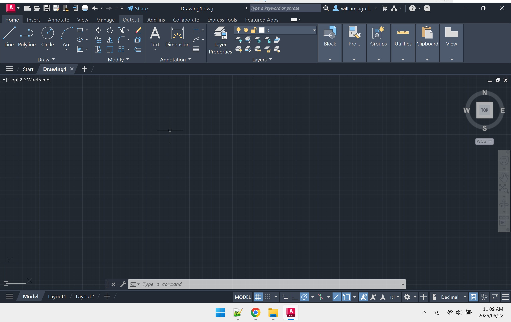</div>

5. Desde el botón _AutoCAD / Drawing Utilities / Units_, defina las unidades de longitud en _Decimal_, ángulos en _Grados decimales_, precisión usando dos decimales y unidades de dibujo o de escala para inserción de elementos externos (tales como bloques) en el espacio de dibujo en milímetros. Esta misma acción puede ser realizada desde el comando **DWGUNITS**, adicionalmente permite convertir un dibujo dibujado p. ej., en metros a milímetros.   

> Tenga en cuenta que en el espacio de impresión o _Layout_ siempre dibujaremos en milímetros.
> 
> Para dibujos arquitectónicos, es recomendable definir la unidades de dibujo en metros. Dibujo de bloques, piezas eléctricas o mecánicas, pueden ser dibujados en milímetros.

<div align="center">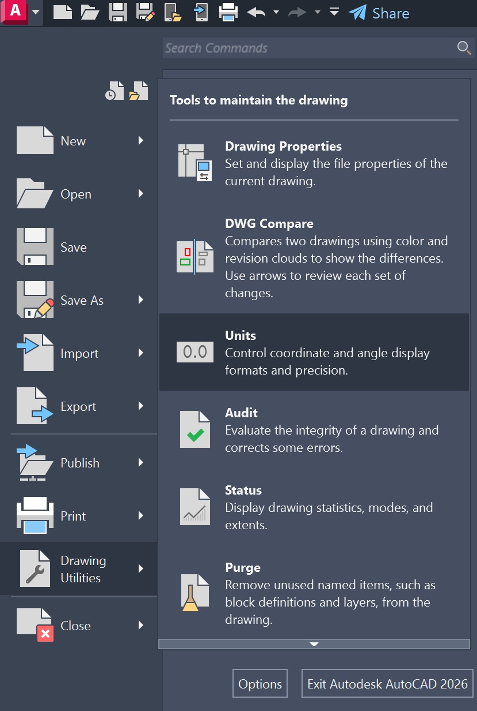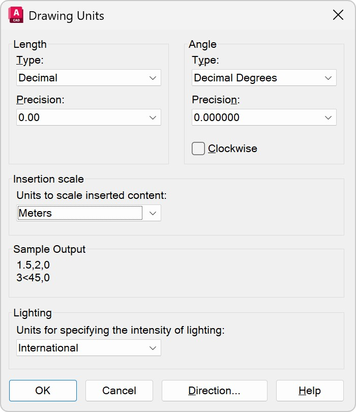</div>


## 3. Dibujo de elementos geométricos básicos

El punto, la línea y el polígono son los elementos geométricos básicos con los que podemos dibujar todas las figuras geométricas. Los límites de un polígono son sus líneas perimetrales y de las líneas los puntos en sus extremos. Los polígonos tienen dos dimensiones, las líneas una única dimensión y los puntos ninguna dimensión, que únicamente determinan un lugar.

AutoCAD dispone de múltiples herramientas de dibujo las cuales se encuentran disponibles en el menú _Home_ dentro del grupo _Draw_. En esta actividad nos concentraremos en el uso de la línea o _Line_.

Para el dibujo de elementos, por defecto el mouse o apuntador realiza las siguientes acciones:

<div align="center">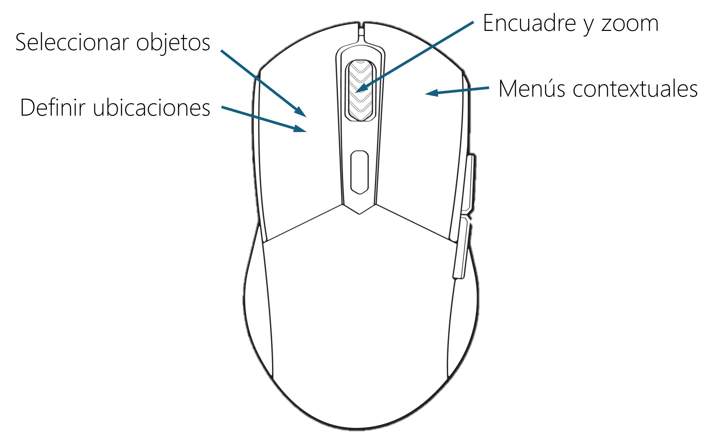</div>

:blue_heart: Al ampliar o reducir el zoom con la rueda del mouse, la ubicación del cursor es importante. Puede considerar el cursor como una lupa., p. ej. si coloca el cursor en el área superior derecha del área de dibujo, se amplía esa área sin cambiar su posición.

1. Seleccione la herramienta _Line_ y trace una línea de izquierda a derecha en cualquier lugar del espacio de dibujo. Podrá observar que luego de establecer el nodo final, el puntero sigue solicitando la inserción de un nuevo nodo, para completar la línea oprima la tecla <kbd>esc</kbd>, de <kbd>enter</kbd> o utilice el clic derecho del Mouse y seleccione la opción _Enter_.

> Tenga en cuenta que el dibujo CAD, el orden de trazado de las líneas define su dirección vectorial.

<div align="center">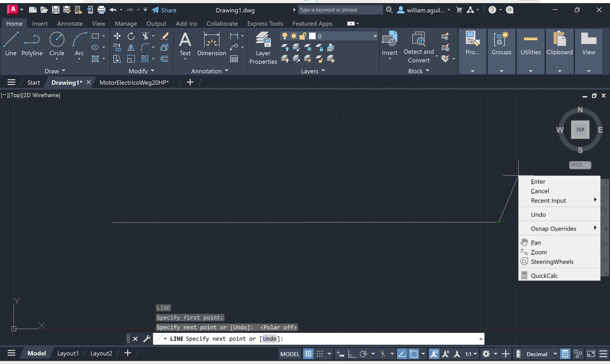</div>

2. Con el puntero del Mouse, de clic sobre la línea creada para seleccionarla. 

> :bulb: Opcionalmente, puede dibujar una cuadro de selección de izquierda a derecha (para lo cual el cuadro debe ser lo suficientemente grande para contener toda la línea, o un cuadro de derecha a izquierda para seleccionar los elementos que tocan el cuadro. Note que el cuadro de selección derecha a izquierda es verde y el de izquierda a derecha es azul.)

<div align="center">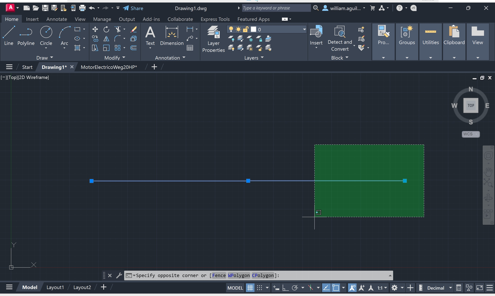</div>

3. Para conocer las propiedades de la línea, de clic derecho sobre el elemento y seleccione la opción Properties. Podrá observar sus coordenadas absolutas y que para este ejemplo, la línea trazada tiene una longitud de 2686.77 metros con una inclinación es de 0.04 grados con respecto a la horizontal.

> Tenga en cuenta que si traza una línea manualmente dando clic en la pantalla, su longitud e inclinación puede variar con respecto al ejemplo presentado.
>
> En AutoCAD, la localización al este o a la derecha del dibujo corresponde al ángulo cero, norte corresponde a 90 grados, oeste a 180 grados y sur a 270 grados.

<div align="center">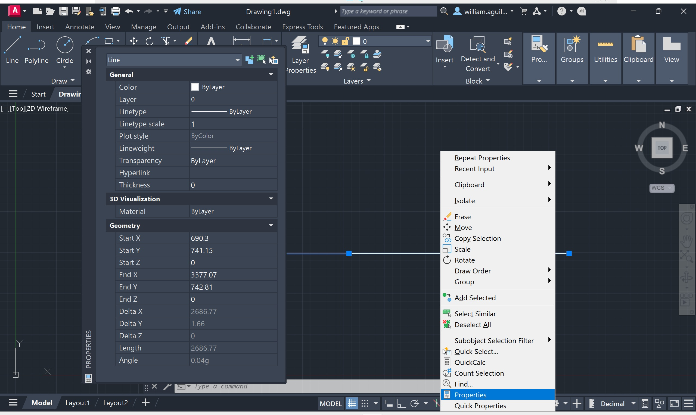</div>

Utilizando el Teorema de Pitágoras y análisis trigonométrico, calcule en un [Libro de Excel](../../file/table/DAPC_TeoremaPitagoras.xlsx) manualmente la longitud de la línea a partir de las coordenadas de sus nodos inicio - fin y compare con el valor obtenido en AutoCAD.

<div align="center">L = √((CXStart - CXEnd)² + (CYStart - CYEnd)²)</div><br>

<div align="center">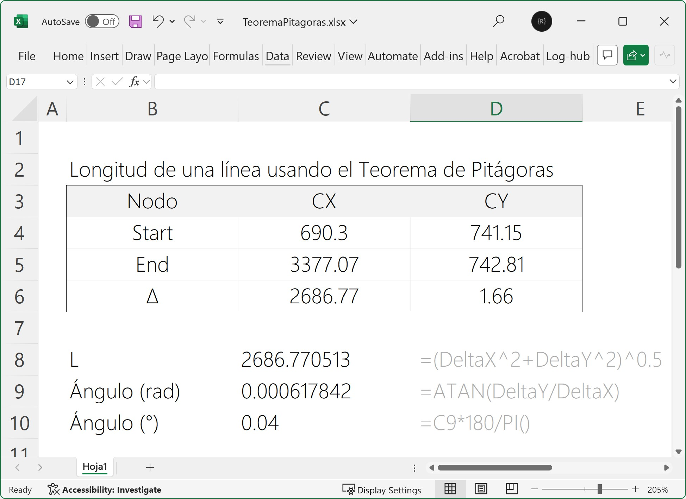</div>

4. En la cinta de opciones superior, de clic en el botón guardar y almacene el archivo como _/file/cad/M01A01.dwg_. Utilizando la rueda del Mouse, acérquese (rueda hacia arriba), aléjese (rueda hacia abajo) y desplace el dibujo (rueda pulsada y desplazamiento del mouse).

5. Como observó, AutoCAD permite trazar líneas utilizando localizaciones manuales en pantalla, sin embargo, para el trazado de dibujos con precisión, podemos utilizar coordenadas absolutas, coordenadas relativas o una secuencia de comandos indicando la localización de sus nodos.

<div align="center">

| Entrada                   | Descripción                                                                                                                                                                                                                                             |
|:--------------------------|:--------------------------------------------------------------------------------------------------------------------------------------------------------------------------------------------------------------------------------------------------------|
| Manual                    | Dando clic en el espacio de dibujo.                                                                                                                                                                                                                     |
| Coordenadas absolutas     | Ingresando valores desde el Command.                                                                                                                                                                                                                    |
| Coordenadas relativas     | Ingresando valores desde el Command utilizando el símbolo @ y el desplazamiento requerido en XY o el valor de las distancias (distancia X distancia Y) y el ángulo (distancia < angulo).<br><br>Es requerido un nodo previo en una línea o un polígono. |
| Por secuencia de comandos | Comandos y nodos de localización que describen la secuencia de construcción del elemento.                                                                                                                                                               |

</div>

Tracemos una línea horizontal de 2500 metros desde la coordenada X = 0 metros, Y = 0 metros hasta la coordenada X = 2500 metros, Y = 0 metros. Seleccione la herramienta _Line_, en el Command ingrese las coordenadas absolutas del punto inicial 0,0 y luego las coordenadas del punto final 2500,0 y presione la tecla <kbd>enter</kbd>. Para finalizar la creación, presione la tecla <kbd>enter</kbd>.

<div align="center">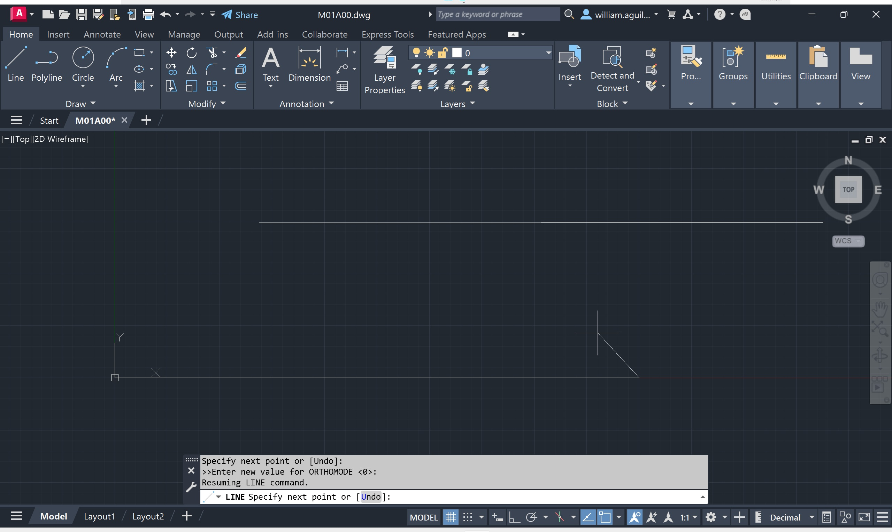</div>

Consulte las propiedades de la línea, observará que su longitud es 2500 metros con un ángulo de 0 grados.

<div align="center">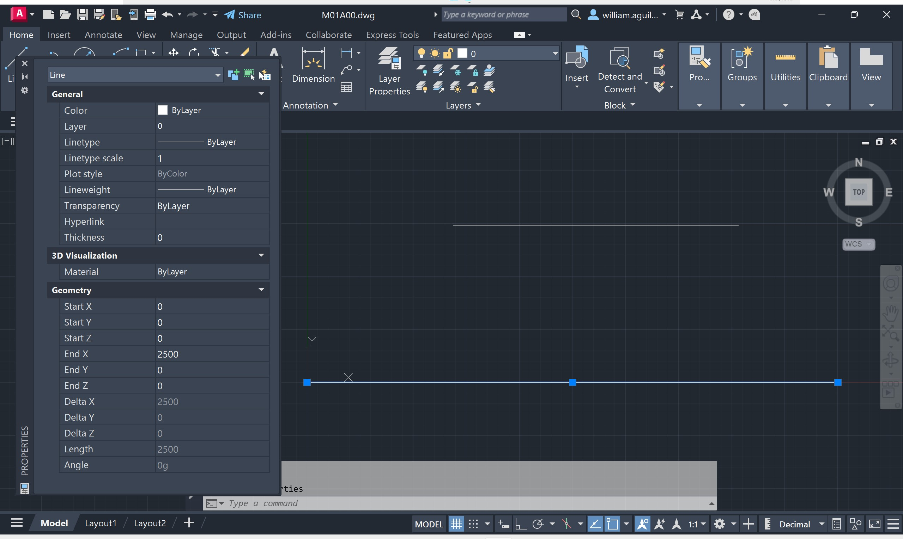</div>

6. Tracemos ahora una línea de 2500 metros tomando como orígen la coordenada absoluta (50,50) e ingresando para el nodo final la coordenada relativa (@2500,0). Revise las propiedades de la línea, observará que la localización del nodo final estará a 2550 metros en la horizontal del orígen absoluto de coordenadas y 50 metros en la vertical.

<div align="center">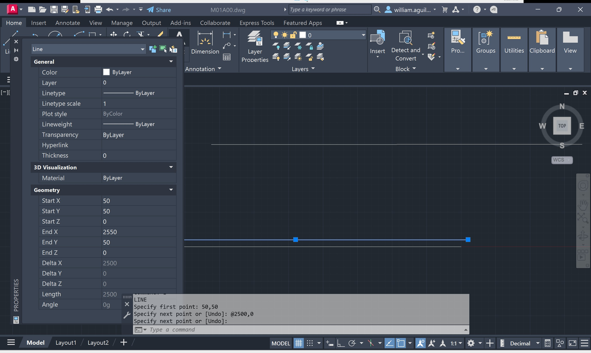</div>


### Ejercicio M01A01E01

Aplicando los conceptos aprendidos de coordenadas absolutas y relativas, dibuje manualmente la siguiente figura con coordenadas absolutas de origen (250,250) y guarde como _/file/cad/M01A01E01.dwg_.

<div align="center"><sub><br> Imagen tomada de: <a href="https://www.mhe.es/bachillerato/bachillerato_dibujo/8448181107/archivos/8448181107_%20Unidad0_DT1Bach.pdf">https://www.mhe.es</a></sub><br><br></div>

Especificaciones:

* Distancias en metros.
* La medida de 20 metros corresponde a la vertical del lado inclinado.
* El tramo de 34 metros está alineado verticalmente con el tramo inferior de 5 metros.
* El nodo de inicio asignado deberá corresponder con la esquina superior más a la izquierda (nodo azul) donde se encuentra el tramo de 15 metros.
* Para verificar el correcto trazado, la figura tiene un Área de 2190 m² y Perímetro de 328.396 metros.

> La medición del área y perímetro de la figura puede ser realizada desde el menú _Home / Utilities / Measure_.


## 4. Uso básico de comandos

1. La creación de líneas puede ser realizada a través del comando _**LINE**_ que puede ser ingresado desde el _Command_ ubicado en la parte inferior del espacio de trabajo o con el comando abreviado _**L**_. Por ejemplo, para la creación de una línea a 45 grados entre las coordenadas absolutas (250,250) y (550,550) cuyo desplazamiento horizontal y vertical es de 300 metros, podemos utilizar el siguiente comando:

```
LINE
250,250
550,550

```

> Al insertar un espacio en blanco al final de las 3 sentencias utilizadas, estará ejecutando la tecla <kbd>enter</kbd> que completará la creación de la línea.

<div align="center">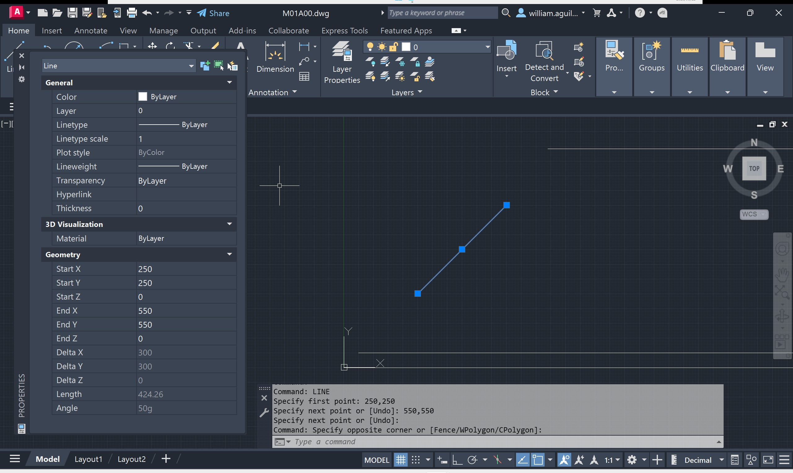</div>

2. Para el trazado de una figura compuesta por 4 líneas, p. ej. un cuadrado de 500 metros con origen en la coordenada absoluta (750,150), podremos usar la siguiente secuencia de posiciones absolutas o relativas.

> Tenga en cuenta que la secuencia uttilizada para el comando _**LINE**_, crea 4 líneas independientes y no una poli-línea.

Secuencia con coordenadas absolutas:
```
LINE
750,150
1250,150
1250,650
750,650
750,150

```

<div align="center">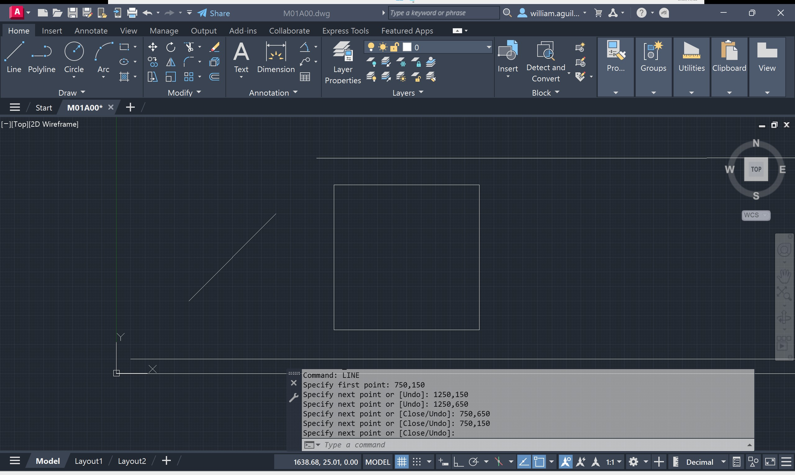</div>

Secuencia con coordenadas relativas:
```
LINE
750,150
@500,0
@0,500
@-500,0
@0,-500

```

Para crear una línea usando ángulos, p. ej. una línea a 45 grados con una longitud de 50 metros desde el orígen de coordenadas absoluto (0,0):
```
LINE
0,0
50<45d

```

> :bulb: Para evitar la escritura de la letra **d** en la definición de ángulos, en las unidades de AutoCAD puede establecer grados decimales.


### Ejercicio M01A01E02

**Parte A:** aplicando los conceptos aprendidos, cree secuencias de comandos (una con posiciones absolutas, otra con posiciones relativas y una final con ángulos) para la construcción de la figura presentada en el Ejercicio M01A01E01, pero con nodo de inicio en (X,Y) igual a los 2 últimos dígitos de su código de alumno, guarde la secuencia en _/file/report/M01A01E02A.txt_ y el dibujo en _/file/cad/M01A01E02A.dwg_.

<div align="center">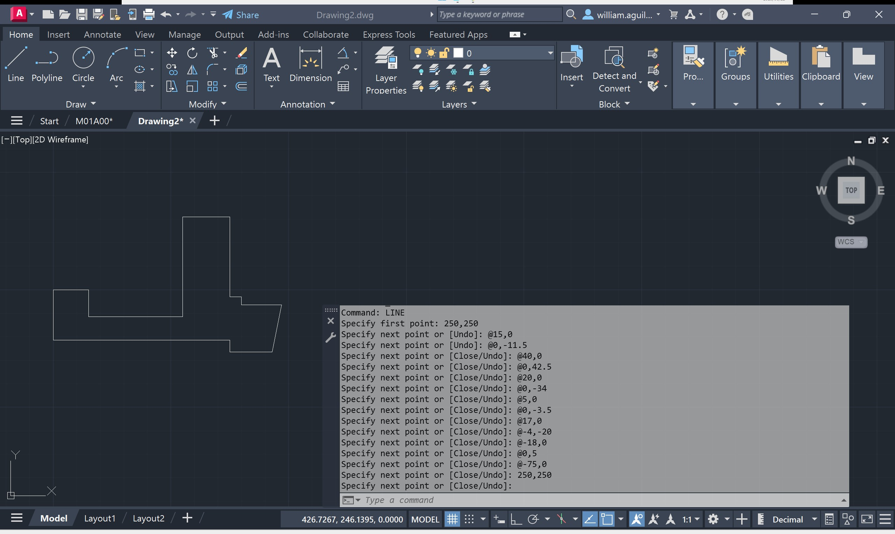</div>

Ejemplo de secuencia para coordenadas relativas usando @
```
LINE
250,250
@15,0
@0,-11.5
@40,0
@0,42.5
@20,0
@0,-34
@5,0
@0,-3.5
@17,0
@-4,-20
@-18,0
@0,5
@-75,0
250,250

```

**Parte B:** utilizando secuencias de comandos, cree los siguientes elementos, guarde la secuencia en _/file/report/M01A01E02B.txt_ y el dibujo en _/file/cad/M01A01E02B.dwg_.:

* Triángulo rectángulo de 50 metros de base por 20 metros de alto con orígen en la coordenada absoluta indicada.
* Triángulo equilátero de 50 metros de lado con orígen en la coordenada absoluta indicada.
* Triángulo rectángulo con área de 200 m² y con orígen en la coordenada absoluta indicada.

> La coordenada absoluta en X corresponde a los dos últimos dígitos de su código de alumno y la coordenada en Y a dos veces este valor.
> 
> Tenga en cuenta que la sumatoria interna de ángulos de un triángulo es de 180°.
> 
> Recuerde que si sus unidades angulares han sido establecidas en grados, deberá incluir la letra **d** luego del valor del ángulo requerido.


### Comandos asociados directamente al teclado

Para facilitar la creación de dibujos, varios de los comandos de AutoCAD están asociados al teclado, como se muestra en la siguiente ilustración.

<div align="center"><sub><br>Tomado de: <a href="https://www.autodesk.com/shortcuts/autocad">https://www.autodesk.com/shortcuts/autocad</a></sub><br><br></div>

> Consulte aquí la lista completa de [comandos de AutoCAD](https://www.autodesk.com/shortcuts/autocad).


## 5. Uso de grillas de referencia, encajado de elementos, asistentes de dibujo y escalas

Herramientas complementarias facilitan el dibujo de elementos geométricos con precisión, estas herramientas se encuentran localizadas en la parte inferior de la pantalla en la barra de estado, o pueden ser activados a partir de teclas de funciones, atajos de teclado o comandos.

<div align="center">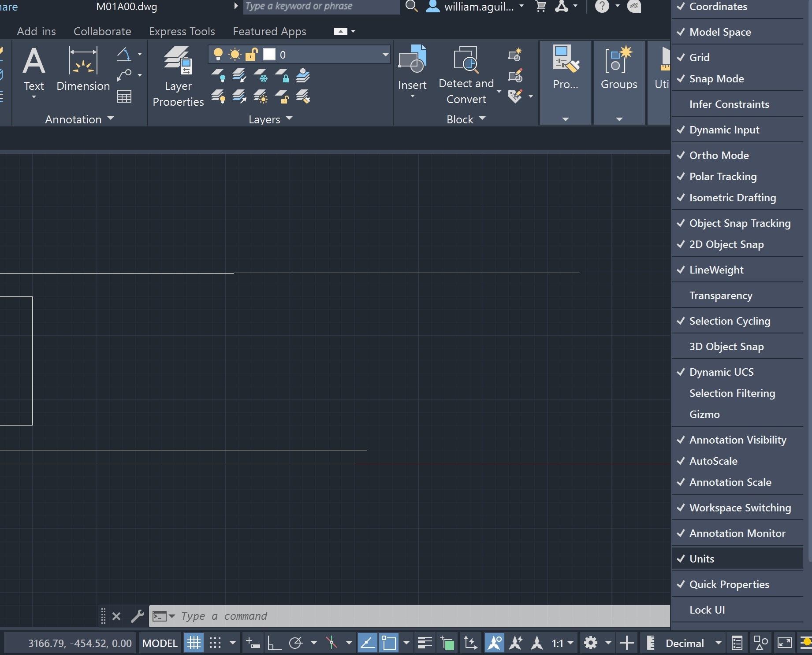</div>

Listado de herramientas complementarias:

| Ícono                                                                                                                                                                                                     | Herramienta           | Atajo / Comando                                      | Descripción                                                                                                                                                                                                                                                                                                         |
|:----------------------------------------------------------------------------------------------------------------------------------------------------------------------------------------------------------|:----------------------|:-----------------------------------------------------|:--------------------------------------------------------------------------------------------------------------------------------------------------------------------------------------------------------------------------------------------------------------------------------------------------------------------|
|                                                                                                                                                                                                           | Coordinates           | <kbd>ctrl</kbd>+<kbd>i</kbd> <br>COORDS              | Activa la visualización de posición de coordenadas del cursor en el espacio de trabajo.                                                                                                                               |
|                                                                                                                                                                                                           | Model Space           |                                                      | Cambiar de espacio de modelo a espacio de papel.                                                                                                                                                                        |
| 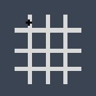                                                                                                                    | Grid                  | <kbd>F7</kbd> <br>GRID <br>GRIDMODE                  | Muestra y oculta la grilla o retícula de referencia. Utilizando los comandos podrá cambiar las propiedades de espaciamiento desde una ventana de configuración y definir si el ajuste es rectangular (por defecto), isométrico o polar.                                                                             |
|                                                                                                                 | Snap Mode             | <kbd>F9</kbd> <br>SNAP <br>SNAPMODE                  | Activa el ajuste de encajado (polar o grid) a la grilla de referencia. El espaciamiento de encajado puede ser definido por el usuario y ser diferente al espaciamiento definido en la grilla de referencia.                                                                                                         |
|                                                                                                         | Infer Constraints     | CONSTRIAINTINFER                                     | Aplica automáticamente restricciones geométricas de ajuste de elementos (perpendicular, horizontal, parallel....) cuando se está creando o editando un elemento geométrico.                                                                                                                                         |
|                                                                                                             | Dynamic Input         | <kbd>F12</kbd> <br>DYNMODE                           | Despliega opciones cerca del cursor, con las que se pueden ingresar comandos adicionales o ingresar valores. Sin su activación, deberá ingresar los valores y parámetros desde la barra inferior Command.                                                                                                           |
|                                                                                                                | Ortho Mode            | <kbd>F8</kbd> <br>ORTHOMODE                          | Activa el modo ortogonal, con lo que solo podrá dibujar elementos hacia izquierda y derecha o arriba y abajo.                                                                                                                                                                                                       |
|                                                                                                            | Polar Tracking        | <kbd>F10</kbd>                                       | Activa el modo de rastreo polar, con lo que el puntero se ajustará automáticamente a los ángulos por defecto o definidos por el usuario.                                                                                                                                                                            |
| 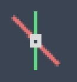                                                                                                       | Isometric Drafting    | ISODRAFT                                             | Activa el modo de dibujo isométrico 2D (a 30°), permitiendo seleccionar entre las vistas izquierda, superior o derecha. Automáticamente cambiará la representación de la grilla de referencia.                                                                                                                      |
|                                                                                                       | Object Snap Tracking  | <kbd>F11</kbd> <br>AUTOSNAP                          | Activa el modo de visualización de líneas de encajado, para lo cual debe ser definida y activada una opción de encajado o Snap.                                                                                                                                                                                     |
|                                                                                                             | 2D Object Snap        | <kbd>F3</kbd> <br>OSNAP                              | Activa el modo de encajado de geometría 2D a partir, p. ej. de nodos en extremos, cuadrantes, centroides, etc...                                                                                                                                                                                                    |
|                                                                                                               | LineWeight            | LWDISPLAY                                            | Muestra en el espacio de dibujo, los anchos de línea establecidos en las capas o layers.                                                                                                                                                                                                                            |
|                                                                                                             | Transparency          | TRANSPARENCYDISPLAY                                  | Activa o desactiva la transparecia definida a elementos en las capas o layers.                                                                                                                                                                                                                                      |
|                                                                                                         | Selection Cycling     | SELECTIONCYCLING                                     | Controla el comportamiento de la selección de elementos, especialmente cuando existen elementos superpuestos o traslapados, solicitando al usuario cual de ellos quiere seleccionar.                                                                                                                                |
|                                                                                                             | 3D Object Snap        | <kbd>F4</kbd> <br>3DOSNAP                            | Activa el modo de encajado de geometría 3D.                                                                                                                                                                                                                                                                         |
|                                                                                                               | Dynamic UCS           | <kbd>F6</kbd> <br>UCSDETECT                          | Activa el modo de visualización dinámica del sistema de coordenadas de usuario (UCS) del dibujo, que temporalmente alinea el plano XY del UCS a la cara planar de un sólido 3D. Se utilizan por defecto valores de desplazamiento relativos, para ingresar valores absolutos utilizar antes del valor el símbolo #. |
|                                                                                                       | Selection Filtering   | SUBOBJSELECTIONMODE                                  | Permite especificar cual tipo de sub-objeto 3D es resaltado cuando el curso es puesto sobre el.                                                                                                                                                                                                                     |
|                                                                                                                    | Gizmo                 | DEFAULTGIZMO                                         | Muestra en pantalla herramientas de manipulación de objetos 3D que permiten mover, rotar o escalar.                                                                                                                                                                                                                 |
|                                                                                                     | Annotation Visibility | ANNOALLVISIBLE                                       | Muestra los objetos de anotación (textos, dimensiones) en la escala actual definida.                                                                                                                                                                                                                                |
|                                                                                                                | AutoScale             | ANNOAUTOSCALE                                        | Agrega escalas a objetos de anotación (textos, dimensiones) cuando cambia la escala de anotación.                                                                                                                                                                                                                   |
|                                                                                                          | Annotation Scale      | CANNOSCALE                                           | Definición de la escala de anotación para la actual vista.                                                                                                                                                                                                                                                          |
|                                                                                                       | Workspace Switching   | WSCURRENT                                            | Permite cambiar entre los diferentes espacios de trabajo de AutoCAD: Drafting and Annotation, 3D Basics, 3D Modeling.                                                                                                                                                                                               |
|    | Annotation Monitor    | ANNOMONITOR                                          | Activa el monitor de anotaciones. Cuando el monitor esta activo o en modo On, se muestran etiquetas sobre todos las anotaciones no asociativas.                                                                                                                                                                     |
|                                                                                                                    | Units                 | UNITS                                                | Permite seleccionar el sistema de unidades a utilizar en el dibujo: Architectural, Decimal, Engineering, Fractional, Scientific.                                                                                                                                                                                    |
|                                                                                                          | Quick Properties      | QPMODE                                               | Activa el modo al vuelo de visualización de propiedades elementales de un elemento seleccionado.                                                                                                                                                                                                                    |
|                                                                                                                   | Lock UI               | LOCKUI                                               | Bloquea la localización de elementos y paneles de la interfaz de usuario.                                                                                                                                                                                                                                           |
|                                                                                                           | Isolate Objects       | ISOLATEOBJECTS <br>HIDEOBJECTS  <br>UNISOLATEOBJECTS | Herramienta para aislar u ocultar objetos del espacio de trabajo. Luego de terminar de editar los objetos visibles, podrá volver a mostrar todos los elementos del diibujo.                                                                                                                                         |
|                                                                                                      | Graphics Performance  | GRAPHICSCONFIG                                       | Permite cambiar la configuración de rendimiento de los gráficos o tarjeta gráfica del equipo.                                                                                                                                                                                                                       |
|                                                                                                              | Clean Screen          | <kbd>ctrl</kbd>+<kbd>0</kbd> <br>CLEANSCREEN         | Permite visualizar AutoCAD en pantalla completa.                                                                                                                                                                                                                                                                    |

> Dando clic derecho sobre la herramienta requerida, podrá acceder a las ventanas de configuración.
> 
> En el evento de que la barra de estado esté oculta, con el comando **STATUSBAR** y el valor 1, podrá reactivarla. Las pestañas de _Modelo_ y _Layouts_ pueden ser alineadas con la barra de estado o estar por encima de ella. Dando clic derecho sobre cualquier pestaña, podrá activar la opción de alineamiento.
> 
> Cuando no se muestran las pestañas inferiores correspondientes al espacio de modelo o _Model_ y las hojas de impresión o _Layouts_, activando el menú contextual en cualquier lugar de la pantalla y seleccionando _Options_, podrá en la ficha _Display_ activar en _Layout elements / Display Layout and Model tabs_. Esta misma opción puede ser ejecutada desde el _Command_ de AutoCAD con el comando _OPTIONS_
>
> Si la barra _Command_ no aparece en pantalla, utilizar <kbd>ctrl</kbd> + <kbd>9</kbd>, digitar _COMMANDLINE_ o _COMMANDLINEHIDE_.
> 
> Para la configuración de las escalas de dibujo, en el botón de la barra de estado _Annotation scale of the current view_, defina las escalas a utilizar, p. ej., para definir escala 1:5 deberá establecer que 1000 unidades en el papel o 1000 milímetros, corresponden a 5 unidades de dibujo.


## 6. Dibujo de planos isométricos y técnica para realizar dibujos en proyección isométrica[^1]

:mortar_board: Lista de video recomendada: [AutoCAD para todos / Dibujo isométrico 2D](https://www.youtube.com/playlist?list=PLzdkaVXEoikTzX7_QvZVBlPJeY8Lwxc9C).

La proyección isométrica es un método para representar objetos tridimensionales en un plano bidimensional, donde las tres dimensiones (alto, ancho y profundidad) se muestran con la misma escala, utilizando ángulos de 30 grados respecto a la horizontal. Esto significa que las líneas paralelas al objeto se mantienen paralelas en la representación, sin puntos de fuga, a diferencia de la perspectiva cónica. 

Las proyecciones ortogonales (u ortográficas) son el medio adecuado para describir cualquier objeto en forma exacta y completa.

<div align="center">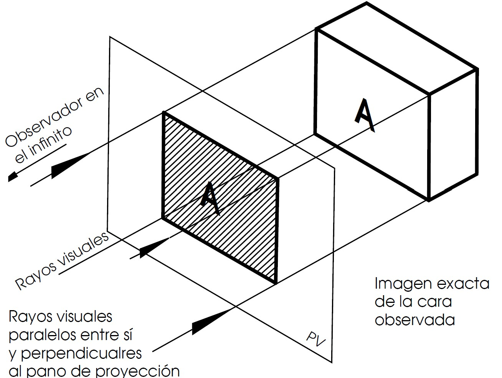<br><sub>Tomado de: Dibujo Técnico I - DGEP (pág. 138)</sub></div>

Por ejemplo:

<div align="center">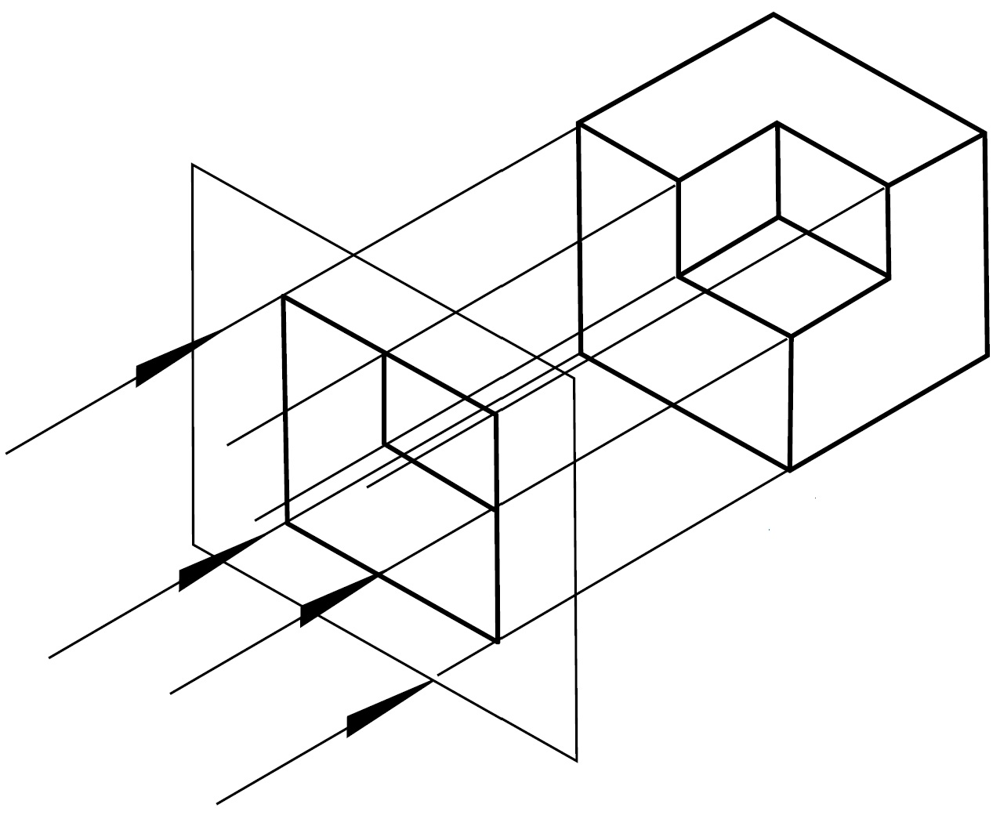<br><sub>Tomado de: Dibujo Técnico I - DGEP (pág. 138)</sub></div>

La técnica para realizar dibujos en proyección isométrica consiste, en primer lugar, en llevar sobre cada eje las dimensiones básicas que envuelven el objeto. A continuación, se trazan paralelas por cada punto señalado anteriormente hasta lograr un prisma base. Después se dibujan los detalles de la cara frontal y, finalmente, por los puntos principales de la cara frontal se trazan líneas auxiliares con la inclinación correspondiente, con el fin de obtener los
detalles restantes del objeto.

<div align="center">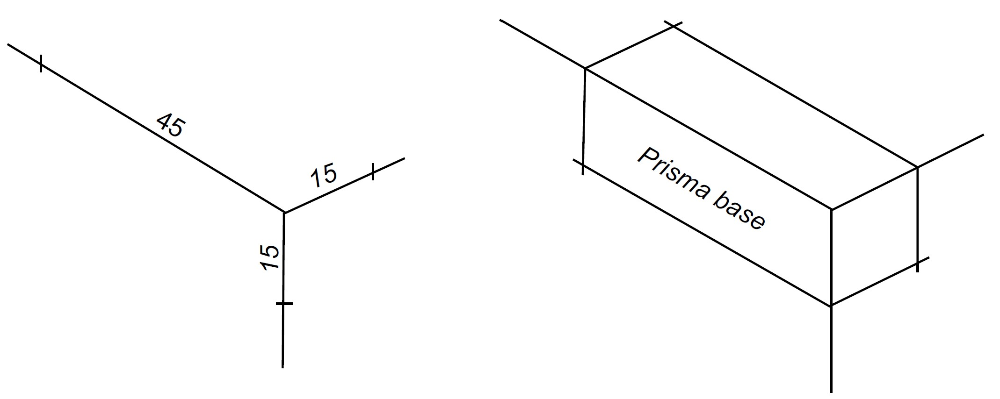<br><sub>Tomado de: Dibujo Técnico I - DGEP (pág. 122)</sub></div>
<div align="center">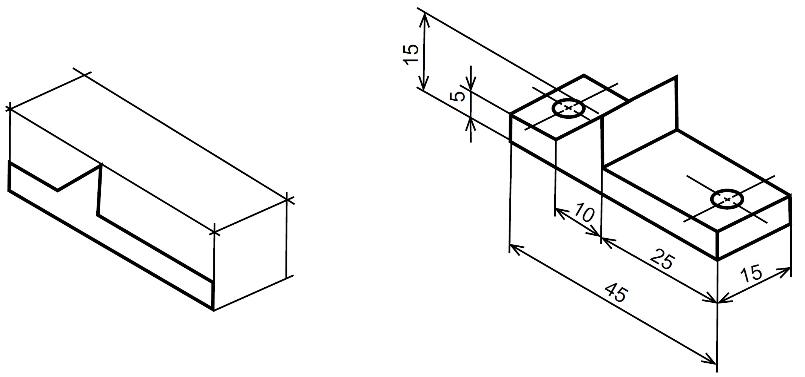<br><sub>Tomado de: Dibujo Técnico I - DGEP (pág. 122)</sub></div>

A partir de la proyección isométrica, podemos dibujar las vistas planas de cualquier objeto, p. ej.:

<div align="center">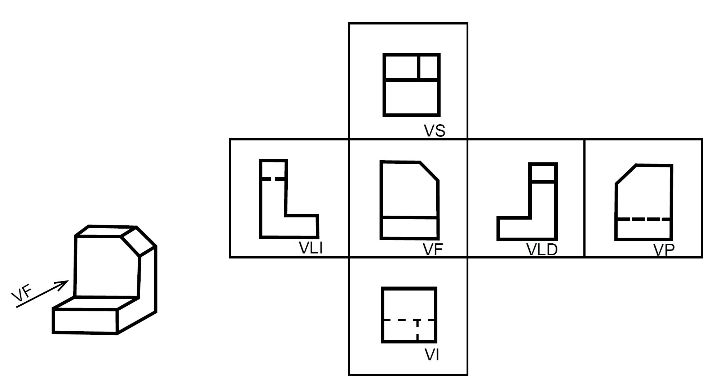<br><sub>Tomado de: Dibujo Técnico I - DGEP (pág. 122)</sub></div><br>

Para el dibujo isométrico en AutoCAD, es necesario activar los siguientes asistentes de dibujo:

*  Dynamic Input, <kbd>F12</kbd>, **DYNMODE**.
*  Polar Tracking, <kbd>F10</kbd> para ángulos de 30 grados.
*   Isometric Drafting , **ISODRAFT**.
*  Object Snap Tracking, <kbd>F11</kbd>, **AUTOSNAP**.
*  2D Object Snap, <kbd>F3</kbd>, **OSNAP** para Endpoint, Midpoint, Center, Quadrant, Intersection y Tangent.

<div align="center">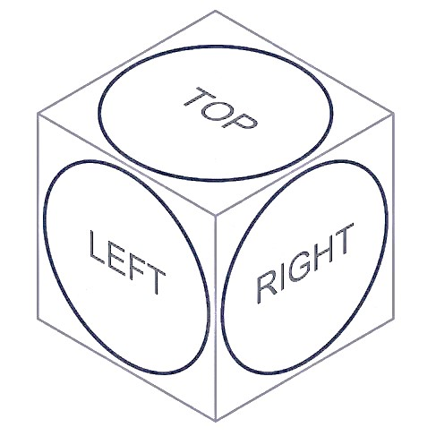<br><sub>Planos isométricos en AutoCAD.</sub></div>


### Ejercicio M01A01E03

Para practicar las herramientas de dibujo asistido, construiremos en clase el siguiente [dibujo isométrico](https://es.wikipedia.org/wiki/Proyecci%C3%B3n_isom%C3%A9trica) a partir de líneas, dibujaremos las vistas proyectadas y vistas planas lateral derecha, superior, frontal y posterior, calcularemos las áreas de cada cara proyectada y el volúmen total del sólido. Guarde el dibujo como _/file/cad/M01A01E03.dwg_.

<div align="center">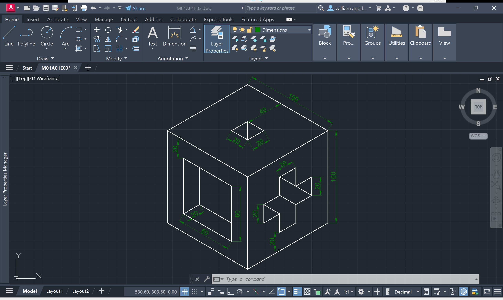</div>


### Ejercicio M01A01E04

Dibuje el siguiente [dibujo isométrico](https://es.wikipedia.org/wiki/Proyecci%C3%B3n_isom%C3%A9trica) a partir de líneas y dibuje las vistas proyectadas y planas lateral derecha, superior, frontal y posterior, calcule las áreas de cada cara proyectada y el volúmen total del sólido. Guarde el dibujo como _/file/cad/M01A01E04.dwg_.

<div align="center"><br><sub>Tomado de: Dibujo Técnico I - DGEP (pág. 122)</sub></div>


### Ejercicio M01A01E05

Dibuje el siguiente [dibujo isométrico](https://es.wikipedia.org/wiki/Proyecci%C3%B3n_isom%C3%A9trica) a partir de líneas y dibuje las vistas proyectadas y planas lateral derecha, superior, frontal y posterior, calcule las áreas de cada cara proyectada y el volúmen total del sólido. Guarde el dibujo como _/file/cad/M01A01E05.dwg_.

<div align="center"><br><sub>Tomado de: Dibujo Técnico I - DGEP (pág. 122)</sub></div>


### Ejercicio M01A01E06

Dibuje el siguiente [dibujo isométrico](https://es.wikipedia.org/wiki/Proyecci%C3%B3n_isom%C3%A9trica) a partir de líneas y dibuje las vistas proyectadas y planas lateral derecha, superior, frontal y posterior, calcule las áreas de cada cara proyectada y el volúmen total del sólido. Guarde el dibujo como _/file/cad/M01A01E06.dwg_.

<div align="center"><br><sub>Tomado de: Dibujo Técnico I - DGEP (pág. 122)</sub></div>


### Ejercicio M01A01E07

Dibuje el siguiente [dibujo isométrico](https://es.wikipedia.org/wiki/Proyecci%C3%B3n_isom%C3%A9trica) de una escalera a partir de líneas y dibuje las vistas proyectadas y planas lateral derecha, superior, frontal y posterior. Guarde el dibujo como _/file/cad/M01A01E07.dwg_.

El espesor del material de la escalera es 2.5 y el ángulo de dibujo es de 45 grados.

<div align="center"><br><sub>Tomado de: Dibujo Técnico I - DGEP (pág. 122)</sub></div>


## Actividades de proyecto :triangular_ruler:

Utilizando la [plantilla suministrada](../../file/report/R.DAPC.PlantillaSoporteDesarrollo.docx), cree un documento soporte mostrando las actividades desarrolladas en el orden presentado en esta actividad, junto con los análisis y recomendaciones realizadas, convierta a Adobe Acrobat (.pdf) y guarde en la carpeta _/activity_ del repositorio de datos del proyecto; nombre el archivo con el código de la actividad agregando al final la fecha de control documental en formato aaaammdd (p. ej. M01A01_20250531.pdf).

En la siguiente tabla se listan las actividades que deben ser desarrolladas y documentadas por cada estudiante o grupo de proyecto.

| Actividad | Alcance                                                                                                                                                                                                                                                                                                                                                                                                                                                                                                  |
|:----------|:---------------------------------------------------------------------------------------------------------------------------------------------------------------------------------------------------------------------------------------------------------------------------------------------------------------------------------------------------------------------------------------------------------------------------------------------------------------------------------------------------------|
| M01A01    | Esta actividad no requiere del desarrollo de elementos en el avance del proyecto final, los contenidos son evaluados a partir de la entrega de los ejercicios definidos en la actividad.                                                                                                                                                                                                                                                                                                                 | 
| M01A01    | En una tabla y al final del informe de avance de esta entrega, indique el detalle de las actividades realizadas por cada integrante de su grupo; utilice las siguientes columnas: `Nombre del integrante`, `Actividades realizadas`, `Tiempo dedicado en horas` (si presenta la entrega individualmente, no es necesaria la presentación de esta tabla).<br><br>Para actividades que no requieren del desarrollo de elementos de avance, indicar si realizo la lectura y ejercicios de la guía de clase. | 

> Nota 1: para la revisión del proyecto final, guarde los libros cálculo de Microsoft Excel y los archivos generados en esta actividad, en las localizaciones indicadas en cada numeral.
>
> Nota 2: una vez el instructor realice la revisión y el estudiante presente las correcciones o ajustes solicitados, será necesario cargar una nueva versión de los archivos en el repositorio del proyecto, incluyendo o actualizando al final del nombre del archivo, la fecha de presentación en formato aaaammdd y manteniendo las versiones anteriores presentadas.
>


## Referencias

* https://help.autodesk.com/view/ACD/2026/ESP
* https://help.autodesk.com/view/ACD/2026/ENU/
* https://es.wikipedia.org/wiki/Proyecci%C3%B3n_isom%C3%A9trica
* https://www.andresdeltoro.es/realizar-una-linea-poligonal-autocad-conociendo-los-angulos/
* [AutoCAD para todos / La barra de estado en AutoCAD](https://www.youtube.com/watch?v=7a7uWnCzSB8)
* [AutoCAD para todos / Comandos de Dibujo](https://www.youtube.com/playlist?list=PLzdkaVXEoikS3EwqyXwFHJ3pCoZE78Ecl)
* [AutoCAD para todos / Comando LINE](https://www.youtube.com/watch?v=tn0AooiV_R0)
* Dibujo Técnico I - DGEP


## Control de versiones

| Versión    | Descripción        | Autor                                      | Horas |
|------------|:-------------------|--------------------------------------------|:-----:|
| 2025.06.22 | Versión inicial.   | [rcfdtools](https://github.com/rcfdtools)  |  16   |


##

_R.DAPC es de uso libre para fines académicos, conoce nuestra licencia, cláusulas, condiciones de uso y como referenciar los contenidos publicados en este repositorio, dando [clic aquí](../../LICENSE.md)._

_¡Encontraste útil este repositorio!, apoya su difusión marcando este repositorio con una ⭐ o síguenos dando clic en el botón Follow de [rcfdtools](https://github.com/rcfdtools) en GitHub._


| [:arrow_backward: Anterior](../Readme.md) | [:house: Inicio](../../README.md) | [:beginner: Ayuda / Colabora](https://github.com/rcfdtools/R.DAPC/discussions/99999) | [Siguiente :arrow_forward:](../M01A02a/Readme.md) |
|-------------------------------------------|-----------------------------------|--------------------------------------------------------------------------------------|---------------------------------------------------|

[^1]: Tomado de: Dibujo Técnico I - DGEP (pág. 125)