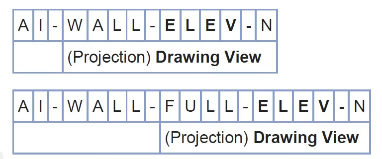
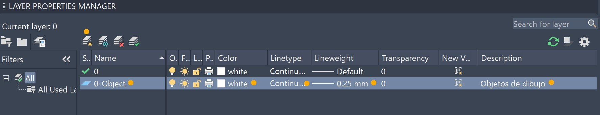

# 1.2.a. Elementos básicos de dibujo / Creación de capas o layers
Keywords: `aia` `nibs` `iso-13567` `m01a01a`

Normas para definición de nombres y creación de capas o Layers.

 Tomado de: <a href="https://nibs.org/">https://nibs.org/</a>  

## Objetivos

Al finalizar esta semana el estudiante:

* Entiende los conceptos de aplicación de normas ISO para el nombramiento de layers o capas de dibujo.
* Crea y modifica layers.

## Requerimientos

Archivos, actividades previas, lecturas y herramientas requeridas para el desarrollo de esta actividad:

| Requerimiento                                                                       | Descripción                                                                                                         |
|:------------------------------------------------------------------------------------|:--------------------------------------------------------------------------------------------------------------------|
| [:toolbox:Herramienta](https://www.autodesk.com/products/autocad)                   | Autodesk Autocad 3D 2026 o superior.                                                                                |
| [:toolbox:Herramienta](https://www.microsoft.com/es/microsoft-365/excel?market=bz)  | Microsoft Excel 365.                                                                                                |
| [:toolbox:Herramienta](https://notepad-plus-plus.org/)                              | Notepad++.                                                                                                          |
| [:date:DAPC_AIALayerName.xlsx](../../file/table/DAPC_AIALayerName.xlsx) | Libro de Excel con nombres de capas (layers) AIA para arquitectura, civil, electricidad y topografía / cartografía. |

> Para los diferentes avances de proyecto, es necesario guardar y publicar las diferentes versiones generadas del (los) libro (s) de Microsoft Excel y reportes o informes, agregando al final la fecha de control documental en formato aaaammdd, p. ej. _R.HydroTools.DisenoCaucesParametros.20250528.xlsx_.

## 1. Normas para nombramiento de capas (layers)

La creación de capas puede obedecer a nombres propios con los que el usuario está familiarizado (p. ej., Dimension, Objeto, Eje, Lote, Circuito, Achurado, Contorno, Edificio, Instalación), sin embargo, en la elaboración profesional de proyectos, se recomienda seguir estándares de creación y nombramiento de capas, como los establecidos en la norma internacional estándar [ISO 13567](https://www.iso.org/standard/70181.html).

Para este ejercicio, utilizaremos como referencia, las especificaciones del [United States National CAD Stardard - v5](https://facilities.duke.edu/sites/default/files/AIA%20CAD%20Layer%20Guidelines.pdf) del [National Institute of Building Sciences](https://nibs.org/), en los que se encuentran las siguientes codificaciones para nombres de capas.

> Tenga en cuenta que existen nuevas versiones de esta norma, p. ej., la versión 6 incluye estándares relacionados con [BIM](https://es.wikipedia.org/wiki/Modelado_de_informaci%C3%B3n_de_construcci%C3%B3n).

### Prefijos por disciplina - Nivel 1

Para la designación de disciplinas, utilizaremos los siguientes prefijos:

| Prefix | Discipline                 | Disciplina                     |
|:------:|:---------------------------|:-------------------------------|
| **A**  | Architectural              | Arquitectura                   |
|   B    | Geotechnical               | Geotecnia                      |
| **C**  | Civil                      | Civil                          |
|   D    | Process                    | Procesos                       |
| **E**  | Electrical                 | Electricidad                   |
|   F    | Fire Protection            | Protección contra incendios    |
|   G    | General                    | General                        |
|   H    | Hazardous Materials        | Materiales peligrosos          |
|   I    | Interiors                  | Interiores                     |
|   L    | Landscape                  | Paisajismo                     |
|   M    | Mechanical                 | Mecánica                       |
|   O    | Operations                 | Operaciones                    |
|   P    | Plumbing                   | Fontanería                     |
|   Q    | Equipment                  | Equipos                        |
|   R    | Resource                   | Recursos                       |
| **S**  | Structural                 | Estructura                     |
|   T    | Telecommunications         | Telecomunicaciones             |
| **V**  | Survey / Mapping           | Topografía / Cartografía       |
| **W**  | Distributed Energy         | Energía distribuida            |
|   X    | Other Disciplines          | Otras disciplinas              |
|   Z    | Contractor / Shop Drawings | Contratista / Planos de taller |

Por ejemplo: **A**, representa la disciplina de arquitectura.

> Las disciplinas resaltadas en negrilla serán las que utilizaremos como referencia general en este curso, si embargo y en caso de ser necesario, utilizaremos nombres de capas de otras disciplinas.

### Prefijos por disciplina - Nivel 2

El nivel dos, corresponde a un caracter opcional que se coloca a la derecha del caracter de nivel 1, y es usado para definir la característica de las disciplinas.:

| Designator | Description                           | Descripción                                                |
|:----------:|:--------------------------------------|:-----------------------------------------------------------|
|   **A**    | **Architectural**                     | **Arquitectura**                                           |
|     AD     | Architectural Demolition              | Demolición arquitectónica                                  |
|     AE     | Architectural Elements                | Elementos arquitectónicos                                  |
|     AF     | Architectural Finishes                | Acabados arquitectónicos                                   |
|     AG     | Architectural Graphics                | Gráficos arquitectónicos                                   |
|     AI     | Architectural Interiors               | Interiores arquitectónicos                                 |
|     AJ     | User Defined                          | Definido por el usuario                                    |
|     AK     | User Defined                          | Definido por el usuario                                    |
|     AS     | Architectural Site                    | Sitio arquitectónico                                       |
|   **C**    | **Civil**                             | **Civil**                                                  |
|     CD     | Civil Demolition                      | Demolición Civil                                           |
|     CG     | Civil Grading                         | Nivelación Civil                                           |
|     CI     | Civil Improvements                    | Mejoras Civiles                                            |
|     CJ     | User Defined                          | Definido por el Usuario                                    |
|     CK     | User Defined                          | Definido por el Usuario                                    |
|     CN     | Civil Nodes                           | Nodos Civiles                                              |
|     CP     | Civil Paving                          | Pavimentación Civil                                        |
|     CS     | Civil Site                            | Sitio Civil                                                |
|     CT     | Civil Transportation                  | Transporte Civil                                           |
|     CU     | Civil Utilities                       | Servicios Civiles                                          |
|   **E**    | **Electrical**                        | **Electricidad**                                           |
|     ED     | Electrical Demolition                 | Demolición eléctrica                                       |
|     EI     | Electrical Instrumentation            | Instrumentación eléctrica                                  |
|     EJ     | User Defined                          | Definido por el usuario                                    |
|     EK     | User Defined                          | Definido por el usuario                                    |
|     EL     | Electrical Lighting                   | Iluminación eléctrica                                      |
|     EP     | Electrical Power                      | Energía eléctrica                                          |
|     ES     | Electrical Site                       | Sitio eléctrico                                            |
|     ET     | Electrical Telecommunications         | Telecomunicaciones eléctricas                              |
|     EY     | Electrical Auxiliary Systems          | Sistemas auxiliares eléctricos                             |
|   **S**    | **Structural**                        | **Estructural**                                            |
|     SB     | Structural Substructure               | Subestructura estructural                                  |
|     SD     | Structural Demolition                 | Demolición estructural                                     |
|     SF     | Structural Framing                    | Estructura estructural                                     |
|     SJ     | User Defined                          | Definido por el usuario                                    |
|     SK     | User Defined                          | Definido por el usuario                                    |
|     SS     | Structural Site                       | Sitio estructural                                          |
|   **V**    | **Survey / Mapping**                  | **Levantamiento/Cartografía**                              |
|     VA     | Survey / Mapping Aerial               | Levantamiento/Cartografía aérea                            |
|     VC     | Survey / Mapping Computated Points    | Levantamiento/Cartografía de puntos calculados             |
|     VF     | Survey / Mapping Field                | Levantamiento/Cartografía de campo                         |
|     VI     | Survey / Mapping Digital              | Levantamiento/Cartografía digital                          |
|     VJ     | User Defined                          | Definido por el usuario                                    |
|     VK     | User Defined                          | Definido por el usuario                                    |
|     VN     | Survey / Mapping Node Points          | Levantamiento/Cartografía de puntos nodales                |
|     VS     | Survey / Mapping Staked Points        | Levantamiento/Cartografía de puntos replanteados           |
|     VU     | Survey / Mapping Combined Utilities   | Levantamiento/Cartografía de servicios públicos combinados |
|   **W**    | **Distributed Energy**                | **Energía distribuida**                                    |
|     WC     | Distributed Energy Civil              | Energía distribuida civil                                  |
|     WD     | Distributed Energy Demolition         | Demolición de energía distribuida                          |
|     WI     | Distributed Energy Interconnection    | Interconexión de energía distribuida                       |
|     WJ     | User Defined                          | Definido por el usuario                                    |
|     WK     | User Defined                          | Definido por el usuario                                    |
|     WP     | Distributed Energy Power              | Energía distribuida eléctrica                              |
|     WS     | Distributed Energy Structural         | Energía distribuida estructural                            |
|     WT     | Distributed Energy Telecommunications | Telecomunicaciones de energía distribuida                  |
|     WY     | Distributed Energy Auxiliary Systems  | Sistemas auxiliares de energía distribuida                 |

Por ejemplo: **AD**, representa una demolición arquitectónica.

### Grupo mayor y grupo menor

Seguido al nivel dos y separando con un guion, se definen los nombres de los grupos mayores contenidos en cada disciplina, se debe utilizar como máximo 4 caracteres para su abreviación y se pueden incluir uno o varios subgrupos de la misma longitud.

| Group | Description                            | Descripción                                        |
|:-----:|:---------------------------------------|:---------------------------------------------------|
| ACCS  | Access                                 | Acceso                                             |
| ACID  | Acid waste systems                     | Sistemas de residuos ácidos                        |
| AERI  | Aerial Survey                          | Levantamiento aéreo                                |
| AFFF  | Aqueous film-forming foam system       | Sistema de espuma formadora de película acuosa     |
| AFLD  | Airfields                              | Aeródromos                                         |
| AIR~  | Air                                    | Aire                                               |
| ALGN  | Alignment                              | Alineación                                         |
| ALRM  | Alarm system                           | Sistema de alarma                                  |
| ANNO  | Annotation                             | Anotación                                          |
| AREA  | Area                                   | Área                                               |
| AUXL  | Auxiliary systems                      | Sistemas auxiliares                                |
| BARR  | Barrier                                | Barrera                                            |
| BCST  | Broadcast related system (radio or TV) | Sistema de radiodifusión (radio o TV)              |
| BEAM  | Beams                                  | Vigas                                              |
| BELL  | Bell system                            | Sistema de timbres                                 |
| BLDG  | Buildings and primary structures       | Edificios y estructuras primarias                  |
| BLIN  | Baseline                               | Línea base                                         |
| BNDY  | Political boundaries                   | Límites políticos                                  |
| BORE  | Borings                                | Perforaciones                                      |
| BRCG  | Bracing                                | Arriostramiento                                    |
| BRDG  | Bridge                                 | Puente                                             |
| BRIN  | Brine systems                          | Sistemas de salmuera                               |
| BRKL  | Break / fault lines                    | Líneas de rotura/falla                             |
| BRLN  | Building restriction line              | Línea de restricción de edificaciones              |
| BZNA  | Buffer zone area                       | Zona de amortiguamiento                            |
| CABL  | Cable systems                          | Sistemas de cable                                  |
| CATH  | Cathodic Protection System             | Sistema de protección catódica                     |
| CATV  | Cable television system                | Sistema de televisión por cable                    |
| CCTV  | Closed-circuit television system       | Sistema de circuito cerrado de televisión          |
| CEME  | Cemetery                               | Cementerio                                         |
| CHAN  | Navigable channels                     | Canales navegables                                 |
| CHEM  | Chemical                               | Productos químicos                                 |
| CHIM  | Chimneys and stacks                    | Chimeneas y conductos                              |
| CLNG  | Ceiling                                | Techo                                              |
| CLOK  | Clock system                           | Sistema de relojería                               |
| CMPA  | Compressed / processed air systems     | Sistemas de aire comprimido/procesado              |
| CMPR  | Computer                               | Ordenador                                          |
| CNDW  | Condenser water systems                | Sistemas de agua del condensador                   |
| CO2S  | CO2 system                             | Sistema de CO2                                     |
| CODE  | Code compliance plan                   | Plan de cumplimiento normativo                     |
| COLS  | Columns                                | Columnas                                           |
| COMM  | Communications                         | Comunicaciones                                     |
| CONT  | Controls and instrumentation           | Controles e instrumentación                        |
| CONV  | Conveying systems                      | Sistemas de transporte                             |
| CRPT  | Carpet / carpet tiles                  | Alfombra/losetas de moqueta                        |
| CSWK  | Casework                               | Carpintería                                        |
| CTRL  | Control points                         | Puntos de control                                  |
| CWTR  | Chilled water systems                  | Sistemas de agua refrigerada                       |
| DATA  | Data / LAN system                      | Datos/LAN Sistema                                  |
| DECK  | Deck                                   | Cubierta                                           |
| DETL  | Detail                                 | Detalle                                            |
| DFLD  | Drain fields                           | Campos de drenaje                                  |
| DIAG  | Diagrams                               | Diagramas                                          |
| DICT  | Dictation system                       | Sistema de dictado                                 |
| DOMW  | Domestic water systems                 | Sistemas de agua potable                           |
| DOOR  | Doors                                  | Puertas                                            |
| DRAN  | Drains                                 | Desagües                                           |
| DRIV  | Driveways                              | Entradas de vehículos                              |
| DTCH  | Ditches or washes                      | Cunetas o lavaderos                                |
| DUAL  | Dual temperature systems               | Sistemas de doble temperatura                      |
| DUST  | Dust and fume collection systems       | Sistemas de recolección de polvo y humos           |
| ELEC  | Electrical system, telecom plan        | Sistema eléctrico, plano de telecomunicaciones     |
| ELEV  | Elevation                              | Elevación                                          |
| ELHT  | Electric heat                          | Calefacción eléctrica                              |
| EMCS  | Energy monitoring control system       | Sistema de control de monitoreo de energía         |
| ENER  | Energy management systems              | Sistemas de gestión de energía                     |
| EQPM  | Equipment                              | Equipo                                             |
| EROS  | Erosion and sediment control           | Control de erosión y sedimentos                    |
| ESMT  | Easements                              | Servidumbres                                       |
| EVAC  | Evacuation plan                        | Plan de evacuación                                 |
| EXHS  | Exhaust system                         | Sistema de extracción                              |
| FENC  | Fences                                 | Cercas                                             |
| FIRE  | Fire protection                        | Protección contra incendios                        |
| FLHA  | Flood hazard area                      | Zona con riesgo de inundación                      |
| FLOR  | Floor                                  | Piso                                               |
| FNDN  | Foundation                             | Cimentación                                        |
| FNSH  | Finishes                               | Acabados                                           |
| FRAM  | Braced frame or moment frame           | Marco arriostrado o marco de momento               |
| FSTN  | Fasteners and connections              | Sujeciones y conexiones                            |
| FUEL  | Fuel systems                           | Sistemas de combustible                            |
| FUME  | Fume hood                              | Campana de extracción de gases                     |
| FURN  | Furnishings                            | Mobiliario                                         |
| GAS~  | Gas                                    | Gas                                                |
| GATE  | Gate                                   | Portón                                             |
| GLAZ  | Glazing                                | Acristalamiento                                    |
| GLYC  | Glycol systems                         | Sistemas de glicol                                 |
| GRID  | Grids                                  | Rejillas                                           |
| GRLN  | Grade line                             | Línea de rasante                                   |
| GRND  | Ground system                          | Sistema de puesta a tierra                         |
| HALN  | Halon                                  | Halón                                              |
| HVAC  | HVAC systems                           | Sistemas de climatización (HVAC)                   |
| HWTR  | Hot water heating system               | Sistema de calentamiento de agua caliente          |
| HYDR  | Hydraulic structure                    | Estructura hidráulica                              |
| IGAS  | Inert gas                              | Gas inerte                                         |
| INGR  | Ingrants                               | Concesiones                                        |
| INST  | Instrumentation system                 | Sistema de instrumentación                         |
| INTC  | Intercom / PA systems                  | Intercomunicador/PA Sistemas                       |
| IRRG  | Irrigation                             | Riego                                              |
| JNTS  | Joints                                 | Juntas                                             |
| JOIS  | Joists                                 | Viguetas                                           |
| LAND  | Land                                   | Terreno                                            |
| LEGN  | Legend, symbols keys                   | Leyenda, símbolos y claves                         |
| LEVE  | Levee                                  | Dique                                              |
| LGAS  | Laboratory gas systems                 | Sistemas de gases de laboratorio                   |
| LIQD  | Liquid                                 | Líquido                                            |
| LITE  | Lighting                               | Iluminación                                        |
| LNTL  | Lintels                                | Dinteles                                           |
| LOCN  | Limits of construction                 | Límites de construcción                            |
| LTNG  | Lightning protection system            | Sistema de protección contra rayos                 |
| MACH  | Machine shop                           | Taller de maquinaria                               |
| MAJQ  | Major equipment                        | Equipo principal                                   |
| MDGS  | Medical gas systems                    | Sistemas de gases medicinales                      |
| MILL  | Millwork                               | Carpintería                                        |
| MINQ  | Minor equipment                        | Equipo menor                                       |
| MKUP  | Make-up air systems                    | Sistemas de aire de reposición                     |
| MNTG  | Mounting system                        | Sistema de montaje                                 |
| MPIP  | Miscellaneous piping systems           | Sistemas de tuberías misceláneos                   |
| NGAS  | Natural gas systems                    | Sistemas de gas natural                            |
| NODE  | Node                                   | Nodo                                               |
| NURS  | Nurse call system                      | Sistema de llamada a enfermeras                    |
| OBST  | Obstructions                           | Obstrucciones                                      |
| OIL~  | Oil                                    | Petróleo                                           |
| OTGR  | Outgrants                              | Conducciones de salida                             |
| PADS  | Pads                                   | Almohadillas                                       |
| PERC  | Perc testing                           | Prueba de percolación                              |
| PGNG  | Paging system                          | Sistema de buscapersonas                           |
| PHON  | Telephone system                       | Sistema telefónico                                 |
| PIPE  | Piping                                 | Tuberías                                           |
| PLAN  | Key Plan (Floor Plan)                  | Plano clave (Plano de planta)                      |
| PLAT  | Platform                               | Andén                                              |
| PLNT  | Plant and landscape material           | Planta y material de jardinería                    |
| POND  | Ponds                                  | Estanques                                          |
| POWR  | Power                                  | Energía                                            |
| PRKG  | Parking lots                           | Estacionamientos                                   |
| PROC  | Process systems                        | Sistemas de proceso                                |
| PROJ  | Projector system                       | Sistema de proyectores                             |
| PROP  | Property                               | Propiedad                                          |
| PROT  | Fire protection system                 | Sistema de protección contra incendios             |
| PRTN  | Partitions                             | Tabiques                                           |
| PVMD  | Photovoltaic modules                   | Módulos fotovoltaicos                              |
| PVMT  | Pavement                               | Pavimento                                          |
| RAIL  | Railroad                               | Ferrocarril                                        |
| RAIR  | Relief air systems                     | Sistemas de aire de alivio                         |
| RCOV  | Energy recovery systems                | Sistemas de recuperación de energía                |
| REFG  | Refrigeration systems                  | Sistemas de refrigeración                          |
| RIGG  | Rigging / automation systems           | Aparejos/automatización Sistemas                   |
| RIVR  | River                                  | Río                                                |
| ROAD  | Roadways                               | Carreteras                                         |
| ROOF  | Roof                                   | Techo                                              |
| RRAP  | Riprap                                 | Escalones                                          |
| RUNW  | Runway                                 | Pista                                              |
| RWAY  | Right-of-way                           | Derecho de paso                                    |
| SECT  | Section                                | Sección                                            |
| SERT  | Security system                        | Sistema de seguridad                               |
| SGHT  | Sight distance                         | Distancia visual                                   |
| SIGN  | Sign                                   | Señal                                              |
| SITE  | Site features                          | Características del sitio                          |
| SLAB  | Slab                                   | Losa                                               |
| SLUR  | Slurry                                 | Lodo                                               |
| SMOK  | Smoke extraction systems               | Sistemas de extracción de humos                    |
| SOIL  | Soils                                  | Suelos                                             |
| SOUN  | Sound system                           | Sistema de sonido                                  |
| SPCL  | Special systems                        | Sistemas especiales                                |
| SPFX  | Entertainment special effects system   | Sistema de efectos especiales para entretenimiento |
| SPKL  | Sprinkler                              | Rociadores                                         |
| SSWR  | Sanitary sewer                         | Alcantarillado sanitario                           |
| STEM  | Steam system                           | Sistema de vapor                                   |
| STIF  | Stiffener                              | Refuerzo                                           |
| STRM  | Storm sewer                            | Alcantarillado pluvial                             |
| STRS  | Stairs                                 | Escaleras                                          |
| SURV  | Survey                                 | Topografía                                         |
| SWLK  | Sidewalks                              | Aceras                                             |
| TEST  | Test equipment                         | Equipo de prueba                                   |
| TILE  | Tile                                   | Tejas                                              |
| TINN  | Triangulated irregular network         | Red irregular triangular                           |
| TOPO  | Topographic feature                    | Característica topográfica                         |
| TRAL  | Trails or paths                        | Senderos o caminos                                 |
| TRAN  | Transmission system                    | Sistema de transmisión                             |
| TRUS  | Trusses                                | Cerchas                                            |
| TVAN  | Television antenna system              | Sistema de antena de televisión                    |
| TVVS  | Television and video system            | Sistema de televisión y video                      |
| UNID  | Unidentified site objects              | Objetos no identificados del sitio                 |
| UTIL  | Utilities                              | Servicios públicos                                 |
| VACU  | Vacuum                                 | Aspiradora                                         |
| VIDO  | Entertainment projection systems       | Sistemas de proyección de entretenimiento          |
| WALL  | Walls                                  | Muros                                              |
| WATR  | Water supply                           | Suministro de agua                                 |
| WETL  | Wetlands                               | Humedales                                          |
| WIND  | Wind powered                           | Energía eólica                                     |
| WWAY  | Waterway                               | Vía fluvial                                        |

Por ejemplo: **A-WALL**, representa muros arquitectónicos.

El uso de grupos menores es opcional y se pueden definir un segundo subnivel.

Por ejemplo: **A-WALL-FULL**, representa muros arquitectónicos completos de piso a techo y **A-WALL-FULL-TEXT** representa los textos de anotación de los muros arquitectónicos completos de piso a techo.

> Consulte el listado completo en [United States National CAD Stardard - v5](https://facilities.duke.edu/sites/default/files/AIA%20CAD%20Layer%20Guidelines.pdf)

### Estado o fase

Un último caracter, permite establecer el estado del elemento que se está representando en la capa.

| State | Description          | Descripción              |
|:-----:|:---------------------|:-------------------------|
|   A   | Abandoned            | Abandonado               |
|   D   | Existing to demolish | Existente para demoler   |
|   E   | Existing to remain   | Existente para conservar |
|   F   | Future work          | Trabajo futuro           |
|   M   | Items to be moved    | Artículos a trasladar    |
|   N   | New work             | Trabajo nuevo            |
|   T   | Temporary work       | Trabajo temporal         |
|   X   | Not in contract      | Sin contrato             |
|  1-9  | Phase numbers        | Número de fase           |

Por ejemplo: **A-WALL-FULL-TEXT-N** representa los textos de anotación de los muros arquitectónicos completos de piso a techo que han sido proyectados a futuro.

### Nombres comunes de capas por disciplina

En el libro de Excel [DAPC_AIALayerName.xlsx](../../file/table/DAPC_AIALayerName.xlsx), se encuentran los nombres de capas definidos por la NCS para las disciplinas relacionadas con las siguientes disciplinas:

* A - Architectural (arquitectura)
* C - Civil (civil)
* E - Electrical (electrical)
* S - Structural (estructural)
* V - Survey / Mapping (topografía y cartografía)
* W - Distributed Energy (energía distribuida)

> El símbolo □, representa la designación de nivel 2.
> 
> En la versión 5 del catálogo AIA, no se encuentran disponibles los nombres de capas para la disciplina W - Distributed Energy (energía distribuida).

Para el desarrollo de curso, utilizaremos las siguientes capas y configuraciones:

> El listado incluye las siguientes sub-capas cero (0) que no se encuentran en el catálogo AIA: 0-Object, 0-Sketch, 0-Axe, 0-Hatch, 0-Dimension, 0-Text, 0-Annotation.

## 2. Creación y manejo de capas (layers) en AutoCAD

En AutoCAD, una capa (o layer) es una herramienta de organización que permite agrupar objetos por función o tipo, facilitando la gestión y visualización de dibujos complejos. Piense en capas como hojas transparentes o papeles calcantes donde cada capa contiene un conjunto específico de elementos. Esto ayuda a controlar la visibilidad, el color, el tipo de línea y otras propiedades de los objetos de manera eficiente. Por defecto, todo dibujo nuevo de AutoCAD es creado incluyendo una capa denominada cero (0).

1. Cree un nuevo dibujo usando la plantilla métrica _acadiso.dwt_ y guarde como _/file/cad/M01A01a.dwg_. En el menú _Home_, seleccione en la pestaña _Layers_ la opción _Layer Properties_ o en el _Command_ ingrese el comando _**LAYER**_. Como observa, por defecto se ha creado la capa cero (0) en color blanco, con tipo de línea contínua, ancho por defecto y sin transparencia (valor de 0 a 100, donde 100 es completamente transparente).

> Dando clic derecho dentro del panel de capas, podrá acceder al menú contextual y encontrará múltiples opciones, entre ella _New Layer_.

2. Dando clic en el botón de agregar capas, cree la capa _0-Object_ de color blanco, con tipo de línea contínua, en grosor 0.25 y sin transparencia. En detatalle indique: _Objetos de dibujo_.

3. Repita el procedimiento para la creación de las demás sub-capas cero (0).

> Para establecer una capa por defecto, en el panel de capa, dar doble clic sobre el nombre de la capa.

## Actividades de proyecto :triangular_ruler:

Utilizando la [plantilla suministrada](../../file/report/R.DAPC.PlantillaSoporteDesarrollo.docx), cree un documento soporte mostrando las actividades desarrolladas en el orden presentado en esta actividad, junto con los análisis y recomendaciones realizadas, convierta a Adobe Acrobat (.pdf) y guarde en la carpeta _/activity_ del repositorio de datos del proyecto; nombre el archivo con el código de la actividad agregando al final la fecha de control documental en formato aaaammdd (p. ej. M01A00_20250531.pdf).

En la siguiente tabla se listan las actividades que deben ser desarrolladas y documentadas por cada estudiante o grupo de proyecto.

| Actividad | Alcance                                                                                                                                                                                                                                                                                                                                                                                                                                                                                                                                              |
|:----------|:-----------------------------------------------------------------------------------------------------------------------------------------------------------------------------------------------------------------------------------------------------------------------------------------------------------------------------------------------------------------------------------------------------------------------------------------------------------------------------------------------------------------------------------------------------|
| M01A00    | Esta actividad no requiere del desarrollo de elementos en el avance del proyecto final, los contenidos son evaluados a partir de la entrega de los ejercicios definidos en la actividad.                                                                                                                                                                                                                                                                                                                                                             |
| M01A00    | En una tabla y al final del informe de avance de esta entrega, indique el detalle de las actividades realizadas por cada integrante de su grupo; utilice las siguientes columnas: `Nombre del integrante`, `Actividades realizadas`, `Tiempo dedicado en horas` (si presenta la entrega individualmente, no es necesaria la presentación de esta tabla).  Para actividades que no requieren del desarrollo de elementos de avance, indicar si realizo la lectura de la guía de clase y las lecturas indicadas al inicio en los requerimientos. | 

> Nota 1: para la revisión del proyecto final, guarde los libros cálculo de Microsoft Excel y los archivos generados en esta actividad, en las localizaciones indicadas en cada numeral.
>
> Nota 2: una vez el instructor realice la revisión y el estudiante presente las correcciones o ajustes solicitados, será necesario cargar una nueva versión de los archivos en el repositorio del proyecto, incluyendo o actualizando al final del nombre del archivo, la fecha de presentación en formato aaaammdd y manteniendo las versiones anteriores presentadas.
>

## Referencias

* https://nibs.org/resources/standards/ncs6
* https://nibs.org/resources/reports/national-bim-guide-owners
* https://help.autodesk.com/view/ACD/2026/ESP
* https://help.autodesk.com/view/ACD/2026/ENU/
* [Draw parabola in AutoCAD](https://www.youtube.com/watch?v=h8pjymm-A5I)
* https://blog.draftsperson.net/iso-13567-cad-layer-standard/
* [Creating Macros in AutoCAD](https://www.youtube.com/watch?v=_fSgqZnqWPw)
* [NEW Autocad Command for Layer settings](https://www.youtube.com/watch?v=lo9cIBHD3j8)

## Control de versiones

| Versión    | Descripción        | Autor                                      | Horas |
|------------|:-------------------|--------------------------------------------|:-----:|
| 2025.06.22 | Versión inicial.   | [rcfdtools](https://github.com/rcfdtools)  |  16   |

##

_R.DAPC es de uso libre para fines académicos, conoce nuestra licencia, cláusulas, condiciones de uso y como referenciar los contenidos publicados en este repositorio, dando [clic aquí](../../LICENSE.md)._

_¡Encontraste útil este repositorio!, apoya su difusión marcando este repositorio con una ⭐ o síguenos dando clic en el botón Follow de [rcfdtools](https://github.com/rcfdtools) en GitHub._

| [:arrow_backward: Anterior](../M01A00/Readme.md) | [:house: Inicio](../../README.md) | [:beginner: Ayuda / Colabora](https://github.com/rcfdtools/R.DAPC/discussions/99999) | [Siguiente :arrow_forward:](../M01A02/Readme.md) |
|--------------------------------------------------|-----------------------------------|--------------------------------------------------------------------------------------|--------------------------------------------------|

[^1]: 