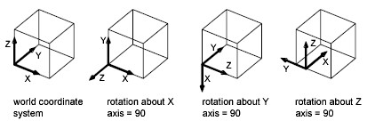
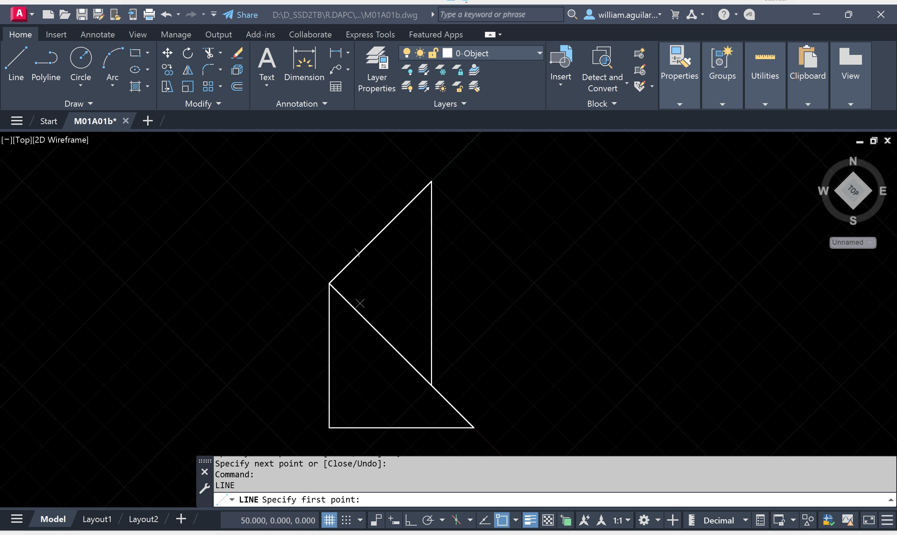
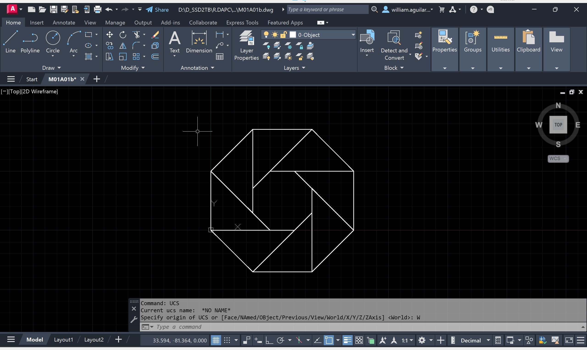
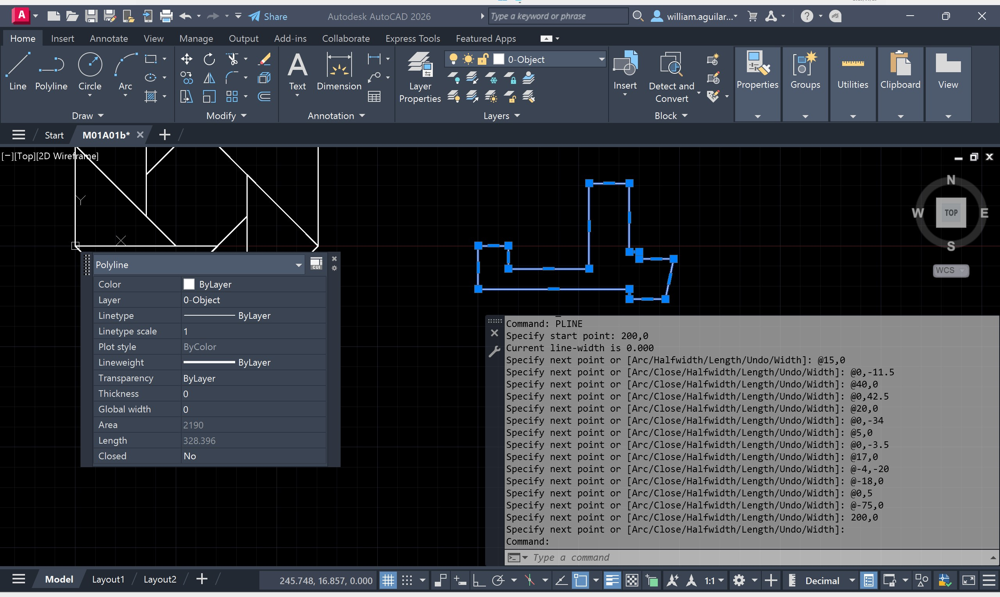
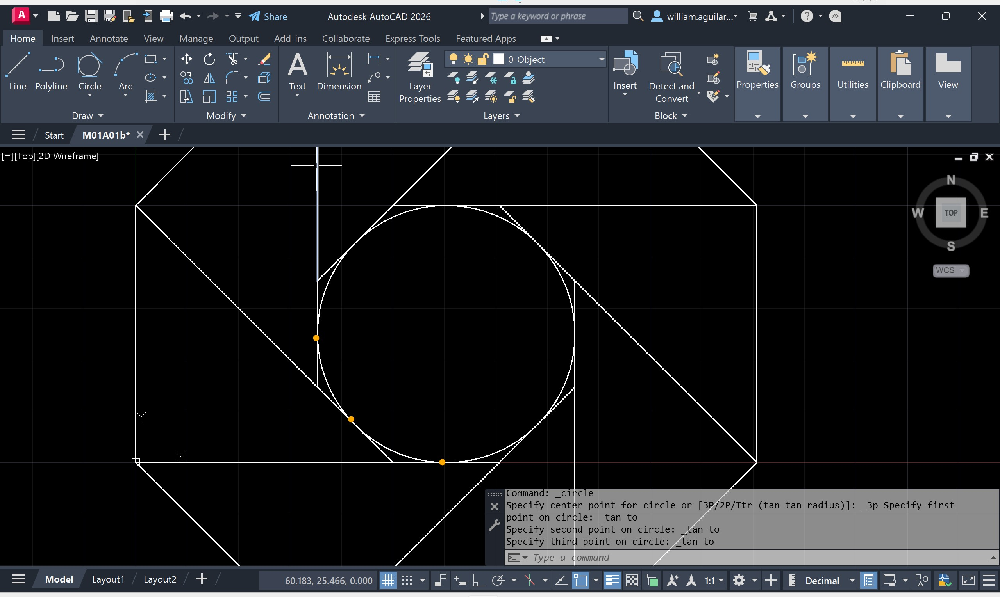
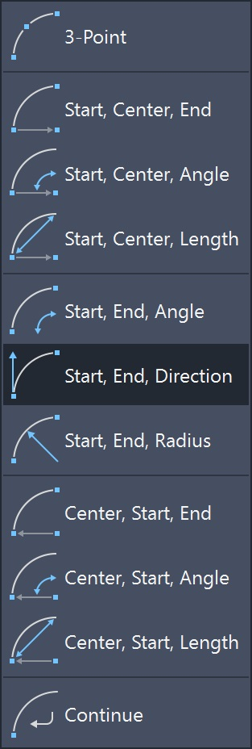
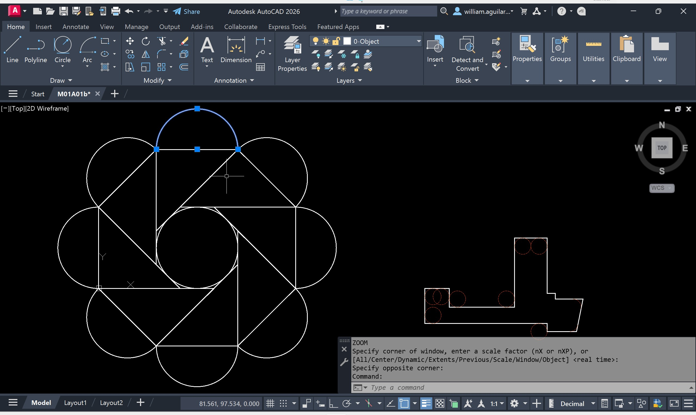
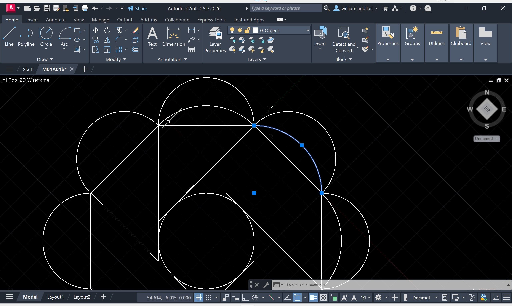

# 1.2.b. Elementos básicos de dibujo / UCS y Geometrías
Keywords: Keywords: `polyline` `arc` `fillet` `chamfer` `point` `array` `mirror` `offset` `donut` `trim` `ellipse` `parabola` `hyperbola` `m01a01b`

Sistema de coordenadas de usuario - UCS. Barra de herramientas de puntos de convergencia. Comandos POLYLINE, ARC, FILLET, CHAMFER, POINT, ARRAY, MIRROR, OFFSET, DONUT, TRIM. Dibujo de elipse, parábola, hipérbola y clotoide.

<div align="center"></div>


## Objetivos

Al finalizar esta actividad, el estudiante:

* 
* Realiza ejercicios de práctica en los que dibuja, traza y edita líneas, poli-líneas, arcos, chaflanes, cortes transversales y figuras geométricas en AutoCAD.


## Requerimientos

Archivos, actividades previas, lecturas y herramientas requeridas para el desarrollo de esta actividad:

<div align="center">

| Requerimiento                                                                                           | Descripción                                                                                                                      |
|:--------------------------------------------------------------------------------------------------------|:---------------------------------------------------------------------------------------------------------------------------------|
| [:toolbox:Herramienta](https://www.autodesk.com/products/autocad)                                       | Autodesk Autocad 3D 2026 o superior.                                                                                             |
| [:toolbox:Herramienta](https://notepad-plus-plus.org/)                                                  | Notepad++.                                                                                                                       |

</div>

> Para los diferentes avances de proyecto, es necesario guardar y publicar las diferentes versiones generadas del (los) libro (s) de Microsoft Excel y reportes o informes, agregando al final la fecha de control documental en formato aaaammdd, p. ej. _R.HydroTools.DisenoCaucesParametros.20250528.xlsx_.


## 1. Sistema de coordenadas de usuario - UCS

El [UCS](https://help.autodesk.com/view/ACD/2026/ENU/?guid=GUID-E658D5E7-EE5C-4A06-BF34-F71CDB363A71) permite definir el origen y la orientación del actual sistema de coordenadas. Por defecto, el UCS se localiza en el origen absoluto (0,0) y sin rotación, norte o arriba indica el valor del eje Y, este o derecha indica la dirección del eje X y perpendicular a su visual en pantalla, se encuentra el eje Z. Para facilitar la creación de dibujos precisos, el UCS puede ser movido, orientado y rotado en cualquier dirección.

<div align="center"></div>

Para entender mejor estos conceptos, creemos 3 líneas independientes que representen un triángulo rectángulo, con lados de 50 metros en las caras ortogonales y origen absoluto en (0,0).

1. Abra el archivo _/file/cad/M01A01a.dwg_ creado previamente que contiene los Layers del curso DAPC y las configuraciones de unidades y visualización, guarde como _/file/cad/M01A01b.dwg_ y establezca por defecto la capa _0-Object_.

Secuencia de comandos para creación del triángulo

```
LINE
0,0
50,0
0,50
0,0

```

Como observa en la figura, el nodo de origen del triángulo se encuentra alineado con los ejes del UCS.

<div align="center"></div>

2. Desde el _Command_, ejecute el comando **UCS**, seleccione el nodo superior del triángulo para mover el orígen, luego el nodo derecho para rotar el sistema de coordenadas y oprima <kbd>enter</kbd> para completar.

<div align="center"></div>

Observe que el orígen y la rotación de la grilla de referencia han cambiado.

<div align="center"></div>

3. Utilizando la secuencia de comandos para la creación del triángulo, vuelva a crear esta figura, podrá observar que ahora el nuevo triángulo se ha alineado a la cara de referencia, correspondiente a la hipotetnusa del triángulo anterior.

<div align="center"></div>

4. Repita este procedimiento 6 veces más y obtendrá la siguiente figura simétrica.

<div align="center"></div>

5. Para restablecer el orígen absoluto de coordenadas, en el _Command_, ingrese el comando **UCS** y seleccione la opción **W**orld.

<div align="center"></div>


## 2. Dibujo de polilíneas

En AutoCAD, una polilínea es una entidad de dibujo compuesta por segmentos de línea o arco que se consideran un único objeto. Esto significa que puedes seleccionar, editar o manipular la polilínea como un todo, en lugar de tratar cada segmento individualmente. El comando genérico para su creación es **PLINE** o su creación puede ser iniciada desde el menú _Home_ en el grupo _Draw_.

1. Utilizando las coordenadas de la figura asimétrica creada en el ejercicio [M01A00E01](../M01A00), creemos una polilínea con orígen absoluto en (200,0). Una ver completada la creación, active desde la barra inferior la visualización rápida de propiedades o ejecute el comando **QPMODE**, seleccione la polílinea y consulte sus propiedades. Podrá observar que se ha calculado automáticamente el área y el perímetro de la figura y que se indica que la polilinea está abierta.

> Para visualizar campos adicionales en la ventana flotante de propiedades rápidas, de clic en el piñon de la ventana y agregue los campos deseados.

```
PLINE
200,0
@15,0
@0,-11.5
@40,0
@0,42.5
@20,0
@0,-34
@5,0
@0,-3.5
@17,0
@-4,-20
@-18,0
@0,5
@-75,0
200,0

```

<div align="center"></div>

> Las polilíneas cerradas permiten crear polígonos, mientras que las abiertas solo son una secuencia de varios segmentos de líneas unidas en una única entidad.


## 3. Dibujo de circunferencias

Para su creación, existen múltiples métodos, tales como:

* Centro y radio
* Centro y diámetro
* 2 puntos
* 3 puntos
* Tangente, tangente y radio
* Tangente, tangente y tangente

Por ejemplo, para crear una circunferencia en la zona central de la figura simétrica construída a partir de triángulos, podremos utilizar la opción de 3 tangentes que puede ser ejecutada desde la cinta de opciones _Home / Draw / Circle_.

<div align="center"></div>

Las circunferencias también pueden ser utilizadas para crear líneas constructivas para el suavizado manual de esquinas, p. ej., para suavizar algunas de las esquinas de la figura asimétrica utilizando radios de 5 metros, primero seleccione en el panel de capas _0-Sketch_, luego cree circunferencias de dos tangentes y radio como se muestra a continuación.

> Para ajustar el espaciado de representación de las líneas constructivas, utilice el comando **LTSCALE** estableciendo escala en 0.1.

<div align="center"></div>

Luego, con la ayuda de la herramienta _Home / Modify / Trim_ o el comando **TRIM**, podrá eliminar las partes restantes fuera de las entre tangencias.

<div align="center"></div>


## 4. Trazado de arcos circulares

Existen múltiples métodos de trazado y su utilización depende de la necesidad particular de localización del arco.

<div align="center"></div>

Por ejemplo, para la creación de arcos de máximo radio en los extremos de la figura simétrica o caras ortogonales de los triángulos, puede utilizar la opción _Start, End, Direction_, definiendo como dirección máxima 90 grados o utilizar _Start, Center, End_.

<div align="center"></div>

Para el trazado de arco máximo de proyección en las caras de la figura, puede utilizar _Start, End, Direction_, estableciendo una dirección de 45 grados para lo cual deberá rotar el UCS o utilizar _Center, Start, End_ utilizando como centro el punto medio de la base de cada triángulo.

<div align="center"></div>


## 5. 


## Actividades de proyecto :triangular_ruler:

Utilizando la [plantilla suministrada](../../file/report/R.DAPC.PlantillaSoporteDesarrollo.docx), cree un documento soporte mostrando las actividades desarrolladas en el orden presentado en esta actividad, junto con los análisis y recomendaciones realizadas, convierta a Adobe Acrobat (.pdf) y guarde en la carpeta _/activity_ del repositorio de datos del proyecto; nombre el archivo con el código de la actividad agregando al final la fecha de control documental en formato aaaammdd (p. ej. M01A00_20250531.pdf).

En la siguiente tabla se listan las actividades que deben ser desarrolladas y documentadas por cada estudiante o grupo de proyecto.

| Actividad | Alcance                                                                                                                                                                                                                                                                                                                                                                                                                                                                                                                                              |
|:----------|:-----------------------------------------------------------------------------------------------------------------------------------------------------------------------------------------------------------------------------------------------------------------------------------------------------------------------------------------------------------------------------------------------------------------------------------------------------------------------------------------------------------------------------------------------------|
| M01A00    | Esta actividad no requiere del desarrollo de elementos en el avance del proyecto final, los contenidos son evaluados a partir de la entrega de los ejercicios definidos en la actividad.                                                                                                                                                                                                                                                                                                                                                             |
| M01A00    | En una tabla y al final del informe de avance de esta entrega, indique el detalle de las actividades realizadas por cada integrante de su grupo; utilice las siguientes columnas: `Nombre del integrante`, `Actividades realizadas`, `Tiempo dedicado en horas` (si presenta la entrega individualmente, no es necesaria la presentación de esta tabla).<br><br>Para actividades que no requieren del desarrollo de elementos de avance, indicar si realizo la lectura de la guía de clase y las lecturas indicadas al inicio en los requerimientos. | 

> Nota 1: para la revisión del proyecto final, guarde los libros cálculo de Microsoft Excel y los archivos generados en esta actividad, en las localizaciones indicadas en cada numeral.
>
> Nota 2: una vez el instructor realice la revisión y el estudiante presente las correcciones o ajustes solicitados, será necesario cargar una nueva versión de los archivos en el repositorio del proyecto, incluyendo o actualizando al final del nombre del archivo, la fecha de presentación en formato aaaammdd y manteniendo las versiones anteriores presentadas.
>


## Referencias

* https://help.autodesk.com/view/ACD/2026/ESP
* https://help.autodesk.com/view/ACD/2026/ENU/
* [AutoCAD UCS](https://help.autodesk.com/view/ACD/2026/ENU/?guid=GUID-E658D5E7-EE5C-4A06-BF34-F71CDB363A71)


## Control de versiones

| Versión    | Descripción        | Autor                                      | Horas |
|------------|:-------------------|--------------------------------------------|:-----:|
| 2025.06.22 | Versión inicial.   | [rcfdtools](https://github.com/rcfdtools)  |  16   |


##

_R.DAPC es de uso libre para fines académicos, conoce nuestra licencia, cláusulas, condiciones de uso y como referenciar los contenidos publicados en este repositorio, dando [clic aquí](../../LICENSE.md)._

_¡Encontraste útil este repositorio!, apoya su difusión marcando este repositorio con una ⭐ o síguenos dando clic en el botón Follow de [rcfdtools](https://github.com/rcfdtools) en GitHub._


| [:arrow_backward: Anterior](../M01A01a/Readme.md) | [:house: Inicio](../../README.md) | [:beginner: Ayuda / Colabora](https://github.com/rcfdtools/R.DAPC/discussions/99999) | [Siguiente :arrow_forward:](../M01A02/Readme.md) |
|---------------------------------------------------|-----------------------------------|--------------------------------------------------------------------------------------|--------------------------------------------------|

[^1]: 