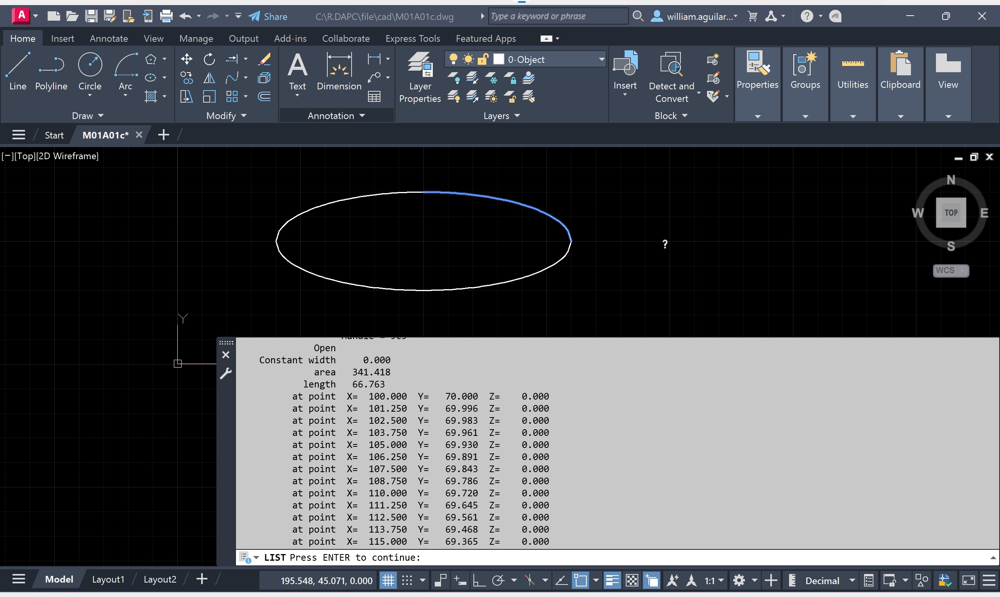
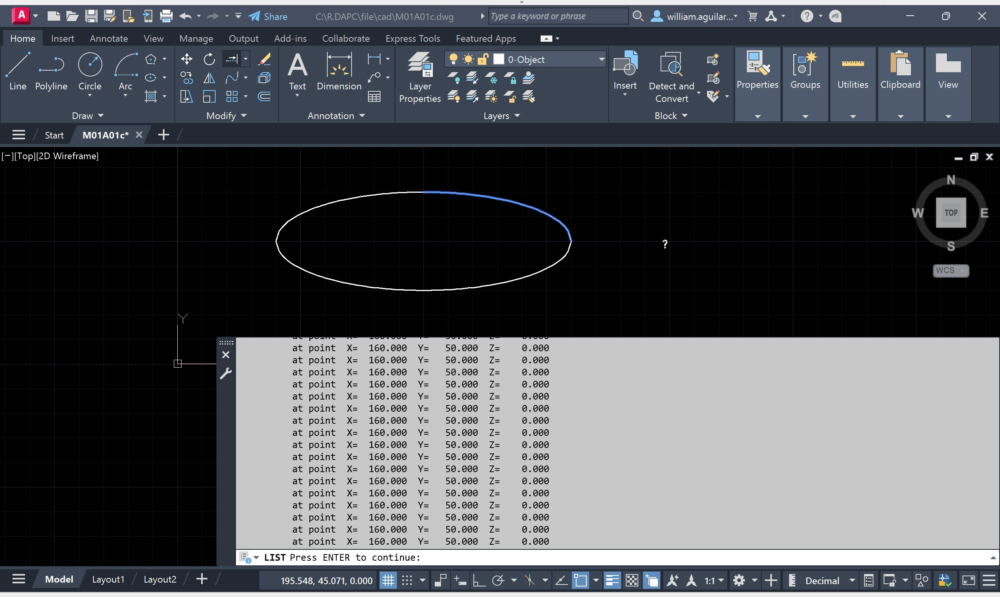
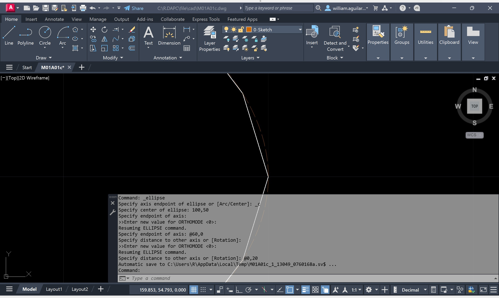
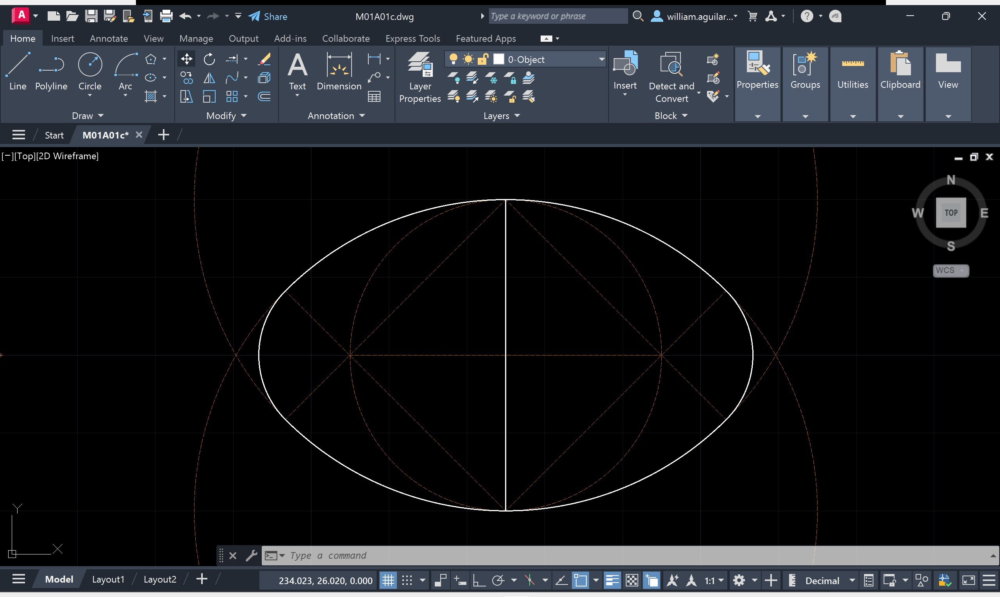
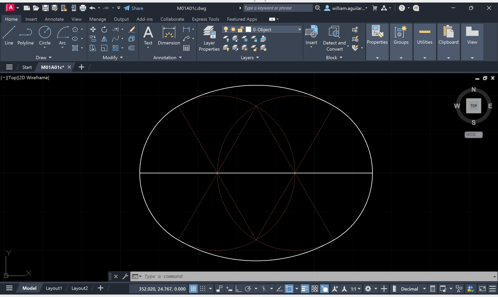
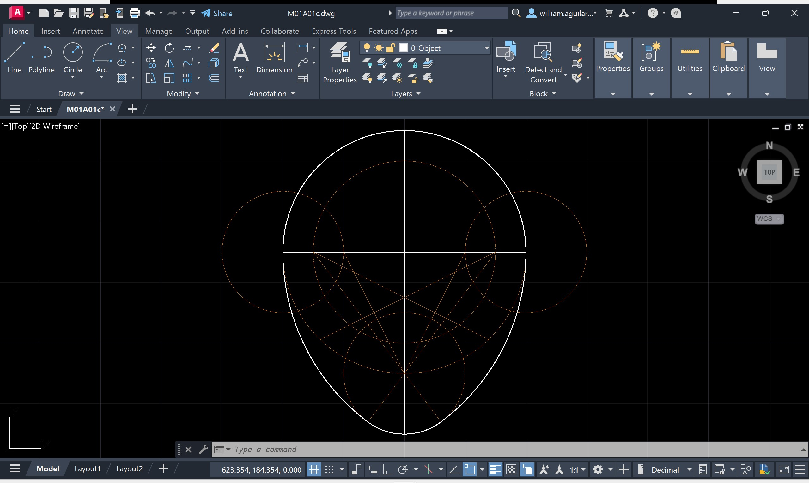

# 1.2.b. Elementos básicos de dibujo / Curvas especiales
Keywords: `ellipse` `parabola` `hyperbola` `clothoid` `m01a01c`

Dibujo de la elipse, óvalo, parábola, hipérbola, clotoide y funciones trigonométricas.

## Objetivos

Al finalizar esta actividad, el estudiante:

* Calcula los elementos que componen las curvas especiales.
* Dibuja curvas especiales con precisión.

## Requerimientos

Archivos, actividades previas, lecturas y herramientas requeridas para el desarrollo de esta actividad:

| Requerimiento                                                                      | Descripción                                               |
|:-----------------------------------------------------------------------------------|:----------------------------------------------------------|
| [:toolbox:Herramienta](https://www.autodesk.com/products/autocad)                  | Autodesk Autocad 3D 2026 o superior.                      |
| [:toolbox:Herramienta](https://www.microsoft.com/es/microsoft-365/excel?market=bz) | Microsoft Excel 365.                                      |
| [:date:DAPC_Curves.xlsx](../../file/table/DAPC_Curves.xlsx)                        | Libro de cálculo para la generación de curvas especiales. |

> Para los diferentes avances de proyecto, es necesario guardar y publicar las diferentes versiones generadas del (los) libro (s) de Microsoft Excel y reportes o informes, agregando al final la fecha de control documental en formato aaaammdd, p. ej. _R.HydroTools.DisenoCaucesParametros.20250528.xlsx_.

## 1. Elipse

Como vimos en la actividad anterior, el dibujo de la elipse es especialmente útil en la representación de circunferencias en figuras isométricas. Si bien AutoCAD permite dibujar elipses por 3 métodos diferentes, es importante conocer los parámetros que permiten su trazado.

Métodos de dibujo en AutoCAD:

* Centro, nodo semieje mayor, nodo semieje menor.
* Nodos de extremo de eje mayor, nodo semieje menor.
* Arco elíptico con nodos de extremo de eje mayor, nodo semieje menor, nodo inicio arco, nodo fin arco.

La ecuación general de una elipse horizontal con centro en (0,0) es:

 Tomado de: https://www.fisimat.com.mx/ecuacion-de-la-elipse-con-centro-fuera-del-origen/

Donde

* x, y: coordenadas de cualquier punto sobre la elipse.
* h, k: coordenadas del centro de la elipse en (x,y).
* a: longitud del semieje mayor.
* b: la longitud del semieje menor. 

Los focos de una elipse son dos puntos fijos dentro de la elipse que definen su forma. La suma de las distancias de cualquier punto de la elipse a estos dos focos es constante e igual a la longitud del eje mayor de la elipse. En otras palabras, si tienes un punto P en la elipse, la distancia de P a un foco más la distancia de P al otro foco siempre será la misma.

La ecuación para encontrar los focos de una elipse depende de si la elipse es horizontal o vertical. En general, para una elipse con centro en (h, k), la distancia del centro a cada foco se calcula como:

c = √(a² - b²)

Donde

* a: longitud del semieje mayor.
* b: longitud del semieje menor.

> Los focos se ubican en el eje mayor. Si la elipse es horizontal, los focos están en (h ± c, k); si es vertical, están en (h, k ± c). 

1. Para el dibujo manual en AutoCAD de las polilíneas por cuadrante que describen una elipse a partir de coordenadas o nodos, crearemos la siguiente hoja de Excel:

A partir de los parámetros de entrada, calcularemos las coordenadas.

Obtendremos la siguiente gráfica en Excel.

Y generaremos la secuencia de comandos para la generación de las polilíneas por cuadrante.

2. En AutoCAD, cree una copia del archivo _/file/cad/M01A01a.dwg_ y guarde como _/file/cad/M01A01c.dwg_. Luego, copie desde la hoja AutoCAD del libro de Excel, la columna A que contiene la secuencia de comandos y pegue en el _Command_ de AutoCAD. Obtendrá la representación de la Elipse usando polilíneas a partir de las coordenadas (x.y) del libro de Excel.

> Tenga en cuenta que debido a que el libro de Excel permite la generación de coordenadas de hasta 100 puntos por cuadrante, y en el ejemplo hemos definido que utilizaremos solo 48 nodos, es posible que los nodos de los extremos contengas duplicidades.

3. Para verificar el número de nodos por cada polilínea, seleccione cualquiera de los cuadrantes y desde el _Command_ ejecute el comando **LIST**.

Observará que las coordenadas del último nodo del objeto se encuentran duplicadas.

4. Para verificar la forma geométrica de la Elipse generada en autocad a partir de arcos circulares, con el comando **ELLIPSE**, dibuje la elipse con los parámetros utilizados para el cálculo de sus coordenadas, utilice centroide en la coordenada absoluta (100,50), semieje mayor a=60 y semieje mejor b=20. Cree esta línea en la capa _0-Sketch_.

Acérquese al extremo lateral derecho y verifique el dibujo a partir de coordenadas calculadas y arcos circulares, podrá observar que los 48 nodos usados por cuadrante no permiten describir en detalle sus extremos.

5. Para facilitar la visualización de la localización de los nodos, con el comando **POINT**, cree todos los nodos generados, utilice para ello la columna B de la hoja AutoCAD del libro de Excel.

## 2. Óvalo y ovoiode 

## 2.1. Óvalo [^1]

El término óvalo hace referencia a una forma geométrica convexa y redondeada, que se asemeja al perfil de un huevo de ave en su sentido más amplio.

 https://es.wikipedia.org/wiki/%C3%93valo

La ecuación general del óvalo corresponde a:

### Ejercicio M01A01cE01

Veamos las líneas constructivas en AutoCAD para su dibujo a partir de arcos circulares y realicemos su trazado en clase. Guarde el dibujo como _/file/cad/**M01A01cE01**.dwg_.

1. Para el dibujo de un _óvalo dado el eje menor_, con centroide en la coordenada absoluta (225,50).

2. Para el dibujo de un _óvalo dado el eje mayor_, con centroide en la coordenada absoluta (335,50).

3. Para el dibujo de un _óvalo dado el eje mayor y el eje menor_, con centroide en la coordenada absoluta (425,50).

## 2.1. Ovoide [^2]

El ovoide es una curva cerrada simétrica con respecto a su eje y cóncava hacia él, conformada por cuatro arcos de circunferencia: uno de ellos es una semicircunferencia y los otros dos son iguales y simétricos. Su nombre deriva de su parecido con la sección longitudinal de un huevo.

Posee dos ejes ortogonales, denominados mayor y menor. Tiene cuatro centros de curvatura. A diferencia del óvalo, solo tiene un eje de simetría.[

> No debe confundirse con un ovoide en geometría proyectiva.

### Ejercicio M01A01cE02 

Veamos las líneas constructivas en AutoCAD para su dibujo a partir de arcos circulares y realicemos su trazado en clase. Guarde el dibujo como _/file/cad/**M01A01cE02**.dwg_.

1. Para el dibujo de un _ovoide dado el eje menor_, con centroide en la coordenada absoluta (225,200).

2. Para el dibujo de un _ovoide dado el eje mayor_, con centroide en la coordenada absoluta (395,200).

> Utilizando el comando **DIVIDE**, divida en 6 partes el eje mayor para obtener nodos a lo largo del eje. El trazado de arcos se realiza en el nodo de la segunda división.

3. Para el dibujo de un _ovoide dado el eje mayor y el eje menor_, con centroide en la coordenada absoluta (425,200).

### Ejercicio M01A01cE02

Utilizando los conceptos aprendidos, cree un libro formulado en Excel para el trazado de una superelipse, el tamaño de la figura es de libre elección. Guarde el dibujo como _/file/cad/**M01A01bE06**.dwg_.

Ecuación Superelipse

 Tomado de: https://es.wikipedia.org/wiki/%C3%93valo

 Tomado de: https://es.wikipedia.org/wiki/%C3%93valo

## 3. Parábola

## 4. Clotoide

## 5. Funciones trigonométricas

## Actividades de proyecto :triangular_ruler:

Utilizando la [plantilla suministrada](../../file/report/R.DAPC.PlantillaSoporteDesarrollo.docx), cree un documento soporte mostrando las actividades desarrolladas en el orden presentado en esta actividad, junto con los análisis y recomendaciones realizadas, convierta a Adobe Acrobat (.pdf) y guarde en la carpeta _/activity_ del repositorio de datos del proyecto; nombre el archivo con el código de la actividad agregando al final la fecha de control documental en formato aaaammdd (p. ej. M01A00_20250531.pdf).

En la siguiente tabla se listan las actividades que deben ser desarrolladas y documentadas por cada estudiante o grupo de proyecto.

| Actividad | Alcance                                                                                                                                                                                                                                                                                                                                                                                                                                                                                                                                              |
|:----------|:-----------------------------------------------------------------------------------------------------------------------------------------------------------------------------------------------------------------------------------------------------------------------------------------------------------------------------------------------------------------------------------------------------------------------------------------------------------------------------------------------------------------------------------------------------|
| M01A00    | Esta actividad no requiere del desarrollo de elementos en el avance del proyecto final, los contenidos son evaluados a partir de la entrega de los ejercicios definidos en la actividad.                                                                                                                                                                                                                                                                                                                                                             |
| M01A00    | En una tabla y al final del informe de avance de esta entrega, indique el detalle de las actividades realizadas por cada integrante de su grupo; utilice las siguientes columnas: `Nombre del integrante`, `Actividades realizadas`, `Tiempo dedicado en horas` (si presenta la entrega individualmente, no es necesaria la presentación de esta tabla).  Para actividades que no requieren del desarrollo de elementos de avance, indicar si realizo la lectura de la guía de clase y las lecturas indicadas al inicio en los requerimientos. | 

> Nota 1: para la revisión del proyecto final, guarde los libros cálculo de Microsoft Excel y los archivos generados en esta actividad, en las localizaciones indicadas en cada numeral.
>
> Nota 2: una vez el instructor realice la revisión y el estudiante presente las correcciones o ajustes solicitados, será necesario cargar una nueva versión de los archivos en el repositorio del proyecto, incluyendo o actualizando al final del nombre del archivo, la fecha de presentación en formato aaaammdd y manteniendo las versiones anteriores presentadas.
>

## Referencias

* https://help.autodesk.com/view/ACD/2026/ESP
* https://help.autodesk.com/view/ACD/2026/ENU/
* https://www.fisimat.com.mx/ecuacion-de-la-elipse-con-centro-en-el-origen/
* https://www.fisimat.com.mx/ecuacion-de-la-elipse-con-centro-fuera-del-origen/
* [Cursos de matemáticas / Elipse en Excel](https://www.youtube.com/watch?v=F3Sb0qiDGwc&t=353s)
* [Dibujo Técnico Bachillerato con Autocad - Carlos Ansaldo / Óvalos y Ovoides](https://www.youtube.com/@dibujotecnicobtoconautocad7149)
* https://es.wikipedia.org/wiki/%C3%93valo

## Control de versiones

| Versión    | Descripción        | Autor                                      | Horas |
|------------|:-------------------|--------------------------------------------|:-----:|
| 2025.06.22 | Versión inicial.   | [rcfdtools](https://github.com/rcfdtools)  |  16   |

##

_R.DAPC es de uso libre para fines académicos, conoce nuestra licencia, cláusulas, condiciones de uso y como referenciar los contenidos publicados en este repositorio, dando [clic aquí](../../LICENSE.md)._

_¡Encontraste útil este repositorio!, apoya su difusión marcando este repositorio con una ⭐ o síguenos dando clic en el botón Follow de [rcfdtools](https://github.com/rcfdtools) en GitHub._

| [:arrow_backward: Anterior](../M01A00/Readme.md) | [:house: Inicio](../../README.md) | [:beginner: Ayuda / Colabora](https://github.com/rcfdtools/R.DAPC/discussions/99999) | [Siguiente :arrow_forward:](../M01A02/Readme.md) |
|--------------------------------------------------|-----------------------------------|--------------------------------------------------------------------------------------|--------------------------------------------------|

[^1]: https://es.wikipedia.org/wiki/%C3%93valo