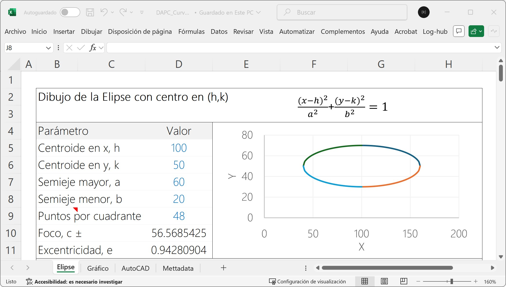
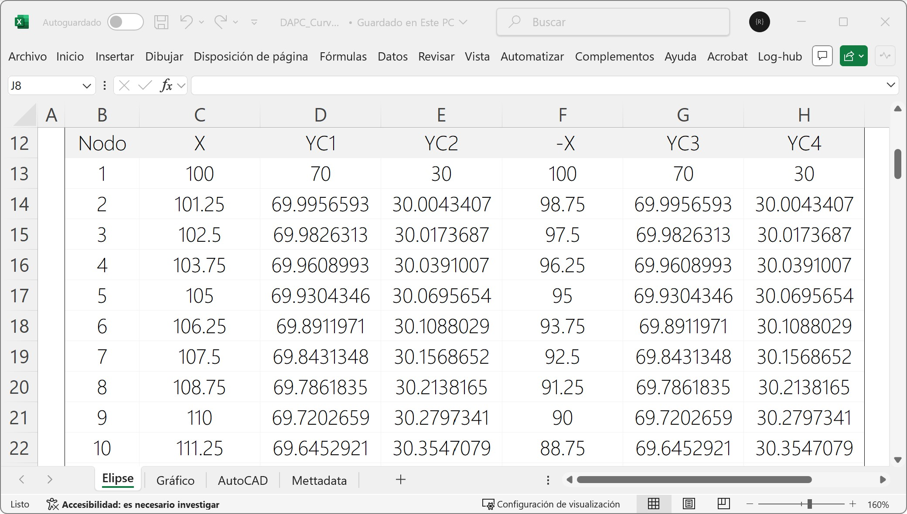
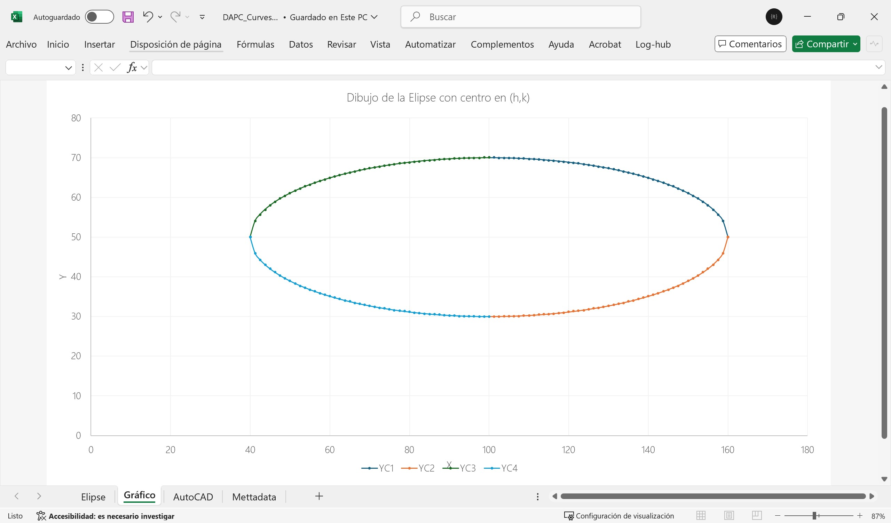

# 1.2.b. Elementos básicos de dibujo / Curvas especiales
Keywords: `ellipse` `parabola` `hyperbola` `clothoid` `m01a01c`

Dibujo de la elipse, óvalo, parábola, hipérbola, clotoide y funciones trigonométricas.

## Objetivos

Al finalizar esta actividad, el estudiante:

* Calcula los elementos que componen las curvas especiales.
* Dibuja curvas especiales con precisión.

## Requerimientos

Archivos, actividades previas, lecturas y herramientas requeridas para el desarrollo de esta actividad:

| Requerimiento                                                                      | Descripción                                               |
|:-----------------------------------------------------------------------------------|:----------------------------------------------------------|
| [:toolbox:Herramienta](https://www.autodesk.com/products/autocad)                  | Autodesk Autocad 3D 2026 o superior.                      |
| [:toolbox:Herramienta](https://www.microsoft.com/es/microsoft-365/excel?market=bz) | Microsoft Excel 365.                                      |
| [:date:DAPC_Curves.xlsx](../../file/table/DAPC_Curves.xlsx)                        | Libro de cálculo para la generación de curvas especiales. |

> Para los diferentes avances de proyecto, es necesario guardar y publicar las diferentes versiones generadas del (los) libro (s) de Microsoft Excel y reportes o informes, agregando al final la fecha de control documental en formato aaaammdd, p. ej. _R.HydroTools.DisenoCaucesParametros.20250528.xlsx_.

## 1. Elipse

Como vimos en la actividad anterior, el dibujo de la elipse es especialmente útil en la representación de circunferencias en figuras isométricas. Si bien AutoCAD permite dibujar elipses por 3 métodos diferentes, es importante conocer los parámetros que permiten su trazado.

Métodos de dibujo en AutoCAD:

* Centro, nodo semieje mayor, nodo semieje menor.
* Nodos de extremo de eje mayor, nodo semieje menor.
* Arco elíptico con nodos de extremo de eje mayor, nodo semieje menor, nodo inicio arco, nodo fin arco.

La ecuación general de una elipse horizontal con centro en (0,0) es:

 Tomado de: https://www.fisimat.com.mx/ecuacion-de-la-elipse-con-centro-fuera-del-origen/

Donde

* x, y: coordenadas de cualquier punto sobre la elipse.
* h, k: coordenadas del centro de la elipse en (x,y).
* a: longitud del semieje mayor.
* b: la longitud del semieje menor. 

Los focos de una elipse son dos puntos fijos dentro de la elipse que definen su forma. La suma de las distancias de cualquier punto de la elipse a estos dos focos es constante e igual a la longitud del eje mayor de la elipse. En otras palabras, si tienes un punto P en la elipse, la distancia de P a un foco más la distancia de P al otro foco siempre será la misma.

La ecuación para encontrar los focos de una elipse depende de si la elipse es horizontal o vertical. En general, para una elipse con centro en (h, k), la distancia del centro a cada foco se calcula como:

c = √(a² - b²)

Donde

* a: longitud del semieje mayor.
* b: longitud del semieje menor.

> Los focos se ubican en el eje mayor. Si la elipse es horizontal, los focos están en (h ± c, k); si es vertical, están en (h, k ± c). 

1. Para el dibujo manual de las polilíneas por cuadrante, que describen a partir de nodos la elipse, crearemos la siguiente hoja de Excel:

A partir de los parámetros de entrada, calcularemos las coordenadas.

Obtendremos la siguiente gráfica en Excel.

Y generaremos la secuencia de comandos para la generación de las polilíneas por cuadrante.

## 2. Óvalo

## 3. Parábola

## 4. Clotoide

## 5. Funciones trigonométricas

## Actividades de proyecto :triangular_ruler:

Utilizando la [plantilla suministrada](../../file/report/R.DAPC.PlantillaSoporteDesarrollo.docx), cree un documento soporte mostrando las actividades desarrolladas en el orden presentado en esta actividad, junto con los análisis y recomendaciones realizadas, convierta a Adobe Acrobat (.pdf) y guarde en la carpeta _/activity_ del repositorio de datos del proyecto; nombre el archivo con el código de la actividad agregando al final la fecha de control documental en formato aaaammdd (p. ej. M01A00_20250531.pdf).

En la siguiente tabla se listan las actividades que deben ser desarrolladas y documentadas por cada estudiante o grupo de proyecto.

| Actividad | Alcance                                                                                                                                                                                                                                                                                                                                                                                                                                                                                                                                              |
|:----------|:-----------------------------------------------------------------------------------------------------------------------------------------------------------------------------------------------------------------------------------------------------------------------------------------------------------------------------------------------------------------------------------------------------------------------------------------------------------------------------------------------------------------------------------------------------|
| M01A00    | Esta actividad no requiere del desarrollo de elementos en el avance del proyecto final, los contenidos son evaluados a partir de la entrega de los ejercicios definidos en la actividad.                                                                                                                                                                                                                                                                                                                                                             |
| M01A00    | En una tabla y al final del informe de avance de esta entrega, indique el detalle de las actividades realizadas por cada integrante de su grupo; utilice las siguientes columnas: `Nombre del integrante`, `Actividades realizadas`, `Tiempo dedicado en horas` (si presenta la entrega individualmente, no es necesaria la presentación de esta tabla).  Para actividades que no requieren del desarrollo de elementos de avance, indicar si realizo la lectura de la guía de clase y las lecturas indicadas al inicio en los requerimientos. | 

> Nota 1: para la revisión del proyecto final, guarde los libros cálculo de Microsoft Excel y los archivos generados en esta actividad, en las localizaciones indicadas en cada numeral.
>
> Nota 2: una vez el instructor realice la revisión y el estudiante presente las correcciones o ajustes solicitados, será necesario cargar una nueva versión de los archivos en el repositorio del proyecto, incluyendo o actualizando al final del nombre del archivo, la fecha de presentación en formato aaaammdd y manteniendo las versiones anteriores presentadas.
>

## Referencias

* https://help.autodesk.com/view/ACD/2026/ESP
* https://help.autodesk.com/view/ACD/2026/ENU/
* https://www.fisimat.com.mx/ecuacion-de-la-elipse-con-centro-en-el-origen/
* https://www.fisimat.com.mx/ecuacion-de-la-elipse-con-centro-fuera-del-origen/
* [Cursos de matemáticas: Elipse video 1 en Excel](https://www.youtube.com/watch?v=F3Sb0qiDGwc&t=353s)

## Control de versiones

| Versión    | Descripción        | Autor                                      | Horas |
|------------|:-------------------|--------------------------------------------|:-----:|
| 2025.06.22 | Versión inicial.   | [rcfdtools](https://github.com/rcfdtools)  |  16   |

##

_R.DAPC es de uso libre para fines académicos, conoce nuestra licencia, cláusulas, condiciones de uso y como referenciar los contenidos publicados en este repositorio, dando [clic aquí](../../LICENSE.md)._

_¡Encontraste útil este repositorio!, apoya su difusión marcando este repositorio con una ⭐ o síguenos dando clic en el botón Follow de [rcfdtools](https://github.com/rcfdtools) en GitHub._

| [:arrow_backward: Anterior](../M01A00/Readme.md) | [:house: Inicio](../../README.md) | [:beginner: Ayuda / Colabora](https://github.com/rcfdtools/R.DAPC/discussions/99999) | [Siguiente :arrow_forward:](../M01A02/Readme.md) |
|--------------------------------------------------|-----------------------------------|--------------------------------------------------------------------------------------|--------------------------------------------------|

[^1]: 