# 1.2.b. Elementos básicos de dibujo / UCS y Geometrías
Keywords: `polyline` `circle` `arc` `ellipse` `rectangle` `polygon` `point` `spline` `donut` `helix` `xline` `fillet` `chamfer` `array` `mirror` `offset` `trim` `array` `qpmode` `ltscale` `selectioncycling` `m01a02b`

Sistema de coordenadas de usuario - UCS. Barra de herramientas de puntos de convergencia. Comandos de dibujo POLYLINE, CIRCLE, ARC, RECTANGLE, POLYGON, POINT, DONUT, HELIX... Comandos de modificación: FILLET, CHAMFER, ARRAY, OFFSET, TRIM, MIRROR...

<div align="center">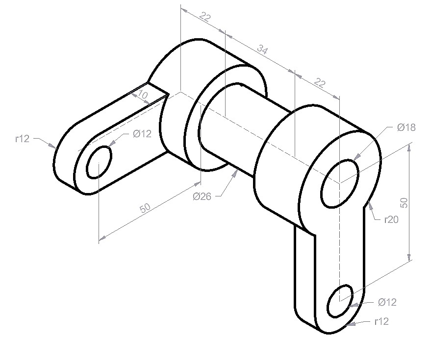</div>


## Objetivos

Al finalizar esta actividad, el estudiante:

* Manipula sistemas de coordenadas de usuario.
* Realiza ejercicios de práctica en los que dibuja, traza y edita líneas, poli-líneas, arcos, chaflanes, figuras geométricas y crea cortes transversales.


## Requerimientos

Archivos, actividades previas, lecturas y herramientas requeridas para el desarrollo de esta actividad:

<div align="center">

| Requerimiento                                                                                           | Descripción                                                                                                                      |
|:--------------------------------------------------------------------------------------------------------|:---------------------------------------------------------------------------------------------------------------------------------|
| [:toolbox:Herramienta](https://www.autodesk.com/products/autocad)                                       | Autodesk Autocad 3D 2026 o superior.                                                                                             |
| [:toolbox:Herramienta](https://notepad-plus-plus.org/)                                                  | Notepad++.                                                                                                                       |

</div>

> Para los diferentes avances de proyecto, es necesario guardar y publicar las diferentes versiones generadas del (los) libro (s) de Microsoft Excel, reportes o informes y dibujos generados, agregando al final la fecha de control documental en formato aaaammdd, p. ej., _M01A01_20250710.dwg_.


## 1. Sistema de coordenadas de usuario - UCS

El [UCS](https://help.autodesk.com/view/ACD/2026/ENU/?guid=GUID-E658D5E7-EE5C-4A06-BF34-F71CDB363A71) permite definir el origen y la orientación del actual sistema de coordenadas. Por defecto, el UCS se localiza en el origen absoluto (0,0) y sin rotación, norte o arriba indica el valor del eje Y, este o derecha indica la dirección del eje X y perpendicular a su visual en pantalla, se encuentra el eje Z. Para facilitar la creación de dibujos precisos, el UCS puede ser movido, orientado y rotado en cualquier dirección.

<div align="center"></div>

Para entender mejor estos conceptos, creemos 3 líneas independientes que representen un triángulo rectángulo, con lados de 50 metros en las caras ortogonales y origen absoluto en (0,0).

1. Abra el archivo _/file/cad/M01A02a.dwg_ creado previamente que contiene los Layers del curso DAPC y las configuraciones de unidades y visualización, guarde como _/file/cad/M01A02b.dwg_ y establezca por defecto la capa _0-Object_.

Secuencia de comandos para creación del triángulo

```
LINE
0,0
50,0
0,50
0,0

```

Como observa en la figura, el nodo de origen del triángulo se encuentra alineado con los ejes del UCS.

<div align="center">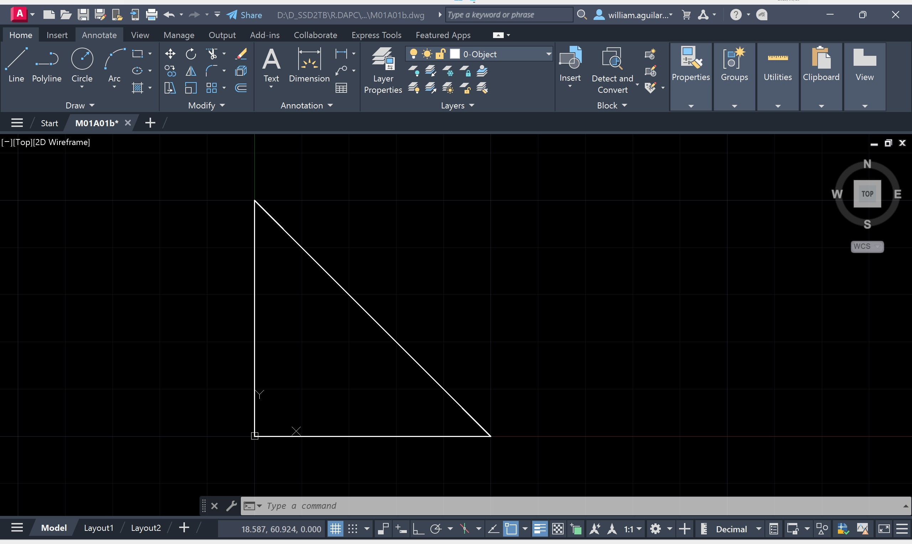</div>

2. Desde el _Command_, ejecute el comando **UCS**, seleccione el nodo superior del triángulo para mover el orígen, luego el nodo derecho para rotar el sistema de coordenadas y oprima <kbd>enter</kbd> para completar.

> Es necesario activar las opciones de encajado u **OSNAP**, oprima la tecla de función <kbd>F3</kbd>.

<div align="center">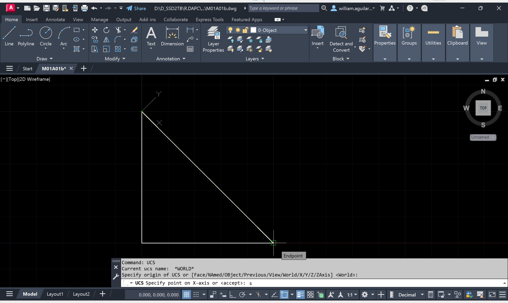</div>

Observe que el orígen y la rotación de la grilla de referencia han cambiado.

<div align="center">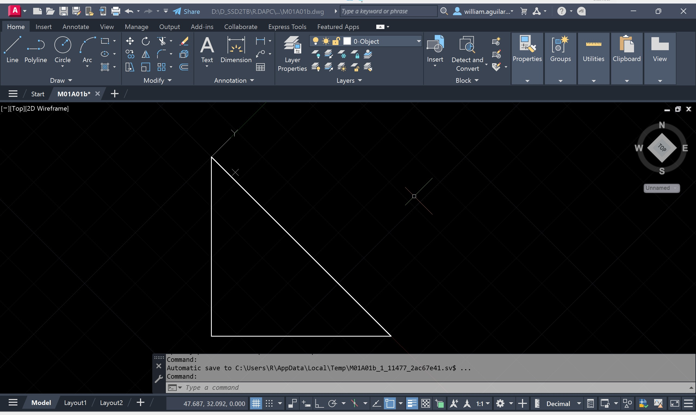</div>

3. Utilizando la secuencia de comandos para la creación del triángulo, vuelva a crear esta figura, podrá observar que ahora el nuevo triángulo se ha alineado a la cara de referencia, correspondiente a la hipotenusa del triángulo anterior.

<div align="center"></div>

4. Repita este procedimiento 6 veces más y obtendrá la siguiente figura simétrica.

<div align="center">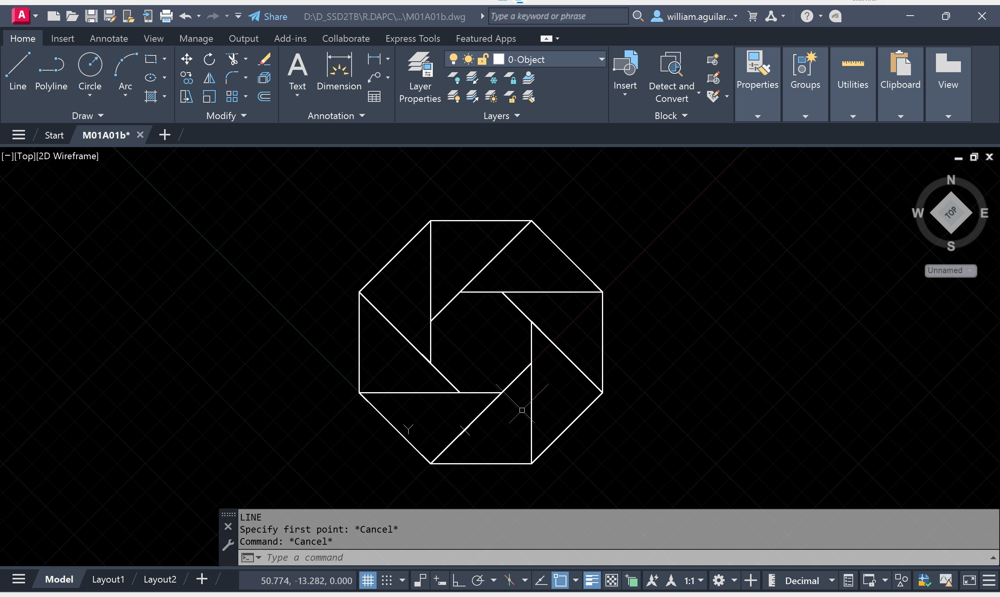</div>

5. Para restablecer el orígen absoluto de coordenadas, en el _Command_, ingrese el comando **UCS** y seleccione la opción **W**orld.

<div align="center"></div>


## 2. Dibujo de polilíneas

En AutoCAD, una polilínea es una entidad de dibujo compuesta por segmentos de línea o arco que se consideran un único objeto. Esto significa que puedes seleccionar, editar o manipular la polilínea como un todo, en lugar de tratar cada segmento individualmente. El comando genérico para su creación es **PLINE** o su creación puede ser iniciada desde el menú _Home_ en el grupo _Draw_.

1. Utilizando las coordenadas de la figura asimétrica creada en el ejercicio [M01A00E01](../M01A00), creemos una polilínea con orígen absoluto en (200,0). Una ver completada la creación, active desde la barra inferior la visualización rápida de propiedades o ejecute el comando **QPMODE**, seleccione la polílinea y consulte sus propiedades. Podrá observar que se ha calculado automáticamente el área y el perímetro de la figura y que se indica que la polilinea está abierta.

> Para visualizar campos adicionales en la ventana flotante de propiedades rápidas, de clic en el piñon de la ventana y agregue los campos deseados.

```
PLINE
200,0
@15,0
@0,-11.5
@40,0
@0,42.5
@20,0
@0,-34
@5,0
@0,-3.5
@17,0
@-4,-20
@-18,0
@0,5
@-75,0
200,0

```

<div align="center"></div>

> Las polilíneas cerradas permiten crear polígonos, mientras que las abiertas solo son una secuencia de varios segmentos de líneas unidas en una única entidad.


## 3. Dibujo de circunferencias

Para su creación, existen múltiples métodos, tales como:

* Centro y radio
* Centro y diámetro
* 2 puntos
* 3 puntos
* Tangente, tangente y radio
* Tangente, tangente y tangente

Por ejemplo, para crear una circunferencia en la zona central de la figura simétrica construída a partir de triángulos, podremos utilizar la opción de 3 tangentes que puede ser ejecutada desde la cinta de opciones _Home / Draw / Circle_ o desde el _Command_ con **LINE**.

<div align="center"></div>

Las circunferencias también pueden ser utilizadas para crear líneas constructivas para el suavizado manual de esquinas, p. ej., para suavizar algunas de las esquinas de la figura asimétrica utilizando radios de 5 metros, primero seleccione en el panel de capas _0-Sketch_, luego cree circunferencias de dos tangentes y radio como se muestra a continuación.

> Para ajustar el espaciado de representación de las líneas constructivas, utilice el comando **LTSCALE** estableciendo escala en 0.1.

<div align="center">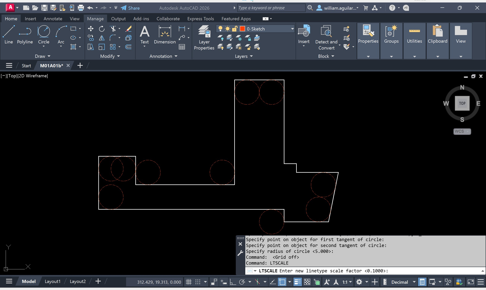</div>

Luego, con la ayuda de la herramienta _Home / Modify / Trim_ o el comando **TRIM**, podrá eliminar las partes restantes fuera de las entre tangencias.

<div align="center">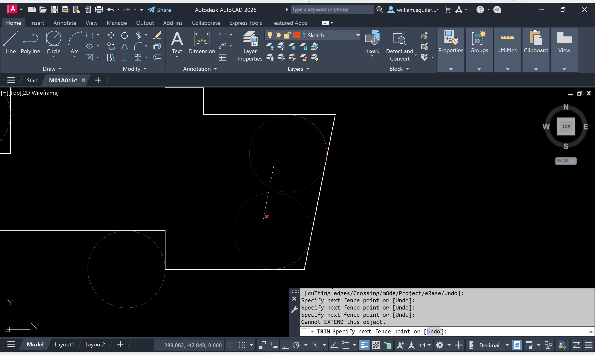</div>


## 4. Trazado de arcos circulares

Existen múltiples métodos de trazado y su utilización depende de la necesidad particular de localización del arco.

<div align="center"></div>

Por ejemplo, para la creación de arcos de máximo radio en los extremos de la figura simétrica o caras ortogonales de los triángulos, puede utilizar la opción _Start, End, Direction_, definiendo como dirección máxima 90 grados o utilizar _Start, Center, End_.

<div align="center"></div>

Para el trazado de arco máximo de proyección en las caras de la figura, puede utilizar _Start, End, Direction_, estableciendo una dirección de 45 grados para lo cual deberá rotar el UCS o utilizar _Center, Start, End_ utilizando como centro el punto medio de la base de cada triángulo.

<div align="center"></div>

> Cuando se dibujan arcos a partir de la definición de ángulos, los valores especificados son dibujados en el sentido inverso de las manecillas del reloj, oprimiendo la tecla <kbd>ctrl</kbd> podrá dibujar el arco en el otro sentido.


## 5. Creación de rectángulos y figuras geométricas regulares

1. Utilizando la herramienta _Home / Modify / Copy_ o el comando **COPY** o **CP**, cree una copia de la figura asimétrica y localícela ortogonalmente (tecla <kbd>F8</kbd>) hacia arriba a una distancia de 75 metros.

<div align="center">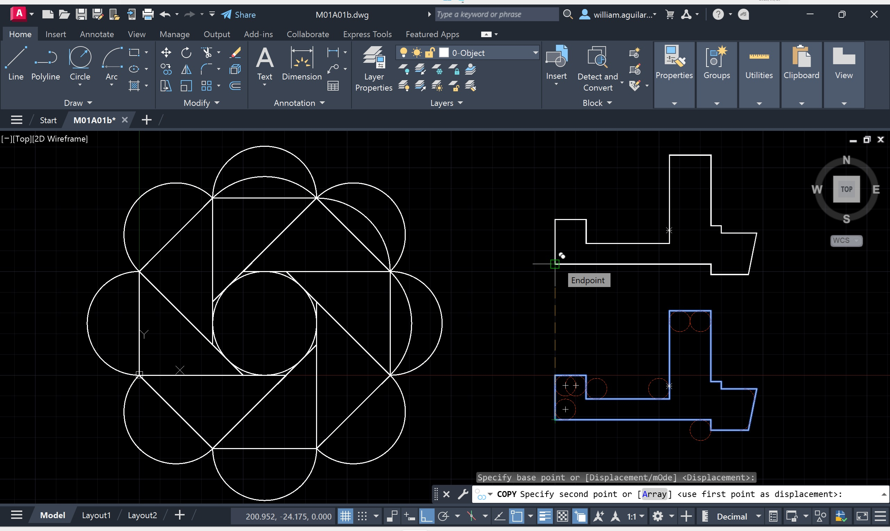</div>

1. Utilizando la herramienta _Home / Draw / Rectangle_ o el comando **RECTANGLE**, cree un rectángulo que inscriba la figura asimétrica. Es indispensable activar en la barra inferior el _Selection Cycling_ o ingresar el comando **SELECTIONCYCLING** y trazar una línea horizontal de construcción de 4 metros en la esquina inferior derecha de la figura.

<div align="center">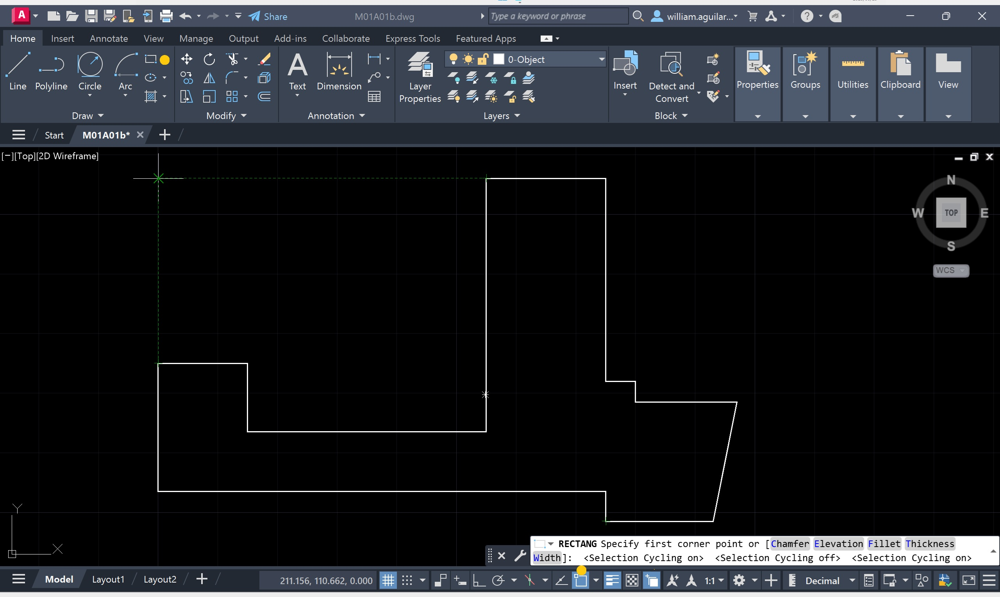</div>
<div align="center">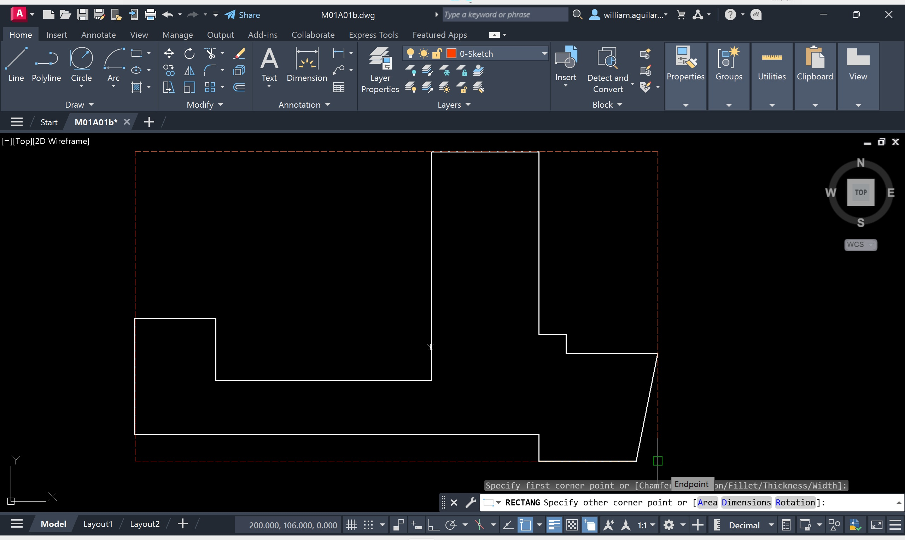</div>

2. Cree ahora polígonos regulares de 3, 4, 5, 6, 7 lados, utilizando como centroide el círculo central de la figura geométrica y alíne hacia arriba. De clic en el expansor de herramientas de rectángulo en el menú _Home / Draw / Polygon_ o ejecute el comando **POLYGON**, en la barra de comandos defina el número de lados, luego seleccione el centroide del círculo, defina que la figura estará inscrita dentro de la circunferencia y seleccione el cuadrante superior de la circunferencia.

<div align="center">Triángulo inscrito<br></div>
<div align="center">Rombo inscrito<br>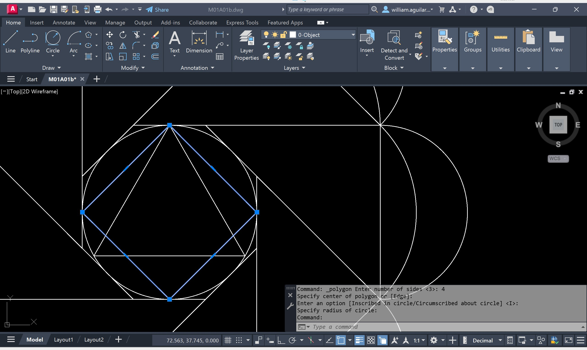</div>
<div align="center">Pentágono inscrito<br>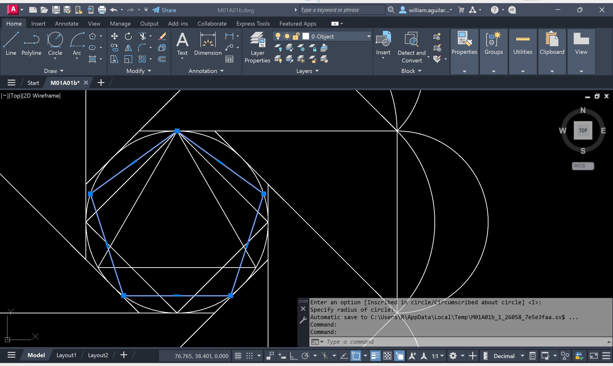</div>
<div align="center">Hexágono inscrito<br>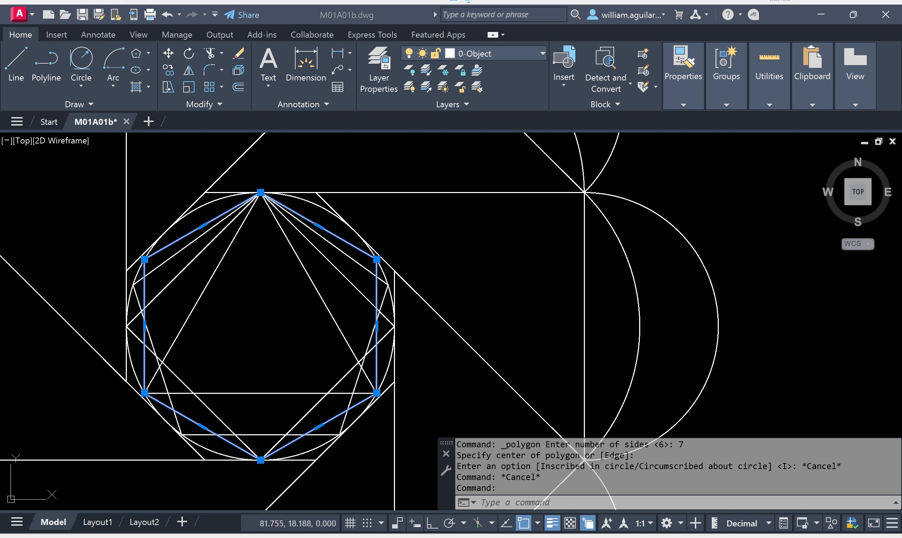</div>
<div align="center">Heptágono inscrito<br>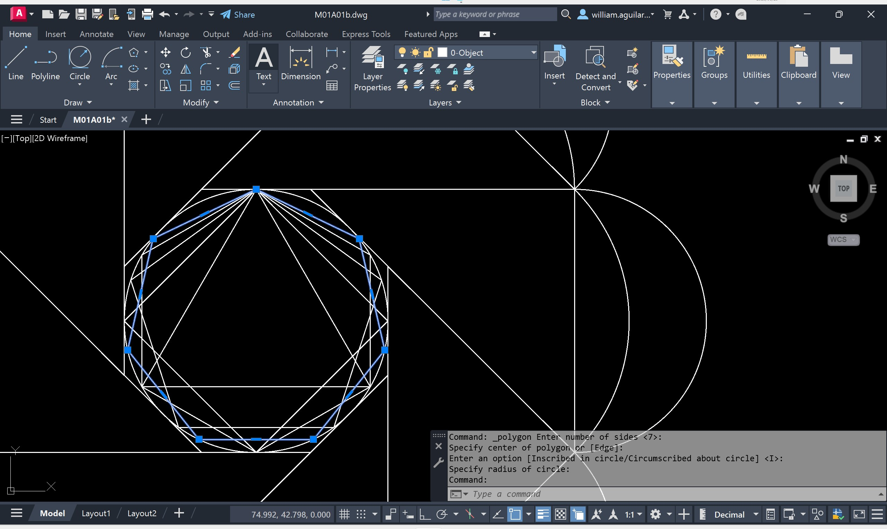</div>


## 6. Inserción de puntos

1. En el menú _Home / Draw_, seleccione la herramienta de dibujo _Multiple Point_ o ejecute el comando **POINT** y de clic en el centroide de la circunferencia de la figura simétrica, para finalizar la creación del punto presione <kbd>esc</kbd> o <kbd>enter</kbd>.

<div align="center">Heptágono inscrito<br>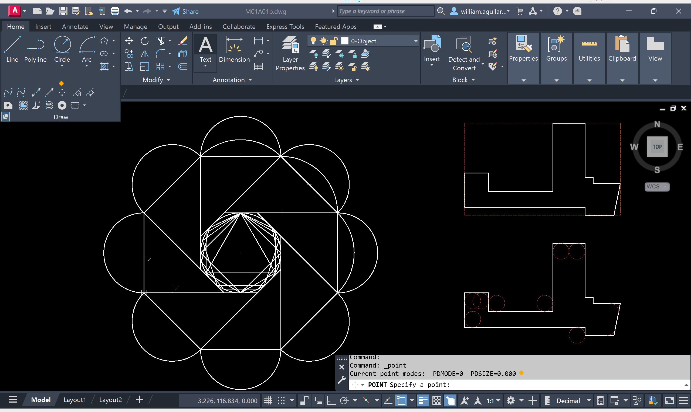</div>

Cómo observa, el punto es difícilmente visible en el espacio de trabajo, para mejorar su visibilidad utilice el comando **PTYPE** estableciendo el estilo de círculo con cruz y defina en tamaño 5 metros.

<div align="center">Heptágono inscrito<br>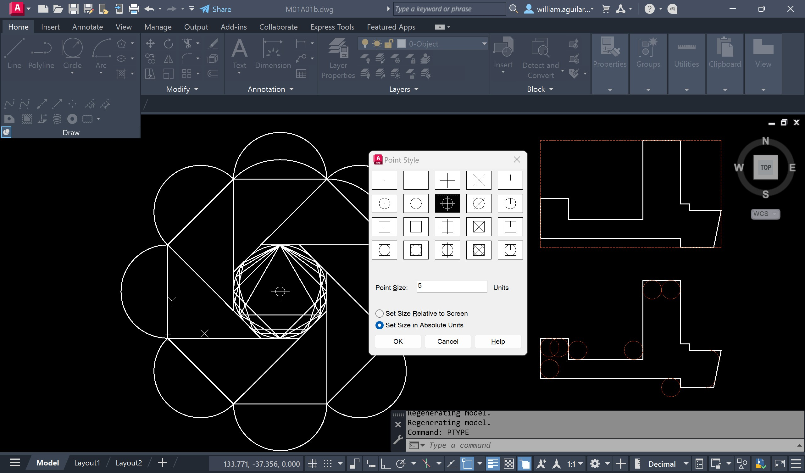</div>

2. Creemos ahora manualmente una nube de puntos separados cada 10 metros, con orígen en la coordenada absoluta (0,130), con 30 repeticiones en la horizontal o eje X y 20 repeticiones en la vertical o eje Y. Para ello, cree primero un punto en la coordenada indicada. `POINT 0,130`, luego seleccione el punto, ahora seleccione la herramienta _Home / Modify / Rectangular Array_ o el comando **ARRAY** (se abrirá una nueva cinta de opciones denominada Array Creation) definiendo las separaciones requeridas, para finalizar de clic en _Close Array_.

<div align="center">Heptágono inscrito<br>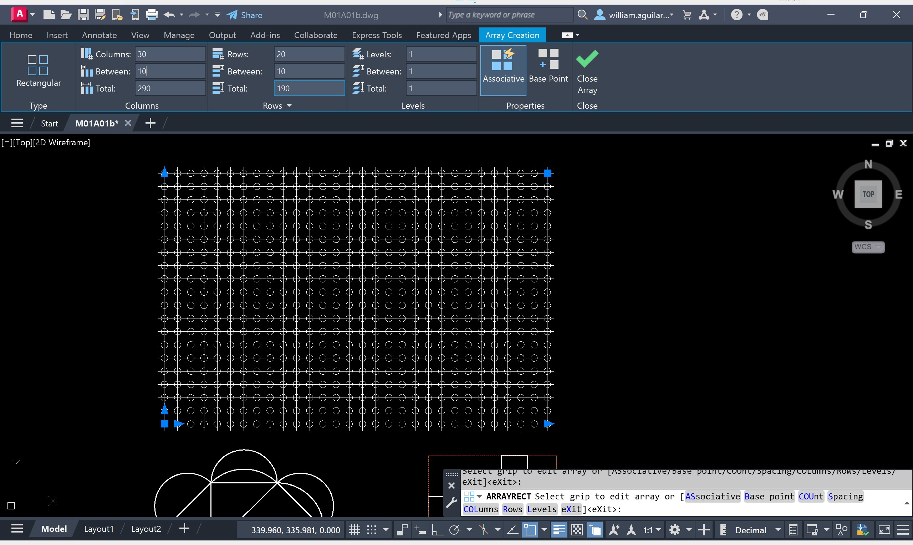</div>

3. Seleccione el arreglo, podrá observar que se comporta como una única entidad.

<div align="center">Heptágono inscrito<br>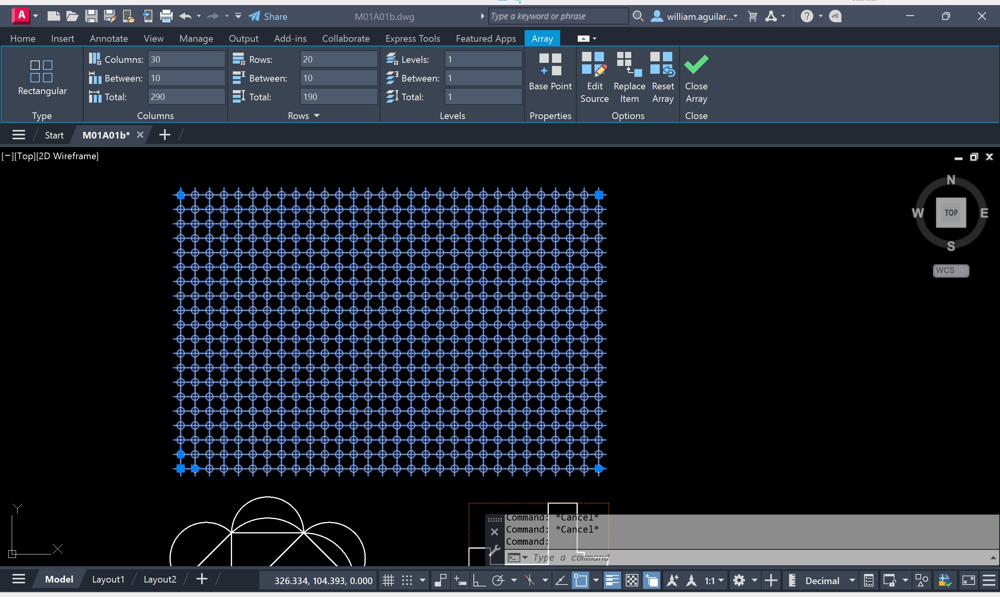</div>

4. Ejecute el commando **EXPLODE** para separar los nodos del arreglo y seleccione algunos de ellos. Para mejorar la visualización, ajuste el **PTYPE** a 2 metros de tamaño.

<div align="center">Heptágono inscrito<br>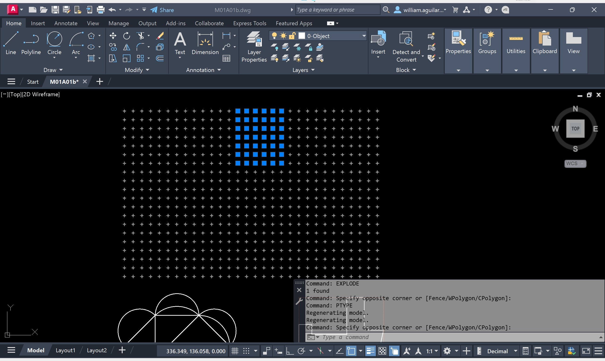</div>

> Los puntos creados podrán ser usados como referencia para crear otras entidades.


## 7. Trazado de espirales

Este tipo de líneas, permiten trazar curvas sin arcos circulares ajustándose o inscribiéndose en los nodos de una entidad.

1. Utilizando la herramienta _Home / Modify / Copy_ o el comando **COPY** o **CP**, cree dos copias de la figura asimétrica y localícela ortogonalmente (tecla <kbd>F8</kbd>) hacia la derecha a una distancia de 150 metros.

<div align="center">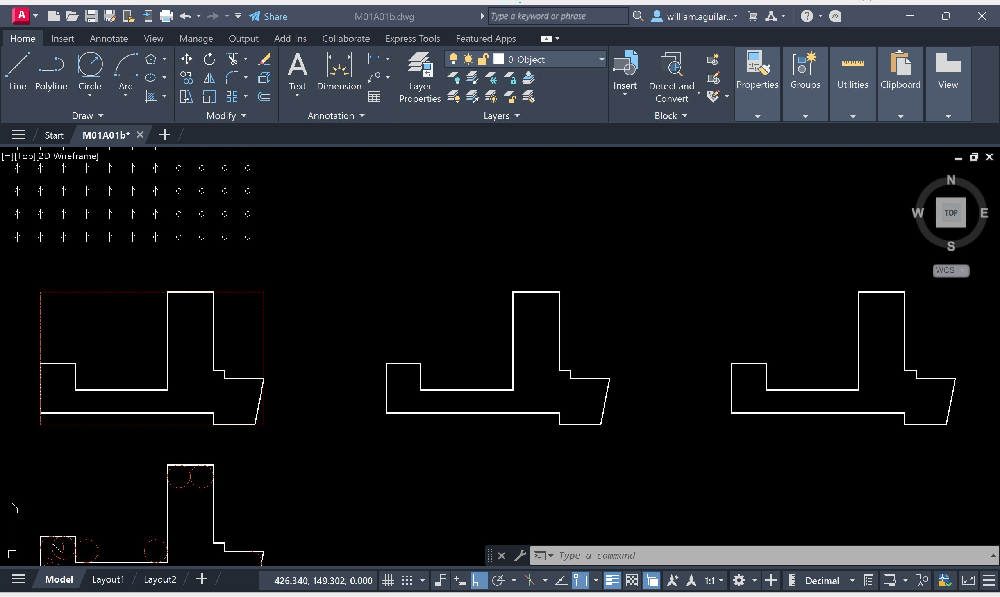</div>

2. Utilizando la herramienta _Home / Modify / Spline Fit_ o el comando **SPLINE** y la opción [**K**nots], cree una espiral que pase por los nodos de la primera figura asimétrica copiada, para completar y cerrar la espiral ingrese el comando **C**lose. Como observa, la espiral pasa sobre los nodos de la entidad.

<div align="center">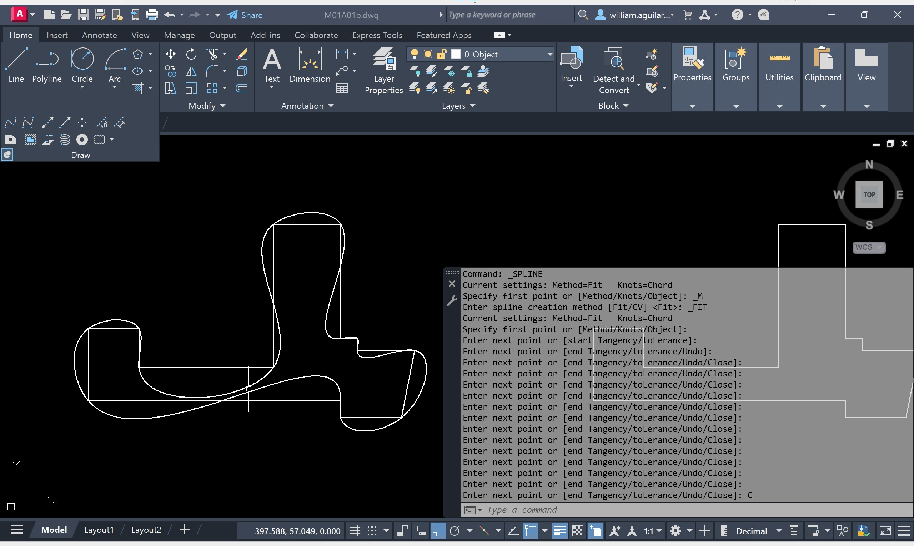</div>

3. Utilizando la herramienta _Home / Modify / Spline CV_ o el comando **SPLINE** y el método [**F**it CV], cree una espiral que pase por los nodos de la segunda figura asimétrica copiada, para completar y cerrar la espiral ingrese el comando **C**lose. Como observa, la espiral se ajusta a la forma general de la figura pero no a sus nodos.

<div align="center">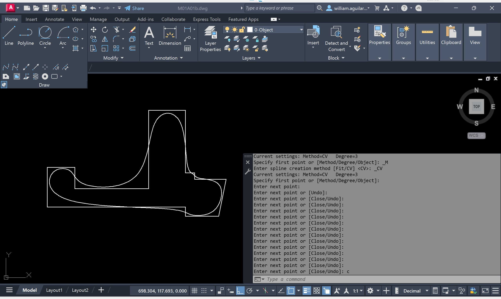</div>

Complementariamente, desde las opciones del _Command_, podrá definir el grado de ajuste (por defecto en 3) y generar a partir de un objeto.

<div align="center">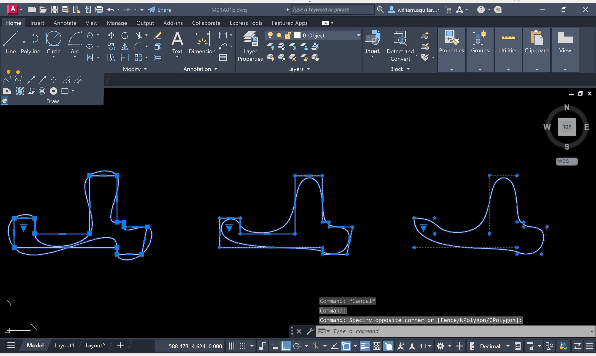</div>


## 8. Creación de donut y hélice

La Donut, es un tipo de objeto que permite crear una falsa superficie en forma de arandela, al ser explotada se convierte en dos semicircunferencias que describen su eje central.

1. Con la herramienta _Home / Draw / Donut_, creemos una Donut con radio externo de 100 metros, interno de 50 metros con centroide en la coordenada absoluta (475,200).

<div align="center">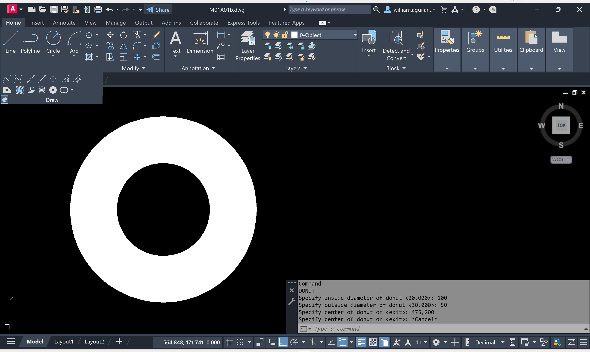</div>

2. Cree una copia a 100 metros a la derecha y explote con el comando **EXPLODE**. Podra observa que hemos obtenido su eje.

<div align="center">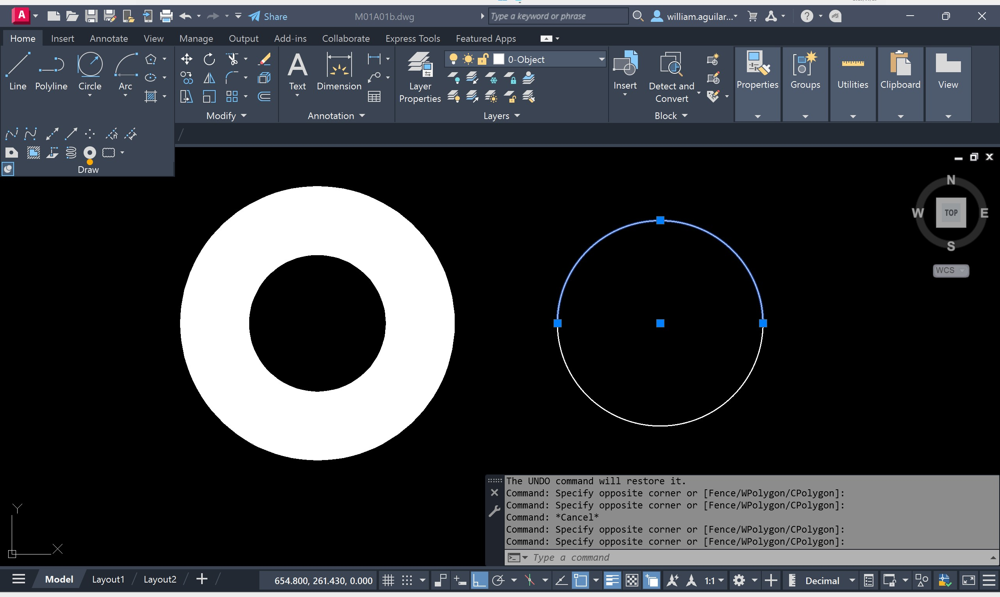</div>

En cuanto a las hélices o espirales de arcos circulares:

1. Con la herramienta _Home / Draw / Helix_, creemos una hélice 2D en la coordenada absoluta (750,200), establezca un radio en la base de 60 metros, un radio en la corona o en el centro de 10 metros y cero metros en altura.

<div align="center">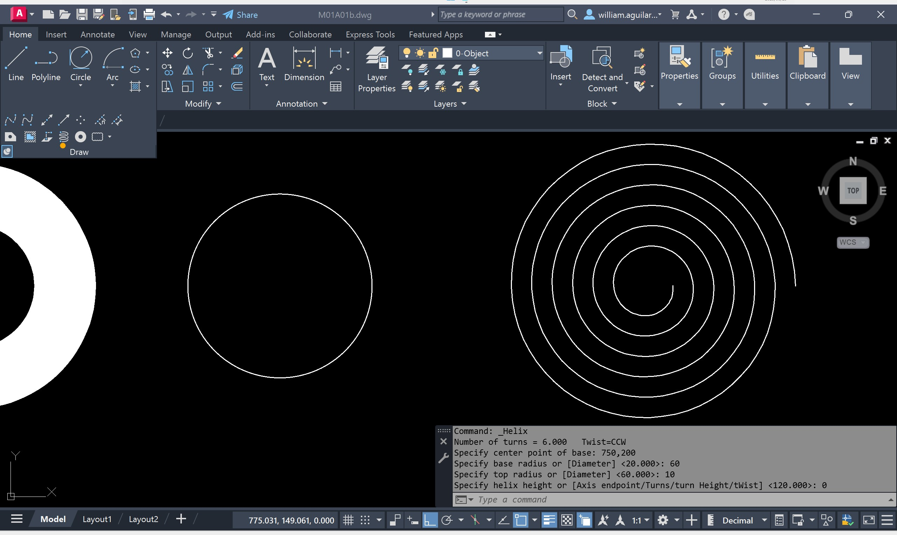</div>

Las técnicas de dibujo de espirales incluyen la utilización de 2 o 3 centros, como se muestra en las siguientes ilustraciones.

<div align="center">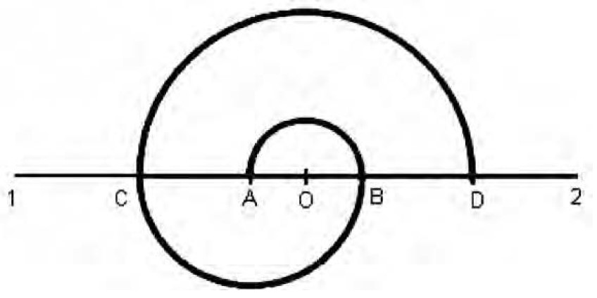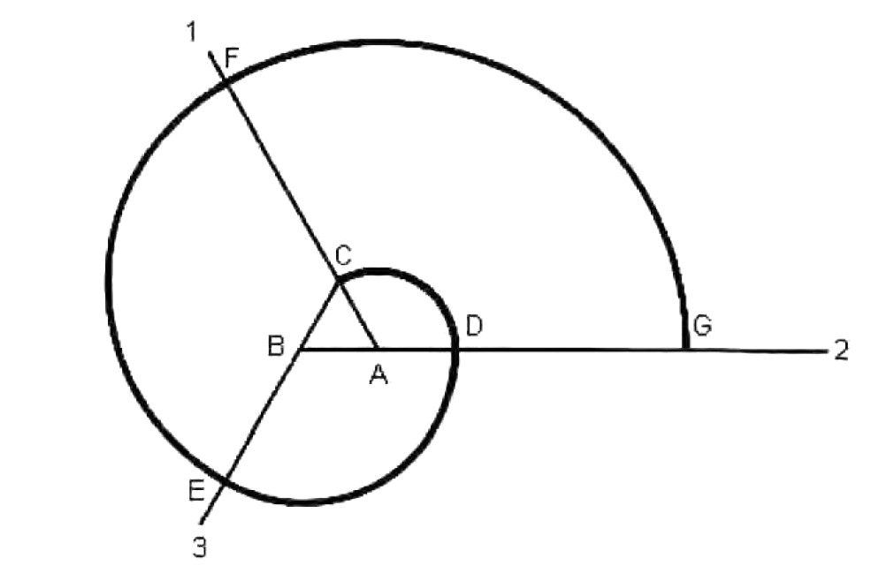<br><sub>Tomado de: Dibujo Técnico I - DGEP (pág. 80)</sub></div>

> Para entender mejor estos conceptos, realice el trazado manual de estas espirales utilizando cualquier radio y centroide.

2. Con la herramienta _Home / Draw / Helix_, creemos una hélice 3D en la coordenada absoluta (900,200), establezca un radio en la base de 60 metros, un radio en la corona o en el centro de 10 metros y 80 metros en altura. Observe que visualmente las dos espirales son iguales.

<div align="center">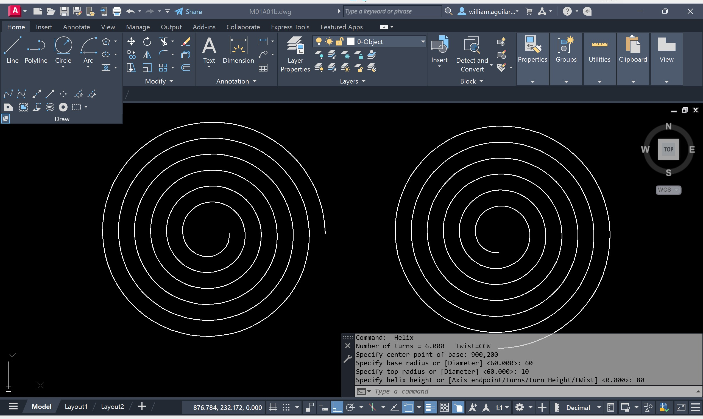</div>

3. Utilizando la tecla <kbd>shift</kbd> y manteniendo oprimida la rueda del Mouse, cambie la rotación de visualización del UCS. Podrá observar que la segunda hélice creada es de 3 dimensiones.

<div align="center">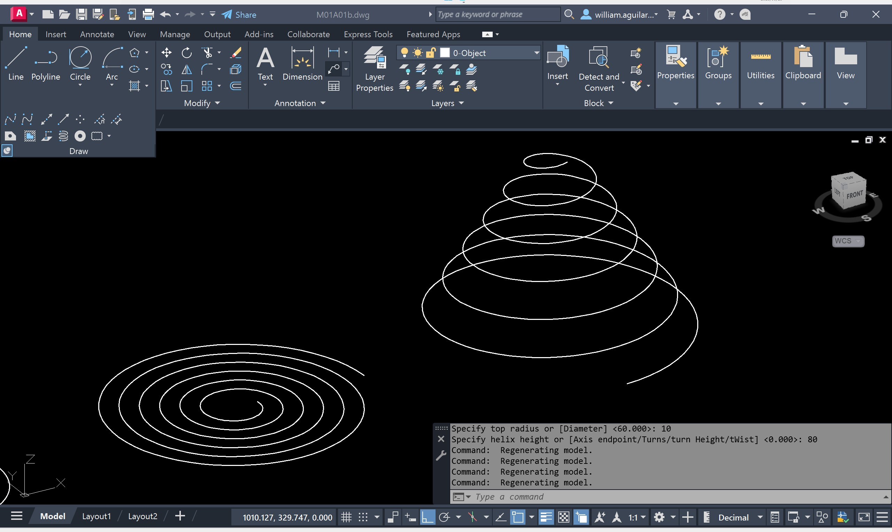</div>

Restablezca la visualización superior del plano XY dando clic en la caja que se encuentra arriba a la derecha del área de dibujo.

<div align="center">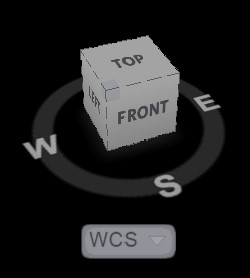</div>


## 9. Líneas constructivas y rayos

Este tipo de geometría, permite crear líneas constructivas infinitas, que son especialmente útiles cuando se necesita definir ejes de proyección o líneas radiales, p. ej., para los ejes de las columnas estructurales de una edificación o para las línes directoras de una escalera curva.

1. Utilizando la herramienta _Home / Draw / Construction Line_ o el comando **XLINE**, trace en la capa _0.Axe_, líneas verticales y horizontales en los extremos de la figura simétrica.

> Para ejecutar correctamente esta acción, es necesario activar las herramientas de ortogonalidad <kbd>F8</kbd> y encajado u OSNAP <kbd>F3</kbd>.

<div align="center">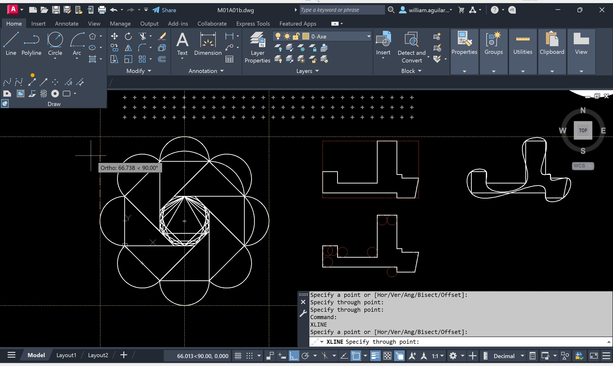</div>

2. Ahora, con la herramienta _Home / Draw / Ray_ o el comando **RAY**, trace en desde el centro de la figura, rayos proyectando los bordes externos de los triángulos existentes en la figura.

<div align="center">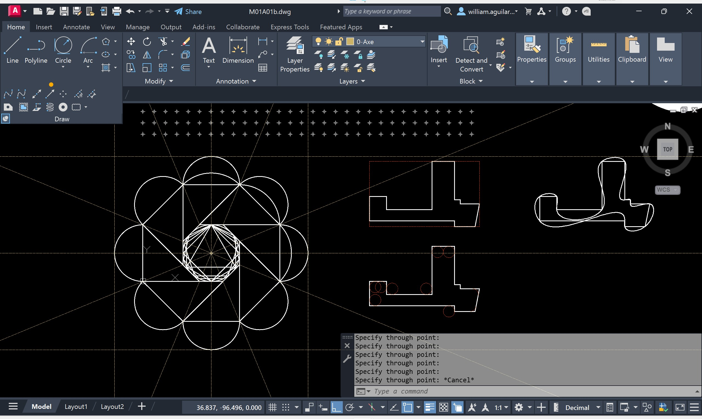</div>

3. Aléjese del dibujo, podrá observar la proyección infinita de estas líneas.

<div align="center">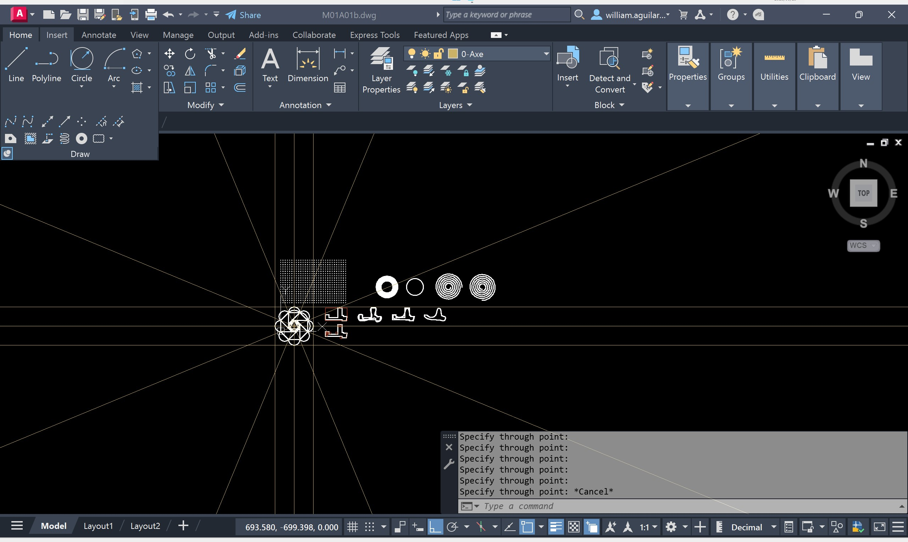</div>


## 10. Herramientas de modificación

Desde la barra _Home / Modify_, podrá acceder a múltiples herramientas de modificación que le permitirán:

|                                           Ícono                                            | Herramienta              | Atajo / Comando           | Descripción                                                                                                                                                                                             |
|:------------------------------------------------------------------------------------------:|:-------------------------|:--------------------------|:--------------------------------------------------------------------------------------------------------------------------------------------------------------------------------------------------------|
|          | [Move](https://help.autodesk.com/view/ACD/2026/ENU/?guid=GUID-47CE7325-84C0-4414-80A3-29DC98392709)                     | <kbd>M</kbd> MOVE         | Mover elementos del dibujo.                                                                                                                                                                             |
|        | [Rotate](https://help.autodesk.com/view/ACD/2026/ENU/?guid=GUID-1C265537-FBAC-48D5-B448-B72E777071E5)                   | <kbd>RO</kbd> ROTATE      | Rotar elementos del dibujo.                                                                                                                                                                             |
|          | [Trim](https://help.autodesk.com/view/ACD/2026/ENU/?guid=GUID-B1A185EF-07C6-4C53-A76F-05ADE11F5C32)                     | <kbd>TR</kbd> TRIM        | Recortar elementos a partir de otros elementos.                                                                                                                                                         |
|    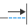    | [Extend](https://help.autodesk.com/view/ACD/2026/ENU/?guid=GUID-89DD7B0F-F4F1-410D-9A3A-5847CA5F8744)                   | <kbd>EX</kbd> EXTEND      | Extender elementos. Esta herramienta se encuentra en el expansor de Trim.                                                                                                                               |
|         | [Erase](https://help.autodesk.com/view/ACD/2026/ENU/?guid=GUID-040C580C-63A2-4C98-9964-4573EF8C9514)  / Delete          | <kbd>E</kbd> ERASE        | Remueve o elimina elementos del dibujo.                                                                                                                                                                 |
|          | [Copy](https://help.autodesk.com/view/ACD/2026/ENU/?guid=GUID-1CF9287F-06E8-4D03-8377-2E130862FE02)                     | <kbd>CP</kbd> COPY        | Copia elementos a una distancia o dirección específica.                                                                                                                                                 |
|    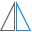    | [Mirror](https://help.autodesk.com/view/ACD/2026/ENU/?guid=GUID-595277C8-9B87-4CFB-A3AF-769537A22F3D)                   | <kbd>MI</kbd> MIRROR      | Crea una copia espejo de un elemento seleccionado.                                                                                                                                                      |
|        | [Fillet](https://help.autodesk.com/view/ACD/2026/ENU/?guid=GUID-64F8B700-23B3-4BD6-8C03-66121AA13E8F)                   | <kbd>F</kbd> FILLET       | Redondea o filetea las aristas de objetos, p. ej., la esquina de una manzana urbana.                                                                                                                    |
|       | [Chamfer](https://help.autodesk.com/view/ACD/2026/ENU/?guid=GUID-B1DCF991-90A7-4DB0-96FC-BDA3FB76337C)                  | <kbd>CHA</kbd> CHAMFER    | Bisela las aristas de objetos.                                                                                                                                                                          |
|         | [Blend](https://help.autodesk.com/view/ACD/2026/ENU/?guid=GUID-9EF74C66-88CA-4C16-B761-CB1119C0F897) curves             | BLEND                     | Crea una tangente o una línea suaviza espiral entre los puntos finales de dos curvas abiertas.                                                                                                          |
|       | [Explode](https://help.autodesk.com/view/ACD/2026/ENU/?guid=GUID-E98BCEF4-DED6-48A6-87EB-10FE87188083)                  | EXPLODE / BREAKUP         | Separa un objeto compuesto en la partes que lo componen, p. ej., al explotar un rectángulo se obtienen sus 4 lados.                                                                                     |
|       | [Stretch](https://help.autodesk.com/view/ACD/2026/ENU/?guid=GUID-F000A502-D39E-4D31-A8E2-4A626473FB72)                  | STRETCH                   | Extiende objetos a partir de una selección de caja o polígono.                                                                                                                                          |
|         | [Scale](https://help.autodesk.com/view/ACD/2026/ENU/?guid=GUID-D4E17E51-5000-4AB6-8D6A-6D2AB4863C75)                    | <kbd>SC</kbd> SCALE       | Escala un objeto, valores superiores a 1 agrandan el objeto en proporción al valor ingresado, valores menores a 1 reducen el objeto.                                                                    |
|     | Rectangular Array        | ARRAYRECT                 | Crea un arreglo de objetos o copia múltiple de objetos en una secuencia rectangular.                                                                                                                    |
|     | Path Array               | ARRAYPATH                 | Crea un arreglo de objetos o copia múltiple de objetos a lo largo de una trayectoria definida.                                                                                                          |
|    | Polar Array              | ARRAYPOLAR                | Crea un arreglo de objetos o copia múltiple de objetos al rededor de una circunferencia.                                                                                                                |
|        | Offset                   | <kbd>O</kbd> OFFSET       | Crea lineas paralelas a un objeto, distancias positivas indican que la paralela se traza fuera del objeto cuando este es una polilínea cerrada.                                                         |
|    | Set To ByLayer           | SETBYLAYER                | Permite restablecer la propiedades de capa de un objeto.                                                                                                                                                |
|   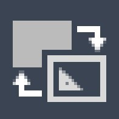    | Change Space             | CHSPACE                   | Permite transferir un objeto entre el espacio de modelado o el espacio de dibujo de impresión.                                                                                                          |
|      | Lengthen                 | LENGTHEN                  | Alargar un objeto estableciendo un valor o porcentaje.                                                                                                                                                  |
|         | Edit Polyline            | <kbd>PE</kbd> PEDIT       | Editar una polilínea, p. ej., para cerrarla.                                                                                                                                                            |
|     | Edit Spline              | SPLINEDIT                 | Editar líneas espirales.                                                                                                                                                                                |
|     | Edit Hatch               | HATCHEDIT                 | Editar achurados o rellenos.                                                                                                                                                                            |
|     | Edit Array               | ARRAYEDIT                 | Editar arreglos de objetos.                                                                                                                                                                             |
|         | Align                    | <kbd>AL</kbd> ALIGN       | Alinear un objeto con otro.                                                                                                                                                                             |
|         | Break                    | BREAK                     | Partir un objeto entre dos puntos.                                                                                                                                                                      |
|  | Break at Point           | <kbd>M</kbd> BREAKATPOINT | Partir un objeto en un punto especificado.                                                                                                                                                              |
|     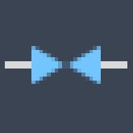     | Join                     | <kbd>J</kbd> JOIN         | Unir objetos para crear un único objeto.                                                                                                                                                                |
|   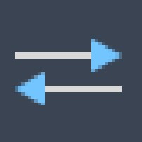    | Reverse                  | REVERSE                   | Cambiar el sentido vectorial de dibujo de un objeto, p. ej., al digitalizar un río, este puede haber sido digitalizado en el sentido inverso del flujo y con este comando podrá cambiar su sentido.     |
|         | Copy Nested Objects      | NCOPY                     | Copia objetos embebidos dentro de bloques o archivos de dibujo de referencias externas.                                                                                                                 |
|      | Delete Duplicate Objects | OVERKILL                  | Elimina elementos duplicados idénticos.                                                                                                                                                                 |
|     | Bring To                 | DRAWORDER                 | Cambia el orden o posición de dibujo de un objeto con respecto a otro, p. ej., una columna que se encuentra en la capa S-COLS puede ser colocada encima o debajo de un muro dibujado en la capa A-WALL. |


## 11. Ejercicios 

Realizar los siguientes ejercicios incluyendo la figura y sus líneas constructivas.

### Ejercicio M01A02bE01

Para practicar las herramientas vistas en esta actividad, construiremos en clase el siguiente [dibujo isométrico](https://es.wikipedia.org/wiki/Proyecci%C3%B3n_isom%C3%A9trica) a partir de líneas, círculos y arcos, inscrita en una circunferencia de diámetro 10 metros. Guarde el dibujo como _/file/cad/M01A02bE01.dwg_.

Especificaciones adicionales:

* Para las líneas constructivas, utilice un escalado de líneas o **LTSCALE** en 0.05.
* En el mismo dibujo, cree copias de la figura creada a escalas 0.5:1, 2:1 y 5:1.
* Utilizando la herramienta de dibujo **ELLIPSE**, trace una de las elipses creadas, calcule y compare su área con respecto a las trazadas manualmente.

<div align="center"><br><sub>Adaptado de: Dibujo Técnico I - Anaya (pág. 80)</sub></div>


### Ejercicio M01A02bE02

Dibuje la llave de tuercas presentada en la ilustración. Guarde el dibujo como _/file/cad/M01A02bE02.dwg_.

<div align="center"><br><sub>Adaptado de: Dibujo Técnico I - DGEP (pág. 84)</sub></div>


### Ejercicio M01A02bE03

Dibuje las siguientes formas geométricas con simetría axial mostradas en la ilustración, establezca libremente las dimensiones de cada figura. Guarde el dibujo como _/file/cad/M01A02bE03.dwg_.

<div align="center">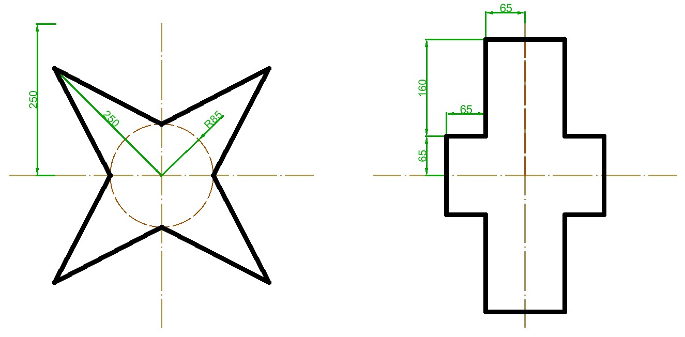<br><sub>Adaptado de: Dibujo Técnico I - DGEP (pág. 86)</sub></div>
<div align="center">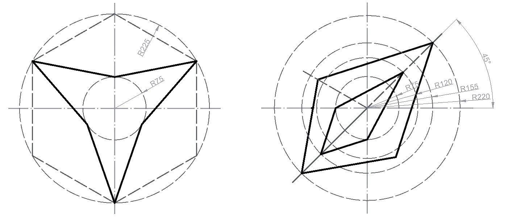<br><sub>Adaptado de: Dibujo Técnico I - DGEP (pág. 86)</sub></div>


### Ejercicio M01A02bE04

Dibuje el siguiente elemento isométrico correspondiente a la cabeza de un martillo. Guarde el dibujo como _/file/cad/M01A02bE04.dwg_.

<div align="center"><br><sub>Adaptado de: Dibujo Técnico I - DGEP (pág. 86)</sub></div>


### Ejercicio M01A02bE05

Dibuje el siguiente elemento isométrico correspondiente a un contra pasador. Guarde el dibujo como _/file/cad/M01A02bE05.dwg_.

<div align="center"><br><sub>Adaptado de: Dibujo Técnico I - DGEP (pág. 86)</sub></div>


### Ejercicio M01A02bE06

Dibuje el siguiente elemento isométrico correspondiente a un tabique o ladrillo con perforaciones, en la cara frontal utilice la herramienta Mirror. Guarde el dibujo como _/file/cad/M01A02bE06.dwg_.

<div align="center"><br><sub>Adaptado de: Dibujo Técnico I - DGEP (pág. 131)</sub></div>


### Ejercicio M01A02bE07

Dibuje el siguiente elemento isométrico correspondiente a pieza mecánica con perforaciones. Guarde el dibujo como _/file/cad/M01A02bE07.dwg_.

<div align="center"><br><sub>Tomado de: Dibujo Técnico I - DGEP (pág. 122)</sub></div>


### Ejercicio M01A02bE08

Dibuje el siguiente elemento isométrico correspondiente a pieza mecánica con perforaciones. Guarde el dibujo como _/file/cad/**M01A02bE08**.dwg_.

<div align="center"><br><sub>Tomado de: Dibujo Técnico I - DGEP (pág. 123)</sub></div>


### Ejercicio M01A02bE09

Creando un array de 10 líneas horizontales por 10 líneas verticales y trazando líneas, cree el logo de la [UECIJG](https://www.escuelaing.edu.co/). El ancho y alto de la figura debe corresponder a los 3 últimos dígitos de su código de estudiante. Guarde el dibujo como _/file/cad/**M01A02bE09**.dwg_.

<div align="center"></div>

> Este logo deberá ser utilizado en el formato de impresión del proyecto.


## Actividades de proyecto :triangular_ruler:

Utilizando la [plantilla suministrada](../../file/report/R.DAPC.PlantillaSoporteDesarrollo.docx), cree un documento soporte mostrando las actividades desarrolladas en el orden presentado en esta actividad, junto con los análisis y recomendaciones realizadas, convierta a Adobe Acrobat (.pdf) y guarde en la carpeta _/activity_ del repositorio de datos del proyecto; nombre el archivo con el código de la actividad agregando al final la fecha de control documental en formato aaaammdd (p. ej. M01A00_20250531.pdf).

En la siguiente tabla se listan las actividades que deben ser desarrolladas y documentadas por cada estudiante o grupo de proyecto.

| Actividad | Alcance                                                                                                                                                                                                                                                                                                                                                                                                                                                                                                                                              |
|:----------|:-----------------------------------------------------------------------------------------------------------------------------------------------------------------------------------------------------------------------------------------------------------------------------------------------------------------------------------------------------------------------------------------------------------------------------------------------------------------------------------------------------------------------------------------------------|
| M01A02b   | Esta actividad no requiere del desarrollo de elementos en el avance del proyecto final, los contenidos son evaluados a partir de la entrega de los ejercicios definidos en la actividad.                                                                                                                                                                                                                                                                                                                                                             |
| M01A02b    | En una tabla y al final del informe de avance de esta entrega, indique el detalle de las actividades realizadas por cada integrante de su grupo; utilice las siguientes columnas: `Nombre del integrante`, `Actividades realizadas`, `Tiempo dedicado en horas` (si presenta la entrega individualmente, no es necesaria la presentación de esta tabla).<br><br>Para actividades que no requieren del desarrollo de elementos de avance, indicar si realizo la lectura de la guía de clase y las lecturas indicadas al inicio en los requerimientos. | 

> Nota 1: para la revisión del proyecto final, guarde los libros cálculo de Microsoft Excel y los archivos generados en esta actividad, en las localizaciones indicadas en cada numeral.
>
> Nota 2: una vez el instructor realice la revisión y el estudiante presente las correcciones o ajustes solicitados, será necesario cargar una nueva versión de los archivos en el repositorio del proyecto, incluyendo o actualizando al final del nombre del archivo, la fecha de presentación en formato aaaammdd y manteniendo las versiones anteriores presentadas.
>


## Referencias

* https://help.autodesk.com/view/ACD/2026/ESP
* https://help.autodesk.com/view/ACD/2026/ENU/
* [AutoCAD UCS](https://help.autodesk.com/view/ACD/2026/ENU/?guid=GUID-E658D5E7-EE5C-4A06-BF34-F71CDB363A71)
* [AutoCAD para todos / Comandos de Dibujo](https://www.youtube.com/playlist?list=PLzdkaVXEoikS3EwqyXwFHJ3pCoZE78Ecl)
* [AutoCAD para todos / Comando CIRCLE](https://www.youtube.com/watch?v=zMBA_d99HC0)
* [AutoCAD para todos / Comando ARC](https://www.youtube.com/watch?v=sATpaS7HCi8)
* [AutoCAD para todos / Comando PLINE](https://www.youtube.com/watch?v=AWP69qexGHo)
* [AutoCAD para todos / Comando RECTANG](https://www.youtube.com/watch?v=Bi_bm2JrEHw)
* [AutoCAD para todos / Comando POLYGON](https://www.youtube.com/watch?v=QjthtjHcpvo)
* [AutoCAD para todos / Comando DIVIDE](https://www.youtube.com/watch?v=FU2ts2C7_0k)
* Dibujo Técnico I - DGEP


## Control de versiones

| Versión    | Descripción        | Autor                                      | Horas |
|------------|:-------------------|--------------------------------------------|:-----:|
| 2025.06.22 | Versión inicial.   | [rcfdtools](https://github.com/rcfdtools)  |  16   |


##

_R.DAPC es de uso libre para fines académicos, conoce nuestra licencia, cláusulas, condiciones de uso y como referenciar los contenidos publicados en este repositorio, dando [clic aquí](../../LICENSE.md)._

_¡Encontraste útil este repositorio!, apoya su difusión marcando este repositorio con una ⭐ o síguenos dando clic en el botón Follow de [rcfdtools](https://github.com/rcfdtools) en GitHub._


| [:arrow_backward: Anterior](../M01A02a/Readme.md) | [:house: Inicio](../../README.md) | [:beginner: Ayuda / Colabora](https://github.com/rcfdtools/R.DAPC/discussions/99999) | [Siguiente :arrow_forward:](../M01A02c/Readme.md) |
|---------------------------------------------------|-----------------------------------|--------------------------------------------------------------------------------------|---------------------------------------------------|

[^1]: 