# 1.2.b. Elementos básicos de dibujo / Curvas especiales
Keywords: `ellipse` `parabola` `hyperbola` `clothoid` `m01a02c`

Dibujo de elipse, óvalo, parábola, hipérbola y funciones trigonométricas.

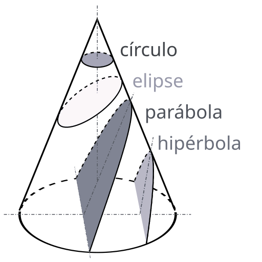 Tomado de: https://es.wikipedia.org/wiki/Par%C3%A1bola_(matem%C3%A1tica)/

## Objetivos

Al finalizar esta actividad, el estudiante:

* Calcula los elementos que componen las curvas especiales.
* Dibuja curvas especiales con precisión.

## Requerimientos

Archivos, actividades previas, lecturas y herramientas requeridas para el desarrollo de esta actividad:

| Requerimiento                                                                      | Descripción                                               |
|:-----------------------------------------------------------------------------------|:----------------------------------------------------------|
| [:toolbox:Herramienta](https://www.autodesk.com/products/autocad)                  | Autodesk Autocad 3D 2026 o superior.                      |
| [:toolbox:Herramienta](https://www.microsoft.com/es/microsoft-365/excel?market=bz) | Microsoft Excel 365.                                      |
| [:date:DAPC_Curves.xlsx](../../file/table/DAPC_Curves.xlsx)                        | Libro de cálculo para la generación de curvas especiales. |

> Para los diferentes avances de proyecto, es necesario guardar y publicar las diferentes versiones generadas del (los) libro (s) de Microsoft Excel y reportes o informes, agregando al final la fecha de control documental en formato aaaammdd, p. ej. _R.HydroTools.DisenoCaucesParametros.20250528.xlsx_.

## 1. Elipse

Como vimos en la actividad anterior, el dibujo de la elipse es especialmente útil en la representación de circunferencias en figuras isométricas. Si bien AutoCAD permite dibujar elipses por 3 métodos diferentes, es importante conocer los parámetros que permiten su trazado.

Métodos de dibujo en AutoCAD:

* Centro, nodo semieje mayor, nodo semieje menor.
* Nodos de extremo de eje mayor, nodo semieje menor.
* Arco elíptico con nodos de extremo de eje mayor, nodo semieje menor, nodo inicio arco, nodo fin arco.

La ecuación general de una elipse horizontal o vertical con centro en (0,0) es:

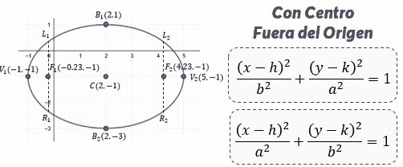 Tomado de: https://www.fisimat.com.mx/ecuacion-de-la-elipse-con-centro-fuera-del-origen/

Donde

* x, y: coordenadas de cualquier punto sobre la elipse.
* h, k: coordenadas del centro de la elipse en (x,y).
* a: longitud del semieje mayor.
* b: la longitud del semieje menor. 

Los focos de una elipse son dos puntos fijos dentro de la elipse que definen su forma. La suma de las distancias de cualquier punto de la elipse a estos dos focos es constante e igual a la longitud del eje mayor de la elipse. En otras palabras, si tienes un punto P en la elipse, la distancia de P a un foco más la distancia de P al otro foco siempre será la misma.

La ecuación para encontrar los focos de una elipse depende de si la elipse es horizontal o vertical. En general, para una elipse con centro en (h, k), la distancia del centro a cada foco se calcula como:

c = √(a² - b²)

Donde

* a: longitud del semieje mayor.
* b: longitud del semieje menor.

> Los focos se ubican en el eje mayor. Si la elipse es horizontal, los focos están en (h ± c, k); si es vertical, están en (h, k ± c). 

1. Para el dibujo manual en AutoCAD de las polilíneas por cuadrante que describen una elipse a partir de coordenadas o nodos, crearemos la siguiente hoja de Excel:

A partir de los parámetros de entrada, calcularemos las coordenadas.

Obtendremos la siguiente gráfica en Excel.

Y generaremos la secuencia de comandos para la generación de las polilíneas por cuadrante.

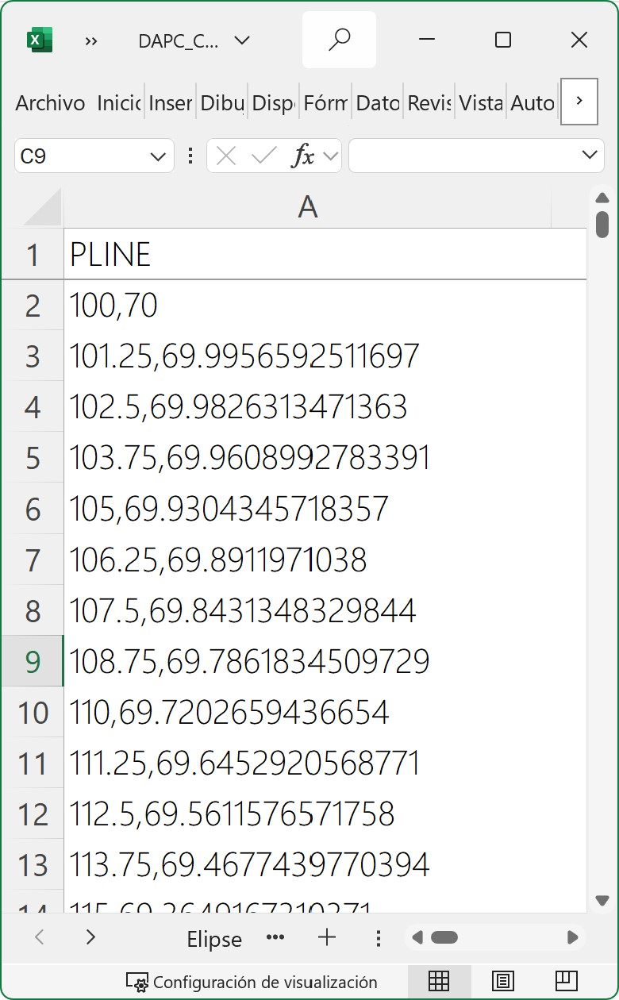

2. En AutoCAD, cree una copia del archivo _/file/cad/M01A02a.dwg_ y guarde como _/file/cad/M01A02c.dwg_. Luego, copie desde la hoja AutoCAD del libro de Excel, la columna A que contiene la secuencia de comandos y pegue en el _Command_ de AutoCAD. Obtendrá la representación de la Elipse usando polilíneas a partir de las coordenadas (x.y) del libro de Excel.

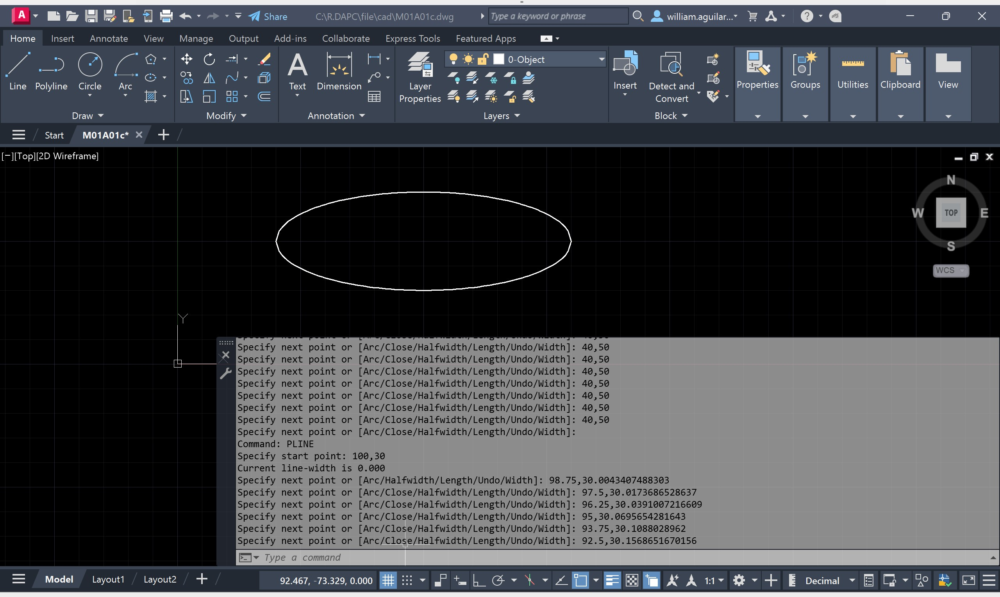

> Tenga en cuenta que debido a que el libro de Excel permite la generación de coordenadas de hasta 100 puntos por cuadrante, y en el ejemplo hemos definido que utilizaremos solo 48 nodos, es posible que los nodos de los extremos contengas duplicidades.

3. Para verificar el número de nodos por cada polilínea, seleccione cualquiera de los cuadrantes y desde el _Command_ ejecute el comando **LIST**.

Observará que las coordenadas del último nodo del objeto se encuentran duplicadas.

4. Para verificar la forma geométrica de la Elipse generada en autocad a partir de arcos circulares, con el comando **ELLIPSE**, dibuje la elipse con los parámetros utilizados para el cálculo de sus coordenadas, utilice centroide en la coordenada absoluta (100,50), semieje mayor a=60 y semieje mejor b=20. Cree esta línea en la capa _0-Sketch_.

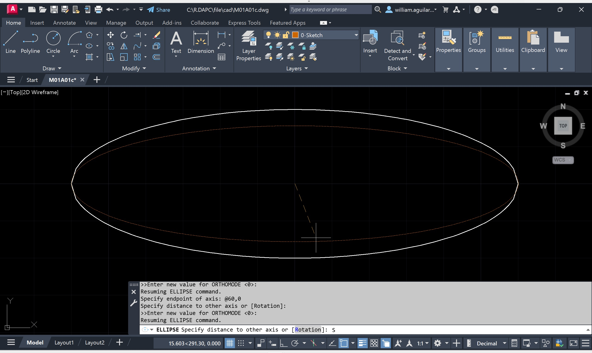

Acérquese al extremo lateral derecho y verifique el dibujo a partir de coordenadas calculadas y arcos circulares, podrá observar que los 48 nodos usados por cuadrante no permiten describir en detalle sus extremos.

5. Para facilitar la visualización de la localización de los nodos, con el comando **POINT**, cree todos los nodos generados, utilice para ello la columna B de la hoja AutoCAD del libro de Excel.

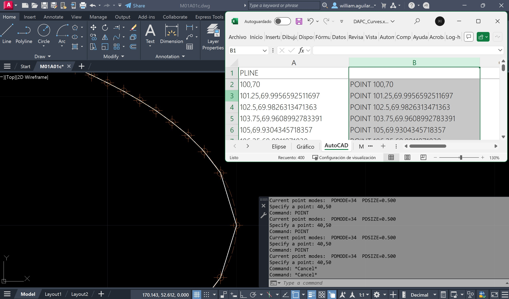

> :bulb: Para convertir las polilíneas trazadas a partir de los nodos de Excel en una curva cerrada similar a la elipse, con el comando **JOIN** una las 4 líneas, luego con el comando **PLINE** cierre la polilínea y desde el mismo comando ejecute **F**it.

### Ejercicio M01A02cE00

A partir de coordenadas de localización del centroide de una elipse y la longitud de los semiejes, generar las coordenadas de localización en 100 puntos sobre la elipse, trazar la polilínea en AutoCAD y luego suavizarla. Utilizando los parámetros de cálculo, trace con la herramienta **ELLIPSE**, la elipse compuesta por arcos y compare su longitud con la trazada a partir de puntos. Guarde el dibujo como _/file/cad/**M01A02cE00**.dwg_.

Especificaciones:

* Centroide: las coordenadas (x,y) del centroide o (h,k), corresponde a los 2 últimos dígitos de su código de alumno.
* Semiejes: la longitud del semieje mayor o a, corresponde a una longitud igual a los 3 últimos dígitos de su código de alumno; la longitud del semieje menor o b, corresponde al 35% de la longitud del semieje mayor.

## 2. Óvalo [^1]

Curva cerrada, con la convexidad vuelta siempre a la parte de afuera, de forma parecida a la de la elipse, y simétrica respecto de uno o de dos ejes. La ecuación general del óvalo corresponde a:

### Ejercicio M01A02cE01

Trace las líneas constructivas y dibuje óvalos en AutoCAD a partir de arcos circulares, conociendo: eje mayor, eje menor, los dos ejes. Guarde el dibujo como _/file/cad/**M01A02cE01**.dwg_.

1. Para el dibujo de un _óvalo dado el eje menor_, con centroide en cualquier localización.

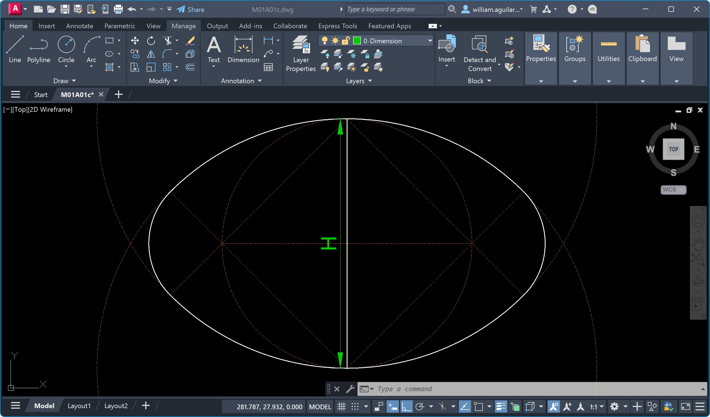

2. Para el dibujo de un _óvalo dado el eje mayor_, con centroide en cualquier localización.

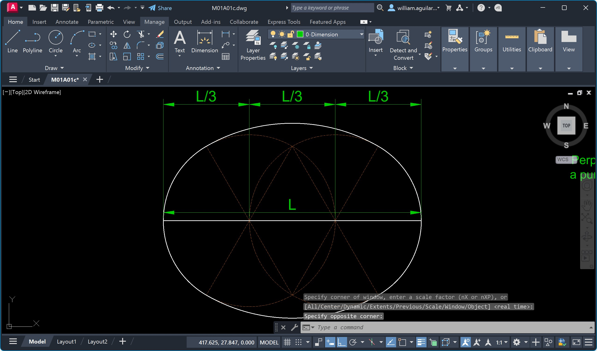

3. Para el dibujo de un _óvalo dado el eje mayor y el eje menor_, con centroide en cualquier localización.

> Para la evaluación del trazado de esta figura, utilice las coordenadas absolutas de localización y dimensiones indicadas por el instructor.

## 2. Ovoide [^2]

El término ovoide hace referencia a una forma geométrica convexa y redondeada, que se asemeja al perfil de un huevo de ave en su sentido más amplio.

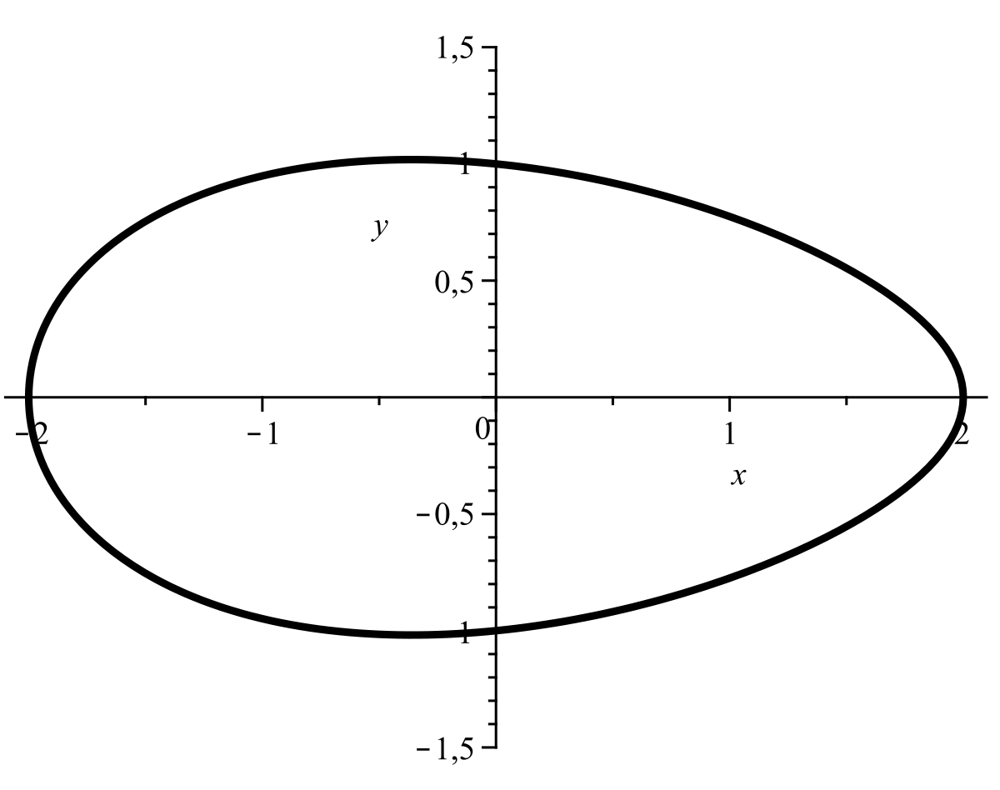 https://es.wikipedia.org/wiki/%C3%93valo

El ovoide es una curva cerrada simétrica con respecto a su eje y cóncava hacia él, conformada por cuatro arcos de circunferencia: uno de ellos es una semicircunferencia y los otros dos son iguales y simétricos. Su nombre deriva de su parecido con la sección longitudinal de un huevo.

Posee dos ejes ortogonales, denominados mayor y menor. Tiene cuatro centros de curvatura. A diferencia del óvalo, solo tiene un eje de simetría.

> No debe confundirse con un ovoide en geometría proyectiva.

### Ejercicio M01A02cE02 

Trace las líneas constructivas y dibuje ovoides en AutoCAD a partir de arcos circulares, conociendo: eje mayor, eje menor, los dos ejes. Guarde el dibujo como _/file/cad/**M01A02cE02**.dwg_.

1. Para el dibujo de un _ovoide dado el eje menor_, con centroide en cualquier localización.

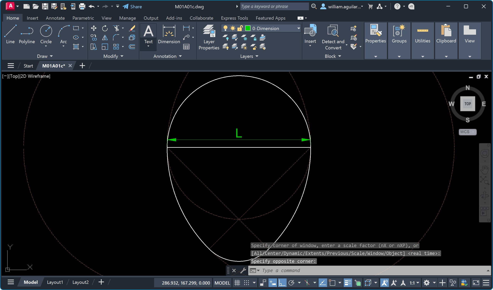

2. Para el dibujo de un _ovoide dado el eje mayor_, con centroide en cualquier localización.

> Utilizando el comando **DIVIDE**, divida en 6 partes el eje mayor para obtener nodos a lo largo del eje. El trazado del arco superior se realiza en el nodo de la segunda división. El trazado del arco inferior se realiza en el nodo de la primera división.

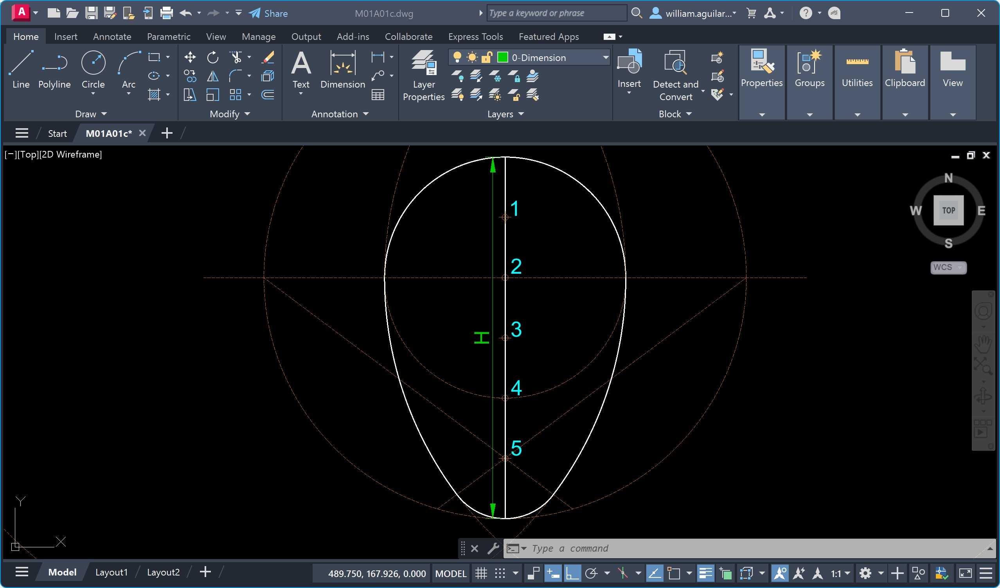

3. Para el dibujo de un _ovoide dado el eje mayor y el eje menor_, con centroide en cualquier localización.

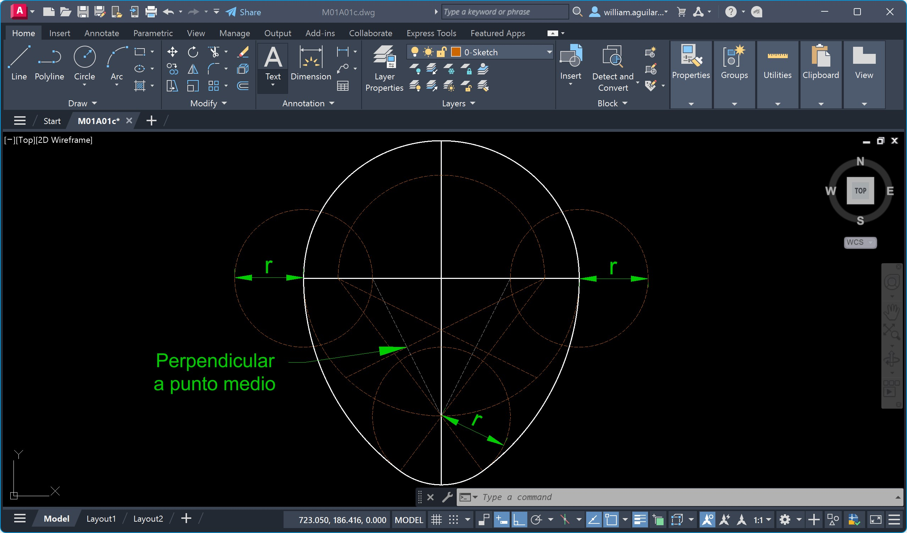

> Para la evaluación del trazado de esta figura, utilice las coordenadas absolutas de localización y dimensiones indicadas por el instructor.

### Ejercicio M01A02cE03

**Parte A**: utilizando los conceptos aprendidos acerca de óvalos, cree un libro formulado en Excel para el trazado de una superelipse, el tamaño y localización de la figura es de libre elección. Guarde el dibujo como _/file/cad/**M01A02cE03A**.dwg_.

Ecuación Superelipse

 Tomado de: https://es.wikipedia.org/wiki/%C3%93valo

 Tomado de: https://es.wikipedia.org/wiki/%C3%93valo

**Parte B**: investigue la forma geométrica que tienen las pistas de atletismo y realice el trazado de su eje interno en AutoCAD, luego y utilizando la herramienta **OFFSET**, trace 8 líneas paralelas externas que le permitirán obtener 8 carriles y calcule la longitud de sus ejes centrales. Guarde el dibujo como _/file/cad/**M01A02cE03B**.dwg_.

## 4. Parábola [^3]

En matemáticas, una parábola es la sección cónica de excentricidad igual a 1, resultante de cortar un cono recto o de revolución con un plano oblicuo cuyo ángulo de inclinación respecto al eje de revolución del cono sea igual al presentado por su generatriz. El plano resultará, por lo tanto, paralelo a dicha recta. Se define también como el lugar geométrico de los puntos de un plano que equidistan de una recta llamada directriz y un punto interior a la parábola llamado foco. En geometría proyectiva, la parábola se define como la curva envolvente de las rectas que unen pares de puntos homólogos en una proyectividad semejante.

Al segmento de recta comprendido por la parábola, que pasa por el foco y es paralelo a la directriz, se le conoce como lado recto.

> Debido a la ecuación que representa a esta curva, surge el siguiente teorema: "_La longitud del lado recto es siempre 4 veces la distancia focal_".

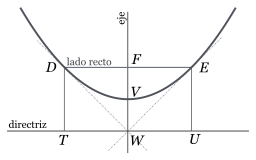 Tomado de: https://es.wikipedia.org/wiki/Par%C3%A1bola_(matem%C3%A1tica)

Siendo D, E los extremos del lado recto y T, U las respectivas proyecciones sobre la directriz, denotando por W la proyección del foco F sobre la directriz, se observa que FEUW y DFWT son cuadrados, y sus lados miden FW = 2FV. Por tanto, el segmento DE es igual a 4 veces el segmento FV (la distancia focal).

> Siempre se debe cumplir que la distancia desde cualquier punto de la parábola a su eje directriz, es igual a la distancia desde el mismo punto hasta su foco.  

Para su dibujo en AutoCAD, podemos utilizar la expresión:

X² = 4PY

Donde,

* X: longitud horizontal que inscribe la parábola
* Y: longitud vertical que inscribe la parábola
* P: distancia VW entre el punto de inflexión y la línea directriz

Por ejemplo, con X = 50, Y=20

50² = 4*P*20 
P = 50² / 80 
P = 31.25 

> El trazado de la parábola se realiza con el comando **SPLINE** con control de vértíces o CV.

Al verificar la distancia desde su foco hasta cualquier punto sobre la curva (p. ej. 39.06), se puede observar que es exactamente igual a la distancia entre el mismo punto en la curva y su eje directriz.

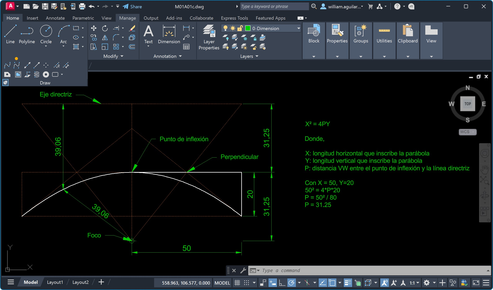

### Ejercicio M01A02cE04

Utilizando los conceptos aprendidos acerca de parábolas, trace una parábola cuya longitud horizontal corresponda a los 3 últimos dígitos de su código de alumno y con longitud vertical correspondiente al 40% de la longitud horizontal. La elección del punto de orígen es libre. Guarde el dibujo como _/file/cad/**M01A02cE04**.dwg_.

Requerimientos:

* El dibujo debe incluir la localización del foco y la verificación de la equidistancia desde la curva al eje directriz en cualquier punto, igual a la distancia desde el mismo punto al foco.
* Presente las líneas constructivas utilizadas.

## 5. Hipérbola [^4]

La hipérbola es la última forma geométrica que se estudia en la geometría analítica. En esta hablaremos sobre la ecuación de la hipérbola con centro en el origen. 

> La Hipérbola es aquel lugar geométrico de los puntos del plano que se mueven de tal manera que el valor absoluto de la diferencia de sus distancias a dos puntos fijos llamados focos son siempre constantes. 

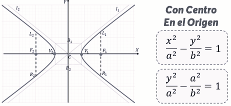 Tomado de: https://es.wikipedia.org/wiki/Par%C3%A1bola_(matem%C3%A1tica)/

Para su trazado en AutoCAD, existen diferentes metodologías, para este ejemplo, construiremos la hipérbola a partir del eje real (línea entre puntos de inflexión A-B) e imaginario (línea C-D). Con estos ejes buscaremos los focos y definiendo la localización del punto 1 (cualquier punto en la proyección del eje real y alejado del foco), obtendremos la localización de un punto conocido sobre la hipérbola.

Parte A 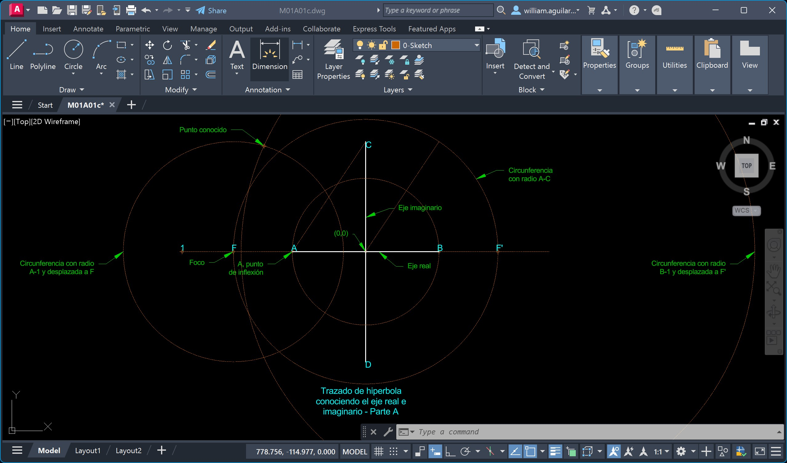

Ahora, construiremos la hipérbola a partir de la localización de uno de los puntos de inflexión y la localización del punto conocido sobre la curva.

Con el comando **DIVIDE** obtenga p. ej., 5 puntos sobre la línea horizontal y vertical proyectada del punto conocido al eje real y hasta el punto de inflexión. Entre más puntos se utilicen, más preciso será su trazado. Luego trace líneas desde el nodo B hasta los nodos de la proyección vertical y líneas desde el nodo A hasta los nodos de la proyección horizontal del punto conocido al nodo A. Para dibujar la curva, utilice una **SPLINE** por ajuste o Fit y luego con el comando **MIRROR** cree copias espejo horizontales y verticales.  

Parte B 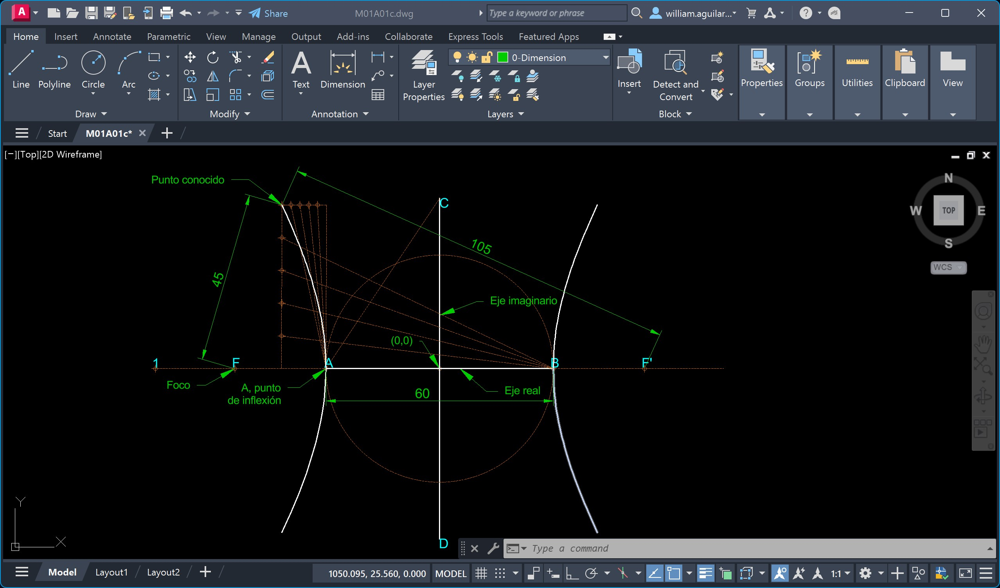

> Para comprobar su correcta construcción, la resta de las distancias de los focos a cualquier punto sobre la hipérbola (para el ejemplo 105-45=60) debe ser igual a la distancia entre los puntos de inflexión (60).

Otro ejemplo de su construcción cuando solo conocemos el punto de inflexión y la localización de cualquier punto. No conocemos la longitud del eje imaginario.

Ejemplo adicional 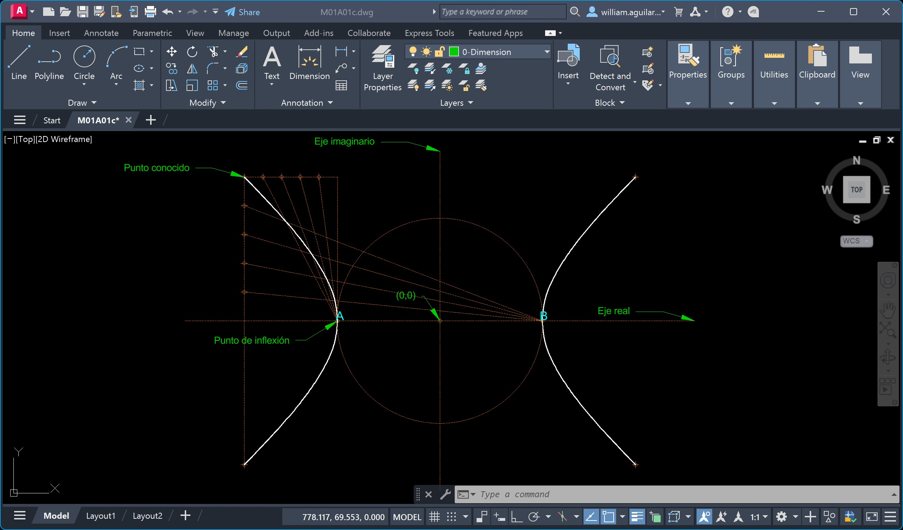

### Ejercicio M01A02cE05

Utilizando los conceptos aprendidos de hipérbolas, trace una hipérbola cuya longitud horizontal o eje real corresponda a los 3 últimos dígitos de su código de alumno y con longitud vertical o eje imaginario correspondiente 2.25 veces la longitud horizontal. La elección del punto de orígen es libre. Guarde el dibujo como _/file/cad/**M01A02cE05**.dwg_.

Requerimientos:

* El dibujo debe incluir la localización de los focos y la verificación de la resta de distancias desde los focos a cualquier punto correspondiente a la longitud entre los puntos de inflexión.
* Presente las líneas constructivas utilizadas.

## 6. Funciones trigonométricas [^5]

Las funciones trigonométricas son relaciones matemáticas que conectan los ángulos de un triángulo rectángulo con las longitudes de sus lados. Se utilizan para calcular ángulos, lados y otras dimensiones geométricas en triángulos rectángulos. Las funciones trigonométricas son esenciales en diversas disciplinas, incluyendo física, ingeniería, astronomía y música, debido a su capacidad para modelar fenómenos cíclicos y repetitivos. En resumen, las funciones trigonométricas son herramientas matemáticas poderosas que permiten relacionar los ángulos y los lados de los triángulos rectángulos, facilitando el cálculo de dimensiones y la comprensión de fenómenos periódicos en diversos campos. 

1. Para su dibujo, obtengamos primero el cálculo de los valores de las funciones en Excel.

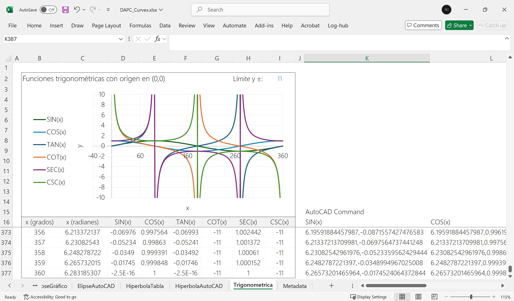

2. Tracemos un rectángulo de 10 metros de alto (correspondiente a un valor por debajo del límite definido en Excel para el cálculo de los valores en Y) por 6.283185307 (correspondiente a 2π) en el origen absoluto de coordenadas (0,0) y cree una copia alineada en la parte inferior. Luego, copie la secuencia de comandos AutoCAD creada en Excel y pegue en el Command para dibujar las funciones.

Para: _y = Seno(x)_

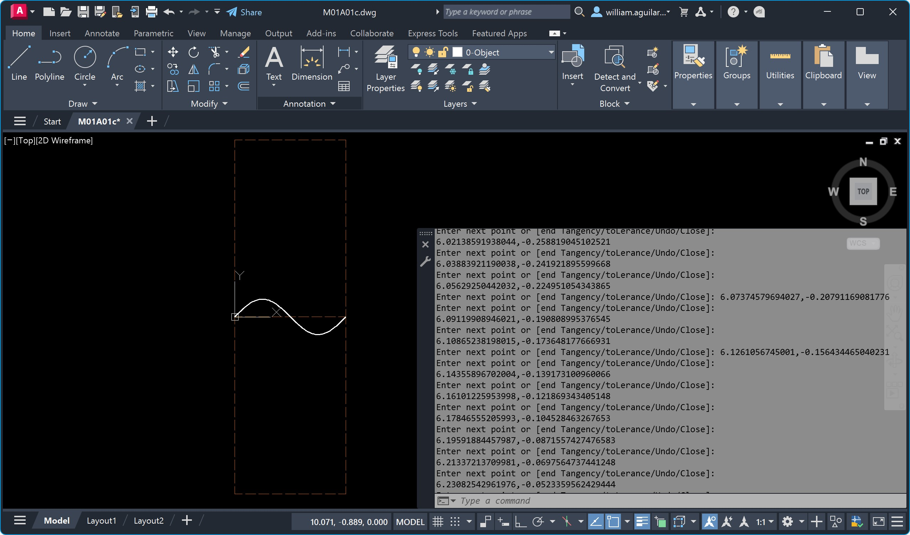

Para las demás funciones,

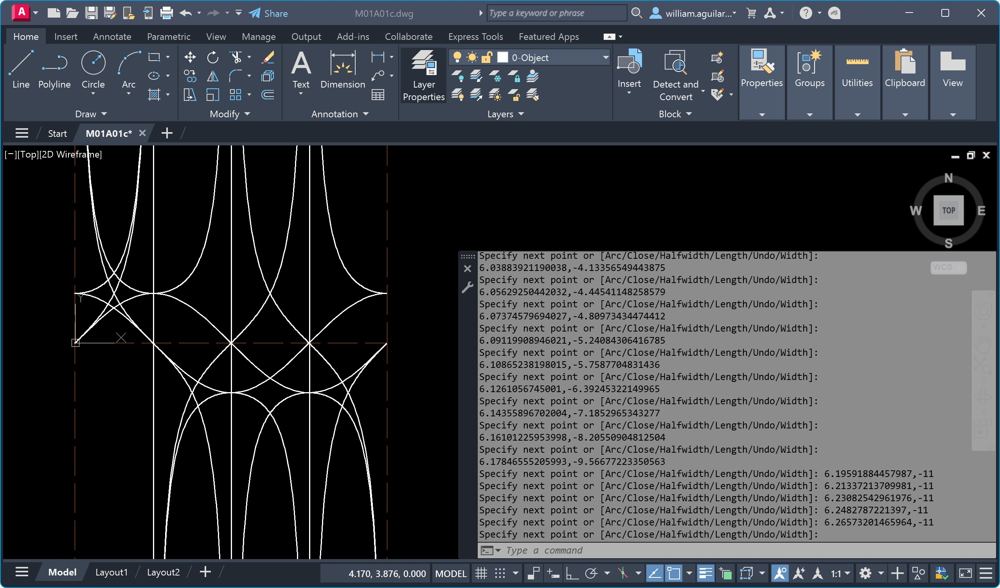

> Tenga en cuenta que para el dibujo de funciones contínuas Seno y Coseno, utilizaremos SPLINE y para las discontínuas PLINE.

3. Debido a que el trazado de funciones discontínuas conecta los extremos superiores con los inferiores calculados que tienden a infinito, es necesario segmentar con el comando _TRIM_, todos los elementos por fuera del rectángulo de referencia y eliminar las líneas de conexión vertical internas.

> Para facilitar el recorte con TRIM, traze a mano alzada una línea que toque en al menos un punto, los elementos a recortar.

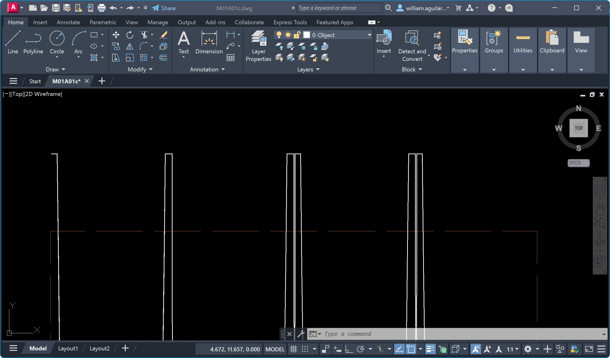

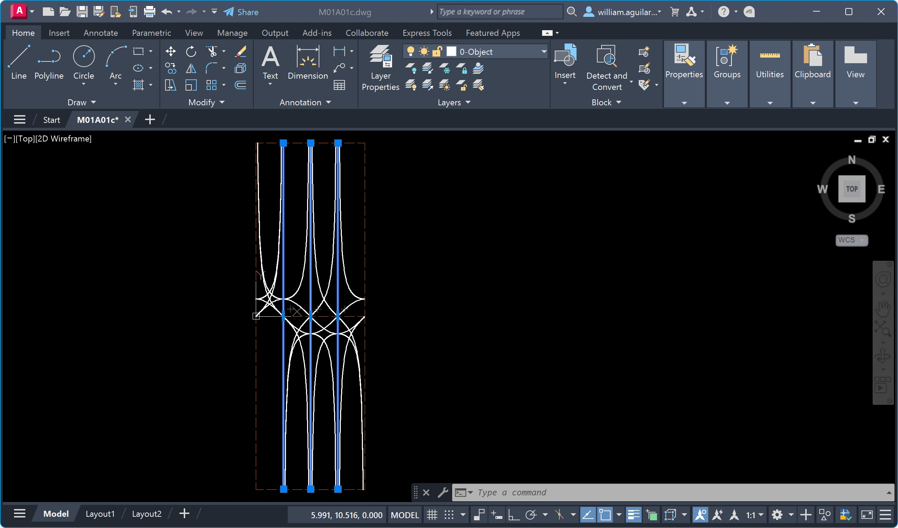

Luego de eliminados los trazos sobrantes, obtendrá el trazado final de las funciones.

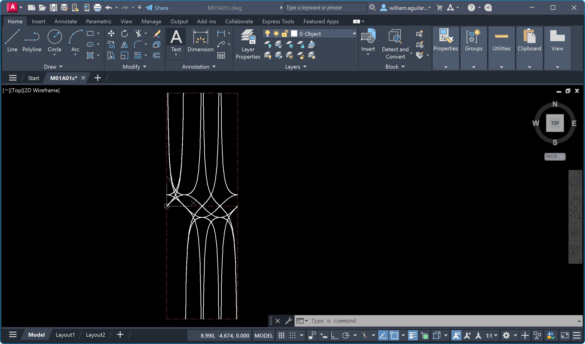

> Opcionalmente, con el comando _SPLINE_ puede suavizar las funciones discontínuas dibujadas con el comando _PLINE_. 

### Ejercicio M01A02cE06

Utilizando los conceptos aprendidos, dibuje las funciones trigonométricas en x de 0 a π (0 a 360 grados) con orígen en (0,0). Luego, encuentre la escala proporcional de ajuste para que la longitud horizontal de las funciones trazadas, sea igual a los últimos 3 dígitos de su código de alumno, y escale las funciones a este tamaño. Guarde el dibujo como _/file/cad/**M01A02cE06**.dwg_.

## Actividades de proyecto :triangular_ruler:

Utilizando la [plantilla suministrada](../../file/report/R.DAPC.PlantillaSoporteDesarrollo.docx), cree un documento soporte mostrando las actividades desarrolladas en el orden presentado en esta actividad, junto con los análisis y recomendaciones realizadas, convierta a Adobe Acrobat (.pdf) y guarde en la carpeta _/activity_ del repositorio de datos del proyecto; nombre el archivo con el código de la actividad agregando al final la fecha de control documental en formato aaaammdd (p. ej. M01A02c_20250531.pdf).

En la siguiente tabla se listan las actividades que deben ser desarrolladas y documentadas por cada estudiante o grupo de proyecto.

| Actividad | Alcance                                                                                                                                                                                                                                                                                                                                                                                                                                                                                                                                              |
|:----------|:-----------------------------------------------------------------------------------------------------------------------------------------------------------------------------------------------------------------------------------------------------------------------------------------------------------------------------------------------------------------------------------------------------------------------------------------------------------------------------------------------------------------------------------------------------|
| M01A02c    | Esta actividad no requiere del desarrollo de elementos en el avance del proyecto final, los contenidos son evaluados a partir de la entrega de los ejercicios definidos en la actividad.                                                                                                                                                                                                                                                                                                                                                             |
| M01A02c    | En una tabla y al final del informe de avance de esta entrega, indique el detalle de las actividades realizadas por cada integrante de su grupo; utilice las siguientes columnas: `Nombre del integrante`, `Actividades realizadas`, `Tiempo dedicado en horas` (si presenta la entrega individualmente, no es necesaria la presentación de esta tabla).  Para actividades que no requieren del desarrollo de elementos de avance, indicar si realizo la lectura de la guía de clase y las lecturas indicadas al inicio en los requerimientos. | 

> Nota 1: para la revisión del proyecto final, guarde los libros cálculo de Microsoft Excel y los archivos generados en esta actividad, en las localizaciones indicadas en cada numeral.
>
> Nota 2: una vez el instructor realice la revisión y el estudiante presente las correcciones o ajustes solicitados, será necesario cargar una nueva versión de los archivos en el repositorio del proyecto, incluyendo o actualizando al final del nombre del archivo, la fecha de presentación en formato aaaammdd y manteniendo las versiones anteriores presentadas.
>

## Referencias

* https://help.autodesk.com/view/ACD/2026/ESP
* https://help.autodesk.com/view/ACD/2026/ENU/
* https://www.fisimat.com.mx/ecuacion-de-la-elipse-con-centro-en-el-origen/
* https://www.fisimat.com.mx/ecuacion-de-la-elipse-con-centro-fuera-del-origen/
* [Cursos de matemáticas / Elipse en Excel](https://www.youtube.com/watch?v=F3Sb0qiDGwc&t=353s)
* [Dibujo Técnico Bachillerato con Autocad - Carlos Ansaldo / Óvalos y Ovoides](https://www.youtube.com/watch?v=rX2V3LmIceo)
* [Dibujo Técnico Bachillerato con Autocad - Carlos Ansaldo / Hiperbola](https://www.youtube.com/watch?v=oS0EKDzEa2A)
* [Ingeniería Civil y Geología / Curvas cicloidales en AutoCAD](https://www.youtube.com/watch?v=Qt2MNsmVUM0)
* [Wikipedia / Ovoide](https://es.wikipedia.org/wiki/Ovoide)
* [Draw parabola in AutoCAD](https://www.youtube.com/watch?v=h8pjymm-A5I)
* [Portal académico / Tiro parabólico](https://e1.portalacademico.cch.unam.mx/alumno/matematicas2/unidad1/ecuacionescuadraticas/tiroparabolico)
* [Autodesk / How to draw parabolas](https://www.autodesk.com/es/support/technical/article/caas/sfdcarticles/sfdcarticles/ESP/How-to-draw-parabolas-in-AutoCAD.html)

## Control de versiones

| Versión    | Descripción        | Autor                                      | Horas |
|------------|:-------------------|--------------------------------------------|:-----:|
| 2025.07.01 | Versión inicial.   | [rcfdtools](https://github.com/rcfdtools)  |  20   |

##

_R.DAPC es de uso libre para fines académicos, conoce nuestra licencia, cláusulas, condiciones de uso y como referenciar los contenidos publicados en este repositorio, dando [clic aquí](../../LICENSE.md)._

_¡Encontraste útil este repositorio!, apoya su difusión marcando este repositorio con una ⭐ o síguenos dando clic en el botón Follow de [rcfdtools](https://github.com/rcfdtools) en GitHub._

| [:arrow_backward: Anterior](../M01A02b/Readme.md) | [:house: Inicio](../../README.md) | [:beginner: Ayuda / Colabora](https://github.com/rcfdtools/R.DAPC/discussions/99999) | [Siguiente :arrow_forward:](../M01A03/Readme.md) |
|---------------------------------------------------|-----------------------------------|--------------------------------------------------------------------------------------|--------------------------------------------------|

[^1]: https://es.wikipedia.org/wiki/%C3%93valo
[^2]: https://es.wikipedia.org/wiki/Ovoide
[^3]: https://es.wikipedia.org/wiki/Par%C3%A1bola_(matem%C3%A1tica)
[^4]: https://www.fisimat.com.mx/ecuacion-de-la-hiperbola-con-centro-en-el-origen/
[^5]: https://es.wikipedia.org/wiki/Funci%C3%B3n_trigonom%C3%A9trica
