# 1.2.d. Dibujo en 3D
Keywords: `extrude`  `m01a2d`

Creación de dibujos y sólidos tridimensionales.

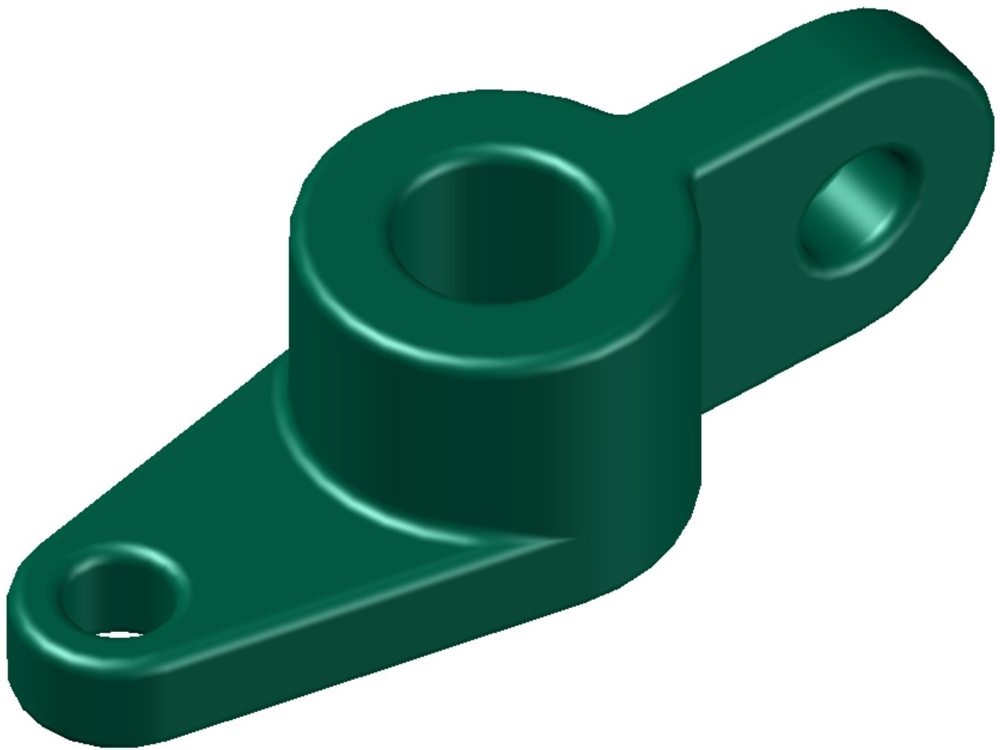

## Objetivos

Al finalizar esta actividad, el estudiante:

* 

## Requerimientos

Archivos, actividades previas, lecturas y herramientas requeridas para el desarrollo de esta actividad:

| Requerimiento                                                                                                              | Descripción                                                                                                                      |
|:---------------------------------------------------------------------------------------------------------------------------|:---------------------------------------------------------------------------------------------------------------------------------|
| [:toolbox:Herramienta](https://www.autodesk.com/products/autocad)                                                          | Autodesk Autocad 3D 2026 o superior.                                                                                             |
| [:toolbox:Herramienta](https://help.autodesk.com/view/INVNTOR/2026/ENU/?guid=GUID-AE780841-1B8B-4197-86F6-5632BA541F32)    | Autodesk Inventor Interoperability 2026 o superior.                                                                                                  |
| [:toolbox:Herramienta](https://www.microsoft.com/es/microsoft-365/excel?market=bz)                                         | Microsoft Excel 365.                                                                                                             |

> Para los diferentes avances de proyecto, es necesario guardar y publicar las diferentes versiones generadas del (los) libro (s) de Microsoft Excel, reportes o informes y dibujos generados, agregando al final la fecha de control documental en formato aaaammdd, p. ej., _M01A01_20250710.dwg_.

## 0. Configuración preliminar 

Antes de iniciar a crear elementos 3D a partir de elementos 2D, es recomendable configurar la eliminación de objetos fuente de referencia, el comando **[DELOBJ](https://help.autodesk.com/view/ACD/2025/ENU/?guid=GUID-CB64587F-611E-441E-AB07-14B415BF535F)** permite establecer diferentes comportamientos de esta variable de sistema, p. ej.:

* 3: elimina el objeto inicial luego de la extrusión.
* 0: se mantiene el objeto original.
* -1: AutoCAD solicita si se elimina o no el objeto original.

Para el dibujo 3D en AutoCAD, es necesario activar los siguientes asistentes de dibujo:

* 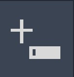 Dynamic Input, <kbd>F12</kbd>, **DYNMODE**.
*  Polar Tracking, <kbd>F10</kbd> p. ej., para ángulos de 30 grados.
*  Object Snap Tracking, <kbd>F11</kbd>, **AUTOSNAP**.
*  2D Object Snap, <kbd>F3</kbd>, **OSNAP** para Endpoint, Midpoint, Center, Quadrant, Intersection y Tangent.
*  3D Object Snap, <kbd>F4</kbd>, **3DOSNAP** para Vertex, Midpoint on edge, Center of face y Perpendicular.
*  Workspace Switching, **WSCURRENT**, seleccionar el espacio de trabajo correspondiente a 3D Modeling.

## 1. Modelado de geometrías básicas

De forma nativa, desde el menú _Home / Modeling_, AutoCAD permite la construcción de las siguientes formas geométricas básicas:

* Box: forma cúbica o poliedro.
* Cylinder: cilindro.
* Cone: cono.
* Sphere: esfera.
* Pyramid: pirámide.
* Wedge: cuña triangular.
* Torus: toroide o donut.

Complementariamente, desde la pestaña Modeling, podrá crear superficies o sólidos a partir de elementos geométricos 2D o formas creadas a partir de objetos, utilizando las siguientes herramientas:

* Extrude: extrusión lineal, angulada, inclinada.
* Loft: sólido o superficie a partir de múltiples objetos.
* Revolve: revolución a partir de un objeto y un eje de rotación. Objetos en el mismo plano.
* Sweep: barrido a partir de un objeto y un alineamiento. Objetos en planos diferentes.
* Polisolid: paredes sólidas a partir de líneas con espesor y ancho definidos.
* Prespull: extrusión de caras a partir de objetos cerrados, extensión de objetos ya extruidos o sustracción sobre un sólido ya creado.

### Ejercicio M01A02dE01

Construya el sólido mostrado en la figura, calcule el volúmen, área superficial, masa de cada elemento y el volúmen y masa final del sólido integrado si su material es titanio.

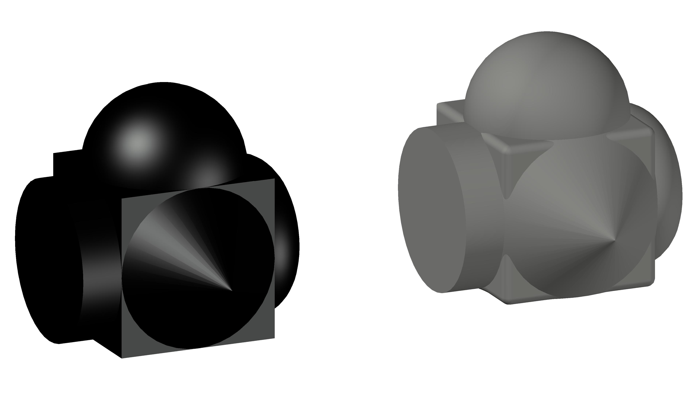

1. Abra el archivo _/file/cad/M01A02a.dwg_ creado previamente que contiene los Layers del curso DAPC y las configuraciones de unidades y visualización, guarde como _/file/cad/M01A02dE01.dwg_ y establezca por defecto la capa _0_.
 
2. En la esquina superior izquierda del espacio de dibujo, seleccione la vista superior o _Top_ y luego la vista isométrica SE. Podrá observar que en la esquina superior derecha del espacio de dibujo, se muestra una representación de un cubo en el que la cara superior corresponde a la vista TOP, abajo a la derecha la cara RIGHT y abajo a la izquierda la cara FRONT. Cree en la coordenada absoluta (50,50), un cubo o caja de +100 unidades en todas las aristas alejándose positivamente del origen absoluto (0,0,0). En _Home / View_, establezca la vista _Conceptual_.

> Tenga en cuenta que AutoCAD, ajusta o rota el sistema de coordenadas dependiendo de la cara y la vista isométrica seleccionada, para lo cual, los elementos serán dibujados en el plano xy de la cara seleccionada.

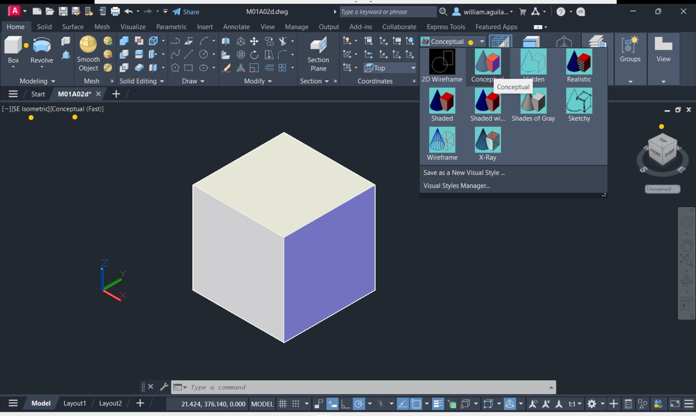

3. Dibujemos ahora un cilindro en la cara frontal del cubo creado. Para ello, primero debemos seleccionar la vista frontal y luego la vista isométrica SE (south-east). Observará que el plano XY ahora se alinea con la cara frontal y que el eje Z se dirige hacia el sentido contrario. Con la herramienta _Cylinder_, dibuje un cilindro en el centro de la cara frontal con radio 50 y altura de 25 unidades.

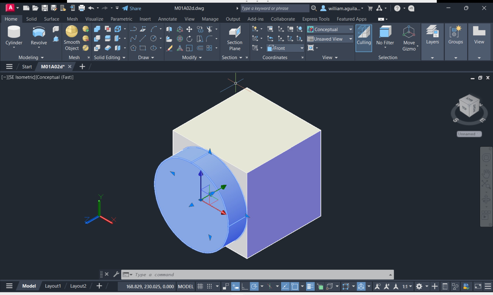

4. Utilizando la misma vista, dibuje un cono de 50 unidades de altura con radio de 50 unidades.

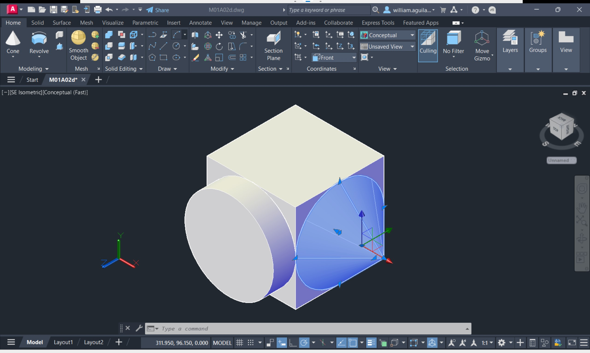

5. En la cara superior, dibuje una espera con radio de 50 unidades. Cambie a la vista _X-Ray_, podrá observar que media esfera se encuentra embebida dentro del cubo.

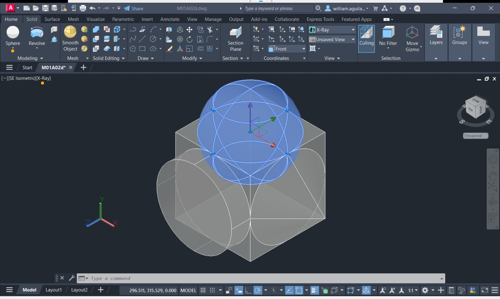

5. Seleccione ahora la vista izquierda o Left y luego la vista isométrica SW (south-west). Dibuje una pirámide en esta cara con altura de 75 unidades.

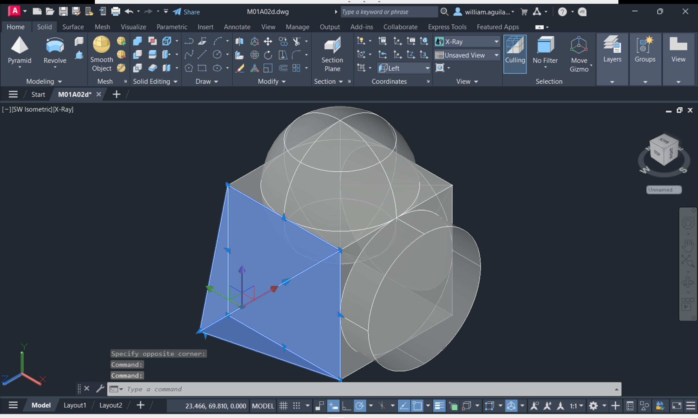

6. Seleccione ahora la vista posterior o Back y luego la vista isométrica NW (north-west). Dibuje un toroide con radio 25 y espesor de 25 unidades.

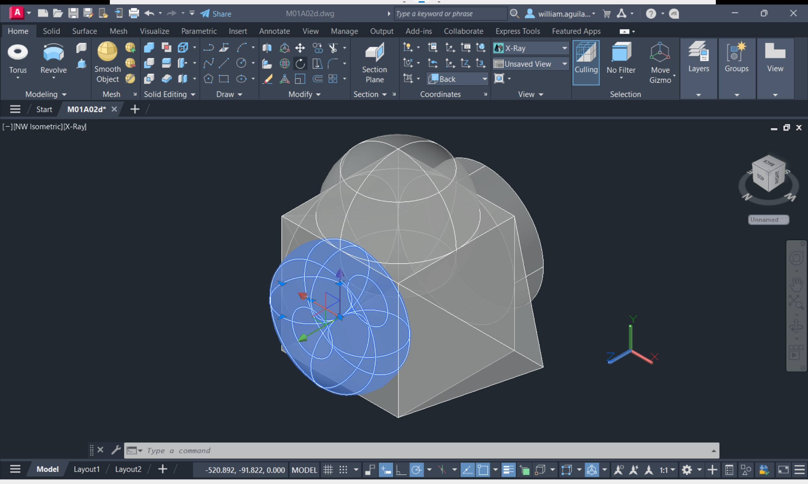

7. Cambie la representación a _Realistic_ y utilizando la tecla <kbd>ctrl</kbd> + rueda del mouse presionada, rote la vista para que pueda visualizar todo el sólido. Tenga en cuenta que todos los elementos creados son independientes.

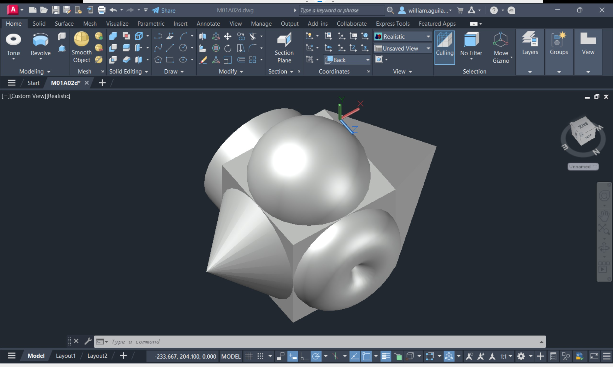

8. Seleccione ahora la vista TOP y luego la vista isométrica SE. Seleccione todos los objetos y cree una copia o **COPY** a 250 unidades en el sentido del eje Y. Utilice como punto de desplazamiento el centroide de la esfera y active el desplazamiento ortogonal con la tecla **F8**.

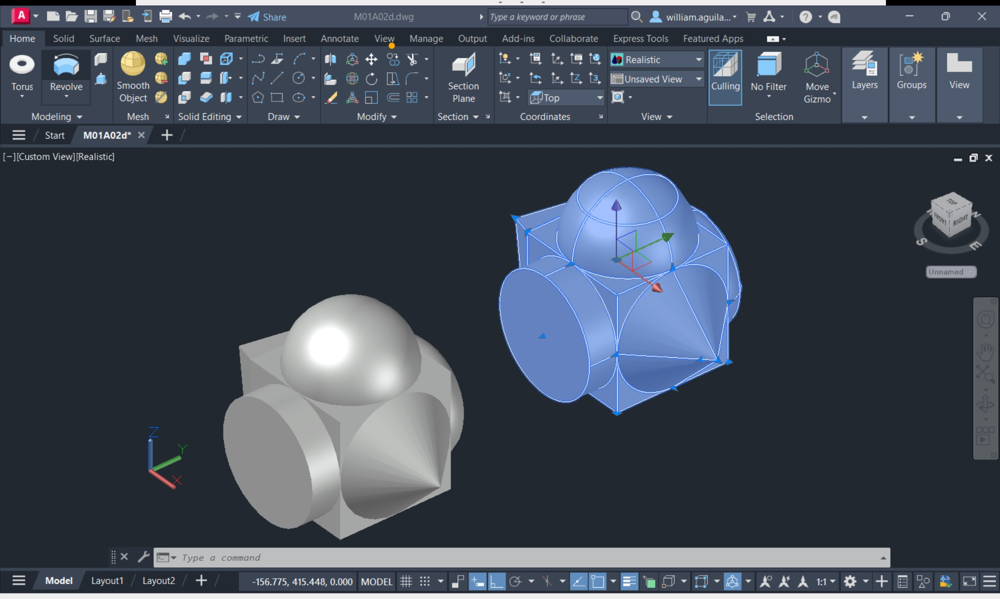

9. Desde el menú _Home / Solid Editing_, ejecute la herramienta _Solid Union_ seleccionando todos los objetos de la copia, así integrará todos los elementos en un único sólido. Active la visualización X-Ray, observará que al seleccionar el elemento ya no existen sólidos separados y que no está duplicado el volúmen de la semiesfera que estaba embebida en el cubo.

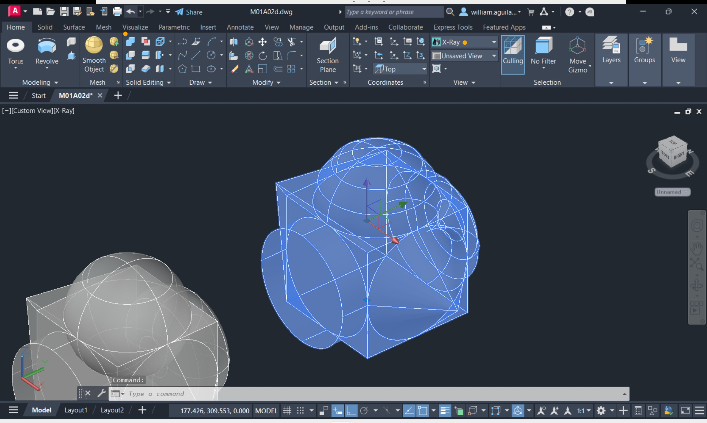

10. Calculemos ahora el volúmen total de cada elemento y del sólido inteegrado, para ello, en el _Command_, ejecute el comando **MASSPROP**. Observará que el volúmen del elemento es de 1993261.191 unidades cúbicas y que el objeto está inscrito dentro de un cubo perimetral o Bounding Box de:

* X: -25.000  --  200.000 
* Y: 275.000  --  425.000 
* Z: 0.000  --  150.000 

Para los elementos dibujados, cree un libro en Excel que permita calcular el volúmen, área superficial que envuelve cada elemento y masa utilizando como material titanio.

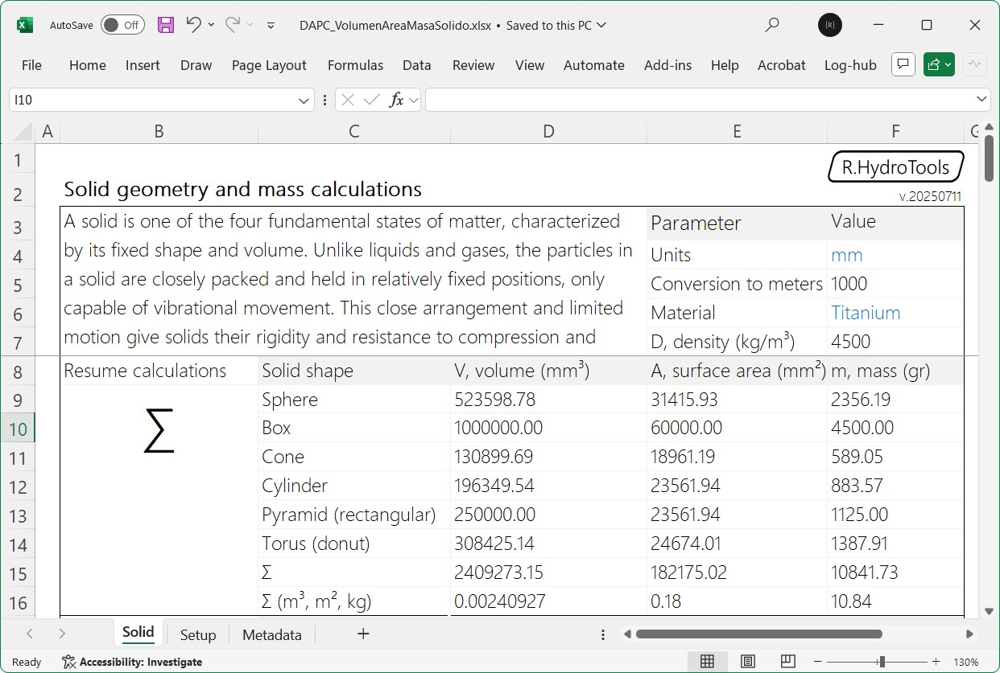

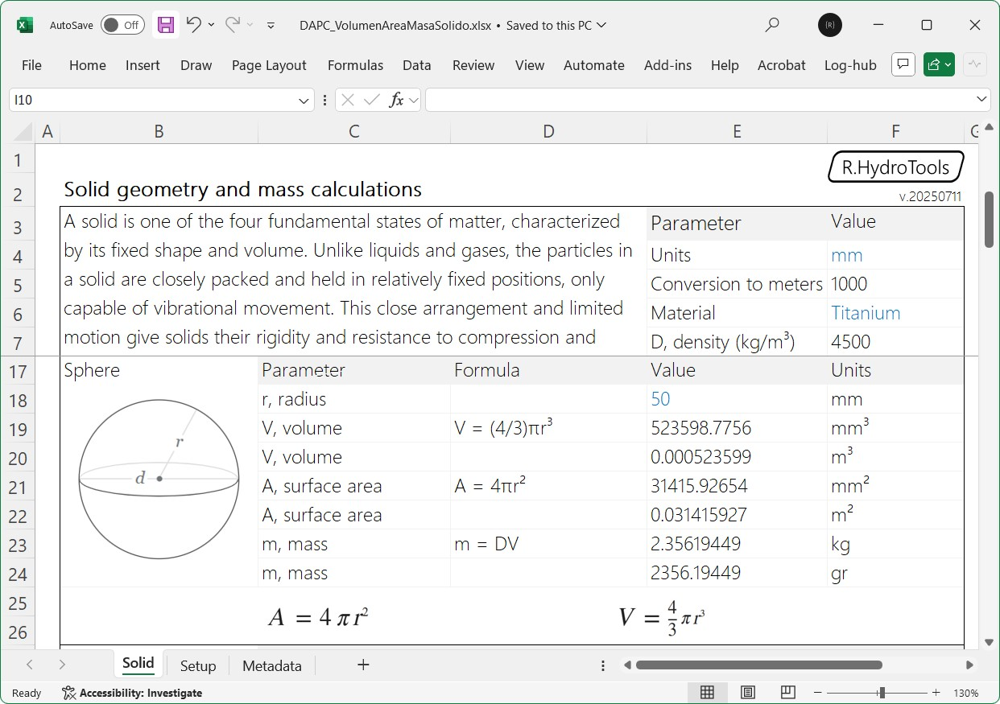

11. Suavicemos ahora las arístas anguladas del objeto creado. Primero cree una copia del objeto integrado y luego en el menú _Home / Solid / Solid Editing_, seleccione la herramienta _Fillet Edge_, defina un radio de suavizado en 5 unidades y suavice todas las aristas del cubo inicial.

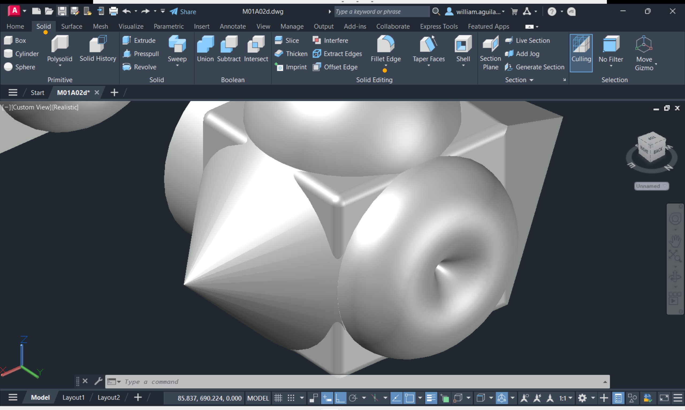

12. Designemos ahora acero o Steel como material del objeto. Desde el menú _Visualize / Materials_, aplique el material requerido arrastrando el material hacia el objeto.

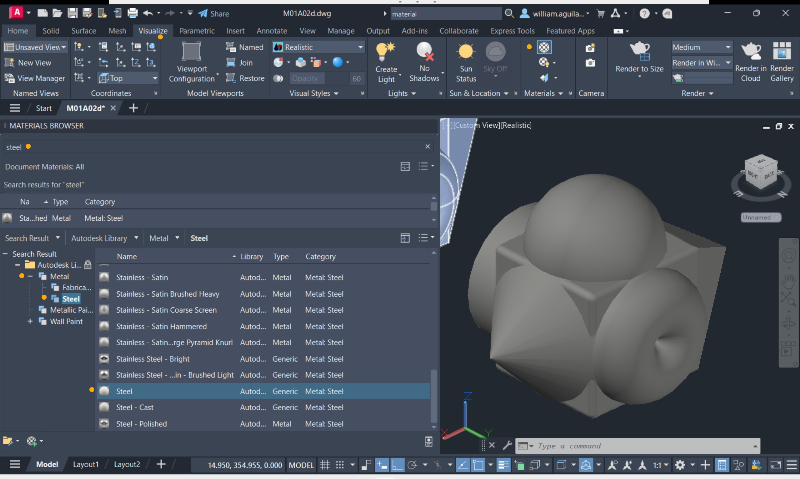

## 2. Solid Editing / Extrude (extrusión)

En AutoCAD, la extrusión es el proceso de convertir objetos 2D en objetos 3D al alargarlos o extruirlos en una dirección específica. Básicamente, se toma una forma plana y se le da profundidad, creando un sólido o una superficie 3D. La extrusión es una herramienta fundamental para transformar dibujos planos en modelos tridimensionales. Dependiendo de si el objeto 2D es cerrado o abierto, la extrusión puede crear un sólido (si el objeto es cerrado, como un círculo o un cuadrado) o una superficie (si el objeto es abierto, como una línea o un arco). La extrusión puede realizarse de manera ortogonal al plano del objeto original o en una dirección específica definida por el usuario. También puede realizarse a lo largo de una trayectoria definida. Además de la dirección, se puede especificar un ángulo de inclinación para la extrusión, lo que permite crear objetos con forma de cono o pirámide. El comando principal para realizar la extrusión en AutoCAD es **EXTRUDE**. 

Para convertir objetos 2D en objetos 3D, podémos utilizar como insumos:

* Líneas: crea una superficie independiente para cada línea fuente.
* Polígonos: crea un sólido.
* Poli-líneas abiertas: crea una superficie contínua sobre toda la línea.
* Poli-líneas cerradas: crea un sólido

> Tenga en cuenta que el comando **EXTRUDE** crea una superficie o un volúmen dependiente del objeto seleccionado, sin embargo, desde el command podrá seleccionar **MO**do y definir si va a crear únicamente superficies.

Otras opciones específicas de este comando, permiten definir:

* Taper angle: ángulo de inclinación con respecto al objeto, valores positivos crean elementos hacia adentro, valores negativos hacia afuera.
* Path: por trayectoria, para lo cual es necesario que los dos objetos no estén en el mismo plano.
* Direction: extrusión con inclinación.
* Expression: en función de parámetros definidos sobre un objeto.

> Opcionalmente, podrá extruir las caras de un sólido, para ello se selecciona primero el sólido, luego con la tecla <kbd>ctrl</kbd> se selecciona la cara o caras a extruir.

### Ejercicio M01A02dE02

A partir de la figura dibujada en el ejercicio [M01A01E01](../M01A01), cree un sólido y calcule su área superficial, volumen y masa. 

Especificaciones:

* Archivo: _/file/cad/M01A02dE02.dwg_.
* Profundidad: +25 unidades.
* Material: acero.
* Plano de referencia: right.

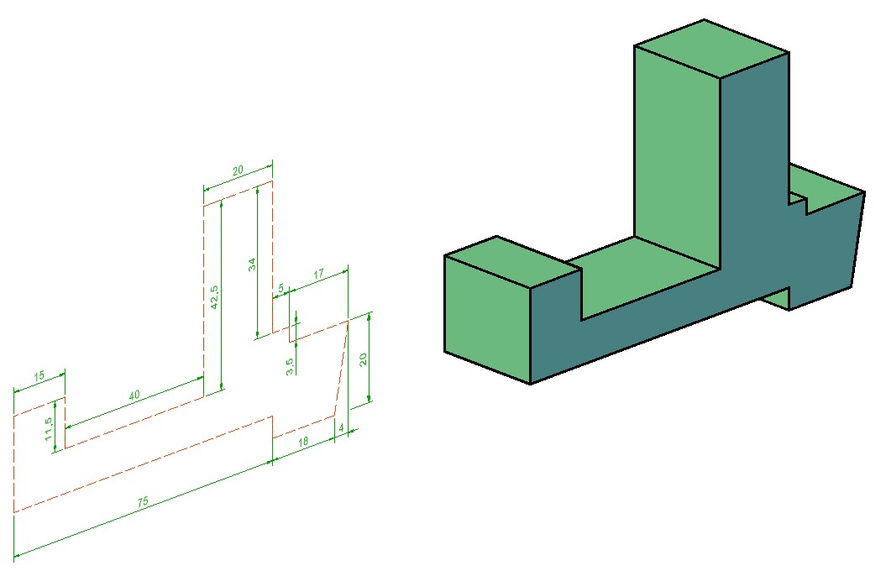

### Ejercicio M01A02dE03

A partir de la figura ejemplo presentada en el numeral 6 de la actividad [M01A01](../M01A01), cree un sólido y calcule su área superficial, volumen y masa. 

Especificaciones:

* Archivo: _/file/cad/M01A02dE03.dwg_.
* Profundidad: +25 unidades.
* Material: concreto.
* Plano de referencia: front.

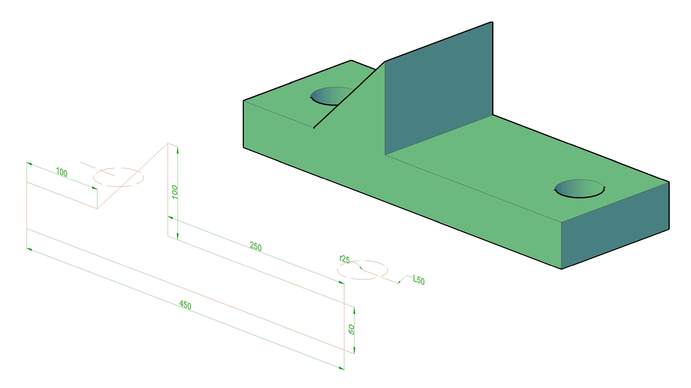

## 3. Solid Editing / SHELL (vaciar)

Permite convertir un sólido en un objeto hueco. Puede ser ejecutado a través del comando **SOLIDEDIT** / **B**ody / **S**hell, o desde _Home / Solid Editing / Shell_, es necesario indicar las caras a remover y el espesor de las paredes (valores positivos generan espesores hacia adentro del sólido, valores negativos hacia afuera).

## Actividades de proyecto :triangular_ruler:

Utilizando la [plantilla suministrada](../../file/report/R.DAPC.PlantillaSoporteDesarrollo.docx), cree un documento soporte mostrando las actividades desarrolladas en el orden presentado en esta actividad, junto con los análisis y recomendaciones realizadas, convierta a Adobe Acrobat (.pdf) y guarde en la carpeta _/activity_ del repositorio de datos del proyecto; nombre el archivo con el código de la actividad agregando al final la fecha de control documental en formato aaaammdd (p. ej. M01A00_20250531.pdf).

En la siguiente tabla se listan las actividades que deben ser desarrolladas y documentadas por cada estudiante o grupo de proyecto.

| Actividad | Alcance                                                                                                                                                                                                                                                                                                                                                                                                                                                                                                                                              |
|:----------|:-----------------------------------------------------------------------------------------------------------------------------------------------------------------------------------------------------------------------------------------------------------------------------------------------------------------------------------------------------------------------------------------------------------------------------------------------------------------------------------------------------------------------------------------------------|
| M01A00    | Esta actividad no requiere del desarrollo de elementos en el avance del proyecto final, los contenidos son evaluados a partir de la entrega de los ejercicios definidos en la actividad.                                                                                                                                                                                                                                                                                                                                                             |
| M01A00    | En una tabla y al final del informe de avance de esta entrega, indique el detalle de las actividades realizadas por cada integrante de su grupo; utilice las siguientes columnas: `Nombre del integrante`, `Actividades realizadas`, `Tiempo dedicado en horas` (si presenta la entrega individualmente, no es necesaria la presentación de esta tabla).  Para actividades que no requieren del desarrollo de elementos de avance, indicar si realizo la lectura de la guía de clase y las lecturas indicadas al inicio en los requerimientos. | 

> Nota 1: para la revisión del proyecto final, guarde los libros cálculo de Microsoft Excel y los archivos generados en esta actividad, en las localizaciones indicadas en cada numeral.
>
> Nota 2: una vez el instructor realice la revisión y el estudiante presente las correcciones o ajustes solicitados, será necesario cargar una nueva versión de los archivos en el repositorio del proyecto, incluyendo o actualizando al final del nombre del archivo, la fecha de presentación en formato aaaammdd y manteniendo las versiones anteriores presentadas.
>

## Referencias

* https://help.autodesk.com/view/ACD/2026/ESP
* https://help.autodesk.com/view/ACD/2026/ENU/
* [AutoCAD para todos / Comando EXTRUDE y objetos paramétricos](https://www.youtube.com/watch?v=6h1mgMekpBw&)
* [AutoCAD para todos / Creación de vistas base y proyectada con AutoCAD](https://www.youtube.com/watch?v=ToCCqdeTCz8)

## Control de versiones

| Versión    | Descripción        | Autor                                      | Horas |
|------------|:-------------------|--------------------------------------------|:-----:|
| 2025.06.22 | Versión inicial.   | [rcfdtools](https://github.com/rcfdtools)  |  16   |

##

_R.DAPC es de uso libre para fines académicos, conoce nuestra licencia, cláusulas, condiciones de uso y como referenciar los contenidos publicados en este repositorio, dando [clic aquí](../../LICENSE.md)._

_¡Encontraste útil este repositorio!, apoya su difusión marcando este repositorio con una ⭐ o síguenos dando clic en el botón Follow de [rcfdtools](https://github.com/rcfdtools) en GitHub._

| [:arrow_backward: Anterior](../M01A02c/Readme.md) | [:house: Inicio](../../README.md) | [:beginner: Ayuda / Colabora](https://github.com/rcfdtools/R.DAPC/discussions/99999) | [Siguiente :arrow_forward:](../M01A03/Readme.md) |
|---------------------------------------------------|-----------------------------------|--------------------------------------------------------------------------------------|--------------------------------------------------|

[^1]: 