# 1.3. Bloques - Achurados- Viewports
Keywords: `realigment`  `m01a00`

Diseño de bloques. Achurados. Sombra. Figuras rellenas. Mosaico de vistas. Vistas fijas - espacio modelo. Vistas flotantes - espacio papel. Comandos BLOCK, HATCH, SOLIDS, VPORTS, MVIEW, PSPACE, VPLAYER.

 Tomado de: <a href="Public Domain, https://commons.wikimedia.org/w/index.php?curid=479365">https://commons.wikimedia.org</a>  

## Objetivos

Al finalizar esta actividad, el estudiante:

* Realiza ejercicios prácticos en los que crea, usa y fragmenta bloques de dibujo, usando achurados en AutoCAD.
* Conoce los símbolos eléctricos del Reglamento Técnico de Instalaciones Eléctricas - RETIE del Ministerio de Minas y Energía de Colombia. 
* Crea mosaicos de vistas fijas y flotantes en el espacio modelo de CAD.
* Aplica adecuadamente las escalas a los dibujos realizados en CAD.

## Requerimientos

Archivos, actividades previas, lecturas y herramientas requeridas para el desarrollo de esta actividad:

| Requerimiento                                                                                           | Descripción                                                                                                                      |
|:--------------------------------------------------------------------------------------------------------|:---------------------------------------------------------------------------------------------------------------------------------|
| [:toolbox:Herramienta](https://www.autodesk.com/products/autocad)                                       | Autodesk Autocad 3D 2026 o superior.                                                                                             |

> Para los diferentes avances de proyecto, es necesario guardar y publicar las diferentes versiones generadas del (los) libro (s) de Microsoft Excel y reportes o informes, agregando al final la fecha de control documental en formato aaaammdd, p. ej. _R.HydroTools.DisenoCaucesParametros.20250528.xlsx_.

## 1. Creación de bloques estáticos

En AutoCAD, los bloques son objetos compuestos por uno o más objetos que se combinan para formar un solo objeto reutilizable. Son útiles para crear elementos repetitivos en un dibujo, como símbolos, piezas, vistas de detalle o cuadros de rotulación, permitiendo ahorrar tiempo y mantener la coherencia. 

Características de un bloque

| Característica          | Alcance                                                                                                                              |
|:------------------------|:-------------------------------------------------------------------------------------------------------------------------------------|
| Agrupa objetos          | Los bloques permiten combinar múltiples objetos (líneas, círculos, texto, etc.) en un solo objeto, facilitando su manejo y edición.  |
| Reutilización           | Una vez creado, un bloque se puede insertar varias veces en el mismo dibujo o en diferentes dibujos.                                 |
| Ahorro de espacio       | Al reutilizar bloques en lugar de crear objetos individuales, se reduce el tamaño del archivo del dibujo.                            |
| Consistencia            | Los bloques garantizan que las copias de un mismo elemento sean idénticas, manteniendo la uniformidad en el diseño.                  |
| Edición centralizada    | Si se modifica la definición de un bloque, todas las referencias a ese bloque se actualizan automáticamente.                         |

> A los bloques insertados se les conoce como instancias del bloque original.

Especificaciones

* Crear los elementos que conforman el bloque en la capa cero (0).
* Desde **UNITS**, definir la escala de creación, p. ej., en milímetros (luego al ser insertado el elemento se establece automáticamente el factor de conversión de escala a las unidades del dibujo principal, p. ej., si el bloque corresponde a una toma eléctrica de 14 x 8 milímetros, la escala de inserción en un dibujo arquitectónico dibujado en metros será de 1m / 1000mm = 0.001).

Para esta actividad, dibujaremos el bloque de símbolo eléctrico definido en el numeral 1.3.3.2. Símbolo de riesgo eléctrico y los símbolos establecidos en el _Artículo 1.3.4. Símbolos eléctricos_ del Reglamento Técnico de Instalaciones Eléctricas - RETIE del Ministerio de Minas y Energía de Colombia.

> Son de obligatoria aplicación los símbolos gráficos contemplados en la Tabla 1.3.4.a del RETIE, tomados de las normas unificadas IEC 60617, ANSI Y32, CSA Z99 e IEEE 315, los cuales guardan mayor relación con la seguridad eléctrica. Cuando se requieran otros símbolos, se podrá acudir a los contemplados en las normas precitadas.

Proporciones en las dimensiones del símbolo de riesgo eléctrico 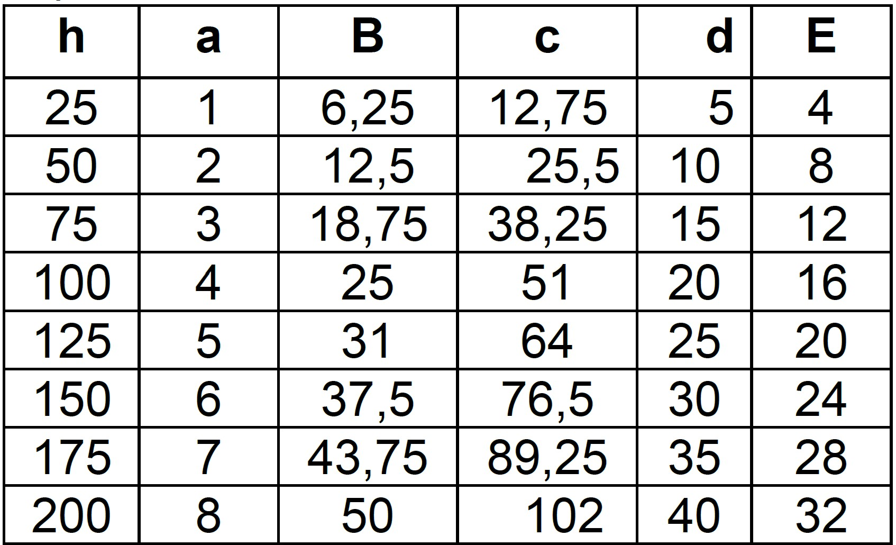

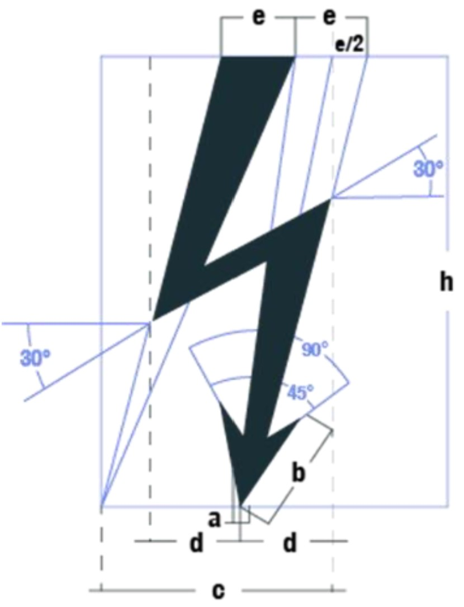 Tomado de: Artículo 1.3.3.2. Símbolo de riesgo eléctrico del Reglamento Técnico de Instalaciones Eléctricas - RETIE - Colombia  

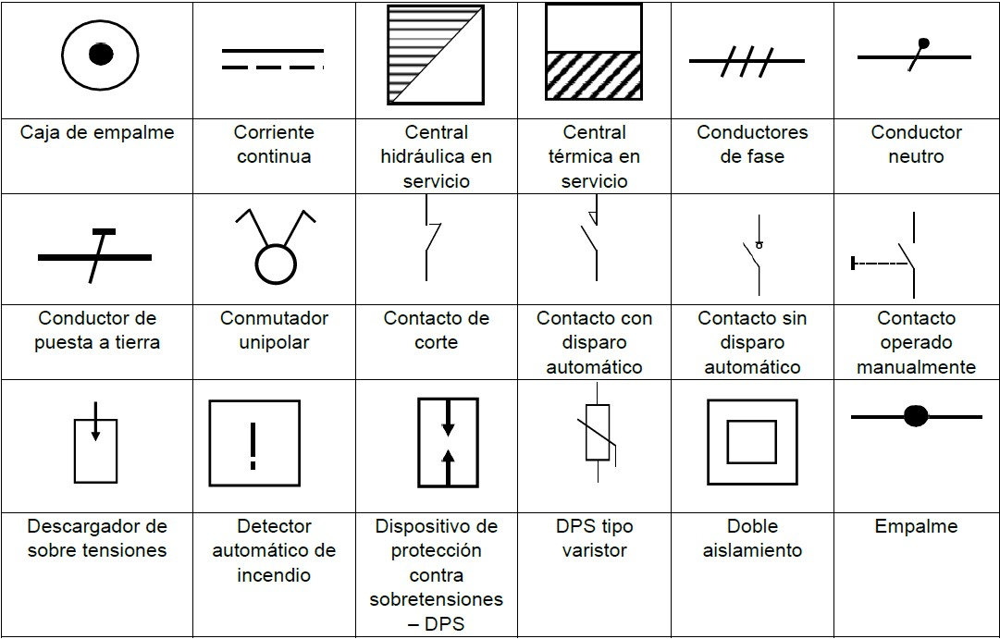

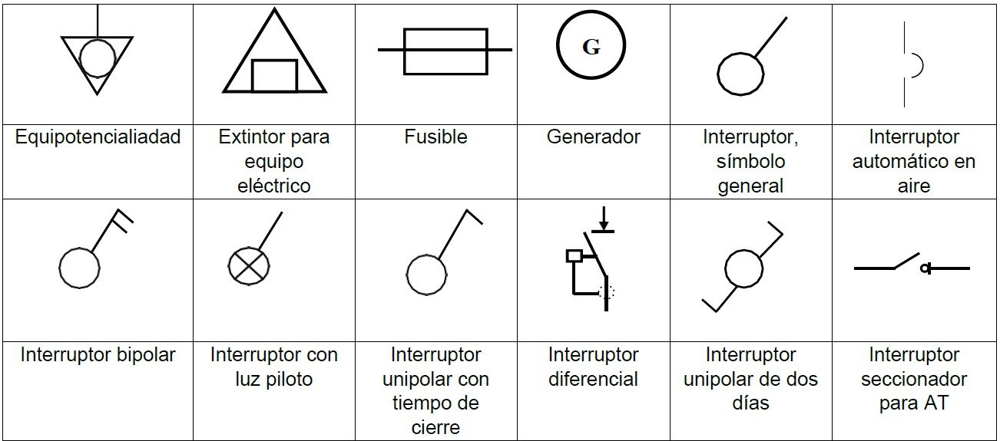

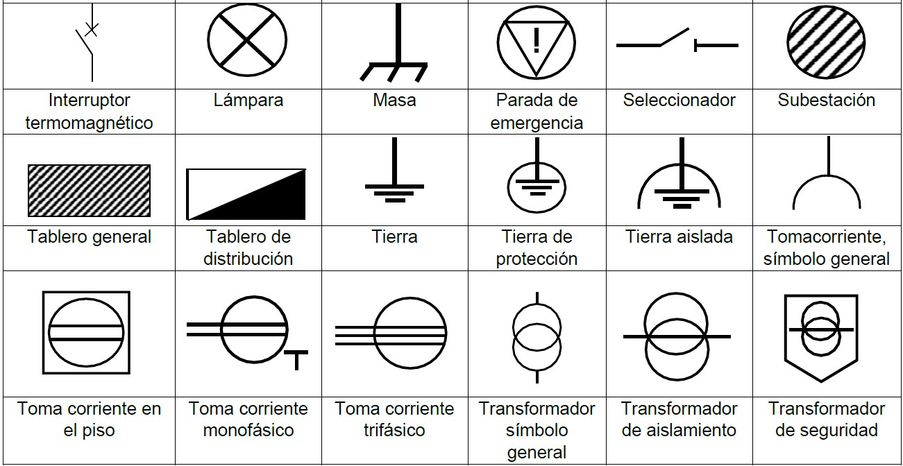 Tomado de: Artículo 1.3.4. Símbolos eléctricos del Reglamento Técnico de Instalaciones Eléctricas - RETIE - Colombia  

### Ejercicio M01A03E01

Cree el símbolo de riesgo eléctrico, utilizando las dimensiones proporcionales para h=200.

1. En AutoCAD, cree una copia del archivo [/file/cad/M01A02a.dwg](../../file/cad/M01A02a.dwg) que contiene los nombres de capas definidos para el curso DAPC, guarde como /file/cad/M01A03.dwg y verifique con _UNITS_ que las unidades de inserción son milímetros.

 Primero, cree líneas esquemáticas tomando como referencia un rectángulo de c+(e/2) = 102+16 = 118 horizontal por h = 200 de alto, luego trace líneas paralelas y las líneas diagonales. Al finalizar, con el comando **COPY** o **CP**, genere una copia de la figura principal y mueva a la capa cero (0), luego una todas las líneas con el comando **JOIN** y con el comando **HATCH**, genere un relleno sólido en la misma capa (utilice para ello las opciones desplegadas en la cinta de opciones _Hatch Creation_).

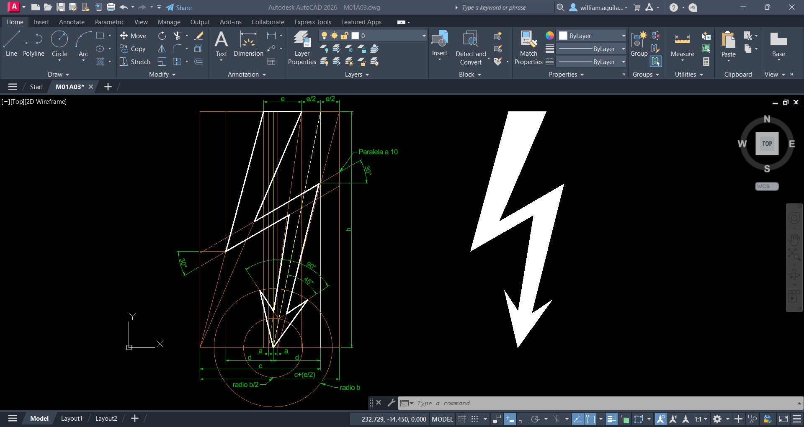

2. Desde el _Command_, ejecute el comando **BLOCK** o desde el menú _Home / Block_, de clic en el botón de creación de bloques. Aparecerá la ventana _Block Definition_, defina como nombre _RETIE - Riesgo eléctrico_, defina como punto base el punto inferior del símbolo de riesgo eléctrico, seleccione los objetos que componen el símbolo que se encuentran en la capa cero (0) y defina las unidades de bloque en _Milimeters_.

> En descripción puede agregar: _Reglamento Técnico de Instalaciones Eléctricas (Resolución 40117 de 2024) - RETIE del Ministerio de Minas y Energía de Colombia_.

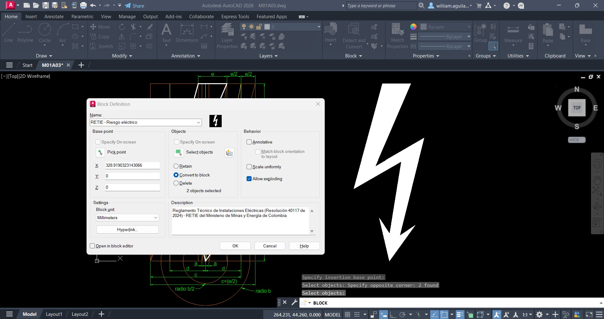

3. Para insertar el bloque, en el menú _Home / Block / Insert_, seleccione el bloque creado y defina el punto de inserción en cualquier parte del dibujo. Inserte varias veces el bloque en diferentes localizaciones, diferentes escalas y diferentes rotaciones.

> En el _Command_ podrá observar que se puede cambiar el punto base, la escala, la rotación, explotar el bloque o repetir su inserción.

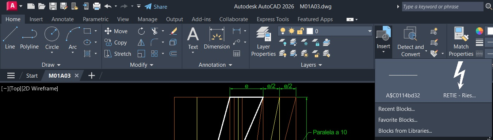

> Las diferentes instancias del bloque puede ser eliminadas y el bloque original permanecerá asociado internamente al archivo de AutoCAD.

4. Con el comando **INSERT**, repita el procedimiento de inserción del bloque creado, arrastrando desde el panel el elemento al dibujo. En la ventana de inserción podrá establecer las opciones relacionadas con el bloque, tales como su punto de inserción, escala y demás.

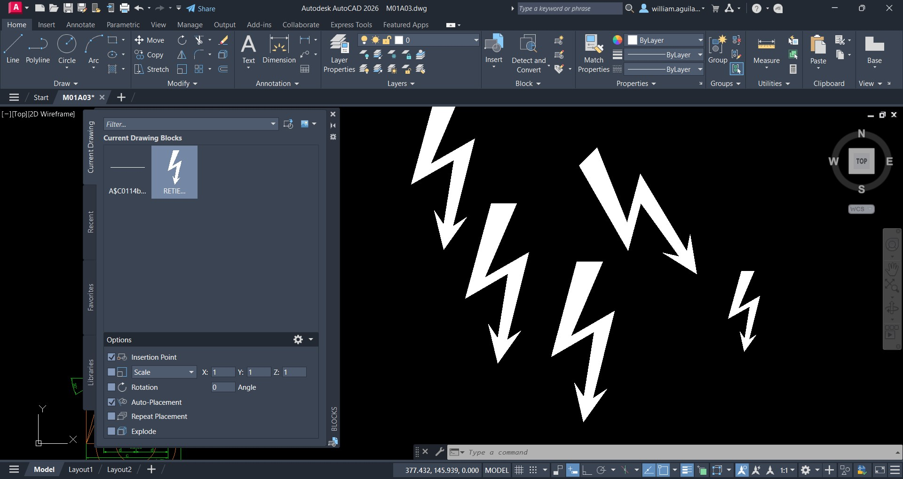

5. Para modificar el bloque creado, p. ej., cambiando el color del relleno por gris y el grosor de contorno por 0.3, seleccione uno de los bloques insertados y con el menú contextual (clic derecho), seleccione la opción _Block Editor_. Una vez terminada la edición, en el menú _Block Editor_, seleccione la opción _Close Block Edit_ que se encuentra a la derecha. 

> Esta acción de modificación también puede ser realizada desde _Home / Block / Block Editor_.

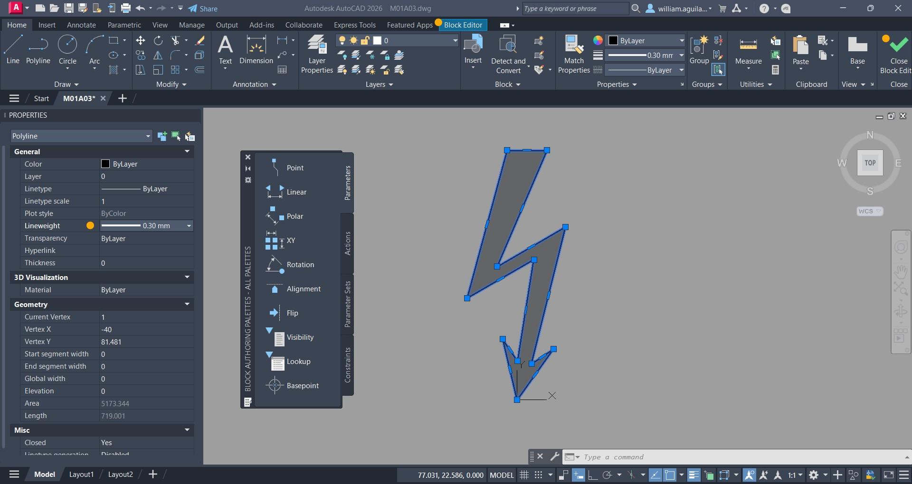

Una vez terminada la modificación podrá observar que todas las instancias del objeto han sido actualizadas.

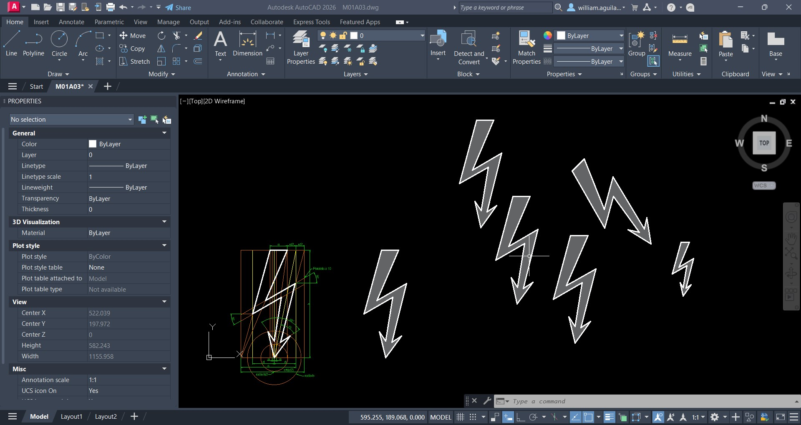

Para insertar bloques desde archivos externos se puede utilizar el comando **ADC** o Autodesk Design Center. 

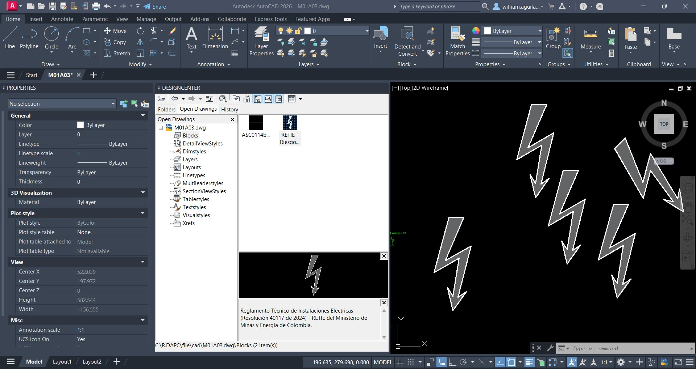

## 2. Creación de bloques dinámicos

## Actividades de proyecto :triangular_ruler:

Utilizando la [plantilla suministrada](../../file/report/R.DAPC.PlantillaSoporteDesarrollo.docx), cree un documento soporte mostrando las actividades desarrolladas en el orden presentado en esta actividad, junto con los análisis y recomendaciones realizadas, convierta a Adobe Acrobat (.pdf) y guarde en la carpeta _/activity_ del repositorio de datos del proyecto; nombre el archivo con el código de la actividad agregando al final la fecha de control documental en formato aaaammdd (p. ej. M01A00_20250531.pdf).

En la siguiente tabla se listan las actividades que deben ser desarrolladas y documentadas por cada estudiante o grupo de proyecto.

| Actividad | Alcance                                                                                                                                                                                                                                                                                                                                                                                                                                                                                                                                              |
|:----------|:-----------------------------------------------------------------------------------------------------------------------------------------------------------------------------------------------------------------------------------------------------------------------------------------------------------------------------------------------------------------------------------------------------------------------------------------------------------------------------------------------------------------------------------------------------|
| M01A00    | Esta actividad no requiere del desarrollo de elementos en el avance del proyecto final, los contenidos son evaluados a partir de la entrega de los ejercicios definidos en la actividad.                                                                                                                                                                                                                                                                                                                                                             |
| M01A00    | En una tabla y al final del informe de avance de esta entrega, indique el detalle de las actividades realizadas por cada integrante de su grupo; utilice las siguientes columnas: `Nombre del integrante`, `Actividades realizadas`, `Tiempo dedicado en horas` (si presenta la entrega individualmente, no es necesaria la presentación de esta tabla).  Para actividades que no requieren del desarrollo de elementos de avance, indicar si realizo la lectura de la guía de clase y las lecturas indicadas al inicio en los requerimientos. | 

> Nota 1: para la revisión del proyecto final, guarde los libros cálculo de Microsoft Excel y los archivos generados en esta actividad, en las localizaciones indicadas en cada numeral.
>
> Nota 2: una vez el instructor realice la revisión y el estudiante presente las correcciones o ajustes solicitados, será necesario cargar una nueva versión de los archivos en el repositorio del proyecto, incluyendo o actualizando al final del nombre del archivo, la fecha de presentación en formato aaaammdd y manteniendo las versiones anteriores presentadas.
>

## Referencias

* https://help.autodesk.com/view/ACD/2026/ESP
* https://help.autodesk.com/view/ACD/2026/ENU/
* [Autodesk AutoCAD / Acerca de la definición de bloques](https://help.autodesk.com/view/ACD/2025/ESP/?guid=GUID-F81D7F1E-1F0A-45AD-AC7E-891A85A0033A)
* [AutoCAD para todos / Bloques - Video 01: ¿Que es un bloque y cómo se crea?](https://www.youtube.com/watch?v=RcMRWfDKt4A)
* https://www.bibliocad.com/search/?term=electrical

## Control de versiones

| Versión    | Descripción        | Autor                                      | Horas |
|------------|:-------------------|--------------------------------------------|:-----:|
| 2025.07.02 | Versión inicial.   | [rcfdtools](https://github.com/rcfdtools)  |  16   |

##

_R.DAPC es de uso libre para fines académicos, conoce nuestra licencia, cláusulas, condiciones de uso y como referenciar los contenidos publicados en este repositorio, dando [clic aquí](../../LICENSE.md)._

_¡Encontraste útil este repositorio!, apoya su difusión marcando este repositorio con una ⭐ o síguenos dando clic en el botón Follow de [rcfdtools](https://github.com/rcfdtools) en GitHub._

| [:arrow_backward: Anterior](../M01A00/Readme.md) | [:house: Inicio](../../README.md) | [:beginner: Ayuda / Colabora](https://github.com/rcfdtools/R.DAPC/discussions/99999) | [Siguiente :arrow_forward:](../M01A02/Readme.md) |
|--------------------------------------------------|-----------------------------------|--------------------------------------------------------------------------------------|--------------------------------------------------|

[^1]: 