# 1.3. Bloques - Achurados- Viewports
Keywords: `block` `dynamic-block` `resetblock` `hatch` `solid` `vports` `mview` `pspace` `vplayer` `join` `copy` `rename` `adc` `m01a03`

Diseño de bloques. Achurados y/o sombras. Figuras rellenas. Mosaico de vistas. Vistas fijas - espacio modelo. Vistas flotantes - espacio papel. Comandos: BLOCK, HATCH, SOLID, VPORTS, MVIEW, PSPACE, VPLAYER.

<div align="center">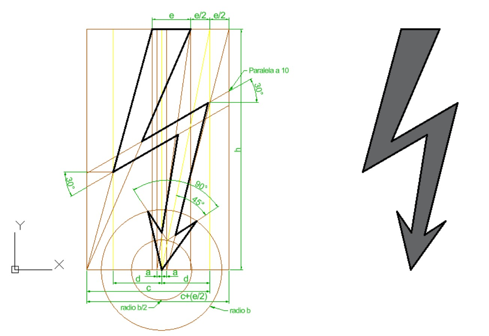</div>


## Objetivos

Al finalizar esta actividad, el estudiante:

* Realiza ejercicios prácticos en los que crea, usa y fragmenta bloques de dibujo.
* Crea dibujos con achurados.
* Conoce los símbolos eléctricos del Reglamento Técnico de Instalaciones Eléctricas - RETIE del Ministerio de Minas y Energía de Colombia. 
* Crea mosaicos de vistas fijas y flotantes en el espacio modelo de CAD.
* Aplica adecuadamente las escalas a los dibujos realizados en CAD.


## Requerimientos

Archivos, actividades previas, lecturas y herramientas requeridas para el desarrollo de esta actividad:

<div align="center">

| Requerimiento                                                                                           | Descripción                                                                                                                      |
|:--------------------------------------------------------------------------------------------------------|:---------------------------------------------------------------------------------------------------------------------------------|
| [:toolbox:Herramienta](https://www.autodesk.com/products/autocad)                                       | Autodesk Autocad 3D 2026 o superior.                                                                                             |

</div>

> Para los diferentes avances de proyecto, es necesario guardar y publicar las diferentes versiones generadas del (los) libro (s) de Microsoft Excel, reportes o informes y dibujos generados, agregando al final la fecha de control documental en formato aaaammdd, p. ej., _M01A01_20250710.dwg_.


## 1. Creación de bloques estáticos

En AutoCAD, los bloques son objetos compuestos por uno o más objetos que se combinan para formar un solo objeto reutilizable. Son útiles para crear elementos repetitivos en un dibujo, como símbolos, piezas, vistas de detalle o cuadros de rotulación, permitiendo ahorrar tiempo y mantener la coherencia. 

Características de un bloque

| Característica          | Alcance                                                                                                                              |
|:------------------------|:-------------------------------------------------------------------------------------------------------------------------------------|
| Agrupa objetos          | Los bloques permiten combinar múltiples objetos (líneas, círculos, texto, etc.) en un solo objeto, facilitando su manejo y edición.  |
| Reutilización           | Una vez creado, un bloque se puede insertar varias veces en el mismo dibujo o en diferentes dibujos.                                 |
| Ahorro de espacio       | Al reutilizar bloques en lugar de crear objetos individuales, se reduce el tamaño del archivo del dibujo.                            |
| Consistencia            | Los bloques garantizan que las copias de un mismo elemento sean idénticas, manteniendo la uniformidad en el diseño.                  |
| Edición centralizada    | Si se modifica la definición de un bloque, todas las referencias a ese bloque se actualizan automáticamente.                         |

> A los bloques insertados se les conoce como instancias del bloque original.

Especificaciones

* Crear los elementos que conforman el bloque en la capa cero (0).
* Desde **UNITS**, definir la escala de creación, p. ej., en milímetros (luego al ser insertado el elemento se establece automáticamente el factor de conversión de escala a las unidades del dibujo principal, p. ej., si el bloque corresponde a una toma eléctrica de 14 x 8 milímetros, la escala automática de inserción en un dibujo arquitectónico dibujado en metros será de 1m / 1000mm = 0.001).

Para esta actividad, dibujaremos el bloque de símbolo eléctrico definido en el numeral 1.3.3.2. Símbolo de riesgo eléctrico y los símbolos establecidos en el _Artículo 1.3.4. Símbolos eléctricos_ del Reglamento Técnico de Instalaciones Eléctricas - RETIE del Ministerio de Minas y Energía de Colombia.

> Son de obligatoria aplicación los símbolos gráficos contemplados en la Tabla 1.3.4.a del RETIE, tomados de las normas unificadas IEC 60617, ANSI Y32, CSA Z99 e IEEE 315, los cuales guardan mayor relación con la seguridad eléctrica. Cuando se requieran otros símbolos, se podrá acudir a los contemplados en las normas precitadas.

<div align="center">Proporciones en las dimensiones del símbolo de riesgo eléctrico<br></div>
<div align="center"><sub><br>Tomado de: Artículo 1.3.3.2. Símbolo de riesgo eléctrico del Reglamento Técnico de Instalaciones Eléctricas - RETIE - Colombia</sub><br><br></div>
<div align="center"></div>
<div align="center"></div>
<div align="center"><sub><br>Tomado de: Artículo 1.3.4. Símbolos eléctricos del Reglamento Técnico de Instalaciones Eléctricas - RETIE - Colombia</sub><br><br></div>


### Ejercicio M01A03E01

Cree el bloque del símbolo de riesgo eléctrico del _Reglamento Técnico de Instalaciones Eléctricas (Resolución 40117 de 2024) - RETIE del Ministerio de Minas y Energía de Colombia_, utilizando las dimensiones proporcionales para h=200.

1. En AutoCAD, cree una copia del archivo [/file/cad/M01A02a.dwg](../../file/cad/M01A02a.dwg) que contiene los nombres de capas definidos para el curso DAPC, guarde como /file/cad/M01A03.dwg y verifique con _UNITS_ que las unidades de inserción son milímetros.

 Primero, cree líneas esquemáticas tomando como referencia un rectángulo de c+(e/2) = 102+16 = 118 horizontal por h = 200 de alto, luego trace líneas paralelas y las líneas diagonales. Al finalizar, con el comando **COPY** o **CP**, genere una copia de la figura principal y mueva a la capa cero (0), luego una todas las líneas con el comando **JOIN** y con el comando **HATCH**, genere un relleno sólido en la misma capa (utilice para ello las opciones desplegadas en la cinta de opciones _Hatch Creation_).

<div align="center"></div>

2. Desde el _Command_, ejecute el comando **BLOCK** o desde el menú _Home / Block_, de clic en el botón de creación de bloques. Aparecerá la ventana _Block Definition_, defina como nombre _RETIE - Riesgo eléctrico_, defina como punto base el punto inferior del símbolo de riesgo eléctrico, seleccione los objetos que componen el símbolo que se encuentran en la capa cero (0) y defina las unidades de bloque en _Milimeters_.

> En descripción puede agregar: _Reglamento Técnico de Instalaciones Eléctricas (Resolución 40117 de 2024) - RETIE del Ministerio de Minas y Energía de Colombia_.

<div align="center"></div>

3. Para insertar el bloque, en el menú _Home / Block / Insert_, seleccione el bloque creado y defina el punto de inserción en cualquier parte del dibujo. Inserte varias veces el bloque en diferentes localizaciones, diferentes escalas y diferentes rotaciones.

> En el _Command_ podrá observar que se puede cambiar el punto base, la escala, la rotación, explotar el bloque o repetir su inserción.

<div align="center"></div>

> Las diferentes instancias del bloque puede ser eliminadas y el bloque original permanecerá asociado internamente al archivo de AutoCAD.

4. Con el comando **INSERT** o **IN**, repita el procedimiento de inserción del bloque creado, arrastrando desde el panel el elemento al dibujo. En la ventana de inserción podrá establecer las opciones relacionadas con el bloque, tales como su punto de inserción, escala y demás.

<div align="center"></div>

5. Para modificar el bloque creado, p. ej., cambiando el color del relleno por gris y el grosor de contorno por 0.3, seleccione uno de los bloques insertados y con el menú contextual (clic derecho), seleccione la opción _Block Editor_. Una vez terminada la edición, en el menú _Block Editor_, seleccione la opción _Close Block Edit_ que se encuentra a la derecha. 

> Esta acción de modificación también puede ser realizada desde _Home / Block / Block Editor_.
> 
> Desde el _Block Editor_ podrá cambiar la posición de anclaje del bloque, y modificar las propiedades generales utilizadas en su creación. Dentro del editor y sin seleccionar ninguna entidad, ejecute el comando **PR** que le permitirá acceder a las propiedades detalladas del bloque.
> 
> Si requiere ajustar o renombrar el bloque creado, Utilice el comando **RENAME**.
> 
> Utilice el comando **EXPLODE** para descomponer un bloque en los elementos de dibujo que lo componen. Luego de su descomposición, los elementos no serán más una instancia del bloque principal, sino simplemente elementos del dibujo.

<div align="center"></div>

Una vez terminada la modificación podrá observar que todas las instancias del objeto han sido actualizadas.

<div align="center"></div>

Para insertar bloques desde archivos externos o los bloques de ejemplo o _Sample Blocks_ de AutoCAD, se puede utilizar el comando **ADC** o Autodesk Design Center. 

<div align="center"></div>

> Utilice el comando **PURGE** para eliminar un bloque creado. Solo podrá ser eliminado si dentro del dibujo no existe ninguna instancia del bloque a ser eliminado. En caso de que tenga múltiples instancias del mismo bloque, podrá desde cualquier espacio blanco del espacio de dibujo, dar clic en la opción _Quick Select_ del menú contextual y buscar todos los bloques insertados.


### Ejercicio M01A03E02

Cree los bloques de símbolos eléctricos del _Reglamento Técnico de Instalaciones Eléctricas (Resolución 40117 de 2024) - RETIE del Ministerio de Minas y Energía de Colombia_. Iniciemos con el símbolo de _Extintor para equipo eléctrico_, como referencia, utilizaremos un extintor con capacidad de 20 libras, con un ancho de 7" x 23"de alto.

<div align="center"></div>

> De acuerdo a las normas de la [NFPA](https://www.nfpa.org/es/news-blogs-and-articles/blogs/2021/04/30/extinguisher-placement-guide), los extintores necesitan instalarse al menos a 4 pulgadas del suelo hasta un máximo de 5 pies. La excepción a esto es para los extintores que pesan más de 40 libras, solo pueden estar a un máximo de 3 pies y 6 pulgadas del suelo y los extintores de incendios con ruedas no necesitan estar separados del suelo, ya que las ruedas ya impiden que el cilindro toque el suelo. Tenga en cuenta estos valores para el proyecto de clase.

1. En el mismo archivo [/file/cad/M01A03.dwg](../../file/cad/M01A03.dwg), cree el símbolo de extintor, tomando como referencia una circunferencia de 7" de diámetro (177.8 milímetros).

> Recuerde que todos los elementos deben ser dibujados en la capa cero (0).
> 
> Dibuje los elementos usando proporciones o relaciones geométricas.

<div align="center">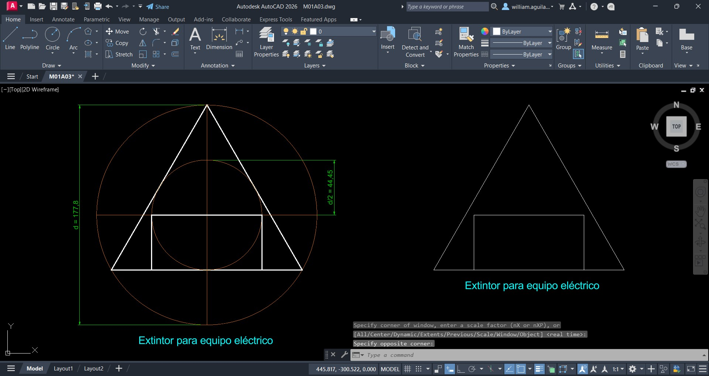</div>

2. Cree el bloque con el comando **BLOCK**, seleccione solo los elementos que corresponden a la figura (sin líneas constructivas y sin textos)

<div align="center">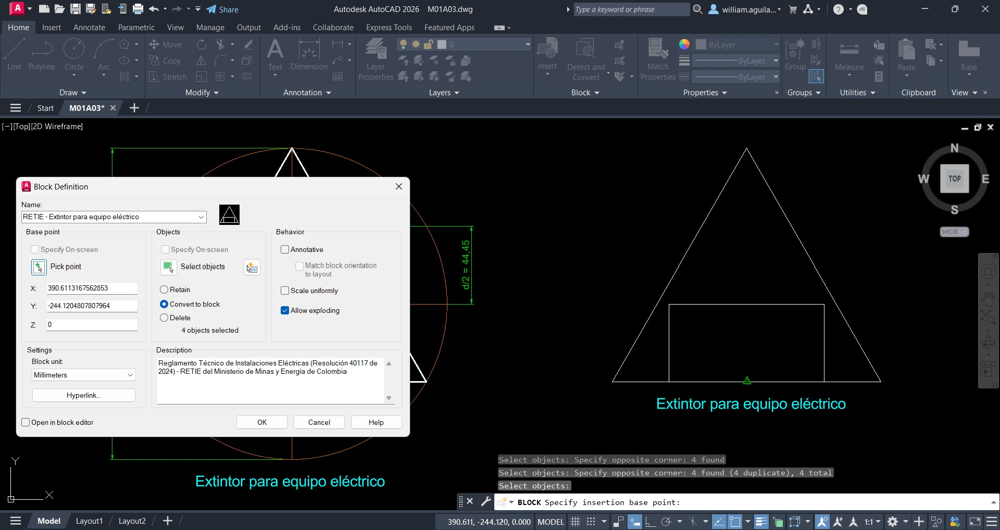</div>

3. Inserte y verifique el bloque.

<div align="center">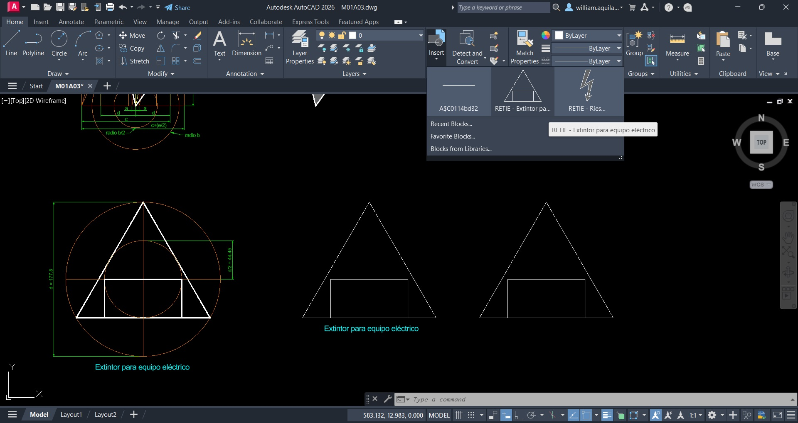</div>

> Repita este procedimiento para todos los demás símbolos del RETIE, en total debe crear 48 símbolos. En el archivo de AutoCAD, incluya las líneas constructivas utilizadas para la creación de cada símbolo.

4. Para practicar los conceptos de escala de inserción de bloques, cree un archivo nuevo de AutoCAD, defina unidades de inserción en metros y con el comando **ADC**, incorpore el bloque creado y verifique sus dimensiones en metros, observará que el objeto tiene un tamaño de 0.154 metros y que ha sido escalado correctamente.

<div align="center">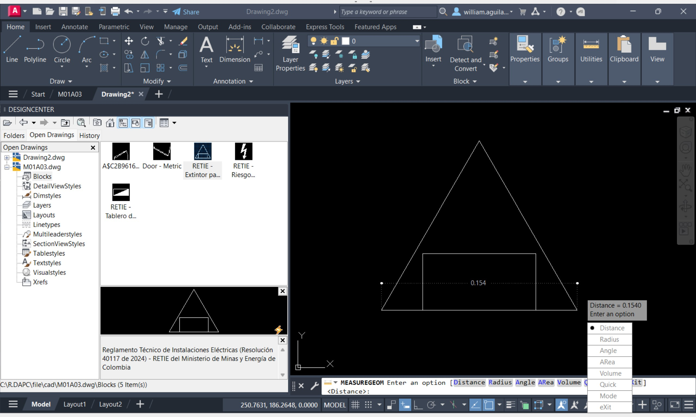</div>


## 2. Creación de bloques dinámicos

En AutoCAD, los bloques dinámicos son bloques que pueden cambiar su forma, tamaño o configuración al insertarse en un dibujo, en lugar de requerir múltiples definiciones de bloque estáticas. Permiten ajustar propiedades como la visibilidad, el estiramiento, la rotación, el desplazamiento y la escala. Los bloques dinámicos ofrecen una mayor flexibilidad que los bloques estáticos, ya que un solo bloque puede adaptarse a diferentes necesidades sin necesidad de crear múltiples versiones.


### 2.1. Para símbolo eléctrico alineado


Por ejemplo, los símbolos eléctricos del RETIE, al ser insertados dentro de un dibujo de planta arquitectónica, deben ser ajustados a la orientación de los muros.

1. Para definir esta acción dinámica en AutoCAD, seleccione el bloque _RETIE - Extintor para equipo eléctrico_ y en el menú contextual seleccione la opción _Block Editor_. Dentro del editor, seleccione el parámetro _Alignment_.

<div align="center"></div>

2. En la barra de comandos, se solicita la definición del punto base que será utilizado para la alineación, utilice el punto central inferior del triángulo que se definió previamente como punto de inserción, luego se solicita la dirección de alineación que para este símbolo eléctrico, corresponderá a la esquina inferior izquierda del triángulo. Lo anterior debido a que la alineación del símbolo, deberá ser realizada dinámicamente hacia afuera del muro arquitectónico. Al terminar, se muestra en color azul un apuntador de alineamiento hacia abajo, que al ser seleccionado mostrará el punto de referencia de inserción y la línea base de alineación.

<div align="center">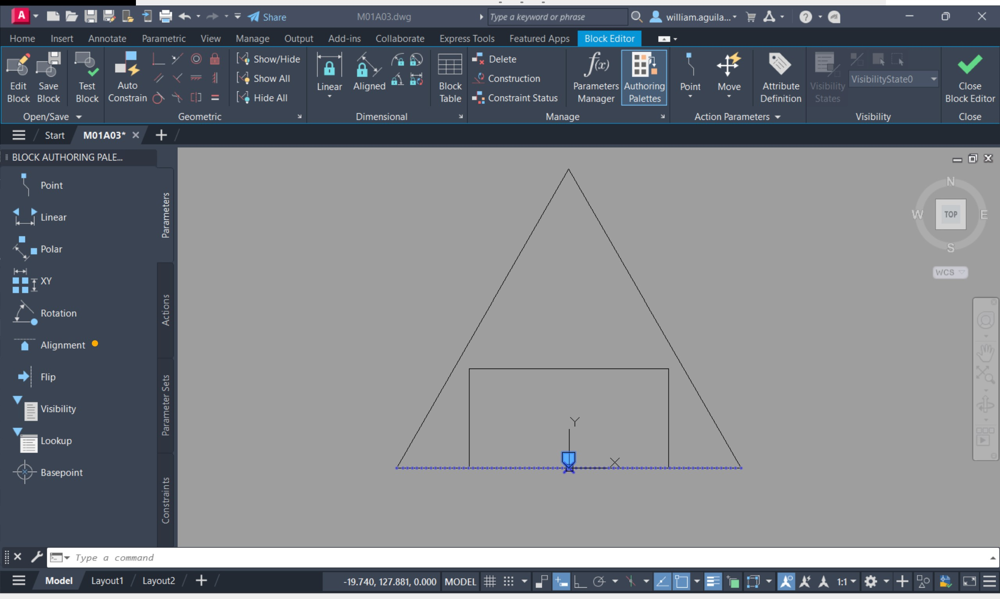</div>

Para finalizar la edición del bloque dinámico, de clic en la opción _Close Block Editor_, localizada arriba a la derecha en la cinta de opciones de _Block Editor_. Una vez guardado, retornará al espacio de dibujo de AutoCAD, seleccione el bloque, podrá observar que ahora aparece la propiedad de alineación.

> El parámetro de alineación no requiere de la definición complementaria de acciones.

3. Para verificar el funcionamiento del bloque dinámico, con la siguiente secuencia de comandos y en la capa _0-Object_, cree un muro. Con las opciones de achurado o **HATCH**, rellene la parte interna del muro usando el patron _AR-CONC_ a escala 0.3.

```
PLINE
1462.132,512.132
1250,300
1250,0
1300,0
1300,279.289
1482.843,462.132
1762.132,462.132
1762.132,512.132
C

```

<div align="center">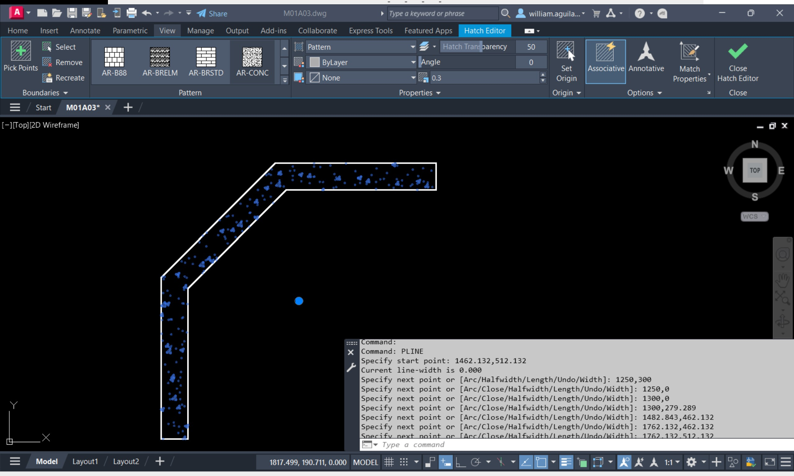</div>

> Tenga en cuenta que el muro no contiene unidades reales de dibujo y que solo es una representación esquemática para este ejemplo.

Cree copias adicionales del muro creado y explore los diferentes estilos de achurado de AutoCAD.

<div align="center">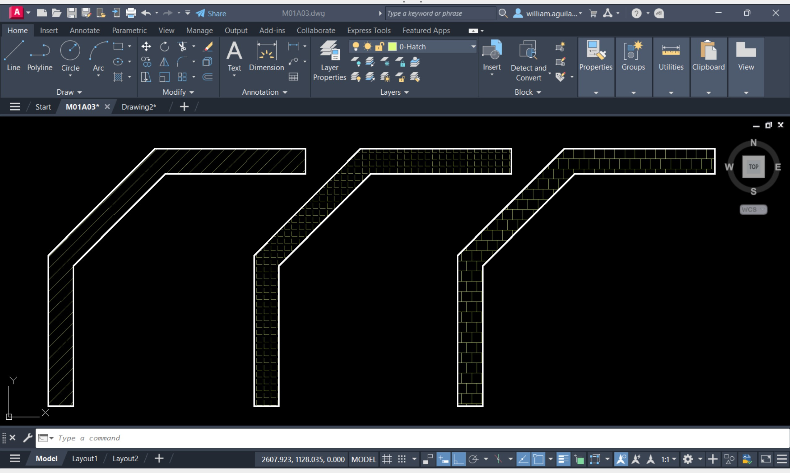</div>

4. Inserte el bloque _RETIE - Extintor para equipo eléctrico_ en diferentes localizaciones del muro, podrá observar que se alinea dinámicamente a sus lados e incluso en los costados angulados.

<div align="center">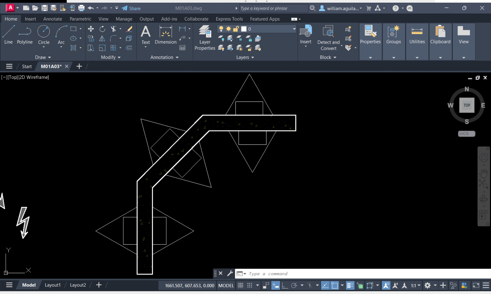</div>


### 2.2. Para símbolo eléctrico extensible

Creemos ahorra un bloque dinámico para el tablero de distribución eléctrica definido en el RETIE, este símbolo debe ser dinámicamente alineado,  alargado y ensanchado.

<div align="center">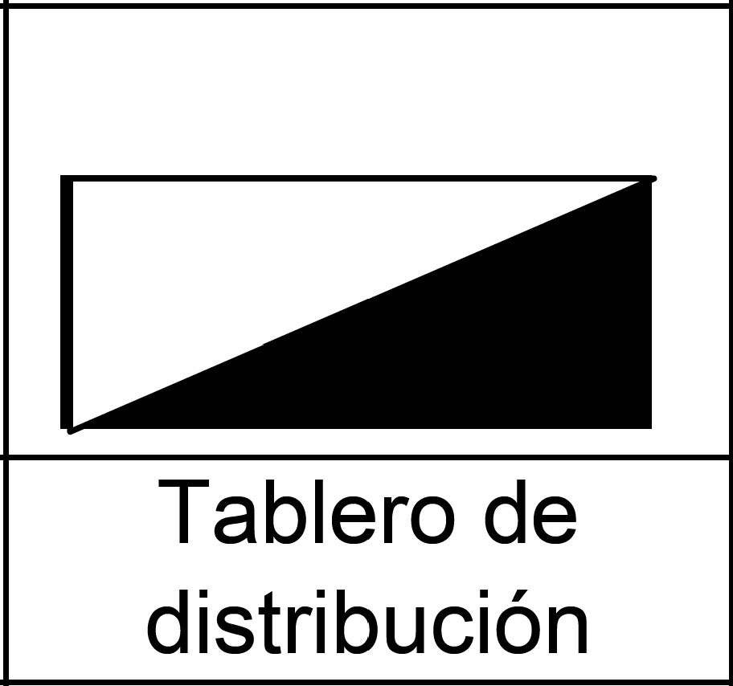</div>

> Las dimensiones de un tablero de distribución eléctrica varían significativamente dependiendo de su capacidad y aplicación, pero generalmente se miden en altura, ancho y profundidad. Los tableros más comunes para uso residencial pueden tener dimensiones desde 225mm x 256mm x 98mm (para 8 polos) hasta 340mm x 590mm x 90mm (para 36 polos). Los tableros más grandes, como los trifásicos, pueden alcanzar dimensiones de 280mm x 885mm. (Dimensiones expresadas en largo x alto x ancho). [^1]

1. Creemos el elemento de dibujo en AutoCAD de 225x98mm.

> Puede utilizar el comando **SOLID** para crear rellenos sólidos en objetos. Este tipo de elementos utilizan menos espacio de almacenamiento en el dibujo que los achurados o rellenos usando **HATCH**. Para crear el relleno sólido de un rectángulo deberá realizar una secuencia diagonal encajando a partir de sus 4 esquinas. Para generar un relleno sólido de diagonales, utilice la secuencia sucesiva de nodos al rededor del rectángulo.

<div align="center">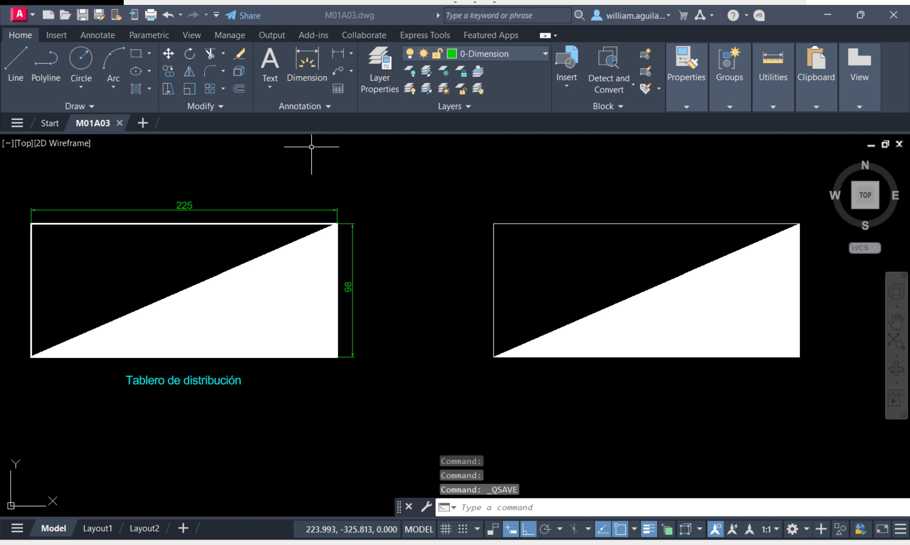</div>

2. Cree el bloque estático definiendo como punto central el punto medio inferior y en milímetros.

<div align="center">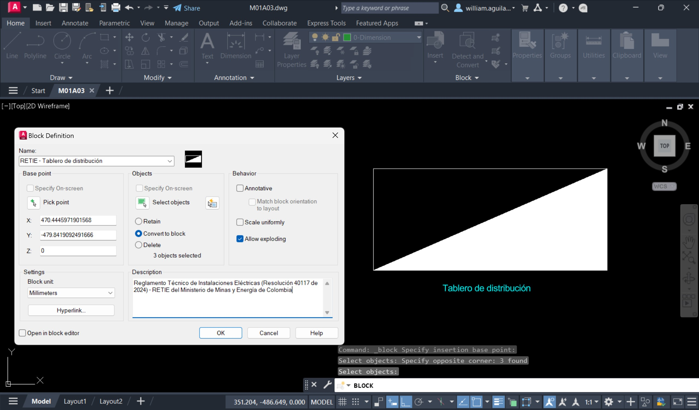</div>

3. Ingrese al editor de bloque o _Block Edit_ y asigne el parámetro _Aligment_ tal como lo realizamos en el símbolo eléctrico anaterior.

<div align="center">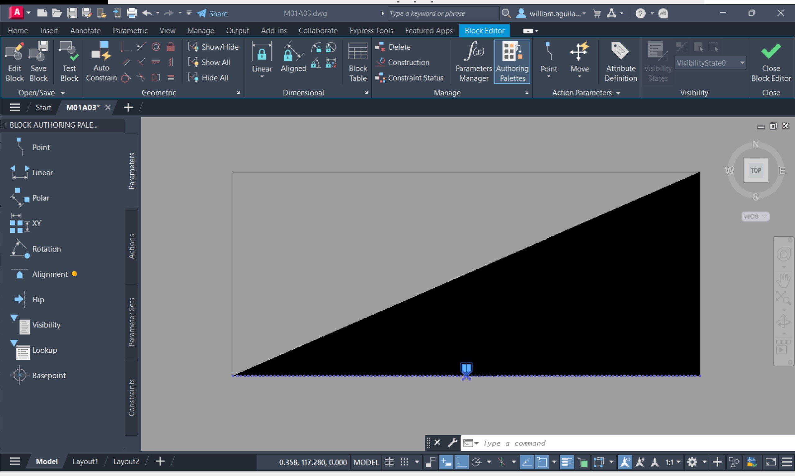</div>

4. Ahora asigne el parámetro _Linear_ asignando primero la esquina inferior izquierda y luego la inferior derecha para definir su distancia (Distance1). 

<div align="center">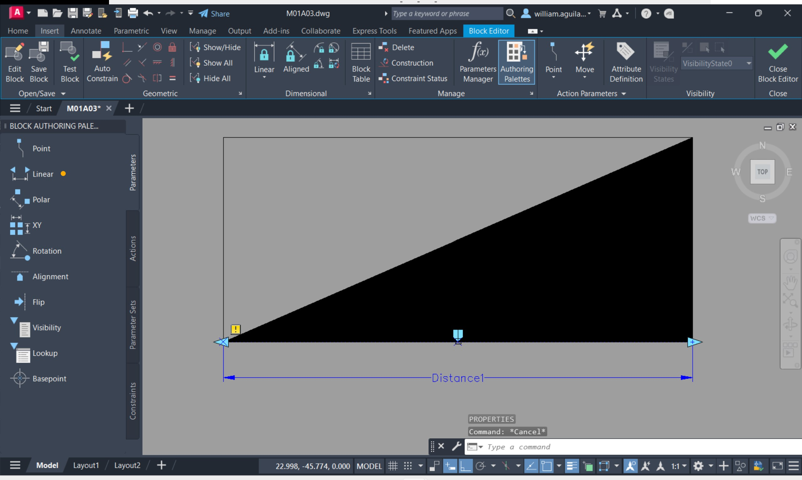</div>

5. Seleccione el parámetro y con el comando **PR** o **PROPERTIES**, cambie el nombre a _Largo_.

<div align="center">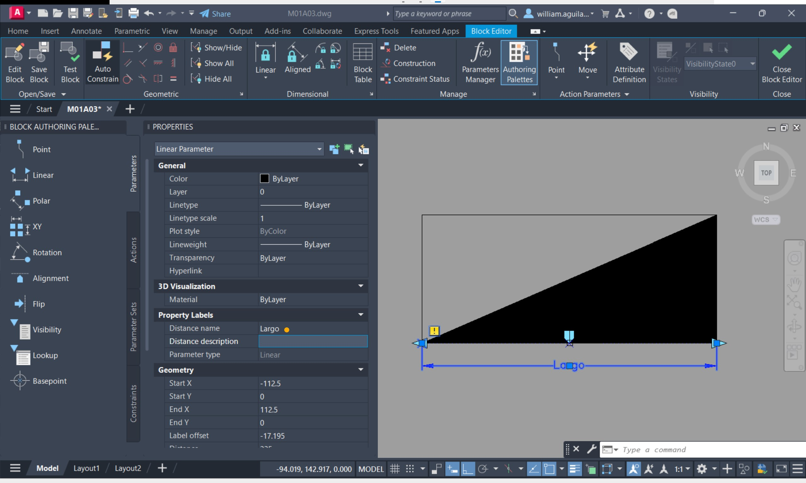</div>

6. En el panel de edición de bloques, defina en _Actions_ la acción de estiramiento o _Stretch_, seleccione el parámetro _Largo_ y defina el punto asociado a la acción de estiramiento (equis de color rojo) correspondiente a la esquina inferior derecha del bloque.

<div align="center">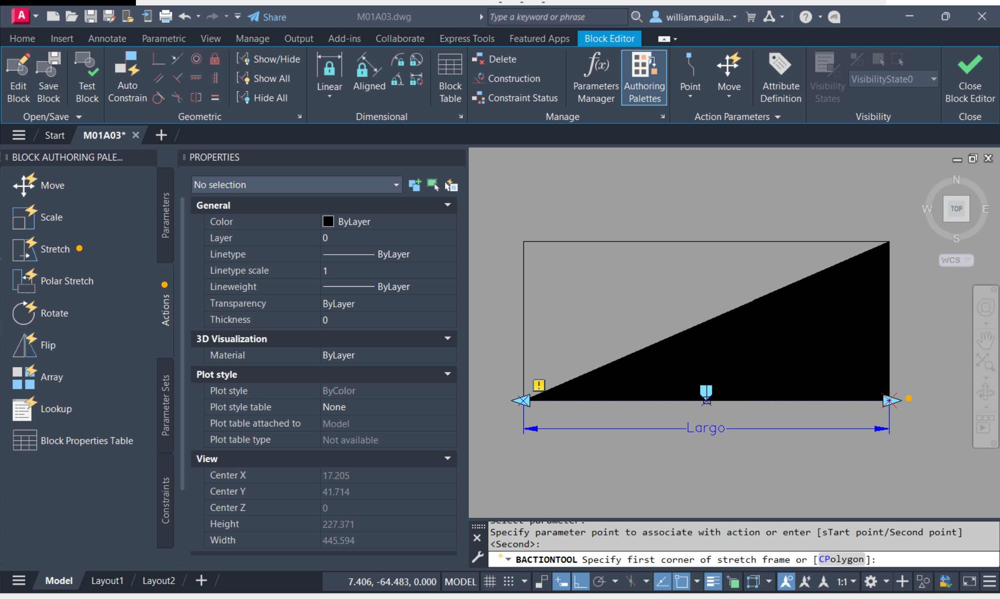</div>

7. Ahora el _Command_ solicita se cree un marco de estiramiento, que para el caso del tablero, corresponderá solo al lado derecho del bloque y luego solicitará se seleccionen los objetos a estirar dentro del marco seleccionado. Presione <kbd>enter</kbd> para finalizar la creación de esta acción.

<div align="center">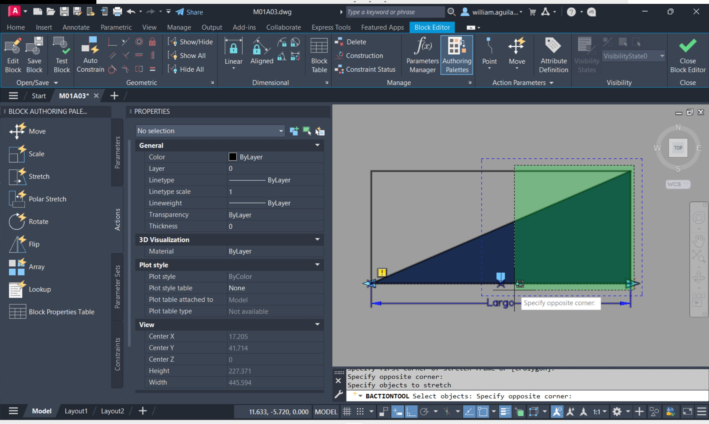</div>

8. En la parte inferior derecha del bloque, aparecerá ahora un ícono con la acción de estiramiento.

<div align="center">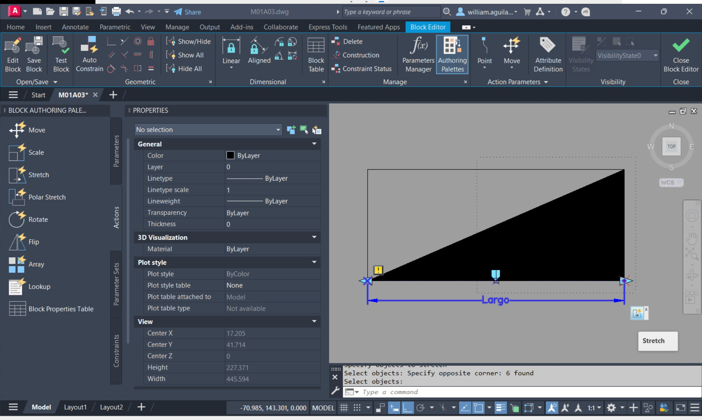</div>

9. Cierre el editor de bloques y guarde los cambios. Inserte el bloque, selecciónelo y compruebe su funcionamiento estirando y alineando sobre una copia del muro creado anteriormente.

<div align="center">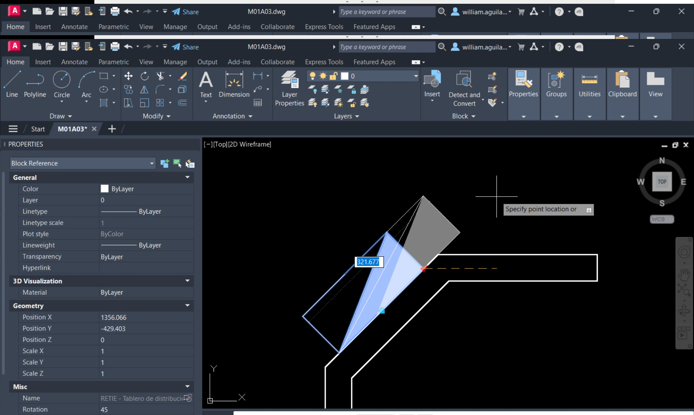</div>

> Utilice el comando **RESETBLOCK** para restablecer una instancia del bloque insertado a su forma original.

10. Repita el procedimiento de estiramiento para el sentido vertical del bloque o su ancho y verifique su funcionamiento.

<div align="center">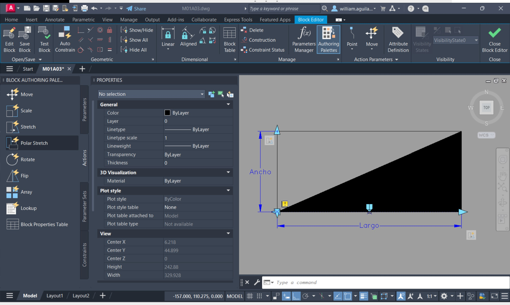</div>
<div align="center">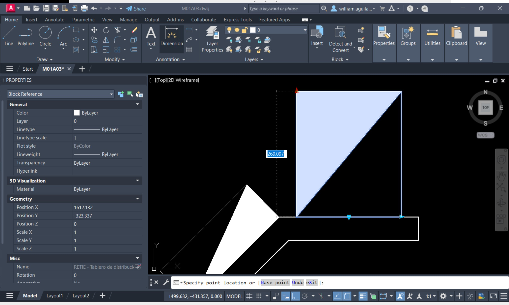</div>

11. Como observó en las pruebas de funcionamiento, el bloque puede ser estirado y alargado utilizando cualquier dimensión, sin embargo, las dimensiones específicas de largo y ancho de los tableros eléctricos disponibles en el mercado Colombiano, pueden ser definidos en las propiedades de largo y ancho establecidas, p. ej., para los largos podemos definir longitudes fijas de 225, 280 o 340 milímetros. Para ello, ingrese al editor de bloques, seleccione la propiedad _Largo_ y en las propiedades (comando PR), defina en el grupo _Value Set_ la lista de valores o largos que puede adoptar el bloque. Podrá observar que a la derecha se muestran 3 líneas indicando los diferentes anchos.

<div align="center">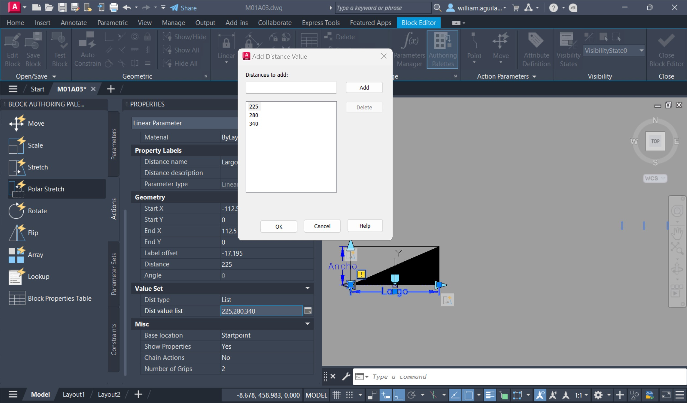</div>

Cierre el editor de bloque guardando los cambios e inserte y pruebe su funcionamiento.

<div align="center">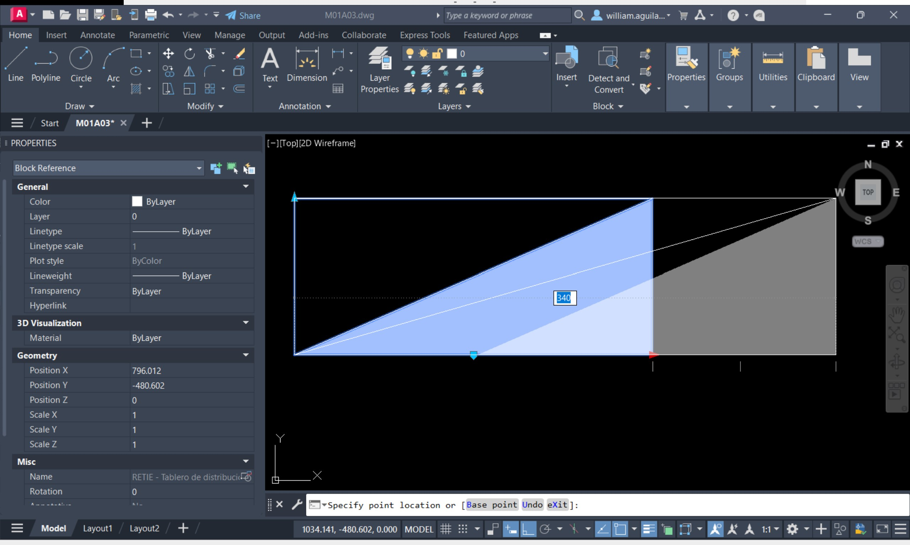</div>


### 2.3. Para elementos arquitectónicos

Los elementos arquitectónicos requieren el uso de múltiples ajustes, p, ej., una puerta puede tener diferentes anchos estándar, la hoja puede estar abierta, cerrada o en un ángulo específico y la orientación para su apertura puede ser izquierda o derecha.

1. Para explorar el funcionamiento de estos bloques, en AutoCAD, ingrese el comando **ADC** que le permitirá acceder al centro de diseño o Autodesk Design Center y de clic en el botón _Home_ que lo redirigirá a la carpeta de ejemplos. 

<div align="center">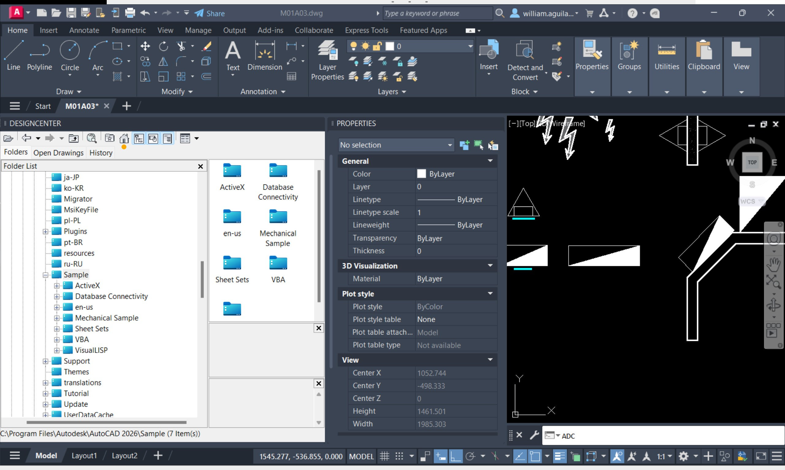</div>

2. En el _Home_, ingrese a la carpeta _D:\Autodesk\AutoCAD 2026\Sample\en-us\Dynamic Blocks\Architectural - Metric.dwg_ y seleccione _Blocks_. Arrastre al dibujo el bloque _Door - Metric_ y selecciónelo, podrá observar que contiene múltiples propiedades y acciones.

> En el ADC, los bloques dinámicos son fácilmente identificables debido a que en la parte inferior derecha de su previsualización, aparece un rayo.

<div align="center">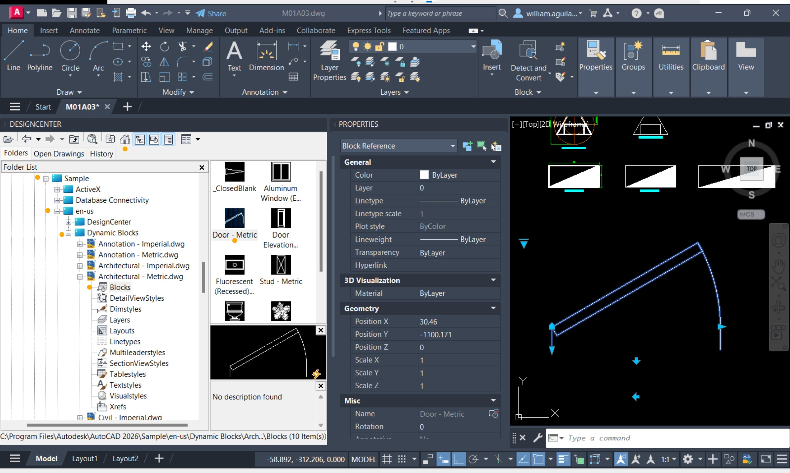</div>

3. Cierre el ADC y explore las acciones disponibles, p. ej., la apertura de la puerta para diferentes ángulos.

<div align="center">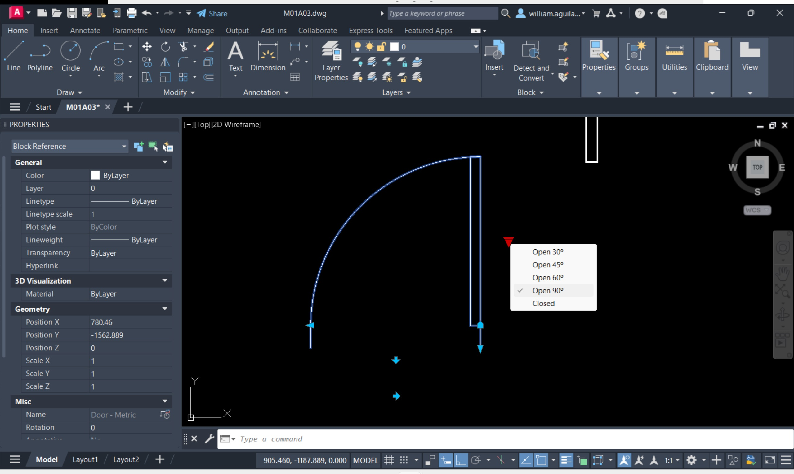</div>

4. Revisemos la configuración de esta propiedad y sus acciones.

<div align="center">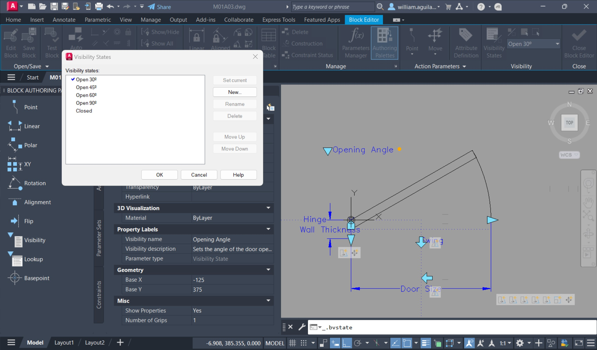</div>

Explore las demás acciones disponibles para este bloque, inserte otros bloques dinámicos y compruebe su funcionamiento.


## 3. Vistas de mosaico y vistas flotantes


### 3.1. Model Viewports

En AutoCAD, los model viewports (o ventanas gráficas en mosaico del modelo), son áreas dentro del espacio modelo que permiten visualizar diferentes vistas de un mismo dibujo o modelo. Estas ventanas se pueden configurar para mostrar vistas en diferentes escalas o desde distintas perspectivas, lo que facilita la navegación y manipulación de diseños complejos.

1. En el menú _View_, seleccione en el grupo _Model Viewports_ de la cinta de opciones, la opción _Viewport Configuration_ y establezca una vista de 3 ventanas con principal a la izquierda. Esta misma acción puede ser ejecutada desde el _Command_, con el comando **VPORTS**.

> Como observa, existen múltiples disposiciones de la vista de mosaicos y su utilización depende de los elementos contenidos en su dibujo.

<div align="center">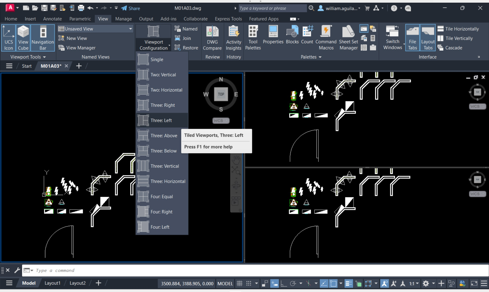</div>

2. Dentro de cada ventana, establezca la visualización de los elementos trazados en esta actividad.

<div align="center">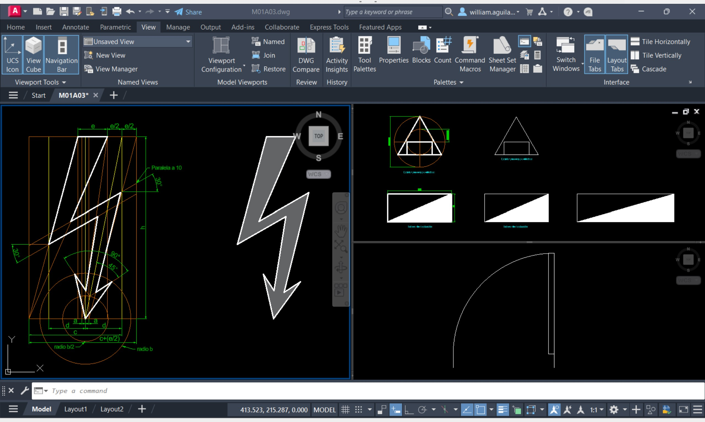</div>

Para restablecer a una única ventana de modelado, en **VPORTS** seleccione _Single_.

<div align="center">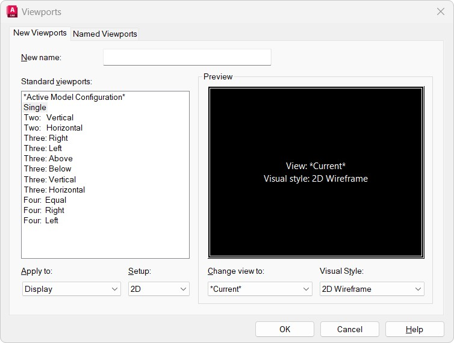</div>


### 3.2. Layout Viewports

En AutoCAD, un layout viewport (o ventana de impresión), es un área rectangular en el layout (papel) que muestra una vista del model space (espacio modelo). Permite visualizar diferentes partes del dibujo a diferentes escalas y orientaciones, como si fueran ventanas a una vista ampliada del modelo. 

1. Por defecto, AutoCAD incluye el Layout1 y Layout2, o vistas de impresión que contienen una ventana al espacio de modelado. Para alternar de la vista de modelado a una de las vistas de impresión, en la parte inferior izquierda, seleccione el elemento requerido. Podrá observar que en la vista de impresión, ya existe un _Layout Viewport_ que muestra el contenido de todo el dibujo.

<div align="center">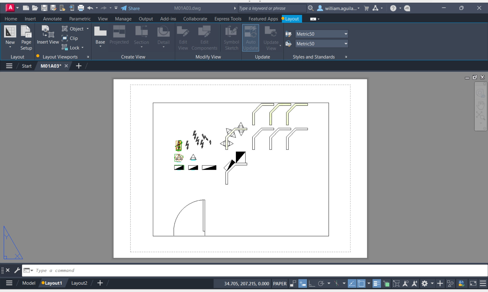</div>

2. De doble clic dentro del espacio de modelado y acérquese al bloque de riesgo eléctrico.

<div align="center">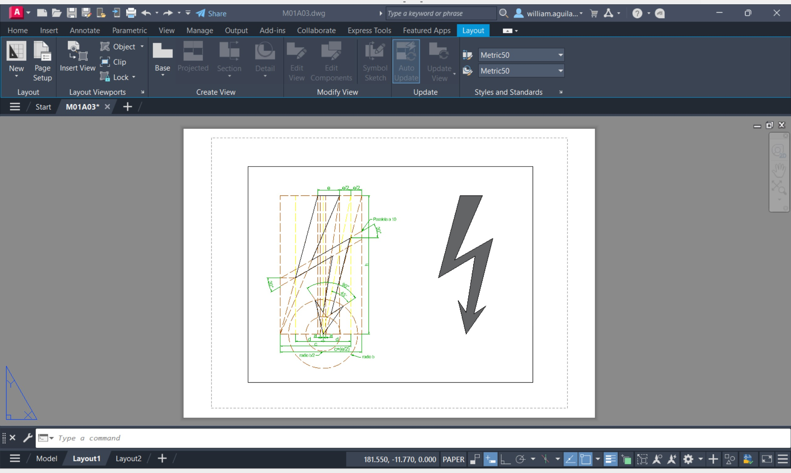</div>

El comando **PSPACE**, le permitirá alternar entre el espacio de modelado dentro una ventana gráfica de impresión al espacio de papel. Esta misma acción puede ser realizada dando doble clic dentro de la ventana o en el espacio de papel.

3. Modifique manualmente el tamaño del rectángulo de vista del espacio de modelado a la cuarta parte del espacio de papel.

<div align="center">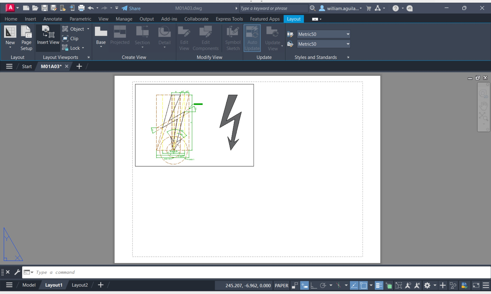</div>

4. Utilizando el comando **MVIEW**, inserte un cuadro de vista en la parte inferior izquierda y acérquese a los bloques creados. Esta acción también puede ser realizada desde _Home / Layout / Layout Viewports / Insert View_.

<div align="center">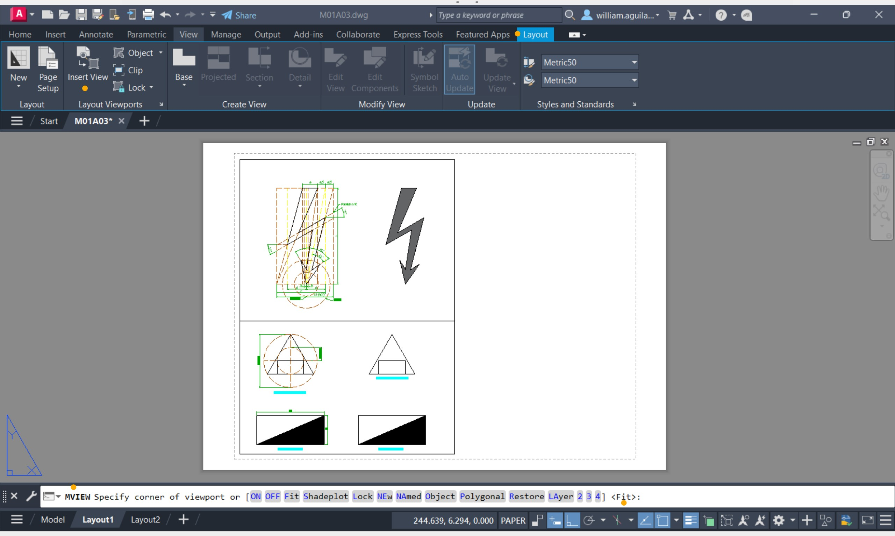</div>

5. Para crear vistas de detalle, p. ej., con formas circulares, dibuje una circunferencia en el espacio de papel. Luego, con el comando _MVIEW_ y la opción **O**bject, seleccione este elemento. Acerque y complemente con líneas que indiquen de donde proviene el detalle. La creación de la vista a partir de un objeto, también puede ser realizada desde el _Home / Layout_.

<div align="center">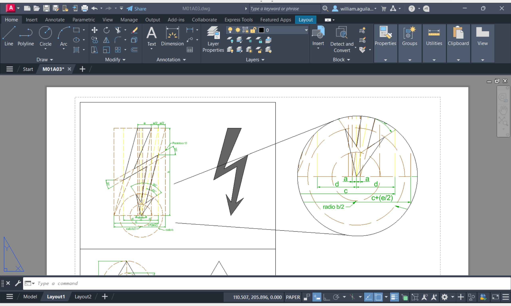</div>

7. En la ventana de impresión, se muestran de forma predeterminada todas las capas activas en el espacio de modelado. Utilice el comando **VPLAYER** para apagar del espacio de papel o de impresión una o varias capas, p. ej., desactive la capa de líneas constructivas. Esta acción podrá ser aplicada a uno de los Layouts o a todos. VPLAYER / Freeze / 0-Sketch / All.

<div align="center">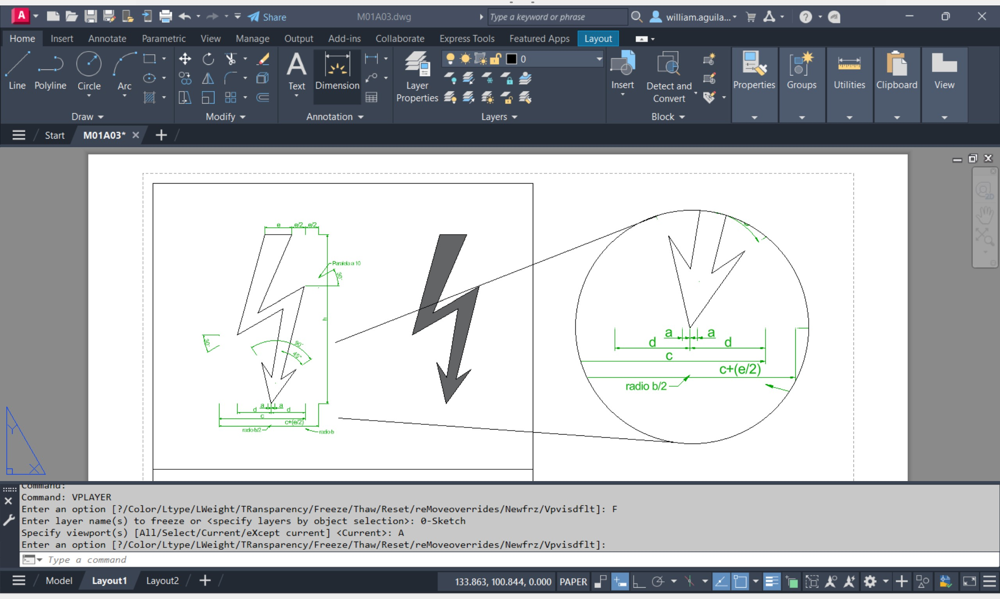</div>


## Actividades de proyecto :triangular_ruler:

Utilizando la [Plantilla de Microsoft Word](../../file/report/R.DAPC.PlantillaSoporteDesarrollo.docx) suministrada, cree un documento soporte mostrando las actividades desarrolladas en el orden presentado en esta actividad, junto con las consideraciones de diseño, los análisis y recomendaciones realizadas para las actividades del proyecto. Convierta a Adobe Acrobat (.pdf) y guarde en la carpeta _/report_ del repositorio de datos, nombre el archivo con el código de la actividad agregando al final la fecha de control documental en formato aaaammdd (p. ej. M01A01_20250531.pdf).

Las especificaciones técnicas detalladas del proyecto para este módulo del curso, se encuentran en el archivo: [DAPC_ProyectoCAD.xlsx](DAPC_ProyectoCAD.xlsx)

En la siguiente tabla se listan las actividades que deben ser desarrolladas y documentadas por cada grupo de proyecto.

| Actividad | Alcance                                                                                                                                                                                                                                                                                                                                                                                                                                                                                                                                              |
|:----------|:-----------------------------------------------------------------------------------------------------------------------------------------------------------------------------------------------------------------------------------------------------------------------------------------------------------------------------------------------------------------------------------------------------------------------------------------------------------------------------------------------------------------------------------------------------|
| M01A03    | Cree el bloque de símbolo de riesgo eléctrico y los bloques de símbolos eléctricos del RETIE, ajuste los bloques para que se comporten dinámicamente. Incorporar símbolo eléctrico en los planos arquitectónicos.                                                                                                                                                                                                                                                                                  |
| M01A03    | Dibuje los elementos de proyecto del grupo _1. Especificaciones técnicas generales_, correspondientes a: bloques dinámicos arquitectónicos, eléctricos y otros.                                                                                                                                                                                                                                                                                                                                                                                      |
| M01A03    | Incorpore los elementos de proyecto del grupo _2. Especificaciones arquitectónicas y estructurales / 2d. Distribución arquitectónica interna_, correspondientes a: puertas y ventanas. Incorporar en los planos arquitectónicos a partir de los bloques creados en esta actividad.                                                                                                                                                                                                                                                                   |
| M01A03    | Incorpore los elementos de proyecto del grupo _3. Especificaciones eléctricas / 3a. Especificaciones generales y redes_, correspondientes a: tomacorrientes, interruptores, luminarias, cámaras de vigilancia, lLuces de emergencia. Incorporar en los planos de redes o instalaciones a partir de los bloques creados en esta actividad.                                                                                                                                                                                                            |
| M01A03    | En una tabla y al final del informe de avance de esta entrega, indique el detalle de las actividades realizadas por cada integrante de su grupo; utilice las siguientes columnas: `Nombre del integrante`, `Actividades realizadas`, `Tiempo dedicado en horas` (si presenta la entrega individualmente, no es necesaria la presentación de esta tabla).<br><br>Para actividades que no requieren del desarrollo de elementos de avance, indicar si realizo la lectura de la guía de clase y las lecturas indicadas al inicio en los requerimientos. | 

> Nota 1: para la revisión del proyecto final, guarde los libros cálculo de Microsoft Excel y los archivos generados en esta actividad, en las localizaciones indicadas en cada numeral.
>
> Nota 2: una vez el instructor realice la revisión y el estudiante presente las correcciones o ajustes solicitados, será necesario cargar una nueva versión de los archivos en el repositorio del proyecto, incluyendo o actualizando al final del nombre del archivo, la fecha de presentación en formato aaaammdd y manteniendo las versiones anteriores presentadas.
>


## Referencias

* https://help.autodesk.com/view/ACD/2026/ESP
* https://help.autodesk.com/view/ACD/2026/ENU/
* https://www.bibliocad.com/search/?term=electrical
* [Autodesk AutoCAD / Acerca de la definición de bloques](https://help.autodesk.com/view/ACD/2025/ESP/?guid=GUID-F81D7F1E-1F0A-45AD-AC7E-891A85A0033A)
* [AutoCAD para todos / Bloques - Video 01: ¿Que es un bloque y cómo se crea?](https://www.youtube.com/watch?v=RcMRWfDKt4A)
* [AutoCAD para todos / Bloques - Video 02: ¿Cómo se actualiza un bloque y cuáles son las opciones de inserción??](https://www.youtube.com/watch?v=qym57qO8UFo)
* [AutoCAD para todos / Bloques - Video 03: Design Center, Bloques Dinámicos](https://www.youtube.com/watch?v=ejZ-1E6y6CA)
* [AutoCAD para todos / Bloques - Video 04: Crea Bloques Dinámicos aplicando la acción de Estiramiento](https://www.youtube.com/watch?v=JPEQ1kEyMY4)
* [Martín Cipoletta / Resetear y reemplazar bloques dinámicos por otros en AutoCAD](https://www.youtube.com/watch?v=4MXMLEwI6qw)
* [Promine / The VPLAYER Command](https://www.youtube.com/watch?v=rv-yaIIB3bQ)


## Control de versiones

| Versión    | Descripción        | Autor                                      | Horas |
|------------|:-------------------|--------------------------------------------|:-----:|
| 2025.07.04 | Versión inicial.   | [rcfdtools](https://github.com/rcfdtools)  |  12   |


##

_R.DAPC es de uso libre para fines académicos, conoce nuestra licencia, cláusulas, condiciones de uso y como referenciar los contenidos publicados en este repositorio, dando [clic aquí](../../LICENSE.md)._

_¡Encontraste útil este repositorio!, apoya su difusión marcando este repositorio con una ⭐ o síguenos dando clic en el botón Follow de [rcfdtools](https://github.com/rcfdtools) en GitHub._


| [:arrow_backward: Anterior](../M01A02d/Readme.md) | [:house: Inicio](../../README.md) | [:beginner: Ayuda / Colabora](https://github.com/rcfdtools/R.DAPC/discussions/99999) | [Siguiente :arrow_forward:](../M01A04/Readme.md) |
|---------------------------------------------------|-----------------------------------|--------------------------------------------------------------------------------------|--------------------------------------------------|

[^1]: https://www.promelsa.com.pe/1035359-tablero-p-empotrar-de-resina-8-din-225x256x98mm-con-puerta.html