# 1.4. Textos, anotaciones y dimensionamiento
Keywords: `style` `dtext` `text` `mtext` `txt2mtxt` `dimstyle` `dim` `realigment`  `m01a04`

Texto simple, multilínea y de anotación. Estilo de la dimensión. Acotado de líneas rectas, círculos, arcos y ángulos. Editar dimensiones. Superficies normales, inclinadas y oblicuas. Visibilidad de aristas. Líneas centrales y líneas directrices. 

<div align="center"></div>


## Objetivos

Al finalizar esta actividad, el estudiante:

* Incorpora textos simples, de múltiples líneas y de anotación en dibujos.
* Crea, edita e interpreta apropiadamente elementos dimensionales aplicando comandos en CAD.
* Comprende y aplica los conceptos de textos anotativos.
* Comprende el uso de escalas para impresión de textos.


## Requerimientos

Archivos, actividades previas, lecturas y herramientas requeridas para el desarrollo de esta actividad:

<div align="center">

| Requerimiento                                                                                           | Descripción                                                                                                                      |
|:--------------------------------------------------------------------------------------------------------|:---------------------------------------------------------------------------------------------------------------------------------|
| [:toolbox:Herramienta](https://www.autodesk.com/products/autocad)                                       | Autodesk Autocad 3D 2026 o superior.                                                                                             |

</div>

> Para los diferentes avances de proyecto, es necesario guardar y publicar las diferentes versiones generadas del (los) libro (s) de Microsoft Excel, reportes o informes y dibujos generados, agregando al final la fecha de control documental en formato aaaammdd, p. ej., _M01A01_20250710.dwg_.


## 1. Textos y anotaciones


### 1.1. Texto simples y multilínea

En AutoCAD, el texto se utiliza para añadir anotaciones y detalles a los dibujos. Hay dos tipos principales de texto: texto de una sola línea y texto multilínea. El texto de una línea es adecuado para anotaciones cortas, mientras que el texto multilínea ofrece más opciones de formato y es ideal para párrafos y descripciones más largas.

Tipos de texto y comandos relacionados en AutoCAD:

| Tipo                              | Comando         | Descripción                                                                                                                                                                                                                                                    |
|:----------------------------------|:----------------|:---------------------------------------------------------------------------------------------------------------------------------------------------------------------------------------------------------------------------------------------------------------|
| Texto de una sola línea           | DTEXT, TEXT, DT | Cada línea de texto se considera un objeto independiente. Es fácil de crear y editar, y es ideal para anotaciones breves como etiquetas o referencias. Es necesario ingresar la altura del texto en unidades de dibujo y el ángulo de inclinación              |
| Texto multilínea                  | MTEXT, MT, T    | Permite texto con múltiples líneas, ofreciendo más opciones de formato, como fuentes, tamaños, estilos, alineación y columnas. Es más adecuado para descripciones detalladas, notas o documentos extensos. Es necesario definir el tamaño de la caja de texto. |
| Textos simples a multilínea       | TXT2MTXT        | Convierte varios de textos simples en un texto multilínea.                                                                                                                                                                                                     |
| Texto multilínea a textos simples | EXPLODE, X      | El comando EXPLODE permite separar textos multilinea. Fracciones y textos de tolerancia son separados en textos simples.                                                                                                                                       |
| MText toolbar                     | MTEXTTOOLBAR    | Esta variable de sistema permite mostrar u ocultar la barra de edición de textos multilínea, defina 1 para mostrar la barra o 2 para ocultarla.                                                                                                                |
| Estilos de texto                  | STYLE           | Configuración de estilos de texto.                                                                                                                                                                                                                             |


Importancia y consideraciones del texto en AutoCAD:

| Importancia       | Descripción                                                                                                                                                        |
|:------------------|:-------------------------------------------------------------------------------------------------------------------------------------------------------------------|
| Comunicación      | El texto transmite información esencial sobre el diseño, como dimensiones, materiales, especificaciones y notas.                                                   |
| Claridad          | Un texto bien formateado y ubicado facilita la comprensión del dibujo y la comunicación del diseño.                                                                |
| Documentación     | El texto ayuda a documentar el diseño, proporcionando información relevante para la fabricación, construcción o implementación.                                    |
| Estilos de texto  | Se recomienda crear estilos de texto personalizados con fuentes, tamaños y formatos predefinidos para mantener la coherencia en el dibujo.                         |
| Anotaciones       | El texto puede ser anotativo, lo que significa que se escala automáticamente con la escala del dibujo, asegurando que sea legible en diferentes vistas y escalas.  |
| Edición           | Tanto el texto de una línea como el multilínea pueden editarse fácilmente, permitiendo actualizaciones y correcciones según sea necesario.                         |

1. En AutoCAD, cree una copia del archivo _/file/cad/M01A02a.dwg_ y guarde como _/file/cad/M01A04.dwg_. Con el comando **UNITS**, verifique que las unidades de dibujo han sido establecidas en milímetros y utilizando la siguiente secuencia de comandos, dibuje en la capa _0-Objeto_, la figura mostrada en la ilustración. Utilizando el comando **DIST**, mida el tamaño horizontal y vertical que envuelve el elemento, obtendrá un tamaño de H=57.5 mm por L=97 mm. Con <kbd>ctrl</kbd> + <kbd>1</kbd>, active la ventana de propiedades, podrá observar que el elemento tiene un perímetro de 328.396 mm y un área de 2190 mm². 

```
PLINE
250,250
@15,0
@0,-11.5
@40,0
@0,42.5
@20,0
@0,-34
@5,0
@0,-3.5
@17,0
@-4,-20
@-18,0
@0,5
@-75,0
250,250

```

<div align="center">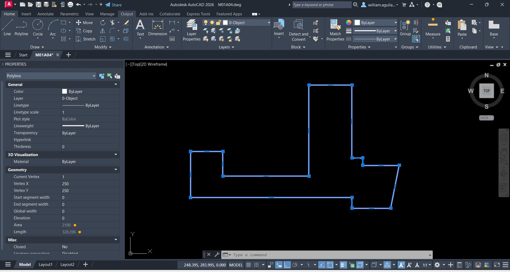</div>

2. Sin tener objetos seleccionados, seleccione la capa 0-Text y con el comando **STYLE**, acceda a los estilos de texto; podrá observar que por defecto se encuentra definido el estilo _Annotative_ y _Standard_. Utilizando el botón _New_, cree un nuevo estilo, utilice la fuente tipográfica _Arial_ y establezca una altura de 2.5 mm, guarde como _DAPC - Arial 2.5 mm_ y establezca por defecto. 

> Tenga en cuenta que el tamaño del texto podrá variar en la impresión en función a la escala utilizada. Si el tamaño del papel en milímetros es suficientemente grande para imprimir el dibujo a escala 1:1, el tamaño de texto en la impresión será igual al tamaño en el dibujo, si la escala es 1:2, el tamaño del texto en la impresión será de 1/2 el tamaño del dibujo.

<div align="center">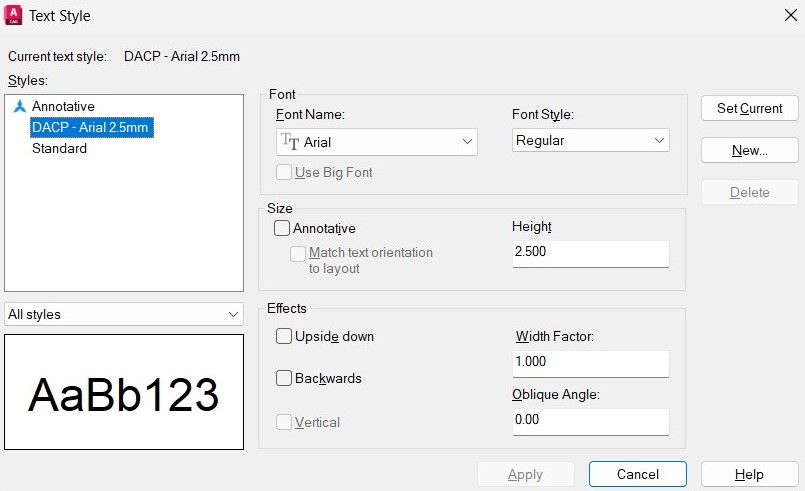</div>

3. Utilizando el comando **DTEXT**, **TEXT** o **DT**, escriba abajo de la figura el texto _Figura Asimétrica_, observará que solo se ha solicitado el punto de inserción y el ángulo de rotación. El ingreso de texto también puede ser realizado desde el menú _Home / Annotation / Text / Single Line_ o desde el menú _Annotate / Text / Single Line_.

> Si en la creación del estilo de texto se ha definido una altura específica, esta no será solicitada al momento de ejecutar el comando **TEXT**.

<div align="center">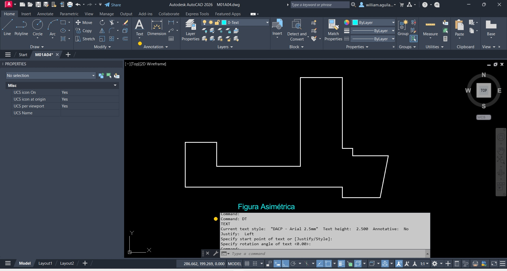</div>

4. Utilizando el estilo de texto _Standard_ y un tamaño de 2 mm, ingrese en dos posiciones apiladas los textos P = 328.396 mm y A = 2190 mm². Para la apilación, utilice la tecla <kbd>enter</kbd> entre las líneas.

> Debido a que el texto con estilo _Standard_ tiene definido un tamaño de cero, la altura del texto será solicitada en el momento de ejecutar el comando **TEXT**.

<div align="center">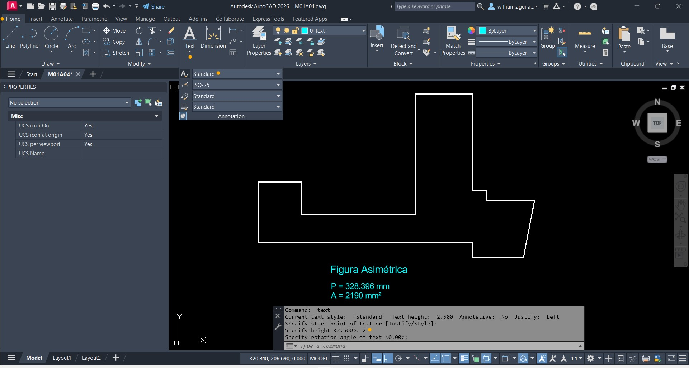</div>

5. Con el comando **COPY**, cree una copia del objeto y el texto, con el comando **SCALE** escale a 2 veces el tamaño inicial. Observará que el texto correspondiente al área y al perímetro sigue siendo igual, esto se debe a que ha sido ingresado como texto de usuario. Tenga en cuenta que ahora el título del texto tendrá un alto de 5 mm y el texto de las propiedades geométricas 4 mm y que el área y perímetro ahora tienen cuatro veces el tamaño original (2 veces más en X por 2 veces más en Y).

<div align="center">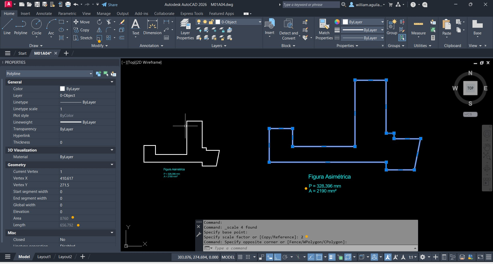</div>

6. Para calcular las propiedades geométricas en función del objeto, dando doble clic edite el texto, p. ej., del área, y desde el menú contextual seleccione la opción _Insert Field_ o presione <kbd>ctrl</kbd> + <kbd>F</kbd>.

<div align="center">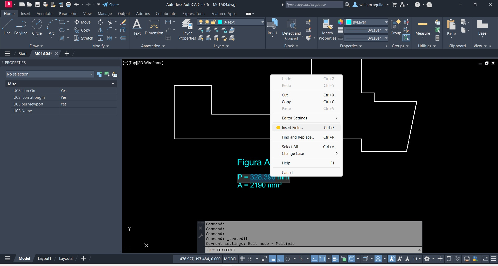</div>

7. En la ventana de campos o _Fields_, filtre por la categoría _Objects_, seleccione la opción _Object_, seleccione manualmente el polígono escalado, luego la propiedad requerida y de clic en _OK_. Automáticamente, el valor de la nueva área será incluida en el texto.

<div align="center">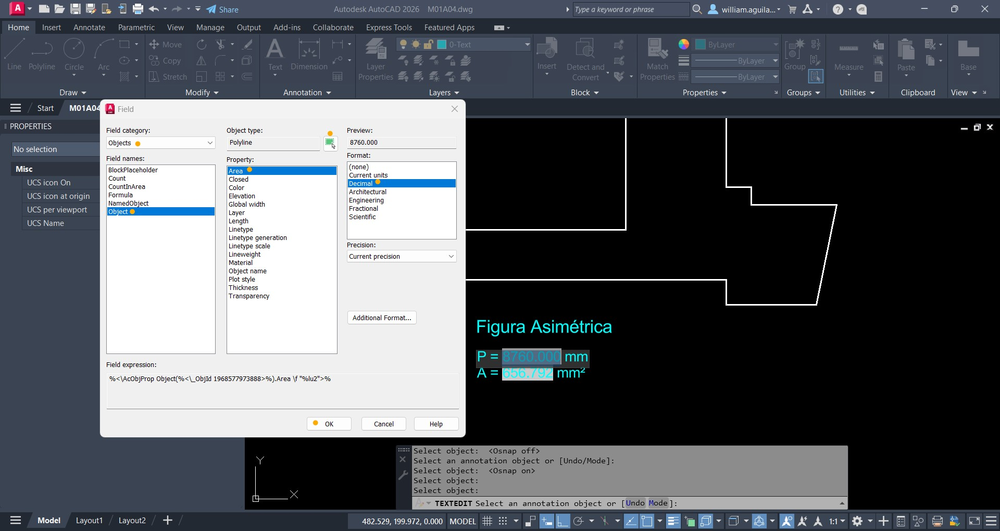</div>

> Para comprobar el funcionamiento de estos campos, re-escale la copia del objeto a su valor inicial dividiendo por el inverso de la escala de ampliación (1/2 = 0.5), edite el texto dando doble clic sobre los campos y actualice el valor en función del nuevo tamaño, podrá observar que los valores obtenidos son iguales a los de la figura original.

9. Con la herramienta _Home / Utilities / Measure / Angle_, mida el ángulo interno del único lado inclinado de la figura. Cree un rótulo inclinado de 1 mm de alto cerca a esta cara, indicando el ángulo de inclinación con respecto a la horizontal (180° - 101.31° = 78.69°).

<div align="center">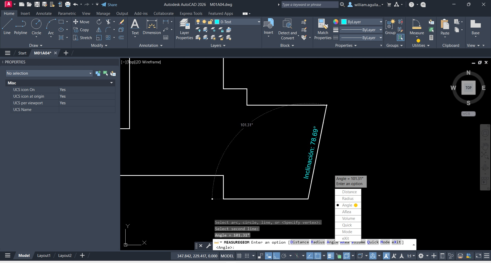</div>

> Desde la ventana de propiedades podrá modificar las propiedades del texto como si se tratara de un objeto.

Creemos ahora textos de múltiples líneas.

10. Utilizando el comando **MTEXT** o desde el menú _HOME / Annotation / Text / Multiline Text_ y con el estilo creado, cree manualmente para el objeto original, una caja de texto multilínea que contenga los textos que generemos anteriormente, incluídos los generados a partir de campos. Recuerde que será necesario actualizar las propiedades de los campos seleccionando el nuevo objeto.

Dentro del texto podrá incluir proporciones de tamaño, p. ej., el rectángulo imaginario que envuelve la figura es de H=57.5 mm por L=97 mm, o sea que la altura es 57.5 / 97 = 0.593 veces el largo. Para incluir la fracción, utilice como entrada `575/970 = 0.593` o `575#970 = 0.593`. Para incluir notas correspondientes a tolerancias, p .ej., de 0.05 mm, utilice `1 +0.05^-0.05`.

<div align="center">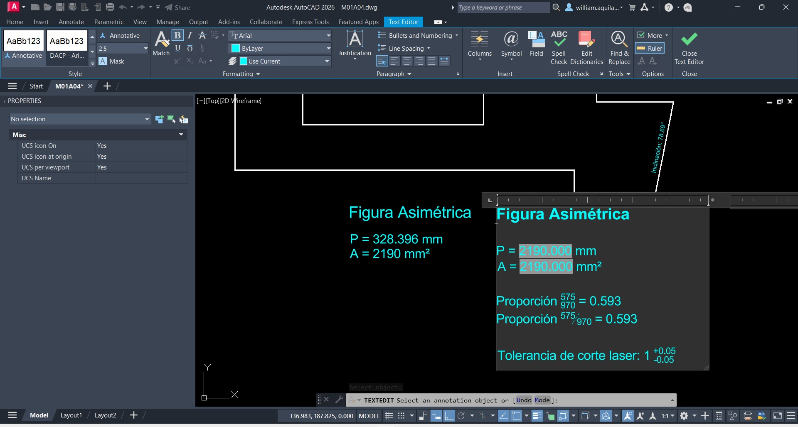</div>

> Recuerde que con el comando **TXT2MTXT**, podrá convertir líneas independientes de texto a un texto de múltiples líneas. 

Verifiquemos ahora el tamaño del texto en la hoja de impresión.

11. En la barra de estado, seleccione la pestaña _Layout1_, desde el menú contextual y _Page Setup Manager_, defina la impresora _DWG To PDF.pc3_, papel _ISO full bleed A4 (297.00 x 210.00 MM)_, impresión _monocrome.ctb_, escala de impresión 1:1 estableciendo que una unidad de dibujo corresponde a 1 mm. 

<div align="center">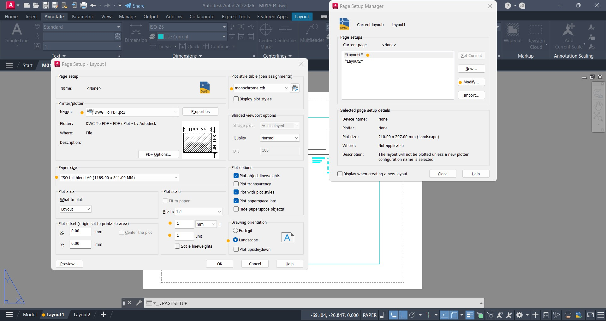</div>

12. Elimine el Viewport existente, agregue en la capa cero (0) un rectángulo de 206 de altura por 293 de ancho. Desde el menú _Layout / Layout Viewports / Object_, defina el rectángulo como una ventana al espacio del modelo.

<div align="center">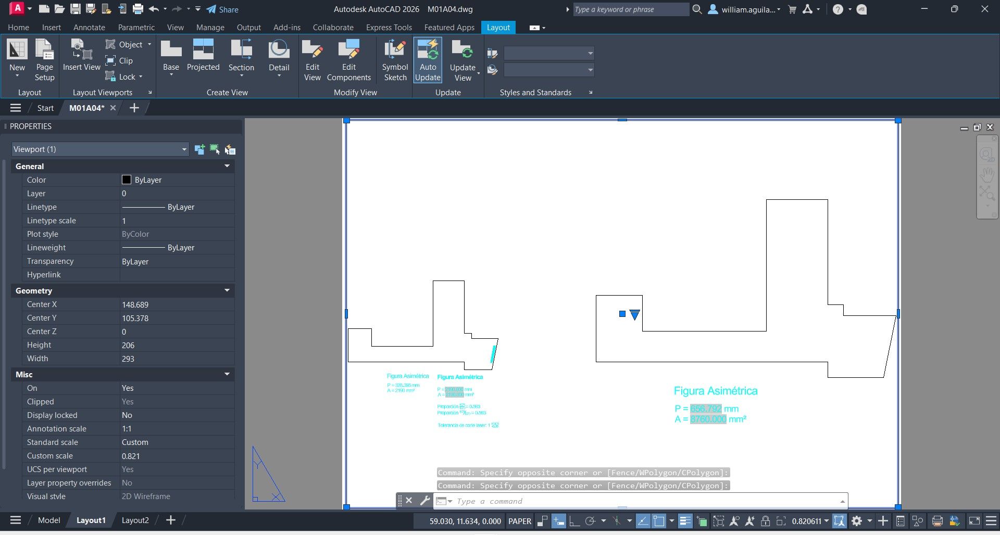</div>

13. Desde las propiedades del Viewport, establezca la escala visualización estándar interna del espacio del modelo dentro de la ventana de impresión en 1:1 (1 mm en el dibujo corresponde a 1 mm en la impresión). 

<div align="center">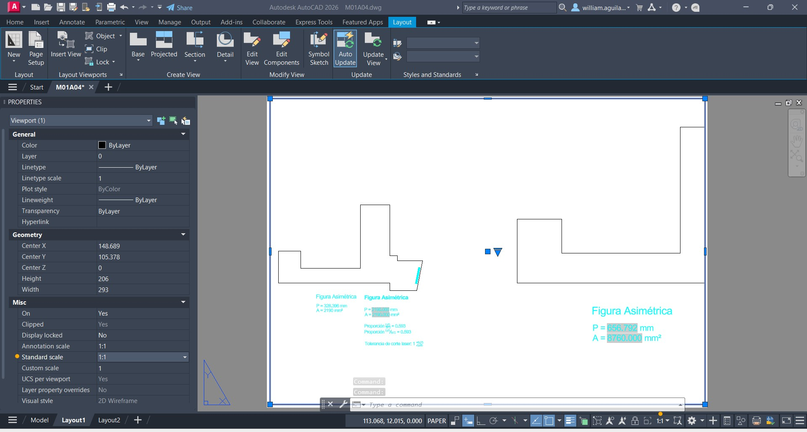</div>

14. Acérquese al espacio de papel y con la herramienta **DIST** mida el tamaño del texto definido en el título _Figura Asimétrica_. Podrá observar que tiene 2.5 mm de altura y que el texto escalado en la figura derecha 5 mm.

<div align="center">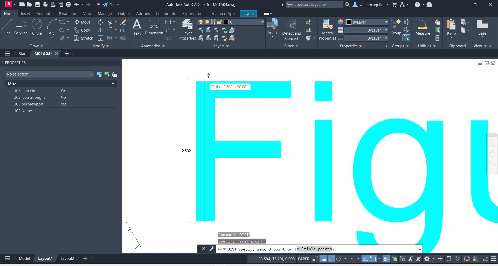</div>

15. Cambiando la escala a 1:2, cuyo factor corresponde a multiplicar todas las unidades de dibujo por 0.5, podrá observar que ahora el texto del título de la figura izquierda en la hoja de impresión, es de la mitad del tamaño original definido en el modelo y que es difícilmente legible. El texto de la figura derecha ahora tiene un tamaño de 2.5 mm y es legible. 

<div align="center">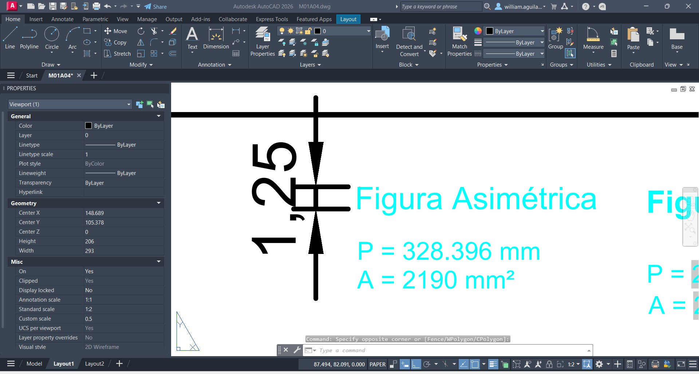</div>

> Para imprimir textos con el mismo tamaño, puede crear estilos con diferentes alturas, sin embargo, esta práctica no es recomendada debido a que en proyectos detallados, se utilizan múltiples escalas de impresión.
> 
> Cómo observa, los textos estáticos cambian su tamaño en el espacio de impresión en función de la escala, sin embargo, el comportamiento deseado es que los textos mantengan su tamaño al momento de ser impresos. Es por ello que son necesarios los textos anotativos que veremos a continuación.


### 1.2. Texto anotativo

En AutoCAD, los textos de anotación son textos que se crean y gestionan de manera que se adaptan automáticamente a diferentes escalas de visualización, manteniendo su tamaño y apariencia consistentes en el dibujo, independientemente de la escala del modelo o de las ventanas gráficas de presentación. Esto significa que no es necesario crear múltiples versiones del mismo texto para diferentes escalas; el texto anotativo se ajusta automáticamente, además contiene las siguientes características:

| Características                    | Descripción                                                                                                                                                                                                                   |
|:-----------------------------------|:------------------------------------------------------------------------------------------------------------------------------------------------------------------------------------------------------------------------------|
| Adaptabilidad a diferentes escalas | Los objetos anotativos, incluyendo el texto, están diseñados para cambiar de tamaño y escala automáticamente cuando se cambia la escala de visualización en el dibujo o en las ventanas gráficas.                             |
| Consistencia en la presentación    | El objetivo principal es mantener la legibilidad y la claridad del dibujo, asegurando que el texto anotativo se vea del mismo tamaño y con la misma apariencia, ya sea que se visualice a escala 1:1 o a una escala reducida. |
| Eficiencia en el diseño            | Al utilizar texto anotativo, se evita la necesidad de crear múltiples versiones del mismo texto para diferentes escalas, lo que simplifica el proceso de diseño y reduce la posibilidad de errores.                           |
| Control sobre la visibilidad       | Además de la escala, se puede controlar la visibilidad de los objetos anotativos en diferentes ventanas gráficas, lo que permite mostrar solo la información relevante en cada ventana.                                       |
| Comandos y herramientas            | AutoCAD proporciona comandos específicos como MTEXT (texto de líneas múltiples) y herramientas para crear y gestionar objetos anotativos, incluyendo el ajuste de escalas de anotación y la gestión de la visibilidad.        |
| Estilos de anotación               | Se pueden crear estilos de anotación que definen la apariencia y el comportamiento de los objetos anotativos, lo que permite una gestión centralizada de las propiedades de los objetos de anotación.                         |

1. Cree una copia del texto multilínea de la figura principal y desde sus propiedades, cambie al estilo _Annotative_, defina la escala anotativa en 1:1, establezca el _Paper Text Height_ en 2.5 mm con justificación _Top left_ para que el texto crezca hacia la derecha y hacia abajo. En la barra de estado seleccione 1:1 en la escala de anotación.

<div align="center">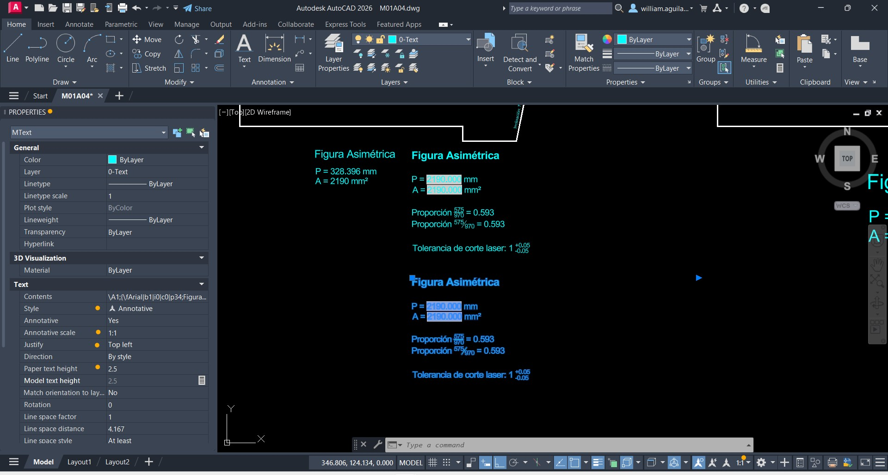</div>

2. Vaya al _Layout1_ y dentro del espacio _Model_ del _Viewport_ establezca en la barra de estado escala 1:1, observará que el tamaño del texto es dibujado igual al texto original de 2.5 mm. Luego cambie la escala a 1:2, observará que el texto anotativo se oculta y que el texto regular reduce su tamaño. Para poder visualizar el texto en otras escalas es necesario desde sus propiedades, definir las escalas que serán utilizadas para la impresión de ese texto en particular, agregue por ejemplo 1:2, 1:5 y 2:1.

<div align="center">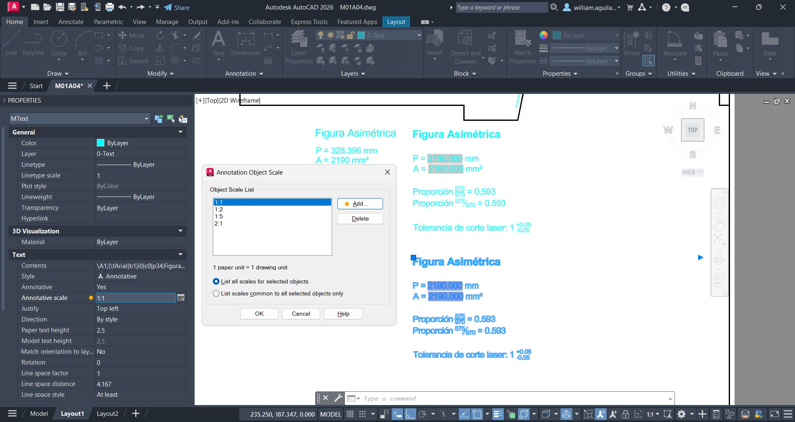</div>

3. Cambie ahora a escala 1:5 o a escala 2:1, observará que el texto ahora mantiene el tamaño de 2.5 mm de altura en el _Layout_ y que los demás textos cambian su tamaño en la impresión dependiendo de la escala seleccionada. 

<div align="center">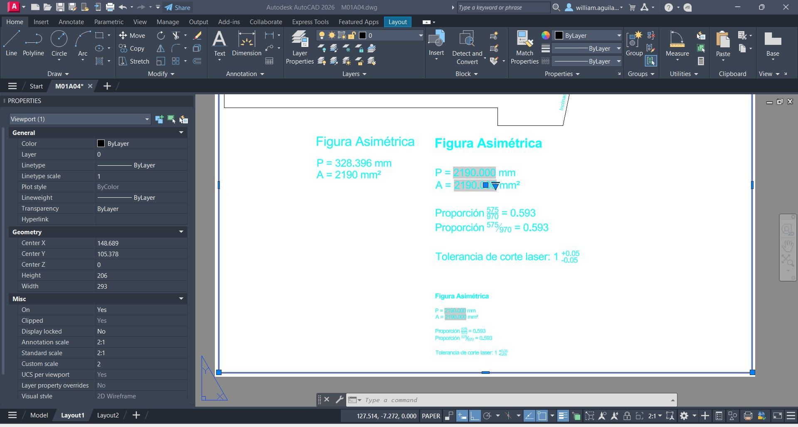</div>

> Tenga en cuenta que el texto solo será mostrado si ha definido escalas anotativas acorde a la escala de impresión. Por otra parte, los textos que se localicen en el área del papel no requieren de propiedades anotativas debido a que el formato de impresión se diseña en milímetros.
> 
> Dependiendo del tipo de proyecto, no es necesario utilizar este tipo de textos, sin embargo, cuando se crean múltiples vistas de impresión, conviene estandarizar el tamaño de los textos para mantener la homogeneidad.


## 2. Dimensionamiento, líneas centrales y líneas directrices

En AutoCAD, el dimensionamiento (o acotación) es el proceso de agregar información numérica y simbólica a un dibujo técnico para indicar las dimensiones y otras características de un objeto, como longitudes, ángulos, radios, diámetros, etc. Se utiliza para comunicar claramente las medidas y relaciones espaciales de los elementos en el diseño. El dimensionamiento en AutoCAD implica:

| Implicación          | Descripción                                                                                                               |
|:---------------------|:--------------------------------------------------------------------------------------------------------------------------|
| Líneas de referencia | Se utilizan para conectar las líneas de cota a los objetos que se están midiendo.                                         |
| Líneas de cota       | Son líneas que indican la distancia o magnitud que se está midiendo.                                                      |
| Flechas o símbolos   | Se colocan en los extremos de las líneas de cota para indicar los puntos de referencia.                                   |
| Valores numéricos    | Se muestran junto a las líneas de cota para indicar la medida específica.                                                 |
| Notas                | Se pueden agregar textos o símbolos adicionales para proporcionar información adicional, como tolerancias, acabados, etc. |

 Su uso es importante debido a que:

| Importancia                | Descripción                                                                                               |
|:---------------------------|:----------------------------------------------------------------------------------------------------------|
| Comunicación clara         | Permite que otros usuarios del dibujo comprendan las dimensiones y relaciones espaciales de los objetos.  |
| Fabricación y construcción | Facilita la fabricación de piezas y la construcción de estructuras según las especificaciones del diseño. |
| Control de calidad         | Permite verificar que las piezas y estructuras cumplen con las dimensiones y tolerancias requeridas.      |
| Documentación              | Forma parte esencial de la documentación técnica de un proyecto.                                          |


### Ejercicio M01A04E01

Modifique la figura presentada en el ejercicio [M01A01E02](../M01A01) y realice el acotado, dibujo de ejes y líneas directrices.

1. Cree una copia de la figura dibujada previamente manteniendo su escala original, luego realice las siguientes modificaciones:

* Con el uso de la herramienta **FILLET**, suavice las aristas anguladas del lado izquierdo de la figura usando un radio de 5 mm.
* En la parte superior y con el comando **CHAMFER**, cree chaflanes de 5 metros.
* Cree una circunferencia tangente a las 3 caras ubicadas a la derecha de la figura.

<div align="center">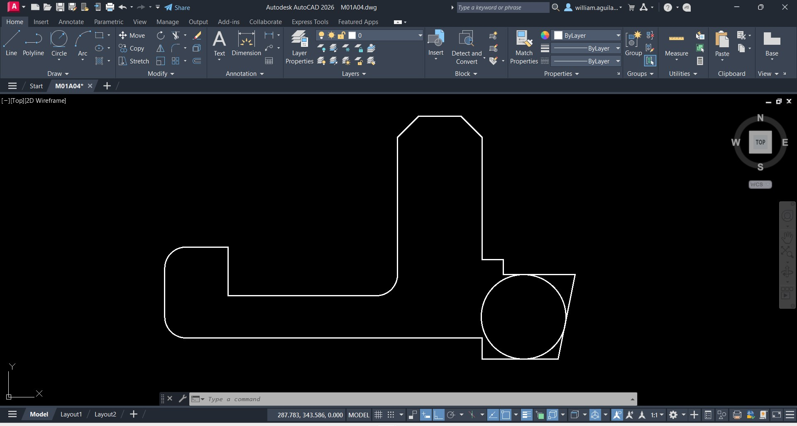</div>

2. Utilizando el comando **DIMSTYLE** y a partir del estilo Standard, cree un estilo con el nombre _DAPC - Standard_, modifique el tamaño del texto a 1.25 mm, flechas a 1.5 mm y precisión con 2 decimales.

<div align="center">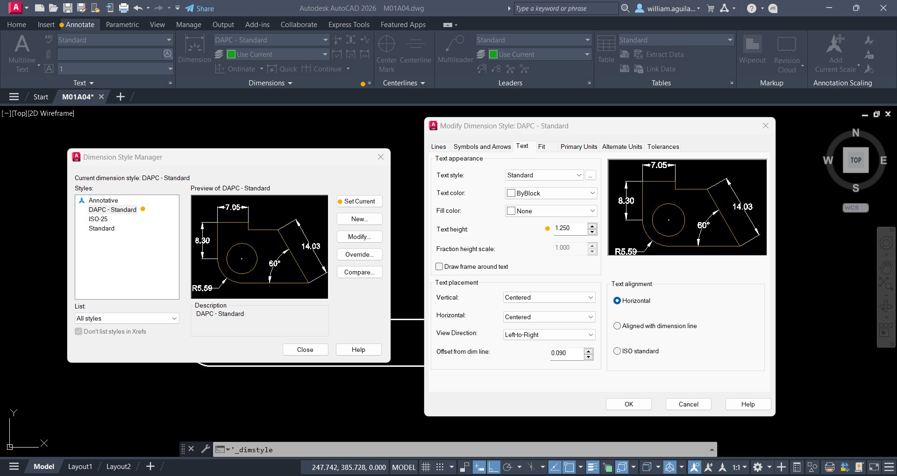</div>

3. Utilizando las herramientas _Annotate / Dimensions_ o el comando **DIM**, acote la figura en la capa _0-Dimension_ y con el estilo creado.

<div align="center">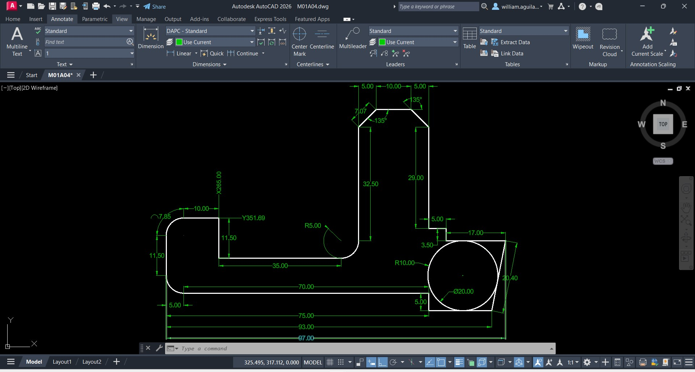</div>

4. Utilizando las herramientas del menú _Annotate / Centerlines_ y _Annotate / Leaders_, incluya las líneas centrales que definen los ejes de elementos curvos y líneas de proyección central, y agregue líneas directrices con notas descriptivas. El uso de estos elementos ofrece mayor legibilidad e interpretación de las dimensiones y elementos del dibujo.

<div align="center">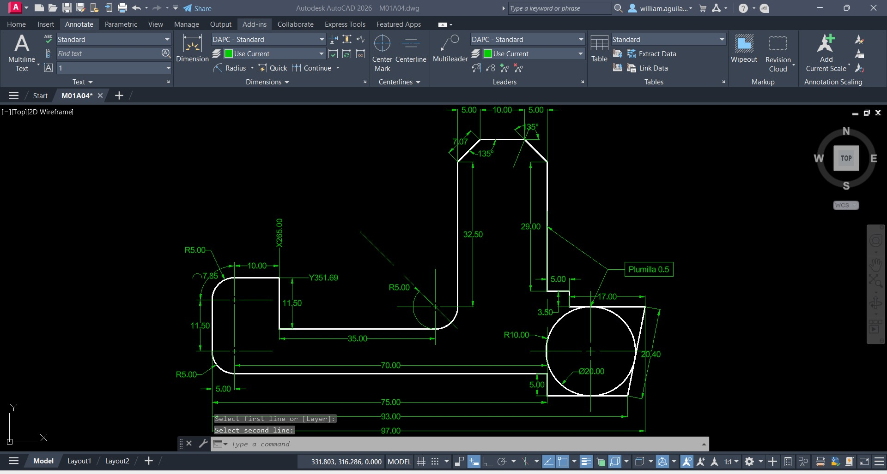</div>

Complementariamente, cree estilos personales a partir del estilo de dimensión _ISO-25_, acote la figura y compare con el estilo _Standard_.

> Tenga en cuenta que al igual que los textos simples y multilínea, los acotados también cambian su tamaño en función de la escala de impresión, por lo que se recomienda crear estilos anotativos para que se conserve el tamaño definido de los textos.


## Actividades de proyecto :triangular_ruler:

Utilizando la [Plantilla de Microsoft Word](../../file/report/R.DAPC.PlantillaSoporteDesarrollo.docx) suministrada, cree un documento soporte mostrando las actividades desarrolladas en el orden presentado en esta actividad, junto con las consideraciones de diseño, los análisis y recomendaciones realizadas para las actividades del proyecto. Convierta a Adobe Acrobat (.pdf) y guarde en la carpeta _/report_ del repositorio de datos, nombre el archivo con el código de la actividad agregando al final la fecha de control documental en formato aaaammdd (p. ej. M01A01_20250531.pdf).

Las especificaciones técnicas detalladas del proyecto para este módulo del curso, se encuentran en el archivo: [DAPC_ProyectoCAD.xlsx](DAPC_ProyectoCAD.xlsx)

En la siguiente tabla se listan las actividades que deben ser desarrolladas y documentadas por cada grupo de proyecto.

| Actividad | Alcance                                                                                                                                                                                                                                                                                                                                                                                                                                                                                                                                              |
|:----------|:-----------------------------------------------------------------------------------------------------------------------------------------------------------------------------------------------------------------------------------------------------------------------------------------------------------------------------------------------------------------------------------------------------------------------------------------------------------------------------------------------------------------------------------------------------|
| M01A04    | Esta actividad no requiere del desarrollo de elementos en el avance del proyecto final, los contenidos son evaluados a partir de la entrega de los ejercicios definidos en la actividad.                                                                                                                                                                                                                                                                                                                                                             |
| M01A04    | En una tabla y al final del informe de avance de esta entrega, indique el detalle de las actividades realizadas por cada integrante de su grupo; utilice las siguientes columnas: `Nombre del integrante`, `Actividades realizadas`, `Tiempo dedicado en horas` (si presenta la entrega individualmente, no es necesaria la presentación de esta tabla).<br><br>Para actividades que no requieren del desarrollo de elementos de avance, indicar si realizo la lectura de la guía de clase y las lecturas indicadas al inicio en los requerimientos. | 

> Nota 1: para la revisión del proyecto final, guarde los libros cálculo de Microsoft Excel y los archivos generados en esta actividad, en las localizaciones indicadas en cada numeral.
>
> Nota 2: una vez el instructor realice la revisión y el estudiante presente las correcciones o ajustes solicitados, será necesario cargar una nueva versión de los archivos en el repositorio del proyecto, incluyendo o actualizando al final del nombre del archivo, la fecha de presentación en formato aaaammdd y manteniendo las versiones anteriores presentadas.
>


## Referencias

* https://help.autodesk.com/view/ACD/2026/ESP
* https://help.autodesk.com/view/ACD/2026/ENU/
* [Autodesk AutoCAD / Conceptos básicos y avanzados de textos](https://help.autodesk.com/view/ACDLT/2024/ESP/?guid=GUID-1B3E8624-ED88-4409-AEA2-32836332AB27)
* [Autodesk AutoCAD / Dimensionamiento](https://help.autodesk.com/view/ACD/2025/ESP/?guid=GUID-45C1A271-9650-4927-858F-B3BDB19B3E6C)
* [Autodesk AutoCAD / Acerca de la creación de líneas directrices](https://help.autodesk.com/view/ACD/2025/ESP/?guid=GUID-8E2FF7CD-1DF9-49F8-AA10-A614C7E63F68)
* [AutoCAD para todos / Dibujo isométrico con acotado y manejo de impresión](https://www.youtube.com/watch?v=Yu6_rZKDoDU)

## Control de versiones

| Versión    | Descripción        | Autor                                      | Horas |
|------------|:-------------------|--------------------------------------------|:-----:|
| 2025.07.15 | Versión inicial.   | [rcfdtools](https://github.com/rcfdtools)  |  12   |


##

_R.DAPC es de uso libre para fines académicos, conoce nuestra licencia, cláusulas, condiciones de uso y como referenciar los contenidos publicados en este repositorio, dando [clic aquí](../../LICENSE.md)._

_¡Encontraste útil este repositorio!, apoya su difusión marcando este repositorio con una ⭐ o síguenos dando clic en el botón Follow de [rcfdtools](https://github.com/rcfdtools) en GitHub._


| [:arrow_backward: Anterior](../M01A03/Readme.md) | [:house: Inicio](../../README.md) | [:beginner: Ayuda / Colabora](https://github.com/rcfdtools/R.DAPC/discussions/99999) | [Siguiente :arrow_forward:](../M01A05/Readme.md) |
|--------------------------------------------------|-----------------------------------|--------------------------------------------------------------------------------------|--------------------------------------------------|

[^1]: 