# 1.5. Layout e Impresión
Keywords: `mview` `print` `zoom` `scale` `mvsetup` `block` `field` `m01a05`

Creación de plantillas. Espacio papel y espacio modelo. Asignación de escala. Configuración de impresora y trazadores (plotter). Configuración del trazado. Impresión. Comandos MVSETUP, PRINT, ZOOM, SCALE.                                           

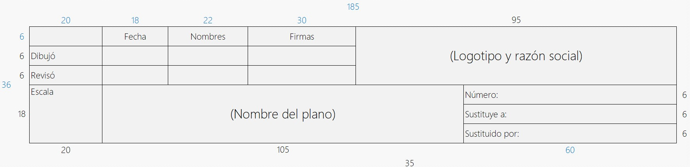

## Objetivos

Al finalizar esta actividad, el estudiante:

* Diferencia y configura apropiadamente los parámetros para la impresión de planos realizados en CAD.
* Crear plantillas de impresión con campos dinámicos.
* Imprimir planos digitales en formado Adobe Acrobat .pdf.

## Requerimientos

Archivos, actividades previas, lecturas y herramientas requeridas para el desarrollo de esta actividad:

| Requerimiento                                                                      | Descripción                                                                                                    |
|:-----------------------------------------------------------------------------------|:---------------------------------------------------------------------------------------------------------------|
| [:toolbox:Herramienta](https://www.autodesk.com/products/autocad)                  | Autodesk Autocad 3D 2026 o superior.                                                                           |
| [:toolbox:Herramienta](https://www.microsoft.com/es/microsoft-365/excel?market=bz) | Microsoft Excel 365.                                                                                           |
| [:date:DAPC_TamanoPapelNTC1687.xlsx](DAPC_TamanoPapelNTC1687.xlsx)                 | Libro de cálculo con tamaños de papel estándar definidos en norma NTC-1678 y dimensionador de rótulos básicos. |

> Para los diferentes avances de proyecto, es necesario guardar y publicar las diferentes versiones generadas del (los) libro (s) de Microsoft Excel, reportes o informes y dibujos generados, agregando al final la fecha de control documental en formato aaaammdd, p. ej., _M01A01_20250710.dwg_.

## 1. Formatos para impresión [^1]

Dependiendo del tipo y tamaño del dibujo se debe utilizar un formato de impresión y unos grosores en las líneas de dibujo que facilite la comprensión y que nos aporte los datos necesarios sobre la pieza que está representada en el dibujo. Además, para favorecer la estandarización, los formatos y las líneas estarán normalizados.

Los tamaños, formatos de papel, están regulados por la norma de estandarización [ISO](https://www.iso.org/) y que proviene de la alemana [DIN](https://www.din.de/en). De esta forma, los formatos de papel se reconocen por su norma, esto es la ISO A4 (DIN A4) es una hoja de papel que mide 210×297 mm. Este formato es el más utilizado para dibujos pequeños.

Para identificación de los tamaños debemos tener en cuenta que cada formato de mayor orden, es la mitad del anterior, es decir, ISO A5 (DIN A5) es la mitad de la ISO A4 (DIN A4). De la misma forma, la ISO A3 (DIN A3) es el doble de la ISO A4 (DIN A4). Al conjunto de estos tamaños se le llama serie A. 

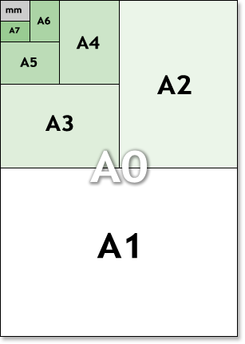 Tomado de: /www.lehighprint.us
 

> Tenga en cuenta que en el mundo existen diferentes tamaños estándar de papel para impresión y que el más utilizado es el [ISO](https://www.iso.org/) estándar y sus diferentes variaciones, también existen los [ANSI](https://www.ansi.org/) y los ARCH, p. ej., ISO A, ISO B, N. American ANSI y N. American ARCH or Architectural.[^2]

De acuerdo a la Norma Técnica Colombiana NTC-1687 del 2003 de Dibujo técnico para formato y plegado de planos técnicos, los tamaños estándar de hoja, tamaño de rótulo y márgenes en milímetros son:

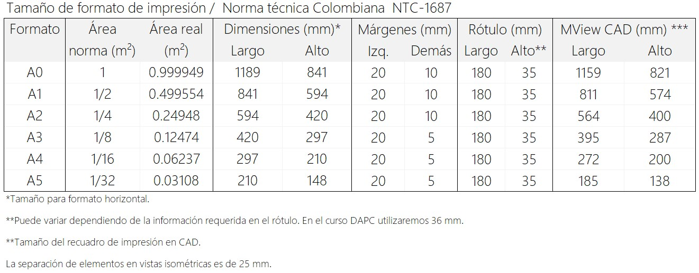

La disposición de la caja de rotulado, será la parte inferior de la hoja de impresión en el caso del formato ISO A4, y en la parte inferior derecha para el resto de formatos.

> La altura del rótulo depende del tipo de formato, puede variar, p. ej., entre los 35 mm y los 51 mm.

Para el desarrollo del curso DAPC, utilizaremos como referencia los siguientes formatos:

Rótulo papel A4 - Formato vertical 

Rótulo papel A4 - Formato horizontal 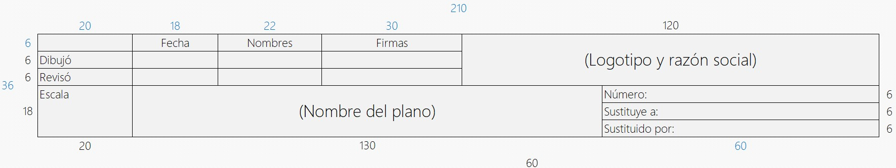

1. En AutoCAD, cree una copia del archivo _/file/cad/M01A04.dwg_ que contiene la configuración de Layers y dimensiones establecida en actividades anteriores, y guarde como _/file/cad/M01A05.dwg_. Con el comando **UNITS**, verifique que las unidades de dibujo han sido establecidas en milímetros. Conserve como ejemplo la figura acotada y el rótulo que contiene los campos de área y perímetro.

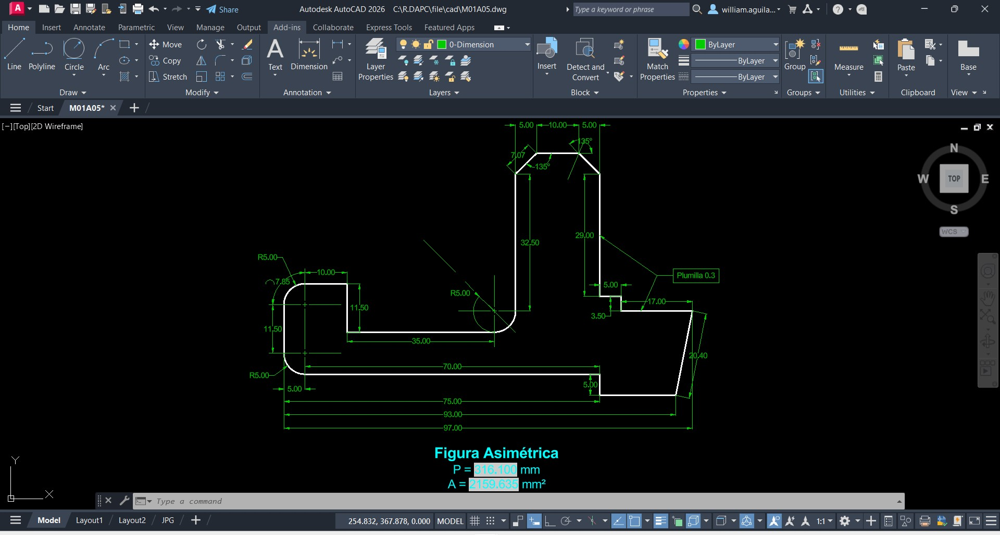

2. Desde la barra de estado, elimine los Layout existentes en el dibujo y cree uno nuevo con el nombre _A4-Vertical_. Elimine la ventana a la vista del modelo y desde las propiedades del _Layout_ creado y la opción _Page Setup Manager_, establezca las siguientes especificaciones:

* Printer / Plotter: DWG To PDF.pc3.
* Page size: ISO full bleed A4 (210.00 x 297.00 MM). Este tipo de papel le permitirá tener márgenes reducidas.
* Plot scale: 1 unit = 1 mm.
* Plot style table: monochrome.pctb.
* Drawing orientation: Portrait.

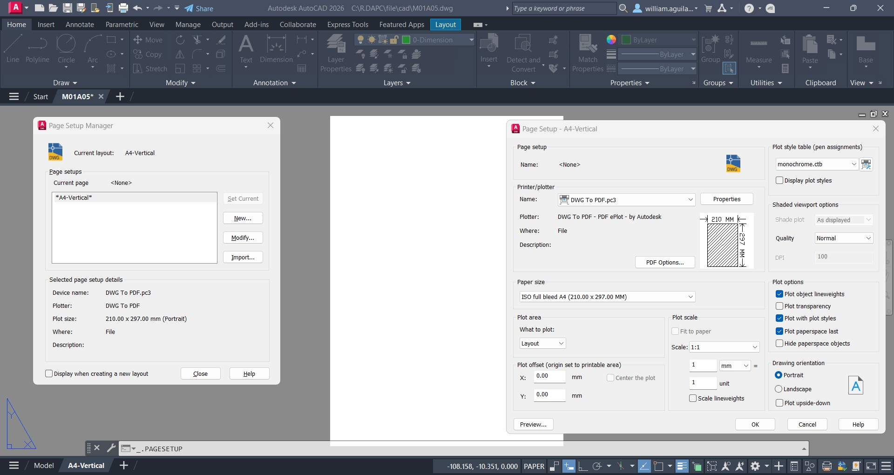

3. Utilizando las herramientas de dibujo y sobre la capa cero (0), cree un polígono de 185 x 287 milímetros de ancho y alto con orígen en la coordenada absoluta (20,5). Estos valores ya contienen las márgenes de reborde definidas en la norma NTC-1687. Observará que el recuadro ha sido creado centrado horizontalmente y a la margen izquierda requerida de 20 milímetros.

> El orígen de coordenadas absoluto del espacio de papel corresponde a la esquina inferior izquierda y el punto de orígen del recuadro del marco de impresión, debe ser localizado a partir de las márgenes.

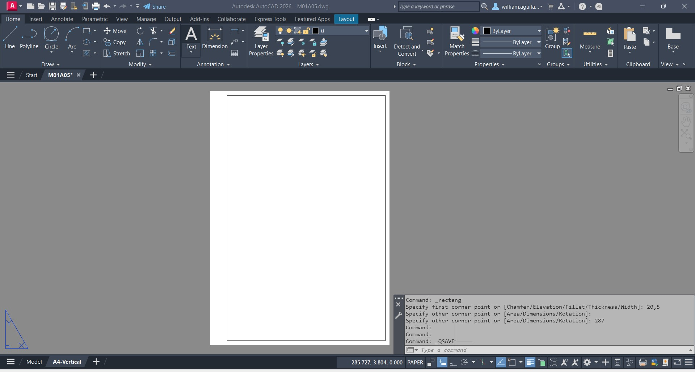

4. Con el comando **OFFSET** o con el comando **COPY** / **A**rray, dibuje líneas paralelas a la línea inferior, utilizando como referencia las dimensiones establecidas para el rótulo vertical.

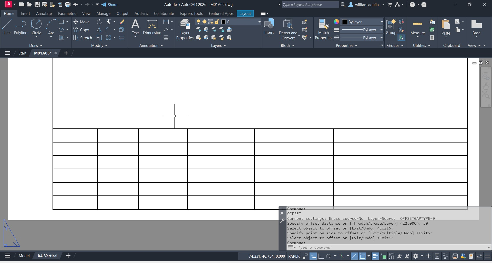

5. Utilizando el comando **TRIM**, recorte las líneas internas que delimitan las zonas del rótulo. Luego incluya los textos de una línea requeridos para cada elemento, utilice tamaño de 1.5 mm para textos secundarios y 2 mm para los principales. Desde la ventana de propiedades, ajuste los grosores de las líneas internas a 0.18 mm y externa del marco principal a 0.4 mm.

> Para garantizar que todos los rótulos se ubiquen a la misma distancia de los bordes, cree un texto con orígen en la coordenada absoluta (22.25,7.25).

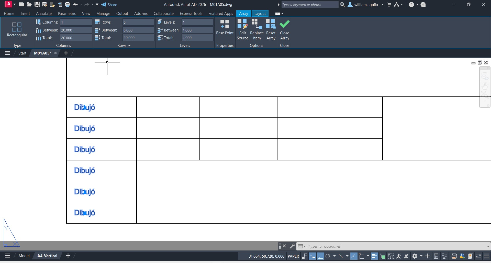

6. Copie y pegue el array de texto utilizando como referencia los anchos de las columnas establecidas.

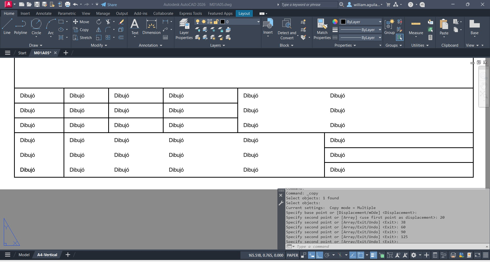

7. Con el comando **EXPLODE**, separe los arrays, elimine y modifique los textos requeridos.

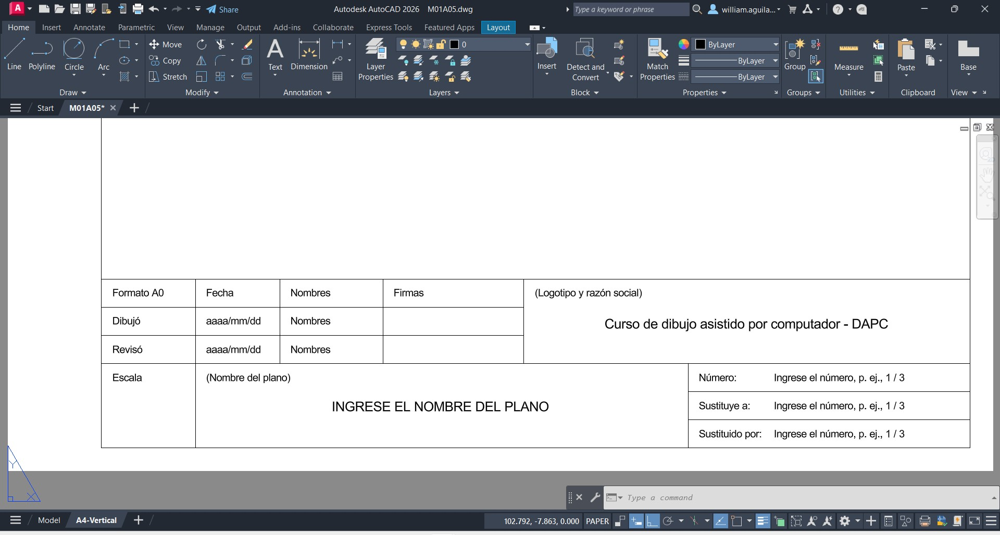

8. Para la creación de los campos de atributos que el dibujante diligenciará durante el proceso de elaboración del plano, desde el menú _Insert / Block Definition / Define Attributes_, cree uno a uno los atributos requeridos y localícelos por encajado en los puntos de inserción de los textos usados como referencia a partir del array. Utilice texto multilínea para `ID-EMPRESA` e `ID-TITULO`.

> Para que al insertar el rótulo este solicite los atributos del rótulo, al menos uno de los atributos definidos no sebe ser definido con un valor o texto por defecto.

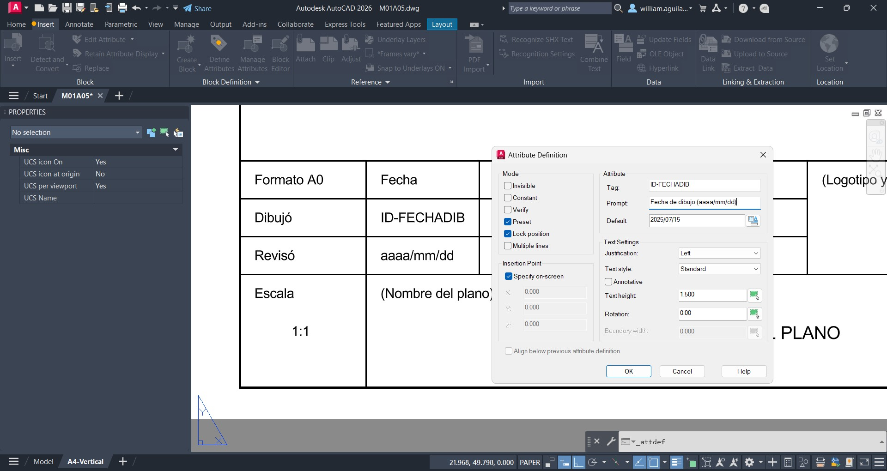

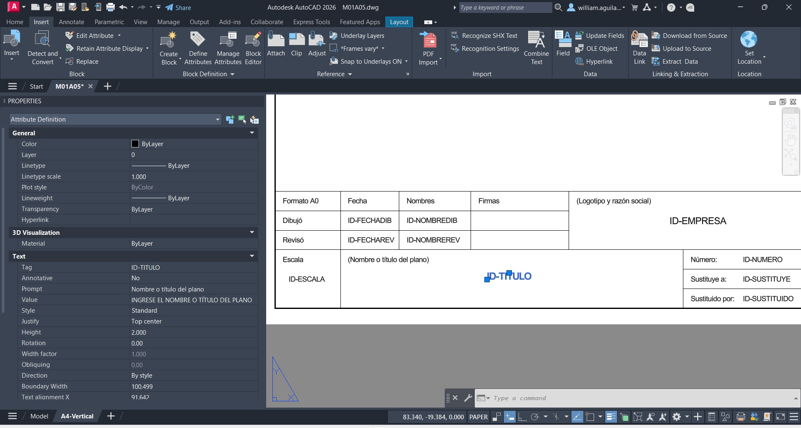

9. Una vez comprobada la localización de los elementos del rótulo y los atributos requeridos, guarde los cambios realizados en el dibujo y luego desde el botón de AutoCAD, guarde el archivo en la carpeta de bloque como _/file/cad/block/BloquesFormatoA4Vertical.dwg_. Copie todos los objetos del espacio de impresión o el layout _A4-Vertical_, al espacio de modelado, luego elimine el layout. Utilizando el menú _Insert / Block Definition / Set Base Point_, establezca la esquina inferior izquierda del rótulo como punto de inserción y guarde el archivo.

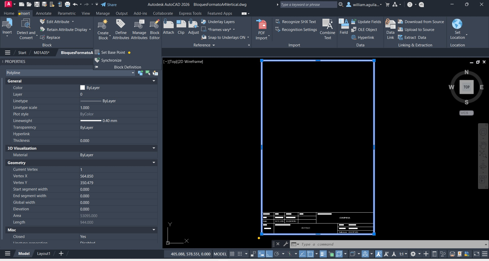

Cierre el archivo del bloque.

10. Abra nuevamente el archivo _/file/cad/M01A05.dwg_ y elimine todos los objetos contenidos en la ventana del layout A4-Vertical. Desde el menú _Insert / Block / Recent Blocks_, inserte el archivo _/file/cad/block/BloquesFormatoA4Vertical.dwg_, como punto de inserción establezca la coordenada (20,5) correspondientes a la esquina inferior del rótulo de acuerdo a las márgenes establecidas previamente.

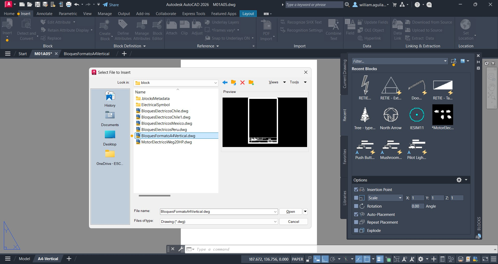

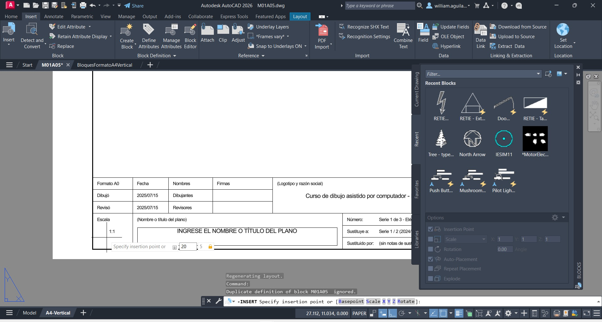

12. Una vez definido el punto de inserción, AutoCAD solicitará el diligenciamiento de los atributos del rótulo a partir de los campos definidos.

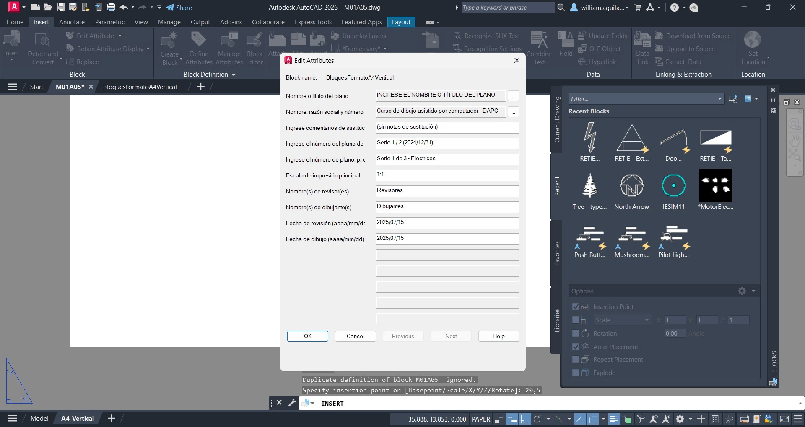

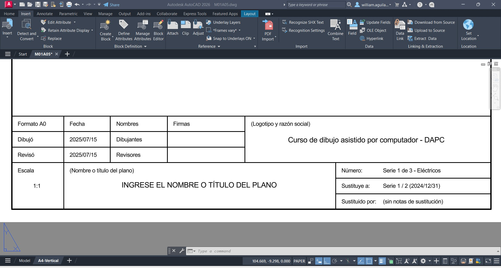

> Desde ahora, cada vez que requiera insertar el rótulo en cualquier dibujo, podrá hacerlo utilizando este archivo de bloque.

Cómo actividad complementaria, a partir del rótulo vertical, cree el rótulo horizontal A4 y los rótulos para impresión en formato ISO-A0.

## 2. Layout Viewports e impresión

1. Utilizando el comando **MVIEW** o desde el menú _Layout / Layout Viewports_, inserte en la capa cero (0), una ventana de impresión del espacio de modelado. Establezca por encajado las esquinas superior izquierda e inferior derecha del área útil del rótulo. Observará que automáticamente se ha escalado el dibujo del espacio del modelo al espacio de impresión. Opcionalmente y con el comando **ZOOM**, podrá acercarse a diferentes zonas del dibujo para verificar el grosor correcto de las plumas de impresión.

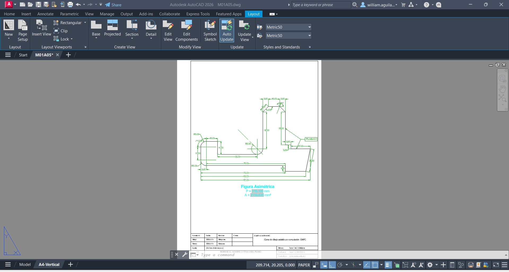

2. Desde las propiedades de la ventana de layout, establezca una escala de 1:1, observará que la figura ocupa una fracción del espacio disponible en la ventana y que al medir con el comando **DIST**, las medidas son idénticas a las del espacio de modelado. También observará que el grosor de la pluma de impresión de las cotas es muy grueso, ajuste a 0.09.

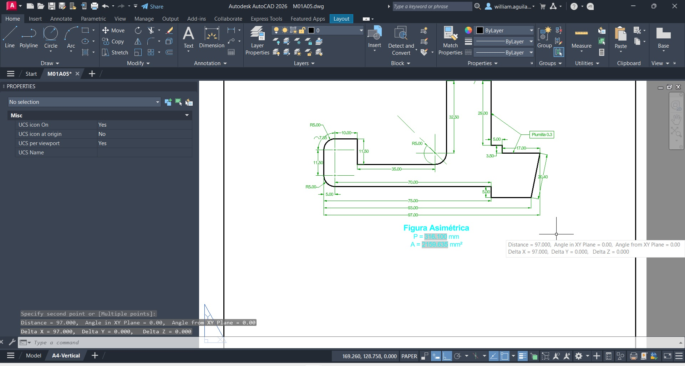

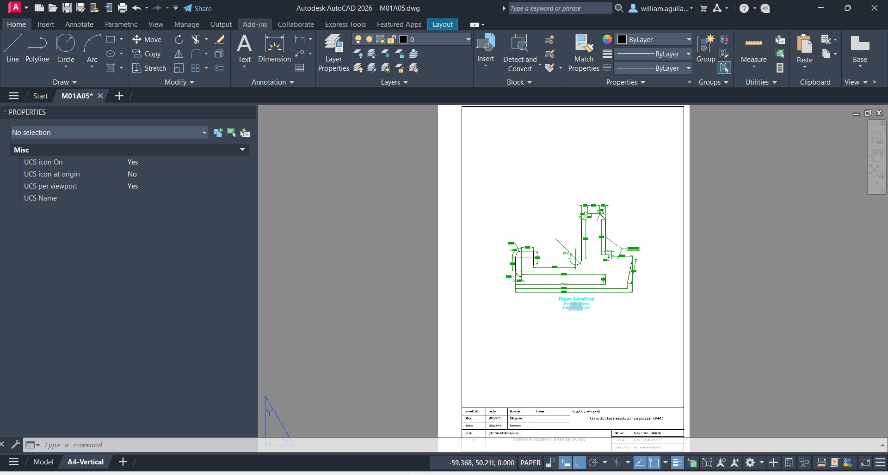

3. Establezca en la ventana, una escala de 1:1.5 y con el comando <kbd>ctrl</kbd> + <kbd>P</kbd> o **PRINT**, imprima en formato .pdf, guarde como _/file/report/M01A05-A4-Vertical.pdf_ y visualice el archivo.

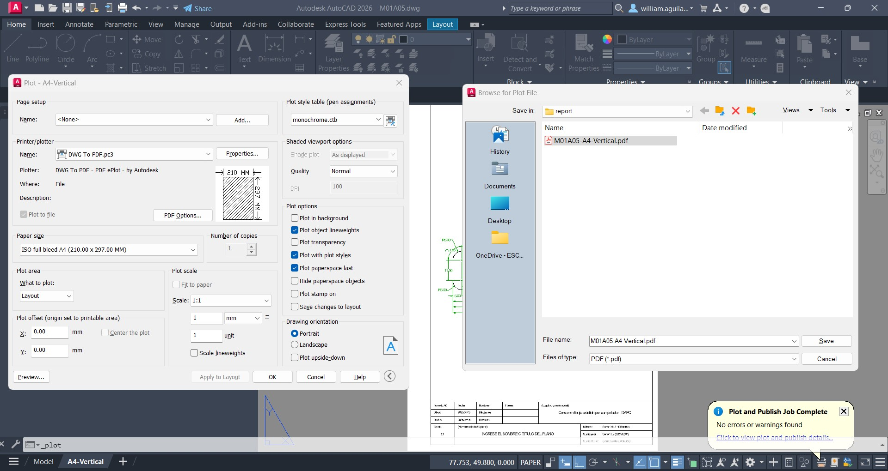

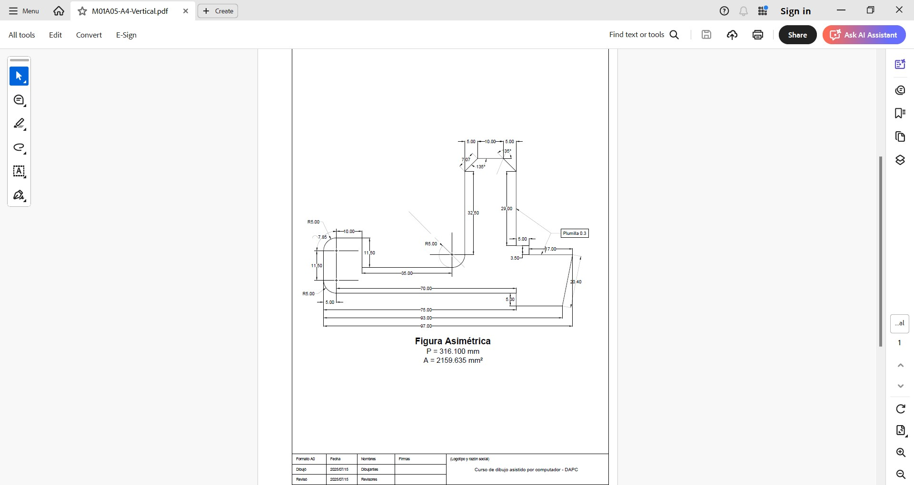

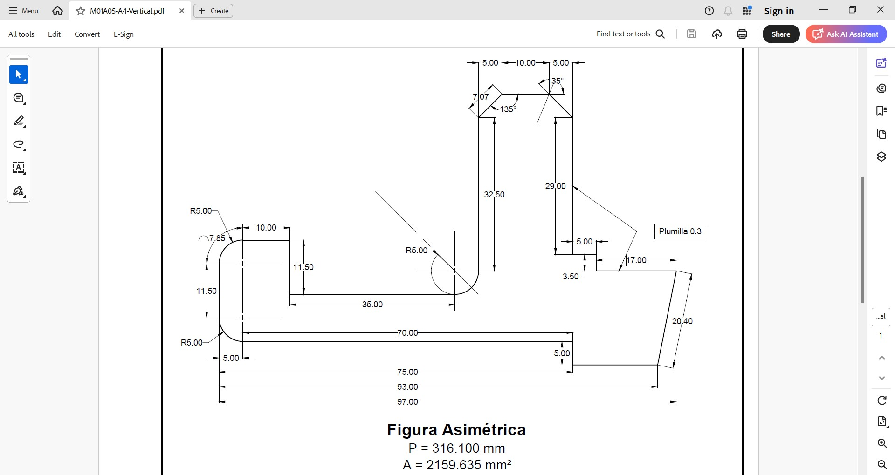

4. Dando doble clic en cualquiera de los campos del formato, ajuste las propiedades específicas para el dibujo realizado y vuelva a imprimir.

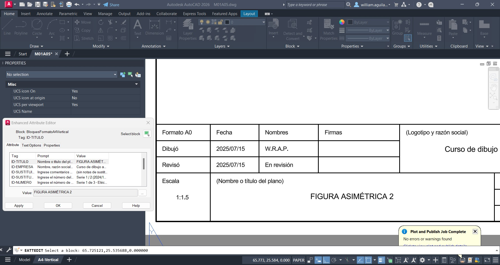

> Opciones complementarias de dibujo para impresión pueden ser establecidas con el comando **MVSETUP**.
>
> El archivo creado puede ser guardado con la extensión _.dwt_ para crear así una plantilla de dibujo e impresión. Guardar como /file/cad/DAPC.dwt.

## Actividades de proyecto :triangular_ruler:

Utilizando la [Plantilla de Microsoft Word](../../file/report/R.DAPC.PlantillaSoporteDesarrollo.docx) suministrada, cree un documento soporte mostrando las actividades desarrolladas en el orden presentado en esta actividad, junto con las consideraciones de diseño, los análisis y recomendaciones realizadas para las actividades del proyecto. Convierta a Adobe Acrobat (.pdf) y guarde en la carpeta _/report_ del repositorio de datos, nombre el archivo con el código de la actividad agregando al final la fecha de control documental en formato aaaammdd (p. ej. M01A01_20250531.pdf).

Las especificaciones técnicas detalladas del proyecto para este módulo del curso, se encuentran en el archivo: [DAPC_ProyectoCAD.xlsx](DAPC_ProyectoCAD.xlsx)

En la siguiente tabla se listan las actividades que deben ser desarrolladas y documentadas por cada grupo de proyecto.

| Actividad | Alcance                                                                                                                                                                                                                                                                                                                                                                                                                                                                                                                                              |
|:----------|:-----------------------------------------------------------------------------------------------------------------------------------------------------------------------------------------------------------------------------------------------------------------------------------------------------------------------------------------------------------------------------------------------------------------------------------------------------------------------------------------------------------------------------------------------------|
| M01A05    | Cree y dibuje los elementos de proyecto del grupo _1. Especificaciones técnicas generales_, correspondientes a: creación de plantilla _ /file/cad/DAPC.dwt_, formatos para impresión ISO-A0 / ISO-A4, horizontal y vertical. Formatos adicionales pueden ser incluídos en la plantilla.                                                                                                                                                                                                                                                              |
| M01A05    | Cree o genere los elementos de proyecto del grupo _5. Planos_, correspondientes a: planta general, cubiertas y fachadas, corte longitudinal, corte transversal, red eléctrica interna 110v, red eléctrica interna 220v, red de datos usando cableado, red foto-voltáica, red vigilancia o seguridad.                                                                                                                                                                                                                                                 |
| M01A05    | En una tabla y al final del informe de avance de esta entrega, indique el detalle de las actividades realizadas por cada integrante de su grupo; utilice las siguientes columnas: `Nombre del integrante`, `Actividades realizadas`, `Tiempo dedicado en horas` (si presenta la entrega individualmente, no es necesaria la presentación de esta tabla).  Para actividades que no requieren del desarrollo de elementos de avance, indicar si realizo la lectura de la guía de clase y las lecturas indicadas al inicio en los requerimientos. | 

> Nota 1: para la revisión del proyecto final, guarde los libros cálculo de Microsoft Excel y los archivos generados en esta actividad, en las localizaciones indicadas en cada numeral.
>
> Nota 2: una vez el instructor realice la revisión y el estudiante presente las correcciones o ajustes solicitados, será necesario cargar una nueva versión de los archivos en el repositorio del proyecto, incluyendo o actualizando al final del nombre del archivo, la fecha de presentación en formato aaaammdd y manteniendo las versiones anteriores presentadas.
>

## Referencias

* https://help.autodesk.com/view/ACD/2026/ESP
* https://help.autodesk.com/view/ACD/2026/ENU/
* [Humberto Amaya Alvear / Selección del formato según normas NTC 1687](https://www.youtube.com/watch?v=D6NTFHMQWDk)
* https://ibiguridt.wordpress.com/temas/materiales/formatos/
* https://tienda.icontec.org/gp-ntc-dibujo-tecnico-formato-y-plegado-de-planos-tecnicos-ntc1687-2023.html
* [AutoCAD para todos / Creación de vistas base y proyectada con AutoCAD](https://www.youtube.com/watch?v=ToCCqdeTCz8)
* [AutoCAD para todos / Dibujo isométrico con acotado y manejo de impresión](https://www.youtube.com/watch?v=Yu6_rZKDoDU)
* https://www.lehighprint.us/page/paper-size-chart-faq

## Control de versiones

| Versión    | Descripción        | Autor                                      | Horas |
|------------|:-------------------|--------------------------------------------|:-----:|
| 2025.07.15 | Versión inicial.   | [rcfdtools](https://github.com/rcfdtools)  |  12   |

##

_R.DAPC es de uso libre para fines académicos, conoce nuestra licencia, cláusulas, condiciones de uso y como referenciar los contenidos publicados en este repositorio, dando [clic aquí](../../LICENSE.md)._

_¡Encontraste útil este repositorio!, apoya su difusión marcando este repositorio con una ⭐ o síguenos dando clic en el botón Follow de [rcfdtools](https://github.com/rcfdtools) en GitHub._

| [:arrow_backward: Anterior](../M01A04/Readme.md) | [:house: Inicio](../../README.md) | [:beginner: Ayuda / Colabora](https://github.com/rcfdtools/R.DAPC/discussions/99999) | [Siguiente :arrow_forward:](../M01A06/Readme.md) |
|--------------------------------------------------|-----------------------------------|--------------------------------------------------------------------------------------|--------------------------------------------------|

[^1]: https://ibiguridt.wordpress.com/temas/materiales/formatos/
[^2]: https://www.lehighprint.us/page/paper-size-chart-faq