# 2.1.b. Conceptos aplicados
Keywords: `electrical-ilumination` `upz` `bogota` `energy` `hydraulic-energy` `eolic-energy` `solar-energy` `shapefile` `m02a01b`

Simbología y estadísticas generales. Tablas relacionales.

En esta actividad, analizaremos la capa geográfica de Luminarias por Unidad de Planeamiento Zonal - UPZ de la ciudad de Bogotá - Colombia - Suramérica.

<div align="center">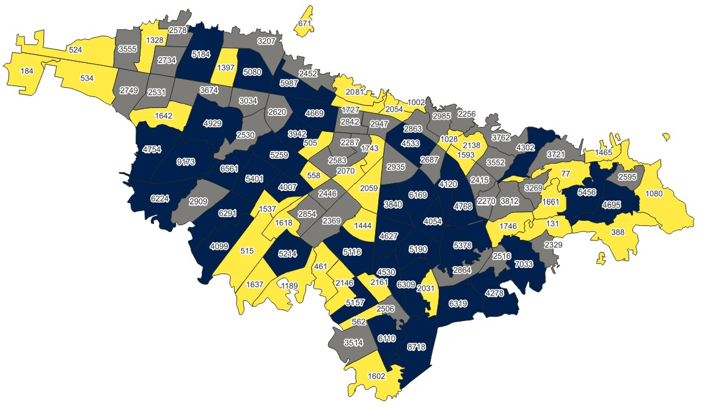</div>


## Objetivos

Al finalizar esta actividad, el estudiante:

* Carga, visualiza, simboliza y representa elementos geográficos.
* Incorpora y visualiza mapas base.
* Consulta y analiza tablas relacionales.


## Requerimientos

Archivos, actividades previas, lecturas y herramientas requeridas para el desarrollo de esta actividad:

<div align="center">

| Requerimiento                                                             | Descripción                                                                                        |
|:--------------------------------------------------------------------------|:---------------------------------------------------------------------------------------------------|
| [:toolbox:Herramienta](https://qgis.org/)                                 | QGIS 3.44 o superior.                                                                              |  
| [:round_pushpin:Luminarias_UPZ.shp](../../file/shp/Luminarias_UPZ.zip)    | Capa de polígonos UPZ con conteo de luminarias por tipo a 2025/08/14 obtenida de www.ideca.gov.co. |

</div>

> :blue_heart: El repositorio de proyecto deberá mantenerse durante la duración del curso, estableciendo permisos de escritura para los integrantes de su grupo y lectura para el instructor.
>
> Para los diferentes avances de proyecto, es necesario guardar y publicar las diferentes versiones generadas del (los) libro (s) de Microsoft Excel, reportes o informes y dibujos generados, agregando al final la fecha de control documental en formato aaaammdd, p. ej., _M01A01_20250710.dwg_.


## 0. Conceptos generales


### ¿Qué son la UPZ?

Una Unidad de Planeamiento Zonal (UPZ) es un instrumento de ordenamiento territorial que divide la ciudad de Bogotá en áreas más pequeñas que las localidades y más grandes que los barrios, buscando orientar el crecimiento urbano, definir normas específicas y facilitar la gestión del desarrollo de cada zona con base en sus características únicas. Las UPZ permiten una planificación detallada que responde a las dinámicas productivas y sociales de cada sector, facilitando la inversión en obras requeridas por la comunidad y promoviendo la participación ciudadana.
 

### ¿Qué son la luminarias?

Las luminarias en el espacio público son los aparatos (farolas, apliques, etc.) que contienen las lámparas y todos los accesorios necesarios para iluminar calles, parques, plazas y otras áreas de circulación y esparcimiento, proporcionando seguridad, visibilidad y embelleciendo el entorno urbano durante la noche. Su función es distribuir y filtrar la luz para permitir el desarrollo de actividades nocturnas y reducir riesgos para peatones y conductores.

En la ciudad de Bogotá, son utilizadas lúminarias de los siguientes tipos:

| Tipo                             | Descripción                                                                                                                                                                                                                                                                                                                                                                                                                                                                                                                                            |
|:---------------------------------|:-------------------------------------------------------------------------------------------------------------------------------------------------------------------------------------------------------------------------------------------------------------------------------------------------------------------------------------------------------------------------------------------------------------------------------------------------------------------------------------------------------------------------------------------------------|
| LED                              | Las lámparas LED son dispositivos de iluminación que utilizan diodos emisores de luz (LED) para producir luz. Los LED son semiconductores que emiten luz cuando una corriente eléctrica los atraviesa. Son conocidos por su eficiencia energética, larga vida útil y versatilidad en diversas aplicaciones de iluminación.                                                                                                                                                                                                                             |
| Halogenuro Metálico (MH) | Las lámparas de halogenuros metálicos son lámparas de descarga de alta intensidad (HID) que producen luz mediante un arco eléctrico a través de una mezcla gaseosa de mercurio y haluros metálicos. Se caracterizan por emitir una luz blanca de alta calidad y buena reproducción de color, lo que las hace ideales para aplicaciones que requieren precisión cromática y alta potencia lumínica. Se utilizan comúnmente en estadios, campos deportivos, iluminación urbana, espacios comerciales grandes y para el cultivo de plantas en interiores. |
| Sodio (Na)                       | Las lámparas de sodio son un tipo de lámpara de descarga de gas que producen luz mediante un arco eléctrico que pasa a través de vapor de sodio a baja o alta presión. Son conocidas por su gran eficiencia energética, que permite generar una gran cantidad de luz con un bajo consumo, y su larga vida útil. La luz que emiten es generalmente de un color amarillo brillante y penetra bien la niebla, lo que las hace muy utilizadas en alumbrado público y autopistas.                                                                           |


## 1. Visualización, consulta de atributos y representación geográfica

1. En QGIS, cree un mapa nuevo, cargue la capa [/shp/Luminarias_UPZ.shp](../../file/shp/Luminarias_UPZ.zip) y consulte su tabla de atributos. Podrá observar que se encuentran los campos de atributos correspondientes a: código de UPZ, nombre de UPZ, conteo de lámparas por tipo, total de lámparas, área y perímetro. Consulte los metadatos de la capa, encontrará que la capa contiene 112 polígonos y que para su trazado se ha utilizado el sistema de proyección de coordenadas EPSG: 3857, correspondiente a _WGS 84 / Pseudo-Mercator_ utilizado a nivel mundial con sistema geográfico en grados geodésicos y proyectado en metros usando Mercator o cilíndrica. 

<div align="center">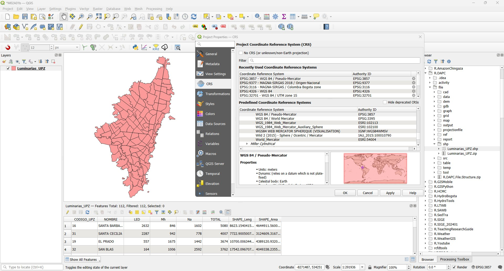</div>

2. Guarde el mapa QGIS cómo _/map/M02A01b.qgz_. Agregue nuevamente la capa al mapa y simbolice de forma categorizada la capa utilizando una rampa de color gradual (p. ej. _Viridis_ con rampa invertida), el total de lámparas (Campo: TOTAL) por UPZ. En la representación, los colores claros indican UPZ's con pocas lámparas y colores oscuros, UPZ's con muchas lámparas. En el panel lateral _Layers_, cambie el nombre de la capa por _Luminarias_UPZ (Categorized TOTAL)_.

<div align="center">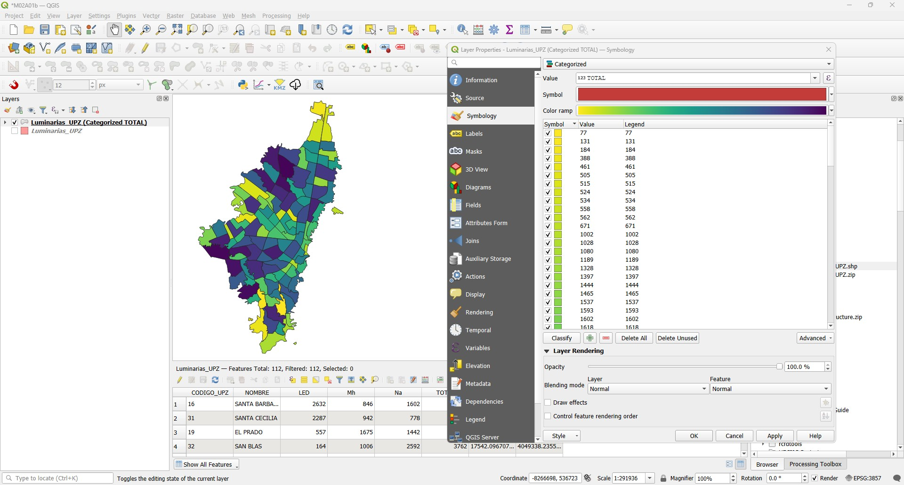</div>

3. Agregue nuevamente la capa _Luminarias_UPZ.shp_ al mapa y simbolice por agrupamiento de forma gradual en 3 clases por quantiles a partir del campo `TOTAL` utilizando la paleta _Cividis_ invertida. Incluya un rótulo del total de lámparas por cada UPZ. Renombre la capa cómo _Luminarias_UPZ (Graduated Quantile TOTAL)_. Podrá observar las zonas de Bogotá agrupadas en 3 clases y los valores de corte.

> Realice este mismo ejercicio para los demás modos de representación disponibles en QGIS: Equal Interval, Fixed Interval, Logarithmic Scale, Natural Breaks, Pretty Breaks y Standard Deviation.

<div align="center">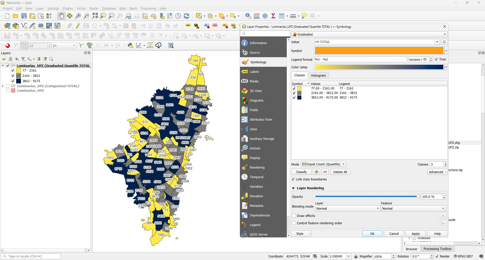</div>


## 2. Cálculo de densidades (lámparas / km²)

En la representación anterior, evaluámos el total de luminarias por UPZ teniendo en cuenta únicamente la localización de la UPZ y no su tamaño geográfico. El estudio de la densidad permite relacionar un valor representativo (cómo el total de las lámparas) con el tamaño del área geográfica, para así evaluar que UPZ's son las más densamente iluminadas.

1. Agregue la capa _Luminarias_UPZ.shp_ al mapa y renombre cómo _Luminarias_UPZ (Densidad Lum/km²)_. Abra la tabla de atributos y con el _Field Calculator_ cree un campo de atributos numérico real con 10 decimales de precisión con el nombre `Akm2` y calcule con la expresión `area(@geometry)/1000000`, el área en km² de cada UPZ.

> En la expresión, es necesario dividir en área geométrica calculada en m² para cada polígono entre 1000x1000, para realizar la conversión a km².
> 
> Al realizar modificaciones en la estructura original de la capa, QGIS ingresa antomáticamente al modo de Edición.

<div align="center">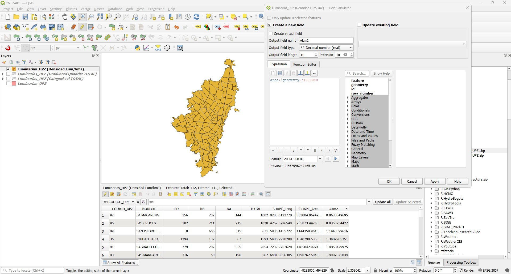</div>

2. Utilizando el calculador de campo, cree un campo numérico real con el nombre `DLumKm2` y con la expresión `"TOTAL" / "Akm2"`, calcule la densidad de luminarias por cada km². Ordene ascendente y descendentemente la columna del atributo creado, podrá observar que la UPZ con la menor densidad es _60 - PARQUE ENTRENUBES_ con 18.15 Lum/km² y con mayor densidad es _29 - MINUTO DE DIOS_ con 1735.75 Lum/km². Simbolice por quantiles en 3 grupos y rotule con la expresión `round("DLumKm2", 1)`, podrá observar que las zonas más densamente iluminadas se encuentran mayoritariamente al sur de la ciudad y en la localidad de Suba. Guarde y detenga el editor.

<div align="center">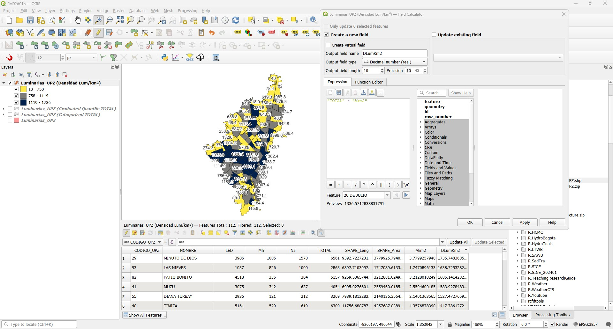</div>

3. Utilizando la herramienta de estadísticas, calcule el área total en km² de los polígonos correspondientes a las UPZ y la densidad promedio de las luminarias en Bogotá. Encontrará que las UPZ tienen un área total de 418.98 km² con una densidad de 900.687 Lum/km².

> Tenga en cuenta que si realiza una estadística con el campo `SHAPE_Area` que se encuentra en m², la herramienta de estadística, reportará el total del área en formato científico, mostrando el resultado como 4.1898e+08.   

<div align="center">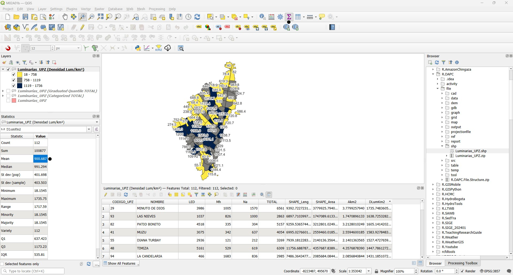</div>


## 3. Conteo de elementos por clase

En el ejemplo anterior, analizamos las densidades y representamos por quantiles en 3 clases, obteniendo valores de corte en 758.01, 1119.23 y 1735.75 Lum/km². Sin embargo, aún no conocemos cuantas UPZ se encuentran en cada una de las 3 clases utilizadas. Utilizando Python, podremos a través de un Script, identificar la clase a la cual pertenece cada UPZ.

Expresión de análisis en Python:
```
def classeval(var):
  cuteval = [758.0105954477, 1119.2344377237, 1736]
  j = 1
  for i in cuteval:
    if var <= i:
      return j
    j += 1
```

Llamado de función: `classeval("DLumKm2")`


1. En la tabla de atributos de la capa _Luminarias_UPZ (Densidad Lum/km²)_, cree un campo de atributos entero corto (Integer 32 bit) con el nombre `DLumKm2Cl` y con la expresión de Python, asigne el número de clase al cual pertenece.

<div align="center">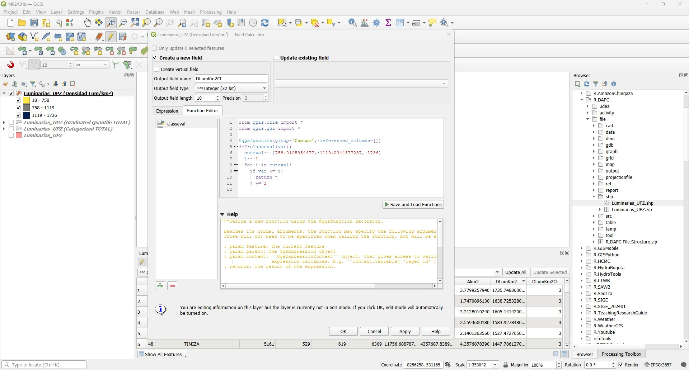</div>

2. Utilizando la herramienta _Processing Toolbox / Vector analysis / Statistics by categories_, obtenga el conteo de elementos y los estadísticos de densidad por clase.

<div align="center">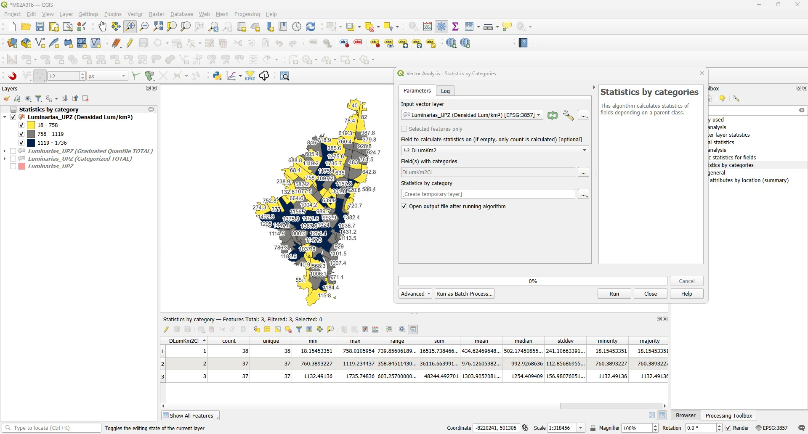</div>

3. Con el complemento _Plotly_, cree gráficas de análisis. Por tratarse de un análisis de quantiles, el número de elementos obtenidos en cada clase será similar. En cuanto a las densidades, podrá observar los promedios de las densidades en cada clase. 

Gráfico de conteo de UPZ por clase
<div align="center">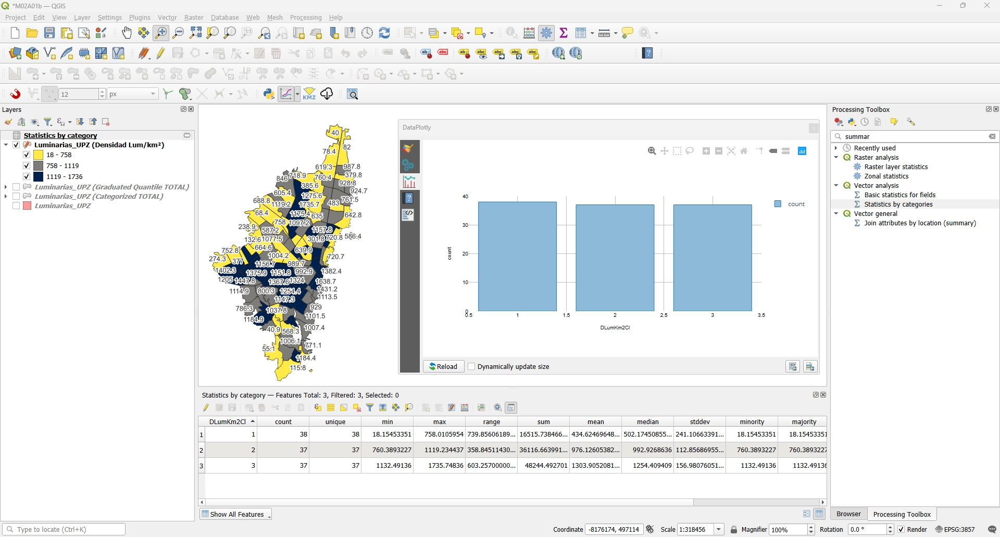</div>

Gráfico de promedio de densidades por clase
<div align="center">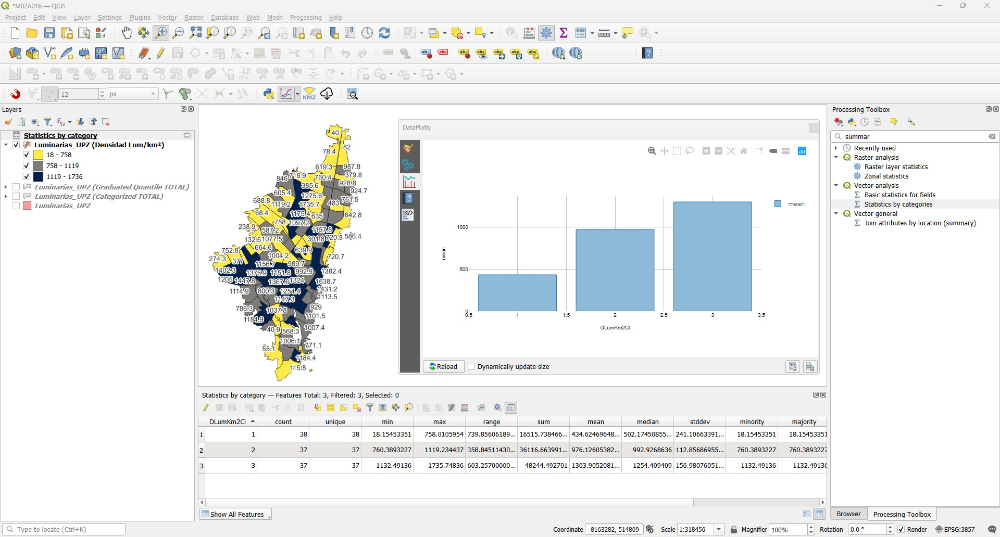</div>


## 4. Filtrado de elementos

Para conocer la localización de las UPZ's que tienen p. ej., 2500 o más lámparas LED, 600 o menos lámparas de Halogenuro Metálico (MH) y entre 300 y 1600 lámparas de  Sodio (Na), podrémos utilizar la herramienta Query Builder.

1. Agregue la capa _Luminarias_UPZ.shp_ al mapa y renombre cómo _Luminarias_UPZ (Filtro múltiple)_. Desde las propiedades de la capa y la pestaña Source, cree con _Query Builder_ el filtro solicitado utilizando la expresión: `"LED"  >= 2500 OR "Mh" <= 600 OR ("Na" >= 300 AND "Na" <= 1600) `. Encontrará que 96 polígonos cumplen con esta condición debido a que hemos incluido el operador OR, lo que significa que sí la UPZ cumple con una de las 3 condiciones, esta seguirá visible. Explore la tabla de atributos.

> Para comprender mejor la localización geográfica de las UPZ's que cumplen con la condición, agregue el mapa base XYZ de Google Maps desde https://mt1.google.com/vt/lyrs=m&x={x}&y={y}&z={z}, establezca transparencia del 65% en la capa y rotule con  `'LED: '  || "LED"  ||  '\n MH: '  ||  "Mh" ||  '\n Na: '  ||  "Na" `.
> 
> Mapas base complementarios en: https://github.com/opengeos/qgis-basemaps/blob/main/qgis_basemaps.py

<div align="center">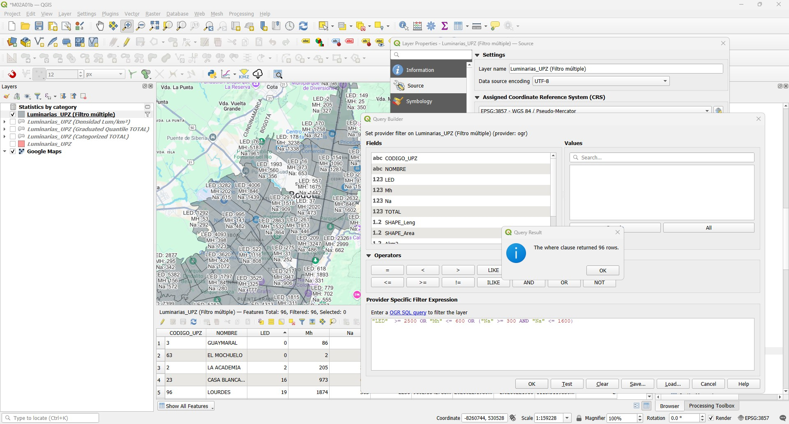</div>

2. Cambie el operador OR por el operador AND, para filtrar solo las UPZ's que cumplen simultáneamente con las 3 condiciones, encontrará que solo 15 polígonos cumplen con estos criterios. Explore la tabla de atributos.

<div align="center">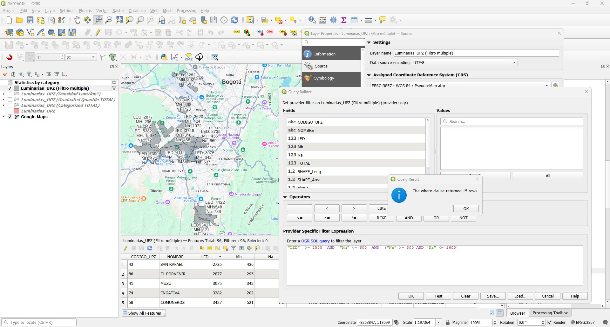</div>


## 5. Distribución porcentual

Calcule el % del área de cada polígono con respecto al total del área de la capa.

1. Agregue la capa _Luminarias_UPZ.shp_ al mapa y renombre cómo _Luminarias_UPZ (Distribución porcentual de área)_. Desde el menú _Vector_, ejecute la herramienta _Analysis Tools / Basic Statistics for Fields_ para el campo _Akm2_. 

<div align="center">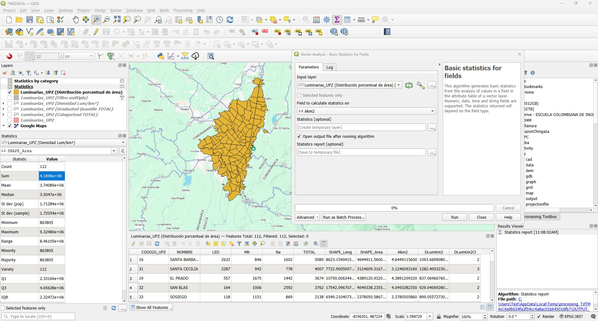</div>

Obtendrá los siguientes resultados:

* COUNT: 112
* UNIQUE: 112
* EMPTY: 0
* FILLED: 112
* MIN: 0.863804969
* MAX: 9.324857568
* CV: 0.4578688763424043
* SUM: 418.97965550400016
* MEAN: 3.740889781285716
* STD_DEV: 1.7128370006780733
* RANGE: 8.461052599
* MEDIAN: 3.5046956145
* MINORITY: 0.863804969
* MAJORITY: 0.863804969
* FIRSTQUARTILE: 2.3316556185
* THIRDQUARTILE: 4.656376681499999
* IQR: 2.3247210629999993

2. Para el cálculo porcentual de cada área, se divide cada valor entre la sumatoria obtenida de todos los polígonos y se multiplica por 100. Utilice el Field Calculador creando un campo numérico real con el nombre `Akm2DP`. Utilice la expresión `("Akm2" / 418.97965550400016) * 100`.

<div align="center">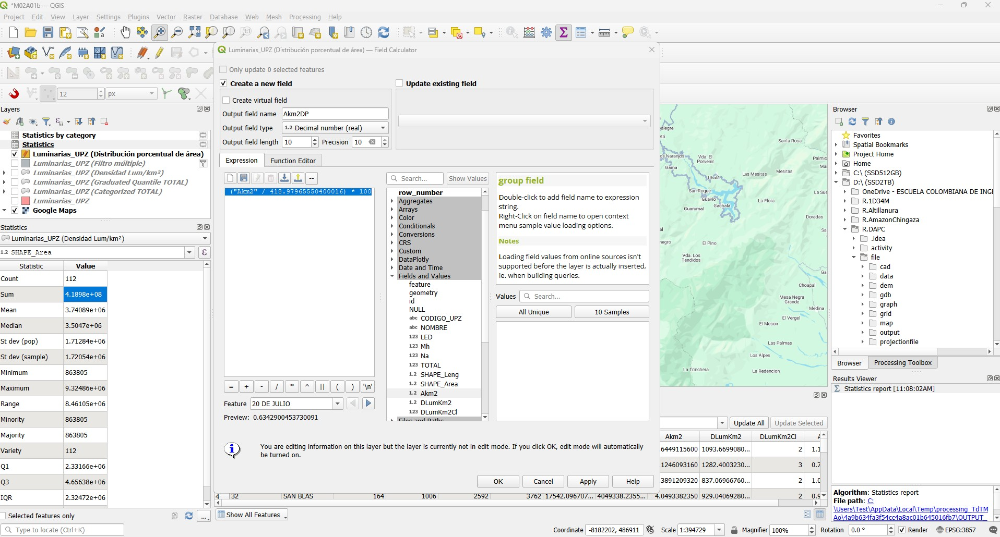</div>

3. Simbolice por cantidades usando Jenks, rotule con la expresión `round("Akm2DP",1) || '%'` y utilizando la herramienta _Statistics_, verifique que el total de los porcentajes distribuídos sea 100%.

<div align="center">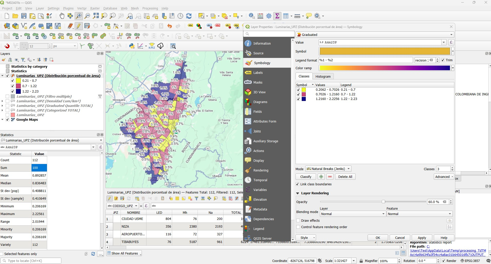</div>
<div align="center">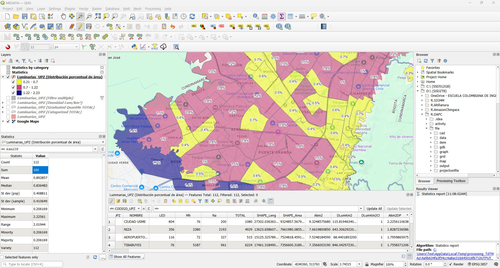</div>

> Realice el ejercicio anterior distribuyendo porcentualmente los diferentes tipos de iluminación por UPZ y el valor total.


## 6. Estimación de consumo y costo eléctrico mensual

Luego de analizar como están distribuidas los diferentes tipos de iluminación en la ciudad, es necesario estimar el consumo eléctrico total mensual utilizando p. ej., los siguientes valores de referencia:

* Horas de uso: desde las 6:15pm hasta las 5:45am, 11.5 horas por día en promedio.
* Días promedio: 30 días por mes.
* Tarifa eléctrica: $650 por kilovatio-hora (kWh).
* Potencia: depende del tipo de iluminación, para este ejemplo utilizaremos como referencia los valores presentados en la siguiente tabla. 

<div align="center">

Tabla de potencia por tipo de lámpara

| Tipo                      | Potencia (Watt o vatio) |
|:--------------------------|:-----------------------:|
| LED                       |           100           |
| Halogenuro Metálico (MH)  |           150           |
| Sodio (Na)                |           200           |

</div>

> La potencia en watts o vatios en iluminación, representa la cantidad de energía eléctrica por hora que consume una lámpara.
> 
> Tenga en cuenta que los valores estimados son hipotéticos y solo deben ser utilizados con fines académicos.

Para el cálculo total mensual por UPZ, se multiplica el total de luminarias de cada tipo por su potencia, por el número de horas promedio de encendido y se divide entre 1000 para obtener el valor en kilovatios.

<div align="center"> Consumo (kWh) = Potencia (kW) x Horas de uso<br><br></div>

1. Agregue la capa _Luminarias_UPZ.shp_ al mapa y renombre cómo _Luminarias_UPZ (Consumo mensual kWh y costo)_. Cree y calcule los siguientes campos de atributos numéricos reales:

| Campo      | Descripción                                                                  | Expresión                                                     |
|:-----------|:-----------------------------------------------------------------------------|:--------------------------------------------------------------|
| LEDConskWh | Consumo lámparas LED en kilovatio-hora (kWh) y por mes.                      | `"LED" * (100/1000) * 11.5 * 30`                              |
| MhConskWh  | Consumo lámparas Halogenuro Metálico (MH) en kilovatio-hora (kWh) y por mes. | `"Mh" * (150/1000) * 11.5 * 30`                               |
| NaConskWh  | Consumo lámparas Sodio (Na) en kilovatio-hora (kWh) y por mes.               | `"Na" * (200/1000) * 11.5 * 30`                               |
| CostoTotal | Costo total mensual de alumbrado público en millones de pesos                | `(("LEDConskWh" +  "MhConskWh" + "NaConskWh") * 650)/1000000` |

Rotule con la expresión `'$' || round("CostoTotal",1)` y simbolice por colores graduados usando el campo `CostoTotal`.

<div align="center"></div>
<div align="center">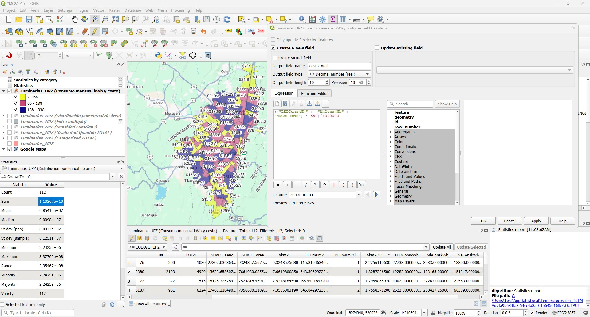</div>

2. Usando la herramienta _Statistics_, estime el costo total mensual de la ciudad en millones de pesos. Obtendrá que el alumbrado de la ciudad cuesta 11036.7 millones de pesos. Visualmente en el mapa de cantidades, podrá observar que UPZ's son las de mayores y menores costos.

> Para mejorar la visualización del mapa, en la barra de estado puede definir una rotación de -90°, localizando el norte a la izquierda.
> 
> Tenga en cuenta que los costos calculados son aproximados y que su cálculo detallado requiere de la distribución de luminarias por estrato, por potencia y por empresa prestadora debido a que las tarifas son variables.

<div align="center">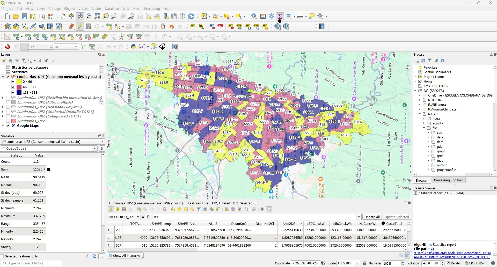</div>

3. Usando la herramienta _Statistics_, estime el consumo total mensual de la ciudad en millones de kilovatios por hora o GWh. Obtendrá que el alumbrado de la ciudad consume mensualmente 16.9795 GWh o 16979.5 MWh.

> Un GWh (Gigavatio hora) es una unidad de energía que representa mil millones (1 000 000 000) de vatios hora y es utilizada para medir la enorme capacidad energética de redes eléctricas nacionales, grandes industrias y proyectos de almacenamiento de energía. Se define a partir de la potencia (Gigavatios) multiplicada por el tiempo (hora). 

<div align="center">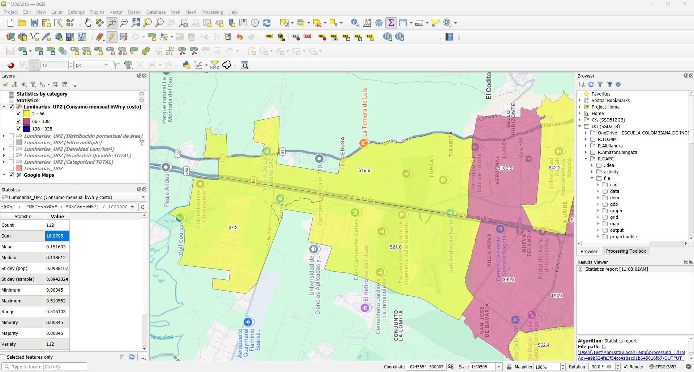</div>


## 7. Generación eléctrica requerida

Supongamos que la ciudad de Bogotá ha planteado un proyecto de generación eléctrica para alimentar la iluminación pública, p. ej., utilizando turbinas en una hidroeléctrica. 

<div align="center">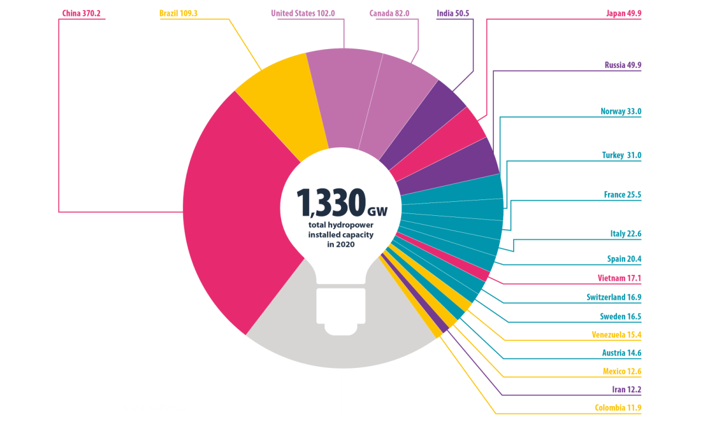<sub><br>Tomado de: <a href="https://elperiodicodelaenergia.com/las-10-centrales-hidroelectricas-mas-grandes-del-mundo/">https://elperiodicodelaenergia.com</a></sub><br><br></div>

Según [Enel Colombia](https://www.enelgreenpower.com/es/learning-hub/energias-renovables/energia-hidroelectrica/turbina-hidroelectrica), la turbina hidroeléctrica es un dispositivo capaz de transformar la energía cinética del agua en energía mecánica. Es un elemento esencial de las centrales hidroeléctricas y muestra un rendimiento altísimo: se estima que las turbinas son capaces de convertir más del 90 % de la energía cinética del agua que captan en energía mecánica.

Una turbina hidroeléctrica está formada por una parte fija, llamada estator, y por la rueda o rotor. El primero sirve para dirigir y regular el caudal de agua y el segundo transfiere la energía cinética del agua al eje en el que está montado.
 
Hay tres tipos principales de turbina, dependiendo del caudal de agua y de la diferencia de altura son la turbina Francis, la turbina Pelton y la turbina Kaplan.

| Tipo de turbina | Descripción                                                                                                                                                                                                                                                                                                                                                                                                                                                                                                                                                                                                                                                                       |
|:----------------|:----------------------------------------------------------------------------------------------------------------------------------------------------------------------------------------------------------------------------------------------------------------------------------------------------------------------------------------------------------------------------------------------------------------------------------------------------------------------------------------------------------------------------------------------------------------------------------------------------------------------------------------------------------------------------------|
| Francis         | La turbina Francis fue desarrollada en 1848 por el ingeniero angloamericano James B. Francis y es el tipo de turbina hidráulica más utilizado. Es una turbina de flujo centrípeto en la que el agua llega al rotor a través de un conducto en espiral; después, un rodillo en la parte fija dirige el caudal para invertir las palas del rotor. Se utiliza para saltos de altura media (de 10 a 300/400 metros) y caudales de agua de 2 a 100 metros cúbicos por segundo.                                                                                                                                                                                                         |
| Pelton          | La turbina Pelton fue introducida en 1879 por el carpintero e inventor americano Lester Allan Pelton. Su principio de funcionamiento refleja el de la clásica noria con paletas de los antiguos molinos de agua, reelaborada para aumentar su eficiencia: el agua se transporta a la tubería forzada, que cuenta con una boquilla en el extremo, una obturación que aumenta la velocidad del agua. El chorro de agua que sale de la boquilla golpea las palas del rotor, que tienen forma de cuchara. La turbina Pelton se utiliza para grandes saltos (entre 300 y 1400 metros) y caudales de menos de 50 metros cúbicos por segundo, con el fin de obtener mayores velocidades. |
| Kaplan          | La turbina Kaplan, que vio la luz en 1913 gracias al profesor austriaco Viktor Kaplan, sigue el principio de las hélices de un barco. La turbina Kaplan es una turbina de tipo axial en la que el caudal de agua hace que los álabes de la hélice giren hacia adentro y hacia afuera en dirección axial con respecto al eje de rotación de la hélice. Gracias a la posibilidad de ajustar el ángulo de incidencia de las palas, tiene la ventaja de proporcionar un excelente rendimiento con pequeños saltos, pero también con grandes variaciones en el caudal (desde 200 metros cúbicos por segundo para subir).                                                               |

Para la estimación del número de turbinas, supongamos que utilizaremos turbinas de 700 MWh, cómo las utilizadas en la [Presa de las Tres Gargantas en China](https://es.wikipedia.org/wiki/Presa_de_las_Tres_Gargantas). Entonces, de acuerdo a la estimación del consumo de alumbrado de la ciudad de Bogotá, correspondiente a 16979.5 MWh, son requeridas (16979.5 / 700) aproximadamente 25 turbinas.

> Investigue y plantee un proyecto de suministro energético utilizando energía eólica y/o solar para alimentar las luminarias de la ciudad de Bogotá e indique el número de generadores y páneles requeridos.


## Actividades de proyecto :triangular_ruler:

Utilizando la [Plantilla de Microsoft Word](../../file/report/R.DAPC.PlantillaInformeTecnico.docx) suministrada, cree un informe técnico mostrando las actividades desarrolladas en el orden presentado en esta actividad, junto con las consideraciones de diseño, los análisis y recomendaciones realizadas para las actividades del proyecto. Convierta a Adobe Acrobat (.pdf) y guarde en la carpeta _/report_ del repositorio de datos, nombre el archivo con el código de la actividad agregando al final la fecha de control documental en formato aaaammdd (p. ej. M01A01_20250531.pdf).

Las especificaciones técnicas detalladas del proyecto para este módulo del curso, se encuentran en el archivo: [DAPC_ProyectoCAD.xlsx](../../file/table/DAPC_ProyectoCAD.xlsx)

En la siguiente tabla se listan las actividades que deben ser desarrolladas y documentadas por cada grupo de proyecto.

| Actividad  | Alcance                                                                                                                                                                                                                                                                                                                                                                                                                                                                                                                                              |
|:-----------|:-----------------------------------------------------------------------------------------------------------------------------------------------------------------------------------------------------------------------------------------------------------------------------------------------------------------------------------------------------------------------------------------------------------------------------------------------------------------------------------------------------------------------------------------------------|
| M02A01a    | Desarrolle los contenidos presentados en esta actividad, incluído el análisis de distribución porcentual por tipo de luminarias y la investigación de un proyecto de suministro energético para alimentar todas las luminarias de la ciudad de Bogotá utilizando energía eólica y/o solar.                                                                                                                                                                                                                                                           |
| M02A01a    | En una tabla y al final del informe de avance de esta entrega, indique el detalle de las actividades realizadas por cada integrante de su grupo; utilice las siguientes columnas: `Nombre del integrante`, `Actividades realizadas`, `Tiempo dedicado en horas` (si presenta la entrega individualmente, no es necesaria la presentación de esta tabla).<br><br>Para actividades que no requieren del desarrollo de elementos de avance, indicar si realizo la lectura de la guía de clase y las lecturas indicadas al inicio en los requerimientos. | 

> Nota 1: para la revisión del proyecto final, guarde los libros cálculo de Microsoft Excel y los archivos generados en esta actividad, en las localizaciones indicadas en cada numeral.
>
> Nota 2: una vez el instructor realice la revisión y el estudiante presente las correcciones o ajustes solicitados, será necesario cargar una nueva versión de los archivos en el repositorio del proyecto, incluyendo o actualizando al final del nombre del archivo, la fecha de presentación en formato aaaammdd y manteniendo las versiones anteriores presentadas.
>


## Referencias

* https://www.ideca.gov.co/recursos/mapas/alumbrado-publico-bogota-dc
* https://www.enel.com.co/es/personas/tarifas-energia-enel-distribucion.html
* https://www.enelgreenpower.com/es/learning-hub/energias-renovables/energia-hidroelectrica/turbina-hidroelectrica
* https://elperiodicodelaenergia.com/las-10-centrales-hidroelectricas-mas-grandes-del-mundo/


## Control de versiones

| Versión    | Descripción        | Autor                                      | Horas |
|------------|:-------------------|--------------------------------------------|:-----:|
| 2025.08.22 | Versión inicial.   | [rcfdtools](https://github.com/rcfdtools)  |  12   |


##

_R.DAPC es de uso libre para fines académicos, conoce nuestra licencia, cláusulas, condiciones de uso y como referenciar los contenidos publicados en este repositorio, dando [clic aquí](../../LICENSE.md)._

_¡Encontraste útil este repositorio!, apoya su difusión marcando este repositorio con una ⭐ o síguenos dando clic en el botón Follow de [rcfdtools](https://github.com/rcfdtools) en GitHub._


| [:arrow_backward: Anterior](../M02A01a/Readme.md) | [:house: Inicio](../../README.md) | [:beginner: Ayuda / Colabora](https://github.com/rcfdtools/R.DAPC/discussions/1) | [Siguiente :arrow_forward:](../M02A01c/Readme.md) |
|----------------------------------------------------|-----------------------------------|----------------------------------------------------------------------------------|----------------------------------------------------|

[^1]: 