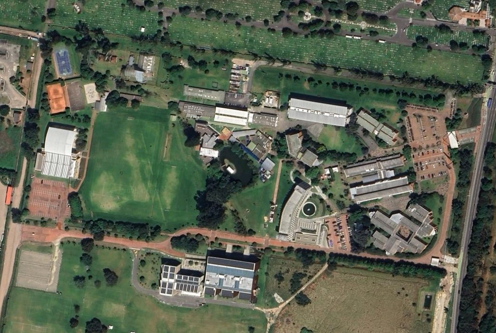

# 2.2.a. Definición y edición de elementos / Digitalización de campus
Keywords:  `shapefile` `new_layer` `land_index` `buffer` `point` `line` `polygon` `m02a02a`

Bases de datos y su manejo en SIG. Definición de elementos de un SIG (shapes, raster, vectores, etc.). Edición de elementos. Digitalización y entrada de entidades.

**Caso de estudio**: digitalización y cálculo de índices de la Universidad Escuela Colombiana de Ingeniería Julio Garavito.

 <a href="https://www.google.com/maps/place/Colombian+School+of+Engineering+Julio+Garavito/@4.7829367,-74.0443354,566m">https://www.google.com/maps</a>  

## Objetivos

Al finalizar esta actividad, el estudiante:

* Comprende el uso de las bases de datos en SIG.
* Realiza ejercicios prácticos en los que define y edita elementos de un SIG.

## Requerimientos

Archivos, actividades previas, lecturas y herramientas requeridas para el desarrollo de esta actividad:

| Requerimiento                             | Descripción           |
|:------------------------------------------|:----------------------|
| [:toolbox:Herramienta](https://qgis.org/) | QGIS 3.44 o superior. |  

> :blue_heart: El repositorio de proyecto deberá mantenerse durante la duración del curso, estableciendo permisos de escritura para los integrantes de su grupo y lectura para el instructor.
>
> Para los diferentes avances de proyecto, es necesario guardar y publicar las diferentes versiones generadas del (los) libro (s) de Microsoft Excel, reportes o informes y dibujos generados, agregando al final la fecha de control documental en formato aaaammdd, p. ej., _M01A01_20250710.dwg_.

## 0. Instrucciones generales

Siga en clase las indicaciones del instructor y complete la digitalización teniendo en cuenta las siguientes directrices:

* Crear diferentes capas geográficas en formato shapefile utilizando el CRS 9377, digitalizar: predio, construcciones bajo cubierta, vías, arbolado y luminarias.
* Crear los campos de atributos indicados en la guía y poblar la tabla a partir de las observaciones realizadas a través de Google Street View, fotografías en Google Maps, en Google Earth o usando vídeos de apoyo. En las capturas de pantalla se deben observar las tablas de atributos pobladas para los atributos indicados.
* En el informe técnico, incluir capturas de pantalla con el procedimiento de creación de cada tabla, el proceso de digitalización y la capa final con la tabla de atributos completamente poblada.
* Para cada capa, crear un resumen estadístico y una gráfica de análisis, p. ej., número de construcciones por tipo de estructura. Incluir para cada capa capturas de pantalla donde se observen las tablas y gráficas de análisis.
* Se recomienda utilizar como referencia para digitalización, los mapas de Open Street Maps y las imágenes satelitales de Google Maps, Bing o ESRI. Por ejemplo, https://www.google.com/maps/@4.7832006,-74.0451788,17.71z
* Algunos edificios requieren de la digitalización de zonas semicirculares o arcos.
* Varias de las esquinas de las edificaciones están construidas a un ángulo de 90 grados, tenga en cuenta que debe conservar este ángulo en la digitalización.
* Para los índices solicitados, es necesario mostrar captura de pantalla de la herramienta GIS con la ventana del Calculador de Campo, donde se observe la operación realizada.
* Comprimir independientemente cada archivo de formas shapefile (_Predio.shp, Construccion.shp, Vial.shp, VialBuffer.shp, Arbolado.shp, ArboladoBuffer.shp, Luminaria.shp, LuminariaBuffer.shp_) y guardar en la carpeta /shp de su repositorio de proyecto. Recuerde que un archivo de forma shapefile está compuesto por 4 archivos: .shp, .shx, .prj, .dbf.

> Para facilitar la edición y visualización, agregue el mapa base de Google Satellite desde el conector https://mt1.google.com/vt/lyrs=s&x={x}&y={y}&z={z}. Mapas base adicionales pueden ser agregados usando los enlaces contenidos en el repositorio https://github.com/opengeos/qgis-basemaps

## 1. Capas geográficas requeridas

Para cada capa requerida, cree archivos de formas geográficas shapefile (.shp). 

### 1.1. Predio o lote

Crear una capa tipo polígono en 2D para digitalizar el predio de la institución educativa, nombrar como `Predio.shp`.

Atributos requeridos:

| Campo    | Tipo         | Descripción                                                                                                                                                       |
|:---------|:-------------|:------------------------------------------------------------------------------------------------------------------------------------------------------------------|
| PredioID | String (200) | Consultar el catastro distrital o nacional y obtener el código CHIP o llave predial de este predio. Es necesario investigar y documentar el proceso de obtención. |
| AreaPm2  | Real (10)    | Área planar en m².                                                                                                                                                |
| PerimPm  | Real (10)    | Perímetro planar en m.                                                                                                                                            |
| CX       | Real (10)    | Coordenada X del centroide en m.                                                                                                                                  |
| CY       | Real (10)    | Coordenada y del centroide en m.                                                                                                                                  |
| LatDD    | Real (10)    | Latitud del centroide en grados geodésicos °. `x(transform($geometry, layer_property(@layer, 'crs'),'EPSG:4326'))`                                             |
| LonDD    | Real (10)    | Longitud del centroide en grados geodésicos °. `y(transform($geometry, layer_property(@layer, 'crs'),'EPSG:4326'))`                                            |

> Tenga en cuenta que en un archivo de formas Shapefile (.shp), los nombres de los campos de atributos no pueden contener más de 10 caracteres. 

Fuentes de datos para obtención de predios y/o lotes:

* Predios Bogotá D.C.: https://mapas.bogota.gov.co
* Predios Bogotá D.C.: https://www.ideca.gov.co/recursos/mapas/predios-bogota-dc
* Predios Bogotá D.C.: https://datosabiertos.bogota.gov.co/dataset/lote
* Predios nacionales: https://geoportal.igac.gov.co/contenido/consulta-catastral

### 1.2. Construcción 

Crear una capa tipo polígono en 2D para las construcciones y/o edificios bajo cubierta, nombrar como `Construccion.shp`. En las construcciones incluir elementos como: invernaderos, casetas, carpas porterías.

Atributos requeridos:

| Campo      | Tipo         | Descripción                                                                                                                                                                            |
|:-----------|:-------------|:---------------------------------------------------------------------------------------------------------------------------------------------------------------------------------------|
| EdifID     | String (200) | Identificación de edificio o bloque. Texto de 100 caracteres. Ejemplo: Bloque A, Bloque B, Coliseo, Kiosco K1, Portería, etc.                                                          |
| AreaPm2    | Real (10)    | Área planar en m².                                                                                                                                                                     |
| PerimPm    | Real (10)    | Perímetro planar en m.                                                                                                                                                                 |
| Pisos      | Real (10)    | Número de pisos. En caso de existir altillos, incluir como 0.5 pisos adicional.                                                                                                        |
| AreaCons   | Real (10)    | Total de área construída `AreaCons = AreaPm2 * Pisos`.                                                                                                                                 |
| MaterialEs | String (100) | Material predominante en la estructura. Normalizar como: • Concreto reforzado en pórticos • Concreto reforzado en paneles • Mampostería estructural • Metálica • Mixta. |
| TipoCubier | String (100) | Tipo de cubierta predominante. Normalizar como: • Teja inclinada • Placa • Carpa • Domo • Curvada continua • Paneles solares • Mixta.                             |
| CX         | Real (10)    | Coordenada X del centroide en m.                                                                                                                                                       |
| CY         | Real (10)    | Coordenada y del centroide en m.                                                                                                                                                       |
| LatDD      | Real (10)    | Latitud del centroide en grados geodésicos °. `x(transform($geometry, layer_property(@layer, 'crs'),'EPSG:4326'))`                                                                  |
| LonDD      | Real (10)    | Longitud del centroide en grados geodésicos °. `y(transform($geometry, layer_property(@layer, 'crs'),'EPSG:4326'))`                                                                 |

Construcciones Bogotá: 

* https://ideca.gov.co/recursos/mapas/construccion-bogota-dc
* https://ideca.gov.co/recursos/mapas/construccion

### 1.3. Vías

Crear una capa tipo línea 2D para las vías del campus, nombrar como `Vial.shp`.

Atributos requeridos:

| Campo      | Tipo         | Descripción                                                                                                                                                                                                            |
|:-----------|:-------------|:-----------------------------------------------------------------------------------------------------------------------------------------------------------------------------------------------------------------------|
| ViaID      | String (200) | Identificación de vía. Ejemplo: Calle 207, Sendero peatonal entre Bloques A y G...                                                                                                                                     |
| AnchoProm  | Real (10)    | Ancho promedio en m. Medir usando imagen satelital como mapa base.                                                                                                                                                     |
| ViaTipo    | String (100) | Tipo de Vía. Normalizar como: • Vehicular • Peatonal • Sendero • Privada • Camino • Andén                                                                                                            |
| MaterialEs | String (100) | Material predominante en la estructura. Normalizar como: • Concreto reforzado en pórticos • Concreto reforzado en paneles • Mampostería estructural • Metálica • Mixta.                                 |
| Rodadura   | String (100) | Tipo de rodadura o recubrimiento. Normalizar como: • Asfalto • Concreto • Adoquín • Placa Huella • Tierra • Césped • Arena • Gravilla                                                          |

### 1.4. Arbolado

Crear una capa tipo punto 2D para el arbolado del Campus, nombrar como `Arbolado.shp`.

Atributos requeridos:

| Campo       | Tipo         | Descripción                                                                                                                           |
|:------------|:-------------|:--------------------------------------------------------------------------------------------------------------------------------------|
| ArbolID     | Long Integer | Identificación de cada árbol. Incluir un valor consecutivo que no debe repetirse.                                                     |
| Altura      | Real (10)    | Alto del árbol. Estimar con Google Street View, utilizando como referencia la altura de elementos cercanos, personas o el mobiliario. |
| RadioC      | Real (10)    | Radio de cobertura del canopy. Medir utilizando imagen satelital como mapa base.                                                      |
| TipoArbol   | String (100) | Tipo de árbol. Normalizar como: • Árbol • Arbusto • Planta • Matorral                                                     |
| CX          | Real (10)    | Coordenada X del centroide en m.                                                                                                      |
| CY          | Real (10)    | Coordenada y del centroide en m.                                                                                                      |
| LatDD       | Real (10)    | Latitud del centroide en grados geodésicos °. `x(transform($geometry, layer_property(@layer, 'crs'),'EPSG:4326'))`                 |
| LonDD       | Real (10)    | Longitud del centroide en grados geodésicos °. `y(transform($geometry, layer_property(@layer, 'crs'),'EPSG:4326'))`                |

Arbolado

* https://www.ideca.gov.co/recursos/mapas/arbolado-urbano-bogota-dc

### 1.5. Luminarias

Crear una capa tipo punto 2D para las luminarias del campus, nombrar como `Luminaria.shp`.

Atributos requeridos:

| Campo    | Tipo         | Descripción                                                                                                                                                                                                                                   |
|:---------|:-------------|:----------------------------------------------------------------------------------------------------------------------------------------------------------------------------------------------------------------------------------------------|
| LumID    | Long Integer | Identificación de cada luminaria. Incluir un valor consecutivo que no debe repetirse.                                                                                                                                                         |
| Altura   | Real (10)    | Alto del árbol. Estimar con Google Street View, utilizando como referencia la altura de elementos cercanos, personas o el mobiliario.                                                                                                         |
| LumTipo  | String (100) | Tipo de luminaria. Normalizar como: • LED • Halogenuro Metálico (MH) • Sodio (Na)                                                                                                                                                    |
| Potencia | Real (10)    | Potencia de la luminaria (Watt o vatio). Utilizar como referencia: • LED - 100W • Halogenuro Metálico (MH) - 150W • Sodio (Na) - 200W                                                                                                |
| RadioC   | Real (10)    | Radio de iluminación directa o de cobertura en función de la potencia, altura y tipo. Investigar y estimar.  Por ejemplo: Lámparas de menos de 6 metros de altura: 10 metros. Lámparas de más de 6 metros: entre 10 y 25 metros. |
| Consumo  | Real (10)    | Consumo eléctrico.                                                                                                                                                                                                                            |
| CX       | Real (10)    | Coordenada X del centroide en m.                                                                                                                                                                                                              |
| CY       | Real (10)    | Coordenada y del centroide en m.                                                                                                                                                                                                              |
| LatDD    | Real (10)    | Latitud del centroide en grados geodésicos °. `x(transform($geometry, layer_property(@layer, 'crs'),'EPSG:4326'))`                                                                                                                         |
| LonDD    | Real (10)    | Longitud del centroide en grados geodésicos °. `y(transform($geometry, layer_property(@layer, 'crs'),'EPSG:4326'))`                                                                                                                        |

> La potencia en watts o vatios en iluminación, representa la cantidad de energía eléctrica por hora que consume una lámpara.

## 2. Aferencias e índices

Para las capas `Vial.shp`, `Arbolado.shp` y `Luminaria.shp`, cree aferencias para crear los corredores viales, el canopy o cobertura de la vegetación y las áreas iluminadas. En QGIS, utilice la herramienta _Processing Toolbox / Vector Geometry / Buffer_.

| Capa de aferencia   | Descripción                                                    |
|---------------------|----------------------------------------------------------------|
| VialBuffer.shp      | Aferencia a partir de ejes viales a partir de `AnchoProm / 2`. |
| ArboladoBuffer.shp  | Aferencia a partir del radio de cobertura de canopy `RadioC`.  |
| LuminariaBuffer.shp | Aferencia a partir del radio de iluminación `RadioC`.          |

Para el cálculo de los índices, cree y calcule los siguientes campos de atributos en la capa `Predio.shp`:

| Campo     | Tipo         | Descripción                                                                         |
|:----------|:-------------|:------------------------------------------------------------------------------------|
| ConsAreaH | Real (10)    | Área total horizontal ocupada por construcciones m². ∑ `AreaPm2` de construcciones. |
| ConstIO   | Real (10)    | Índice de ocupación por construcción `ConstIO = ConsAreaH / AreaPm2`.               |
| ConsAreaV | Real (10)    | Área total construída m². ∑ `AreaCons`.                                             |
| ConstIC   | Real (10)    | Índice de construcción `ConstIC = ConsAreaV / AreaPm2`.                             |
| VialArea  | Real (10)    | Área total de vías en m².                                                           |
| VialIO    | Real (10)    | Índice de ocupación vial `VialIO = VialArea / AreaPm2`.                             |
| ArbolArea | Real (10)    | Área total cubierta por canopy de vegetación en m².                                 |
| ArbolIO   | Real (10)    | Índice de ocupación por canopy `ArbolIO = ArbolArea / AreaPm2`.                     |
| LuminArea | Real (10)    | Área total iluminada en m².                                                         |
| LuminIC   | Real (10)    | Índice de cobertura por iluminación `LuminIC = LuminArea / AreaPm2`.                |

> `AreaPm2` corresponde al área del lote o predio.

## 3. Representación 3D

Cree una visualización 3D con alzados que integre:

* Modelo de elevación digital - DEM mundial 
* Límite del predio
* Edificios
* Ejes y polígonos de las áreas aferentes de las vías
* Puntos de localización del arbolado y coberturas de vegetación en alzado con 3 tipos (árbol, arbusto, matorral)
* Luminarias y cobertura de iluminación

## Actividades de proyecto :triangular_ruler:

Utilizando la [Plantilla de Microsoft Word](../../file/report/R.DAPC.PlantillaInformeTecnico.docx) suministrada, cree un informe técnico mostrando las actividades desarrolladas en el orden presentado en esta actividad, junto con las consideraciones de diseño, los análisis y recomendaciones realizadas para las actividades del proyecto. Convierta a Adobe Acrobat (.pdf) y guarde en la carpeta _/report_ del repositorio de datos, nombre el archivo con el código de la actividad agregando al final la fecha de control documental en formato aaaammdd (p. ej. M01A01_20250531.pdf).

En la siguiente tabla se listan las actividades que deben ser desarrolladas y documentadas por cada grupo de proyecto o individualmente.

| Actividad | Alcance                                                                                                                                                                                                                                                                                                                                                                                                                                                                                                                                                                                          |
|:----------|:-------------------------------------------------------------------------------------------------------------------------------------------------------------------------------------------------------------------------------------------------------------------------------------------------------------------------------------------------------------------------------------------------------------------------------------------------------------------------------------------------------------------------------------------------------------------------------------------------|
| M02A02a   | Individual: los numerales vistos en esta actividad son evaluados individualmente a través de un quiz de conocimiento y habilidad.  Cada estudiante presenta un informe técnico incluyendo como mínimo: 1 predio. 5 construcciones. 1 kilómetro de vías. Buffer vial. 20 árboles. Buffer de arbolado. 5 luminarias. Buffer de luminarias. Calcular los índices. Realizar la representación 3D.  El informe técnico debe contener capturas de pantalla donde se visualice cada capa, la tabla de atributos y los rótulos de cada elemento. |
| M02A02a   | Opcional en grupo: desarrolle los numerales indicados en esta actividad y presente un informe técnico detallado.                                                                                                                                                                                                                                                                                                                                                                                                                                                                                 |
| M02A02a   | Opcional en grupo: en una tabla y al final del informe de avance de esta entrega, indique el detalle de las actividades realizadas por cada integrante de su grupo; utilice las siguientes columnas: `Nombre del integrante`, `Actividades realizadas`, `Tiempo dedicado en horas` (si presenta la entrega individualmente, no es necesaria la presentación de esta tabla).  Para actividades que no requieren del desarrollo de elementos de avance, indicar si realizo la lectura de la guía de clase y las lecturas indicadas al inicio en los requerimientos.                          | 

> Nota 1: para la revisión del proyecto final, guarde los libros cálculo de Microsoft Excel y los archivos generados en esta actividad, en las localizaciones indicadas en cada numeral.
>
> Nota 2: una vez el instructor realice la revisión y el estudiante presente las correcciones o ajustes solicitados, será necesario cargar una nueva versión de los archivos en el repositorio del proyecto, incluyendo o actualizando al final del nombre del archivo, la fecha de presentación en formato aaaammdd y manteniendo las versiones anteriores presentadas.
>

## Referencias

* https://es.zgsm-china.com/blog/coefficient-of-utilization-for-street-lighting-why-it-matters.html
* https://es.zgsm-china.com/blog/lighting-calculation-lumen-calculation-method-and-its-benefits.html
* https://www.zgsm-china.com/lighting-design/lighting-design-road-lighting-simulation-by-dialux-evo.html
* https://luxmanlight.com/es/como-calcular-la-altura-y-la-distancia-del-poste-de-luz-solar-de-la-calle/
* https://www.ensa.com.pa/sites/default/files/13_capitulo_16_-_alumbrado_publico_ver.3.0.pdf

## Control de versiones

| Versión    | Descripción        | Autor                                      | Horas |
|------------|:-------------------|--------------------------------------------|:-----:|
| 2025.08.29 | Versión inicial.   | [rcfdtools](https://github.com/rcfdtools)  |  12   |

##

_R.DAPC es de uso libre para fines académicos, conoce nuestra licencia, cláusulas, condiciones de uso y como referenciar los contenidos publicados en este repositorio, dando [clic aquí](../../LICENSE.md)._

_¡Encontraste útil este repositorio!, apoya su difusión marcando este repositorio con una ⭐ o síguenos dando clic en el botón Follow de [rcfdtools](https://github.com/rcfdtools) en GitHub._

| [:arrow_backward: Anterior](../M02A01b/Readme.md) | [:house: Inicio](../../README.md) | [:beginner: Ayuda / Colabora](https://github.com/rcfdtools/R.DAPC/discussions/1) | [Siguiente :arrow_forward:](../M02A02b/Readme.md) |
|----------------------------------------------------|-----------------------------------|----------------------------------------------------------------------------------|----------------------------------------------------|

[^1]: 