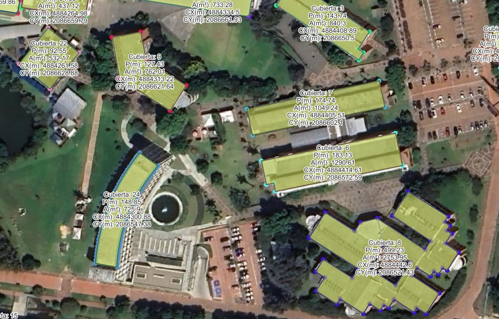

# 2.2.b. Definición y edición de elementos / Potencial fotovoltáico
Keywords:  `photovoltaic` `solar-panel` `m02a02b`

Bases de datos y su manejo en SIG. Creación y edición de tablas relacionales.                                                                                       

**Caso de estudio**: cálculo de energía fotovoltáica que puede ser producida instalando paneles solares en las cubiertas de los diferentes edificios de la Universidad Escuela Colombiana de Ingeniería Julio Garavito.

## Objetivos

Al finalizar esta actividad, el estudiante:

* Comprende el uso de las bases de datos en SIG.
* Realiza ejercicios prácticos en los que define y edita elementos de un SIG.
* Crea y edita tablas relacionales.

## Requerimientos

Archivos, actividades previas, lecturas y herramientas requeridas para el desarrollo de esta actividad:

| Requerimiento                                                                     | Descripción                                                                        |
|:----------------------------------------------------------------------------------|:-----------------------------------------------------------------------------------|
| [:toolbox:Herramienta](https://qgis.org/)                                         | QGIS 3.44 o superior.                                                              |  
| [:date:DAPC_CubiertaNodoUECIJG.csv](../../file/table/DAPC_CubiertaNodoUECIJG.csv) | Tabla con geo-localizadores de nodos para generación de áreas útiles por cubierta. |

> :blue_heart: El repositorio de proyecto deberá mantenerse durante la duración del curso, estableciendo permisos de escritura para los integrantes de su grupo y lectura para el instructor.
>
> Para los diferentes avances de proyecto, es necesario guardar y publicar las diferentes versiones generadas del (los) libro (s) de Microsoft Excel, reportes o informes y dibujos generados, agregando al final la fecha de control documental en formato aaaammdd, p. ej., _M01A01_20250710.dwg_.

## 0. Creación de nodos

A partir del archivo [DAPC_CubiertaNodoUECIJG.csv](../../table/DAPC_CubiertaNodoUECIJG.csv) y utilizando el CRS 9377, cree la capa geográfica de puntos. 

En QGIS y desde el menú _Layer / Add Layer / Add Delimited Text Layer..._

Export layer as: /shp/DAPC_CubiertaNodoUECIJG.shp
QGIS label: "CubiertaID" ||  '- '   ||  "PuntoNum"
Simbology: Categorized
Mapa base Google Satellite: https://mt1.google.com/vt/lyrs=s&x={x}&y={y}&z={z}

Atributos requeridos:

| Campo    | Tipo         | Descripción                                                                                                                                                       |
|:---------|:-------------|:------------------------------------------------------------------------------------------------------------------------------------------------------------------|
| PredioID | String (200) | Consultar el catastro distrital o nacional y obtener el código CHIP o llave predial de este predio. Es necesario investigar y documentar el proceso de obtención. |
| AreaPm2  | Real (10)    | Área planar en m².                                                                                                                                                |
| PerimPm  | Real (10)    | Perímetro planar en m.                                                                                                                                            |
| CX       | Real (10)    | Coordenada X del centroide en m.                                                                                                                                  |
| CY       | Real (10)    | Coordenada y del centroide en m.                                                                                                                                  |
| LatDD    | Real (10)    | Latitud del centroide en grados geodésicos °. `x(transform($geometry, layer_property(@layer, 'crs'),'EPSG:4326'))`                                             |
| LonDD    | Real (10)    | Longitud del centroide en grados geodésicos °. `y(transform($geometry, layer_property(@layer, 'crs'),'EPSG:4326'))`                                            |

## Actividades de proyecto :triangular_ruler:

Utilizando la [Plantilla de Microsoft Word](../../file/report/R.DAPC.PlantillaInformeTecnico.docx) suministrada, cree un informe técnico mostrando las actividades desarrolladas en el orden presentado en esta actividad, junto con las consideraciones de diseño, los análisis y recomendaciones realizadas para las actividades del proyecto. Convierta a Adobe Acrobat (.pdf) y guarde en la carpeta _/report_ del repositorio de datos, nombre el archivo con el código de la actividad agregando al final la fecha de control documental en formato aaaammdd (p. ej. M01A01_20250531.pdf).

Las especificaciones técnicas detalladas del proyecto para este módulo del curso, se encuentran en el archivo: [DAPC_ProyectoCAD.xlsx](../../file/table/DAPC_ProyectoCAD.xlsx)

En la siguiente tabla se listan las actividades que deben ser desarrolladas y documentadas por cada grupo de proyecto.

| Actividad | Alcance                                                                                                                                                                                                                                                                                                                                                                                                                                                                                                                                              |
|:----------|:-----------------------------------------------------------------------------------------------------------------------------------------------------------------------------------------------------------------------------------------------------------------------------------------------------------------------------------------------------------------------------------------------------------------------------------------------------------------------------------------------------------------------------------------------------|
| M02A02b   | Desarrolle los numerales indicados en esta actividad y presente un informe técnico detallado.                                                                                                                                                                                                                                                                                                                                                                                                                                                        |
| M02A02b  | En una tabla y al final del informe de avance de esta entrega, indique el detalle de las actividades realizadas por cada integrante de su grupo; utilice las siguientes columnas: `Nombre del integrante`, `Actividades realizadas`, `Tiempo dedicado en horas` (si presenta la entrega individualmente, no es necesaria la presentación de esta tabla).  Para actividades que no requieren del desarrollo de elementos de avance, indicar si realizo la lectura de la guía de clase y las lecturas indicadas al inicio en los requerimientos. | 

> Nota 1: para la revisión del proyecto final, guarde los libros cálculo de Microsoft Excel y los archivos generados en esta actividad, en las localizaciones indicadas en cada numeral.
>
> Nota 2: una vez el instructor realice la revisión y el estudiante presente las correcciones o ajustes solicitados, será necesario cargar una nueva versión de los archivos en el repositorio del proyecto, incluyendo o actualizando al final del nombre del archivo, la fecha de presentación en formato aaaammdd y manteniendo las versiones anteriores presentadas.
>

## Referencias

* https://www.energy.gov/eere/solar/homeowners-guide-going-solar

## Control de versiones

| Versión    | Descripción        | Autor                                      | Horas |
|------------|:-------------------|--------------------------------------------|:-----:|
| 2025.08.29 | Versión inicial.   | [rcfdtools](https://github.com/rcfdtools)  |  12   |

##

_R.DAPC es de uso libre para fines académicos, conoce nuestra licencia, cláusulas, condiciones de uso y como referenciar los contenidos publicados en este repositorio, dando [clic aquí](../../LICENSE.md)._

_¡Encontraste útil este repositorio!, apoya su difusión marcando este repositorio con una ⭐ o síguenos dando clic en el botón Follow de [rcfdtools](https://github.com/rcfdtools) en GitHub._

| [:arrow_backward: Anterior](../M02A02b/Readme.md) | [:house: Inicio](../../README.md) | [:beginner: Ayuda / Colabora](https://github.com/rcfdtools/R.DAPC/discussions/1) | [Siguiente :arrow_forward:](../M02A03/Readme.md) |
|----------------------------------------------------|-----------------------------------|----------------------------------------------------------------------------------|--------------------------------------------------|

[^1]: 