

# 2.3.a. Mapas e imágenes / Red de interconexión energética nacional 2D y aislamientos RETIE
Keywords: `study-zone` `powerline-offset` `m02a03a`

Mapas y cartografía. Elaboración de planos. Procesamiento e integración de vectores con análisis de aferencias. 

**Caso de estudio**: análisis de servidumbres RETIE y longitud 2D de líneas de energía en red de interconexión energética nacional de Colombia.

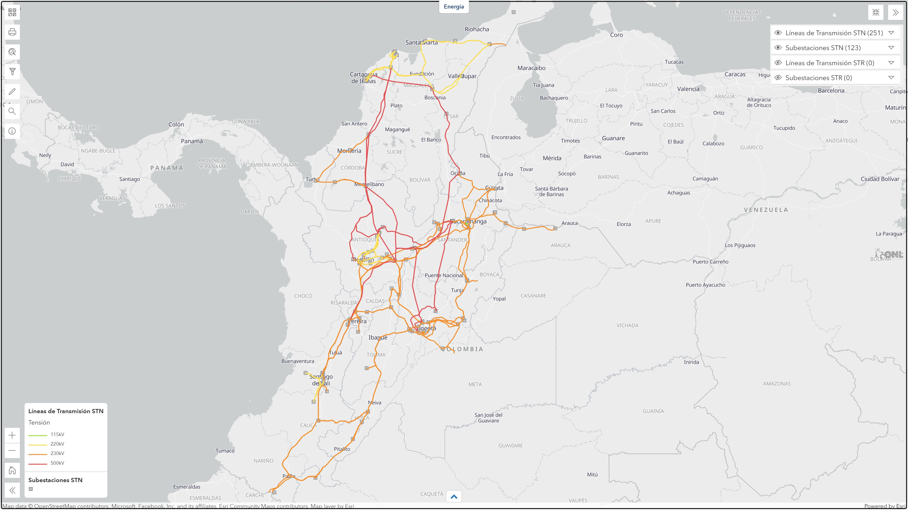 Tomado de: <a href="https://onl.dnp.gov.co/transicion-energetica/Paginas/default.aspx">https://onl.dnp.gov.co/</a>  

## Objetivos

Al finalizar esta actividad, el estudiante:

* Elabora mapas y planos.
* Une capas geográficas para análisis con cobertura integrada.
* Crea y calcula aferencias e identifica áreas afectadas.
* Analiza agrupaciones categóricas por distribución porcentual.

## Requerimientos

Archivos, actividades previas, lecturas y herramientas requeridas para el desarrollo de esta actividad:

| Requerimiento                                                                                                                                                                                                                                                                                          | Descripción                                                                                                          |
|:-------------------------------------------------------------------------------------------------------------------------------------------------------------------------------------------------------------------------------------------------------------------------------------------------------|:---------------------------------------------------------------------------------------------------------------------|
| [:toolbox:Herramienta](https://qgis.org/)                                                                                                                                                                                                                                                              | QGIS 3.44 o superior.                                                                                                |
| [:round_pushpin:qgis_basemaps.py](../../file/src/qgis_basemaps.py)                                                                                                                                                                                                                                     | Script en Python para inclusión de mapas base XYZ en QGIS por [opengeos](https://github.com/opengeos/qgis-basemaps). |
| [:round_pushpin:IGAC_Municipio.shp](../../file/data/IGAC/IGAC_Municipio_20250912.zip)                                                                                                                                                                                                                  | Municipios, Distritos y Áreas no municipalizadas de Colombia obtenidas de https://www.colombiaenmapas.gov.co/.       |
| [:round_pushpin:DANE_CentroUrbano.shp](../../file/data/DANE/DANE_CentroUrbano_20250912.rar)                                                                                                                                                                                                            | Centros poblados y cabeceras municipales de Colombia obtenidas de https://www.colombiaenmapas.gov.co/.               |
| [:round_pushpin:LineasTransmisionSTN.shp](../../file/data/DNP/LineasTransmisionSTN.zip), [LineasTransmisionSTR.shp](../../file/data/DNP/LineasTransmisionSTR.zip), [SubestacionesSTN.shp](../../file/data/DNP/SubestacionesSTN.zip), [SubestacionesSTR.shp](../../file/data/DNP/SubestacionesSTR.zip)  | Líneas de transmisión y subestaciones eléctricas obtenidas de https://onl.dnp.gov.co.                                |

> Para los diferentes avances de proyecto, es necesario guardar y publicar las diferentes versiones generadas del (los) libro (s) de Microsoft Excel, reportes o informes y dibujos generados, agregando al final la fecha de control documental en formato aaaammdd, p. ej., _M01A01_20250710.dwg_.

## 1. Exploración e integración de líneas de transmisión y subestaciones

Descargue la capa de Municipios de Colombia y exporte el polígono geográfico del municipio asignado. Para el ejemplo de clase utilizaremos el límite geopolítico de la ciudad de Bogotá D.C.

> Los municipios se representan sobre cartografía del IGAC, acorde a lo establecido en la Ley 1447 de 2011 y su Decreto Reglamentario 1170 de 2015. Para el caso de los Distritos, la definición y modificación de sus límites está estipulado en la Ley 1617 de 2013. Las áreas No Municipalizadas, hacen parte de la división territorial, pero no son entidades territoriales (artículo 285 y 286 de la Constitución Política de Colombia, 1991); la categorización de cada municipio se establece de conformidad con la Ley 617 de 2000. La información sobre los límites municipales, está sujeta a las actualizaciones de los resultados de las operaciones administrativas de deslinde y las decisiones tomadas por los competentes (Asambleas departamentales y Congreso de la República).

1. Ingrese al portal https://www.colombiaenmapas.gov.co/, busque el servicio _Municipios, Distritos y Áreas no municipalizadas de Colombia_ y descargue en formato shapefile. Guardar el comprimido como en [/data/IGAC/IGAC_Municipio.shp](../../file/data/IGAC/IGAC_Municipio_20250912.zip).

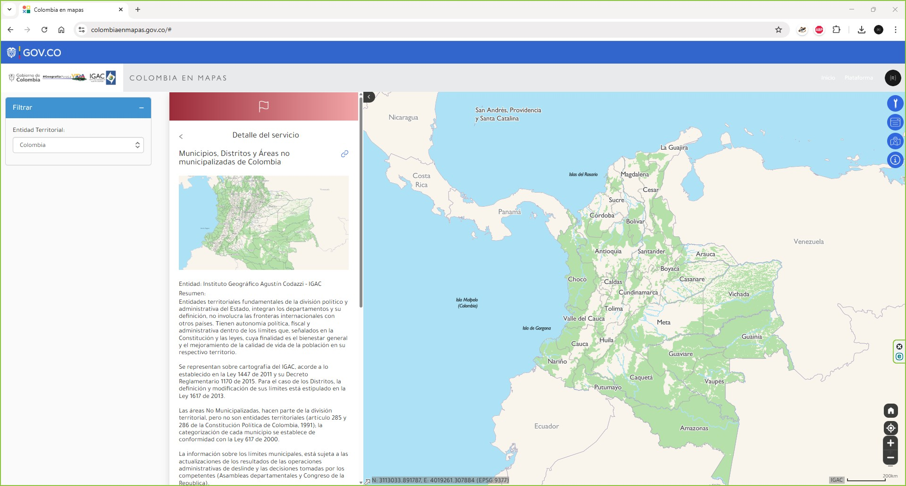

2. Desde el mismo portal, descargue la capa shapefile de _Centros poblados y cabeceras municipales de Colombia_. Guardar el comprimido como en [/data/DANE/DANE_CentroUrbano.shp](../../file/data/DANE/DANE_CentroUrbano_20250912.rar).

> Cabeceras y centros poblados de Colombia delimitados por el DANE dentro del Marco Geo-estadístico Nacional año 2020. Las cabeceras municipales son áreas geográficas delimitadas por el perímetro censal. A su interior se localiza la sede administrativa del municipio, es decir la alcaldía. Los centros poblados son concentraciones mínimo de veinte (20) viviendas contiguas, vecinas o adosadas entre sí, ubicados en el área resto municipal o en un área no municipalizada.

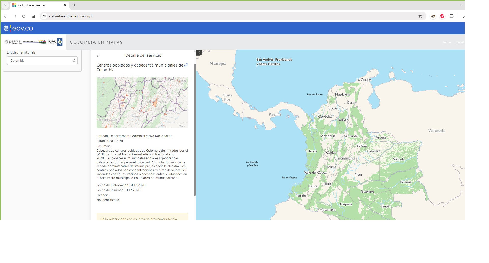

3. Desde el portal https://onl.dnp.gov.co/transicion-energetica/Paginas/default.aspx o desde el Observatorio de Logística e Infraestructura de Colombia https://onl.dnp.gov.co/olic/main.aspx, descargue las capas geográficas de líneas de transmisión eléctrica y subestaciones del sistema nacional y regional. Guardar los comprimidos en /data/DNP como [LineasTransmisionSTN.shp](../../file/data/DNP/LineasTransmisionSTN.zip), [LineasTransmisionSTR.shp](../../file/data/DNP/LineasTransmisionSTR.zip), [SubestacionesSTN.shp](../../file/data/DNP/SubestacionesSTN.zip), [SubestacionesSTR.shp](../../file/data/DNP/SubestacionesSTR.zip).

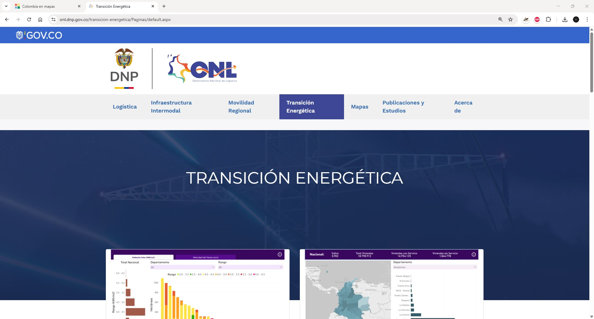

4. En la carpeta _/shp_, descomprima las capas geográficas obtenidas en formato shapefile.

5. Cree un proyecto nuevo en QGIS, asigne el CRS 9377, cargue las capas y desde el panel _Browser_ renombre como:

* _Municipio, Distrito y Area no municipalizada.shp_ -> _IGAC_Municipio.shp_
* _MGN_URB_AREA_CENSAL.shp_ -> _DANE_CentroUrbano.shp_
* _LineasTransmisionSTN.shp_ -> _UPME_LineaTransmisionSTN.shp_
* _LineasTransmisionSTR.shp_ -> _UPME_LineaTransmisionSTR.shp_
* _SubestacionesSTN.shp_ -> _UPME_SubestacionSTN.shp_
* _SubestacionesSTR.shp_ -> _UPME_SubestacionSTR.shp_

Simbolice las líneas de transmisión a partir del campo `id_tension`. Tenga en cuenta que la tabla de atributos dispone de códigos de dominio 0, del 17 al 26 y no de rótulos asociados a la tensión eléctrica.

Para la simbología y rotulación, utilice la siguiente tabla de homologación:

| id_tension | Tensión (kW) | Color Hex |
|:----------:|:------------:|-----------|
|     0      |     <110     | #7a7a7a   |
|     17     |     <110     | #7a7a7a   |
|     18     |     <110     | #7a7a7a   |
|     19     |     110      | #007f2e   |
|     21     |     115      | #5bdd31   |
|     24     |     220      | #fad522   |
|     25     |     230      | #f08b01   |
|     26     |     500      | #e70b1e   |

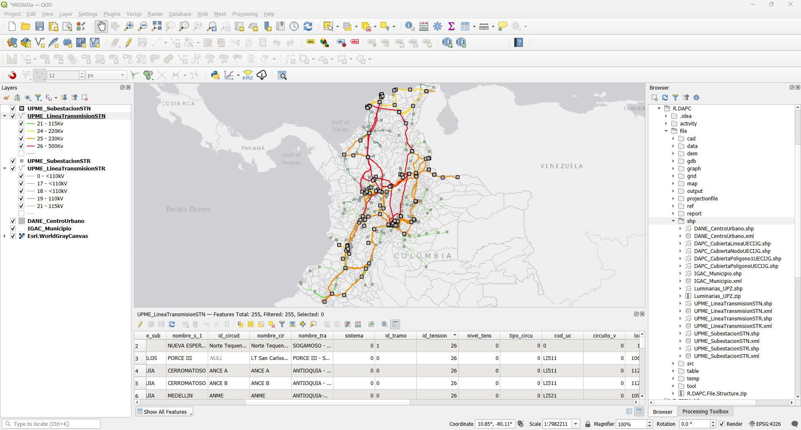

6. En las tablas de atributos de las capas de líneas de transmisión y subestaciones, cree un campo de texto de 20 de longitud con el nombre `STTipo` correspondiente al tipo de sistema de transmisión. Con el calculador de campo o _Field Calculator_ de las tablas, para los elementos del sistema nacional, asigne _STN - Nacional_ y para los regionales _STR - Regional_.

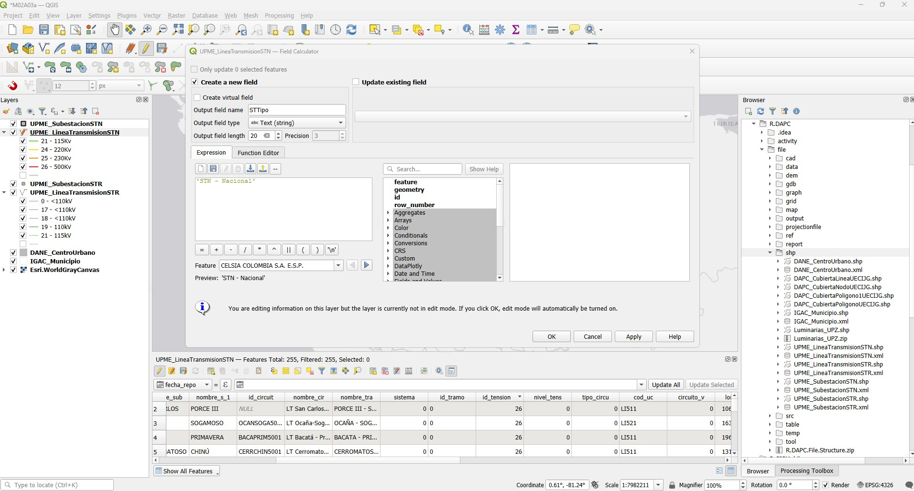

7. Con la herramienta _Processing Toolbox / Vector general / Merge vector layers_, combine las capas de líneas de transmisión cómo _/file/shp/UPME_LineaTransmision.shp_, luego repita este procedimiento para combinar las capas de nodos de localización de las subestaciones eléctricas, guarde cómo _/file/shp/UPME_Subestacion.shp_. Utilice en la combinación el CRS 9377.

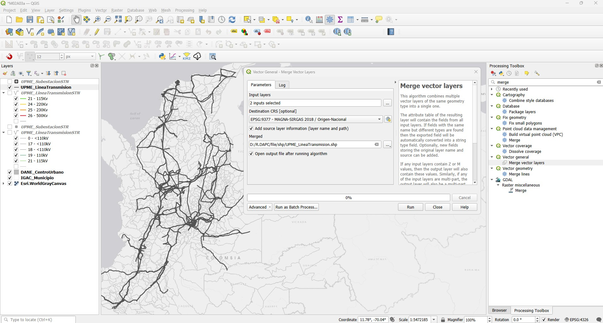

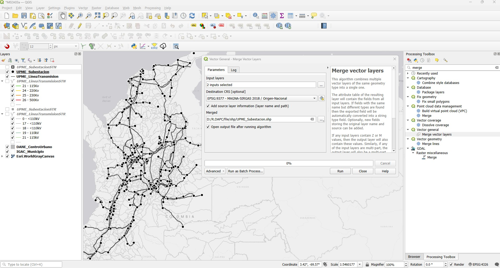

8. Como observa en las ilustraciones anteriores, luego del proceso de combinación será necesario volver a ajustar la simbología, para ello primero crearemos una tabla de asociación en formato _[/table/UPME_TensionkW.csv](../../file/table/UPME_TensionkW.csv)_ utilizando el identificador asociado y homologaremos los valores de tensión a representar. En QGIS, cargue y visualice la tabla .csv, luego, desde las propiedades de la capa _UPME_LineaTransmision.shp_, realice un _Join_ de atributos usando como llave el campo `id_tension`.

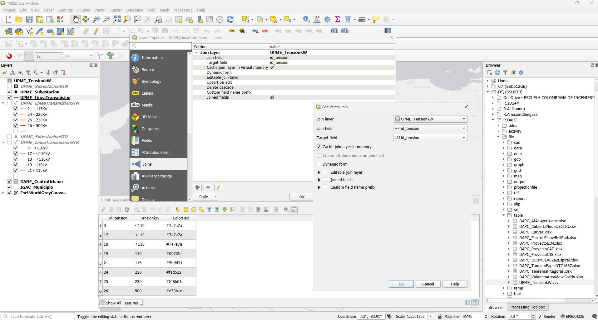

Podrá observar que luego del _Join_, la tabla de atributos de la capa geográfica contiene los valores asociados de tensión. Simbolice por categorías a partir de este valor utilizando p.ej., la paleta _Turbo_.

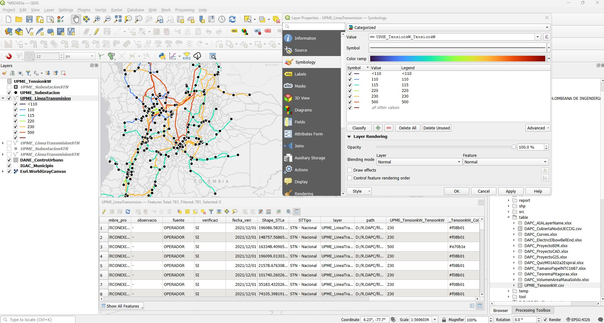

## 2. Identificación y caracterización de zona de estudio

Para el análisis de las redes eléctricas y subestaciones, utilizaremos como límite geográfico, el polígono de la ciudad de Bogotá D.C. contenido en la capa IGAC.

1. Utilizando la herramienta _Query Builder_ de la capa _IGAC_Municipio.shp_, filtre el polígono requerido a partir de la expresión `"MpNombre" = 'Bogotá, D.C.'`. En la tabla de atributos podrá observar que el código DANE es 11001.

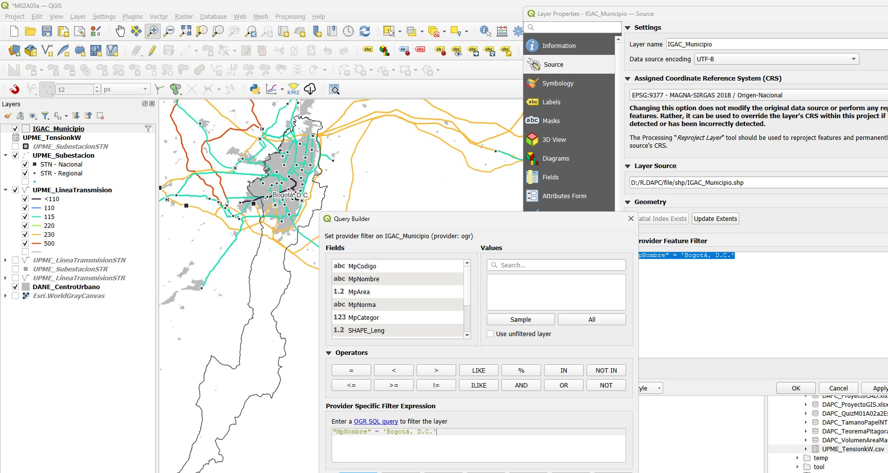

2. Con la herramienta _Processing Toolbox / Vector overlay / Clip_, recorte a partir del límite de la ciudad la capa _UPME_LineaTransmision.shp_, guarde como _/shp/UPME_LineaTransmisionBogota.shp_. Simbolice por categorías a partir del valor del campo `UPME_Tensi`. Observará que en la ciudad solo existen líneas de transmisión <110, de 115 y 230 kW.

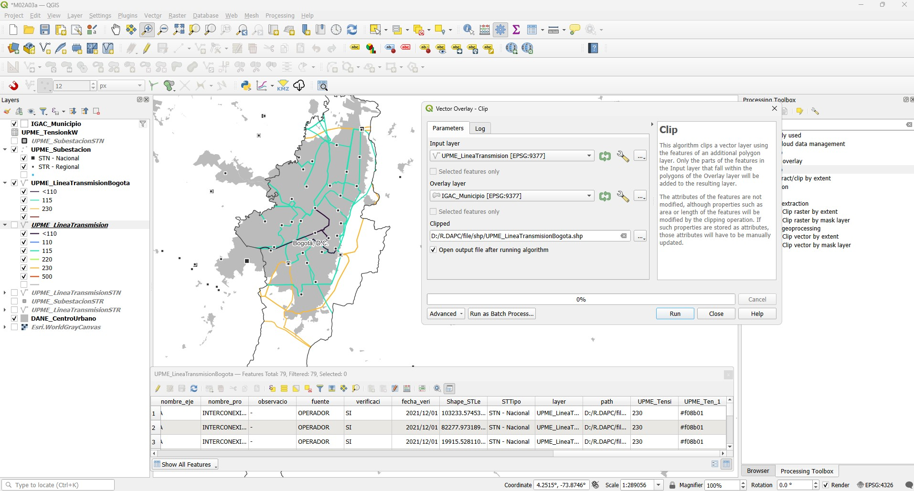

3. Repita el procedimiento anterior para obtener las subestaciones eléctricas que se encuentran dentro de la ciudad, guarde como _/shp/UPME_SubestacionBogota.shp_. Observará que en Bogotá D.C. existen 3 estaciones del STN - Nacional y 34 del STR - Regional.

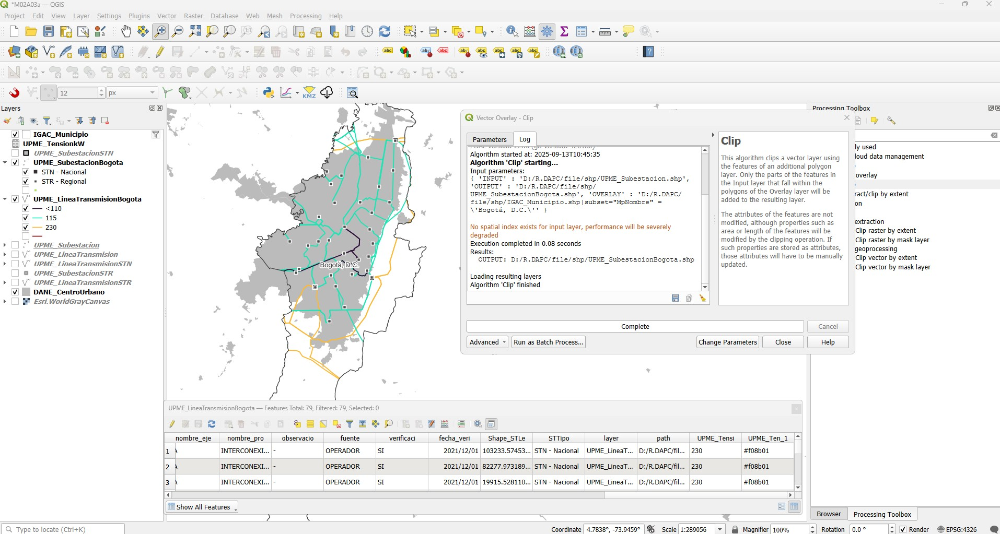

4. En la tabla de atributos de la capa _UPME_LineaTransmisionBogota.shp_, cree un campo de atributos Real de 10 de precisión con el nombre `LPkm2D` y desde el calculador de campo calcule la longitud planar en kilómetros de las diferentes entidades, utilice la expresión `length(@geometry)/1000`.

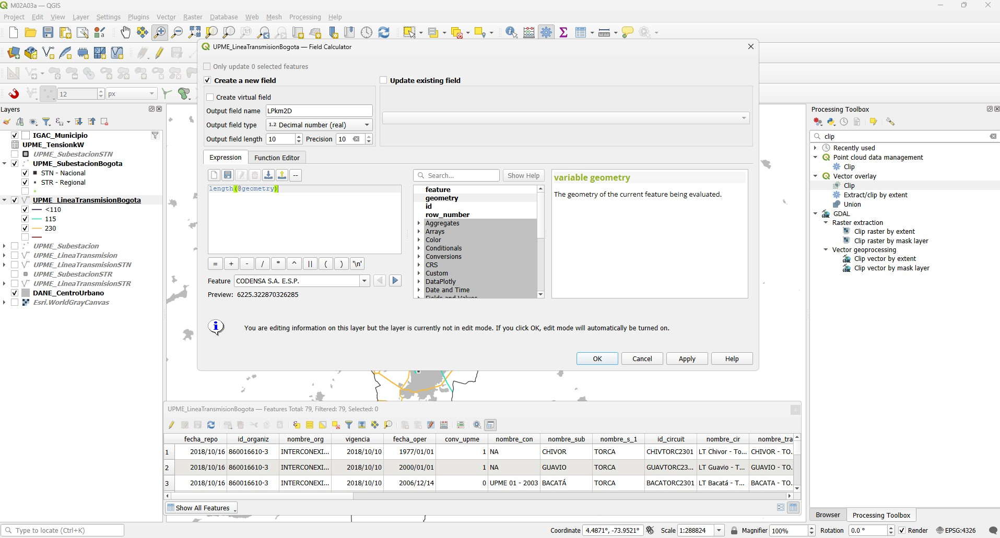

5. Utilizando la herramienta _Processing Toolbox / Vector Analysis / Statistics by categories_, cree una tabla de resumen estadístico por nivel de tensión y sumando las longitudes en kilómetros, nombre como _/table/UPME_LineaTransmisionBogotaStat.csv_. En la tabla resultante, podrá observar 37.09km de redes <110kW, 369.21km de redes 115kW y 141.61km de redes 230kW.

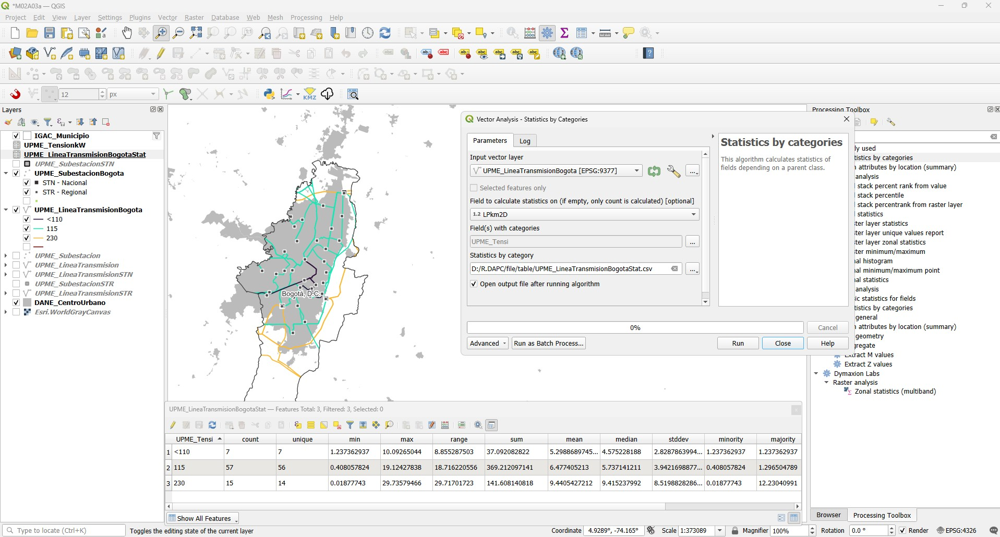

6. Utilizando el complemento _Data Plotly_, cree una gráfica de pastel que represente el total de las longitudes de la red para cada categoría. Podrá observar que el 67.4% corresponde a redes de 115kW. 

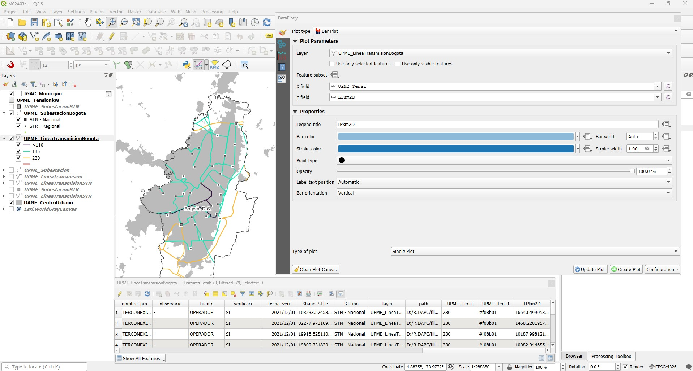

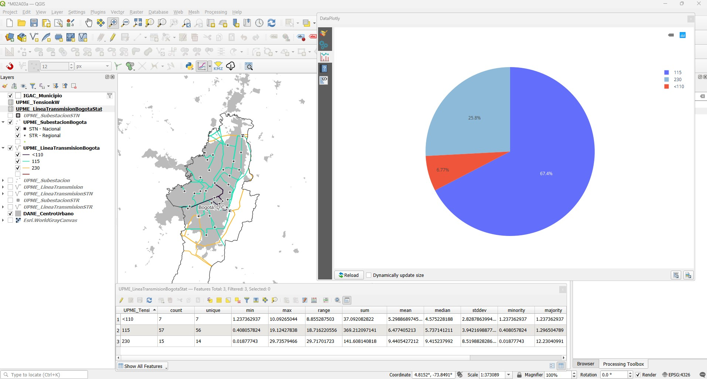

## 3. Análisis de corredores de servidumbre

Dependiendo de la tensión transportada por las líneas de transmisión, existen corredores de servidumbre o de seguridad dentro de los cuales no deben existir desarrollos urbanísticos.

> Las servidumbres de líneas transmisoras son franjas de terreno delimitadas a lo largo de las líneas de alta tensión para garantizar la seguridad de personas y animales, y el acceso de la empresa para mantenimiento y operación. Esta zona de servidumbre es un requisito del Reglamento Técnico de Instalaciones Eléctricas (RETIE), que establece el ancho según el nivel de tensión. En Colombia, estas servidumbres pueden establecerse voluntariamente mediante acuerdo con el propietario, quien recibe una compensación única, o por imposición judicial si no hay acuerdo. Durante esta franja no se pueden construir edificaciones ni realizar actividades que pongan en riesgo la seguridad. 

La siguiente tabla contiene los valores de referencia que utilizaremos para el trazado de estos corredores dentro de la ciudad.

|  Tensión(kW)  |  Servidumbre (m)  |
|:-------------:|:-----------------:|
|     <110      |        20         |
|      115      |        20         |
|      230      |        32         |

> Los valores presentados en la tabla corresponden al ancho completo del corredor, por lo cual el buffer corresponderá a la mitad de la servidumbre.
> 
> Para el caso de las redes menores y según comunicados de Enel Codensa y el RETIE, las fachadas de las edificaciones deben respetar una distancia mínima de 2.30
metros frente a las redes eléctricas.

1. Utilice la herramienta _Processing Toolbox / Vector geometry / Buffer_, para crear las áreas de aferencia. Guardar como _/shp/UPME_LineaTransmisionBogotaServidumbre.shp_.

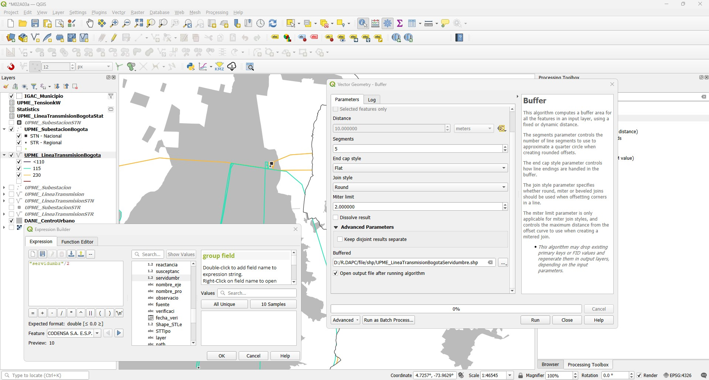

2. Utilice la herramienta _Processing Toolbox / Vector geometry / Dissolve_, para combinar los polígonos disueltos por tipo de tensión. De esta forma obtendrá solo una aferencia para líneas que se encuentran muy cercanas y que tienen la misma tensión. Guardar como _/shp/UPME_LineaTransmisionBogotaServidumbreDissolve.shp_.

3. En la tabla de atributos de la capa _UPME_LineaTransmisionBogotaServidumbreDissolve.shp_, cree un campo de atributos real de 10 decimales de precisión con el nombre `APha` y calcule el área planar en hectáreas de cada servidumbre. Calcular con la expresión `area(@geometry)/10000`. Simbolice y grafique por tensión y área. Podrá observar que las mayores servidumbres corresponden a las líneas de transmisión con tensión de 115kW, con 492.56 hectáreas o 54.4%.

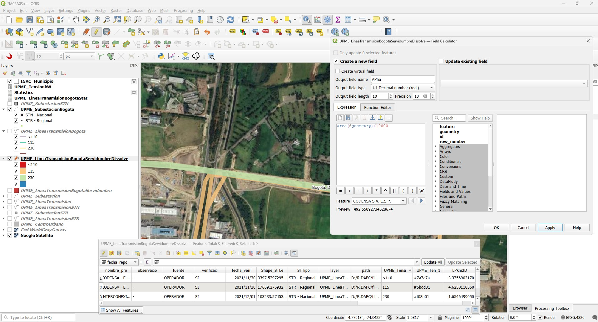

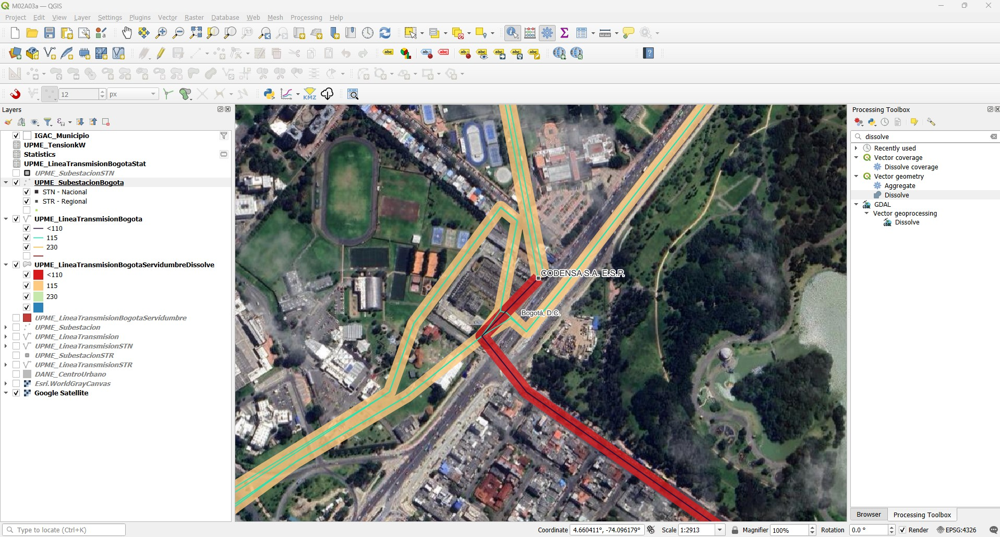

4. En la tabla de atributos, cree un campo de atributos real con el nombre `Dp` y calcule la distribución porcentual de las 3 clases obtenidas en función de las áreas por nivel de tensión.

## Actividades de proyecto (grupal opcional no calificable, individual requerido) :triangular_ruler:

Utilizando la [Plantilla de Microsoft Word](../../file/report/R.DAPC.PlantillaInformeTecnico.docx) suministrada, cree un informe técnico mostrando las actividades desarrolladas en el orden presentado en esta actividad, junto con las consideraciones de diseño, los análisis y recomendaciones realizadas para las actividades del proyecto. Convierta a Adobe Acrobat (.pdf) y guarde en la carpeta _/report_ del repositorio de datos, nombre el archivo con el código de la actividad agregando al final la fecha de control documental en formato aaaammdd (p. ej. M01A01_20250531.pdf).

En la siguiente tabla se listan las actividades que deben ser desarrolladas y documentadas por cada grupo de proyecto o individualmente.

| Actividad | Alcance                                                                                                                                                                                                                                                                                                                                                                                                                                                                                                                                                         |
|:----------|:----------------------------------------------------------------------------------------------------------------------------------------------------------------------------------------------------------------------------------------------------------------------------------------------------------------------------------------------------------------------------------------------------------------------------------------------------------------------------------------------------------------------------------------------------------------|
| M02A03a   | Individual: los numerales vistos en esta actividad son evaluados individualmente a través de un quiz de conocimiento y habilidad.                                                                                                                                                                                                                                                                                                                                                                                                                               |
| M02A03a   | En grupo: desarrolle los numerales indicados en esta actividad y presente un informe técnico detallado con capturas de pantalla de todas las herramientas utilizadas. Incluir en la carpeta /shp, las capas creadas. Para el predio del campus de la [UECIJG](https://www.escuelaing.edu.co), determine el % de afectación.                                                                                                                                                                                                                                     |
| M02A03a   | En grupo: en una tabla y al final del informe de avance de esta entrega, indique el detalle de las actividades realizadas por cada integrante de su grupo; utilice las siguientes columnas: `Nombre del integrante`, `Actividades realizadas`, `Tiempo dedicado en horas` (si presenta la entrega individualmente, no es necesaria la presentación de esta tabla).  Para actividades que no requieren del desarrollo de elementos de avance, indicar si realizo la lectura de la guía de clase y las lecturas indicadas al inicio en los requerimientos. | 

> Nota 1: para la revisión del proyecto final, guarde los libros cálculo de Microsoft Excel y los archivos generados en esta actividad, en las localizaciones indicadas en cada numeral.
>
> Nota 2: una vez el instructor realice la revisión y el estudiante presente las correcciones o ajustes solicitados, será necesario cargar una nueva versión de los archivos en el repositorio del proyecto, incluyendo o actualizando al final del nombre del archivo, la fecha de presentación en formato aaaammdd y manteniendo las versiones anteriores presentadas.

## Referencias

* https://www.minenergia.gov.co/es/sala-de-prensa/noticias-index/colombia-y-panam%C3%A1-avanzan-en-la-integraci%C3%B3n-energ%C3%A9tica-a-trav%C3%A9s-de-la-interconexi%C3%B3n-el%C3%A9ctrica/
* https://onl.dnp.gov.co/transicion-energetica/Paginas/default.aspx
* https://www.enel.com.co/content/dam/enel-co/espa%C3%B1ol/7-prensa/2020/diciembre/Respeto-por-las-distancias-minimas-con-la-red-de-energia-en-proyectos-de-construccion-salva-vidas.pdf
* https://www.enel.com.co/es/proyectos-en-alta-tension/servidumbres-electricas.html

##

_R.DAPC es de uso libre para fines académicos, conoce nuestra licencia, cláusulas, condiciones de uso y como referenciar los contenidos publicados en este repositorio, dando [clic aquí](../../LICENSE.md)._

_¡Encontraste útil este repositorio!, apoya su difusión marcando este repositorio con una ⭐ o síguenos dando clic en el botón Follow de [rcfdtools](https://github.com/rcfdtools) en GitHub._

| [◄ Anterior](../M02A02b/Readme.md) | [:house: Inicio](../../README.md) | [:beginner: Ayuda / Colabora](https://github.com/rcfdtools/R.DAPC/discussions/1) | [Siguiente ►](../M02A03b/Readme.md) |
|---------------------------------------------------|-----------------------------------|----------------------------------------------------------------------------------|---------------------------------------------------|

[^1]: 