# 2.3.b. Mapas e imágenes / Modelos digitales de elevación DEM - Red de interconexión energética 3D
Keywords:  `dem` `copernicus` `powerline-offset` `m02a03b`

Mapas y cartografía. Elaboración de planos. Imágenes en SIG. Manejo y manipulación de imágenes. Procesamiento de modelos digitales de elevación. 

**Caso de estudio**: análisis de longitudes 3D de la red de interconexión energética nacional de Colombia.

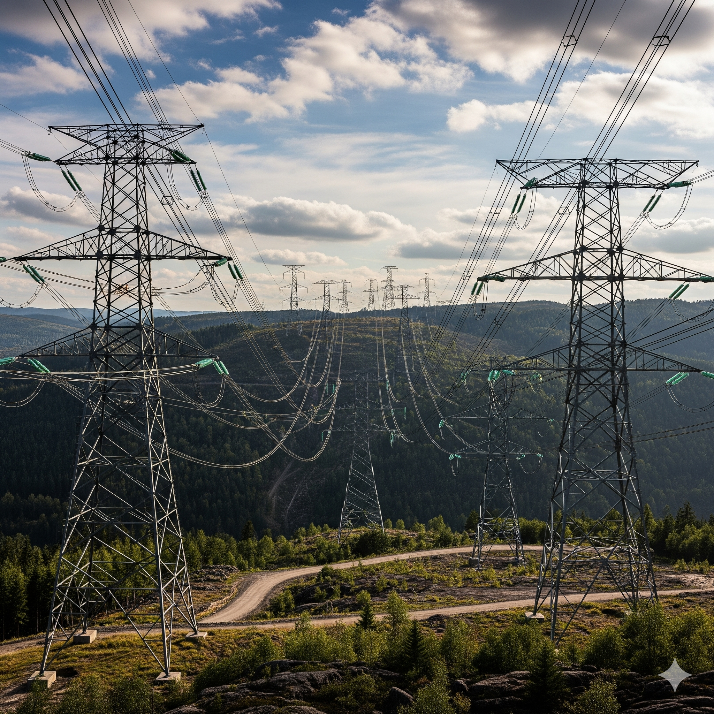 Generado con: <a href="https://gemini.google.com/app/ae9373792145f9e2">https://gemini.google.com/</a>  

## Objetivos

Al finalizar esta actividad, el estudiante:

* Elabora mapas y planos.
* Une capas geográficas para análisis con cobertura integrada.
* Descarga y procesa imágenes satelitales de modelos digitales de elevación.
* Crea nodos y líneas 3D.

## Requerimientos

Archivos, actividades previas, lecturas y herramientas requeridas para el desarrollo de esta actividad:

| Requerimiento                                                                            | Descripción                                                                                                    |
|:-----------------------------------------------------------------------------------------|:---------------------------------------------------------------------------------------------------------------|
| [:toolbox:Herramienta](https://qgis.org/)                                                | QGIS 3.44 o superior.                                                                                          |  
| [:man_technologist:Cuenta de usuario en _Open Topography_](https://opentopography.org/)  | Cuenta de usuario requerida para descarga de modelos digitales de elevación DEM.                               |  
| [:round_pushpin:IGAC_Municipio.shp](../../file/data/IGAC/IGAC_Municipio_20250912.zip)    | Municipios, Distritos y Áreas no municipalizadas de Colombia obtenidas de https://www.colombiaenmapas.gov.co/. |
| [:round_pushpin:UPME_LineaTransmision.shp](../../file/shp/DNP/UPME_LineaTransmision.zip) | Líneas de transmisión regional y nacional, integradas a partir de capas obtenidas de https://onl.dnp.gov.co.   |

> :blue_heart: El repositorio de proyecto deberá mantenerse durante la duración del curso, estableciendo permisos de escritura para los integrantes de su grupo y lectura para el instructor.
>
> Para los diferentes avances de proyecto, es necesario guardar y publicar las diferentes versiones generadas del (los) libro (s) de Microsoft Excel, reportes o informes y dibujos generados, agregando al final la fecha de control documental en formato aaaammdd, p. ej., _M01A01_20250710.dwg_.

## 1. Modelo digital de elevación DEM

Para la descarga del modelo de terreno satelital, es necesaria la creación de un polígono envolvente.

1. En QGIS, cree un proyecto nuevo en blanco, asigne el CRS 9377, agregue la capa [IGAC_Municipio.shp](../../file/data/IGAC/IGAC_Municipio_20250912.zip) y filtre el polígono correspondiente a Bogotá, expresión: `"MpCodigo" = '11001'`. Simbolice el polígono solo por su contorno y rotule con la expresión  `"MpCodigo"  ||  ' / '  || "MpNombre"`. Guarde el mapa como _/map/M02A03b.qgz_.

> Para entender la localización topográfica del polígono de Bogotá, agregue el mapa base de _Google Terrain_ desde la URL https://mt1.google.com/vt/lyrs=p&x={x}&y={y}&z={z} 
>
> Mapas base complementarios en: https://github.com/opengeos/qgis-basemaps/blob/main/qgis_basemaps.py

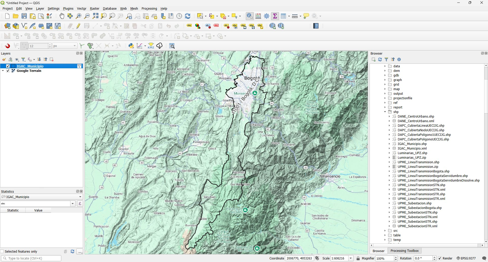

2. Utilizando la herramienta _Processing Toolbox / Vector Geometry / Bounding boxes_, obtenga el polígono regular envolvente que rodea el polígono de la ciudad. Guarde como _/shp/IGAC_Municipio11001Box.shp_ y simbolice solo por contorno.

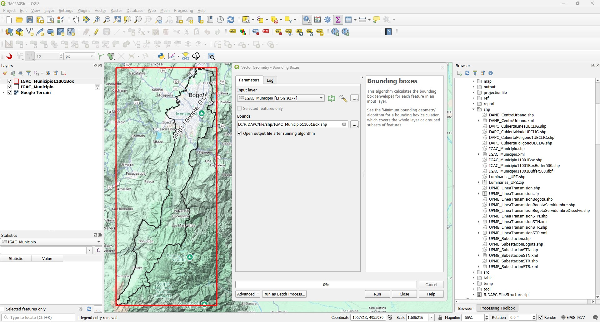

3. Utilizando la herramienta _Processing Toolbox / Vector Geometry / Buffer_, cree un polígono con aferencia de 500 metros alrededor del polígono envolvente. Guarde como _/shp/IGAC_Municipio11001BoxBuffer500.shp_ y simbolice solo por contorno. En los parámetros establezca:

* Segments: 1
* End cap style: Square
* Join style: Miter
* Miter limit: 10

> La aferencia es requerida para descargar una región más amplia del modelo digital de elevación que permita evaluar todo su contorno.

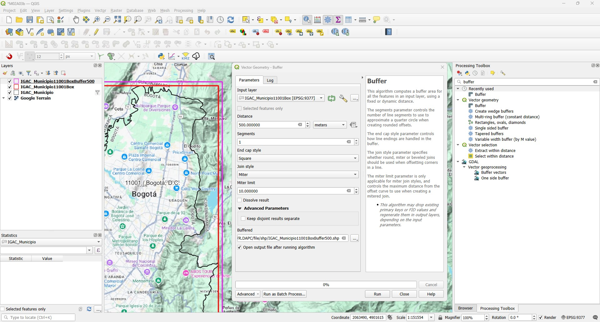

4. En la tabla de atributos de la capa _/shp/IGAC_Municipio11001BoxBuffer500.shp_, cree 4 campos de atributos reales con precisión 10 con los nombres `LongLeft`, `LongRight`, `LatTop` y `LatBottom`. Utilizando las siguientes expresiones y desde el _Field Calculator_, obtenga las latitudes y longitudes que delimitan el polígono envolvente.

* `LonDDMin = x_min(transform($geometry, layer_property(@layer, 'crs'),'EPSG:4326'))`
* `LonDDMax = x_max(transform($geometry, layer_property(@layer, 'crs'),'EPSG:4326'))`
* `LatDDMin = y_min(transform($geometry, layer_property(@layer, 'crs'),'EPSG:4326'))`
* `LatDDMax = y_max(transform($geometry, layer_property(@layer, 'crs'),'EPSG:4326'))`

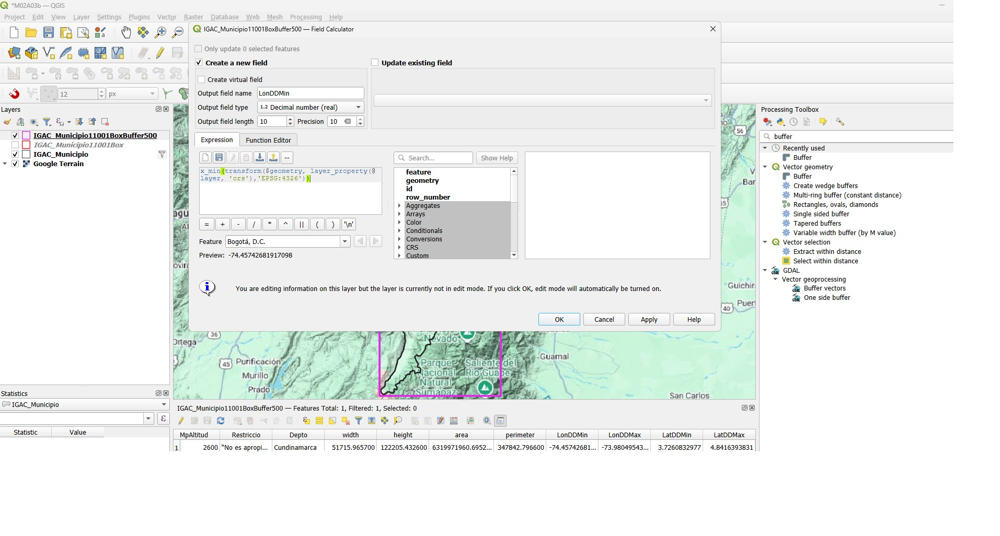

5. Para la obtención de modelo digital de elevación - DEM Copernicus, ingrese al portal https://opentopography.org/ con su cuenta de usuario. En la pestaña DATA, seleccione la opción FIND DATA MAP. En el panel _Data Sources_ localizado a la derecha del mapa, active la casilla _Global & Regional DEM's / COP 30m & 90m_. Desde el panel de opciones localizado a la izquierda, ingrese las coordenadas que delimitan la zona de descarga, para el ejemplo corresponden a: 

* Lower-left Lon: -74.4574268192
* Lower-left Lat: 3.7260832977
* Upper-right Lon: -73.9804954370
* Upper-right Lat: 4.8416393831

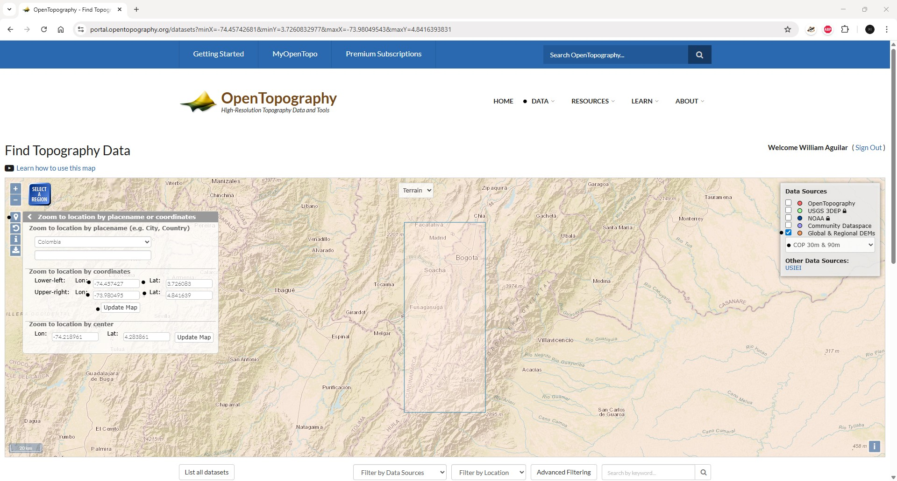

6. Una vez ingresadas las coordenadas, de clic en el botón _Update Map_, observará que en la parte inferior son mostrados los enlaces para descarga de los diferentes modelos digitales de elevación.

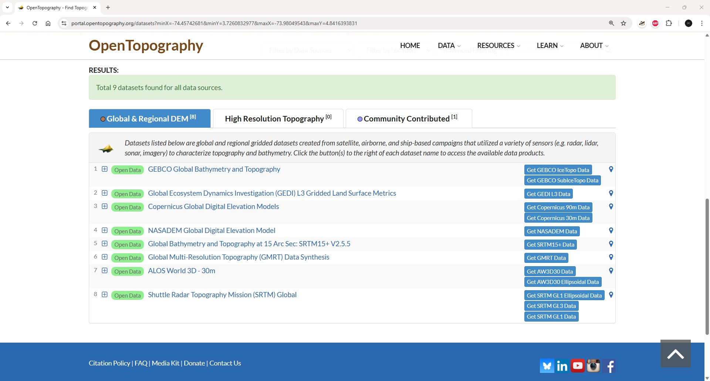

7. Descargue en formato GeoTiff el modelo correspondiente a Copernicus 30m Data, podrá observar en la ventana que el área a descargar corresponde a 6560 km². Guarde el archivo descargado [rasters_COP30.tar.gz](../../file/dem/rasters_COP30.tar.gz) y descomprima en la carpeta _/dem_, renombre como _Copernicus30m.tif_.

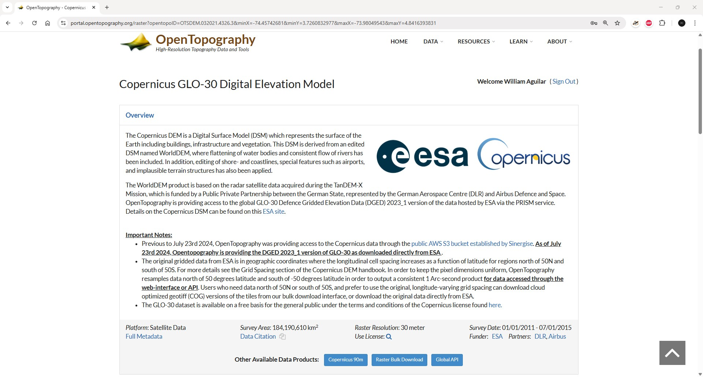

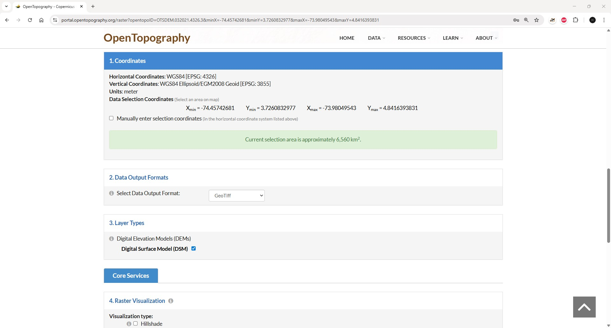

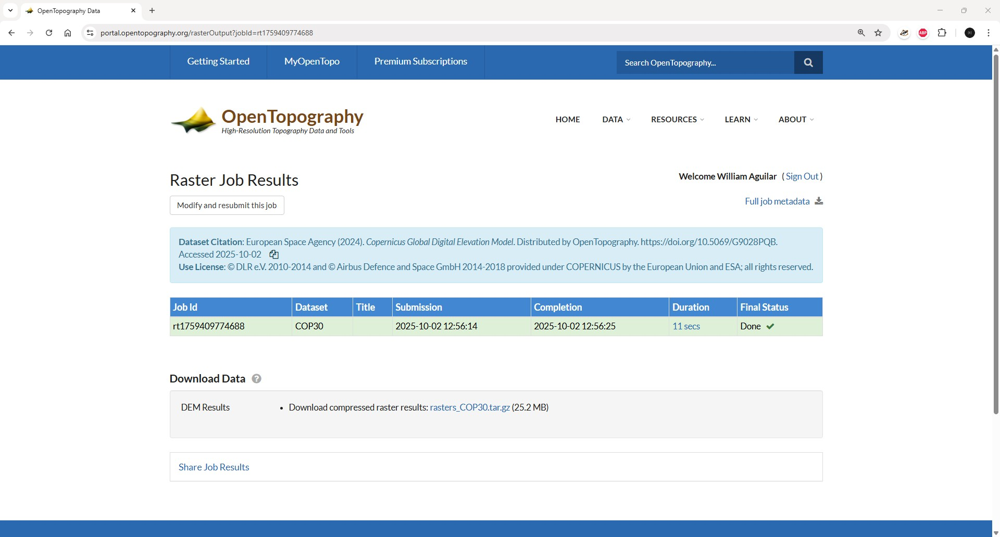

> El procedimiento de descarga de modelos digitales de elevación DEM, también puede ser realizado directamente desde QGIS instalando el complemento _OpenTopography_ que requiere de una API Key que puede ser obtenida desde el perfil de usuario de este servicio.

8. Agregue el DEM al mapa de QGIS y consulte sus propiedades, podrá observar que el CRS asociado es el 4326 ó WGS84.

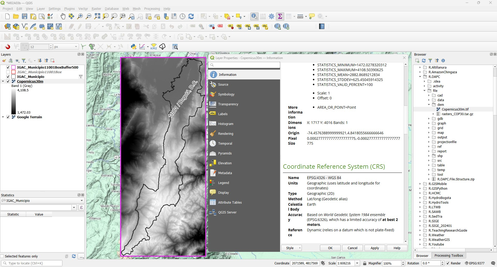

9. Exporte y reproyecte el DEM al CRS 9377, guarde como _/dem/Copernicus30m9377.tif_, simbolice por _Hillshade_.

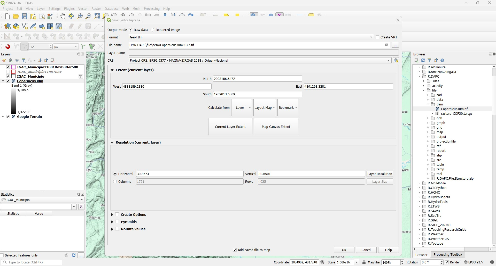

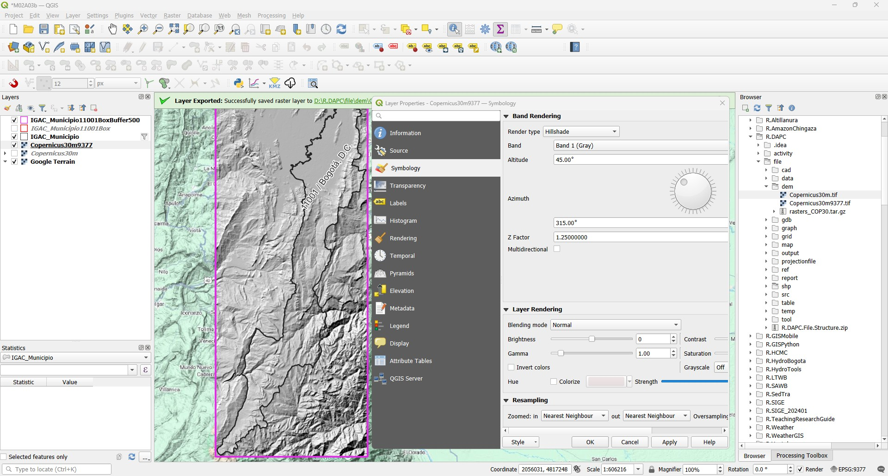

## 2. Localización de torres eléctricas y elementos 3D

Las dimensiones de las torres eléctricas varían significativamente; las de distribución son más bajas (15-55 metros), mientras que las de transmisión de alta tensión pueden superar los 300 metros, con diámetros variables según el diseño y la estructura de la celosía. Su altura depende de la tensión y la distancia de transporte, requiriendo tramos más altos para cruzar ríos u otros obstáculos. 

El ancho de la base de una torre eléctrica varía según su tipo, pero puede ir desde los 8 metros para torres de celosía de 32 metros de altura, hasta anchos mayores para torres más altas o con otras configuraciones, dado que las torres tienen una forma de tronco piramidal que las hace más anchas en la base para garantizar la estabilidad. 

Para la segmentación de líneas de transmisión eléctrica a partir de la separación de torres eléctricas por tipo de tensión eléctrica, utilizaremos los siguientes valores de referencia:

| Tensión                | Rango de separación (m)  |  Valor (m)  |
|:-----------------------|:-------------------------|:-----------:|
| Alta (AT) <= 500 kW    | Entre 350m y 1700m       |    1000     |
| Media (MT) <= 230 kW   | Entre 275 y 455m         |     400     |
| Baja (BT) <= 115 kW    | 100 metros               |     100     |

1. Agregue al proyecto la capa de líneas de transmisión eléctrica localizadas dentro de Bogotá D.C. desde la capa _/shp/UPME_LineaTransmisionBogota.shp_ y simbolice por categorías a partir del campo `UPME_Tesi`,

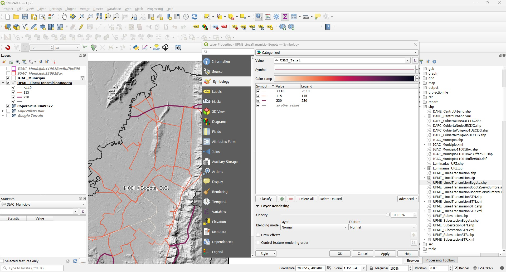

2. Con la herramienta _View / Elevation Profile_, visualice el perfil 3D del tramo denominado _CIRCO - NUEVA ESPERANZA 1 230 kV_. Podrá observar que su elevación varía pasando por los cerros orientales y occidentales de la ciudad.

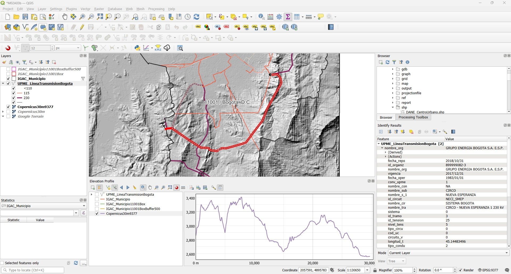

3. Asigne un código único de identificación a cada tramo de las líneas de transmisión. En la tabla de atributos de la capa, cree un campo numérico entero largo con el nombre `IDLine` y asigne con el _Field Calculator_ la propiedad `@id`.

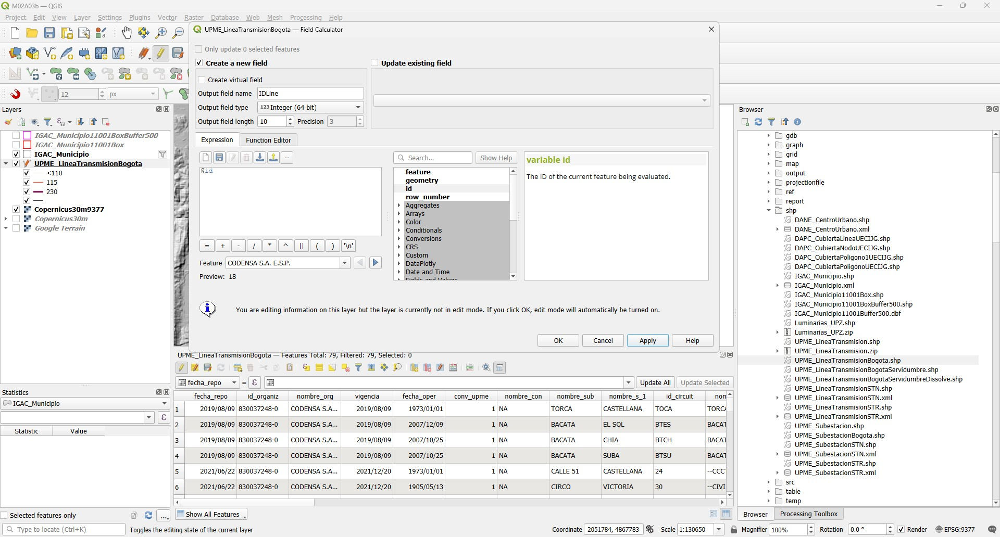

4. Cree ahora un campo real de precisión 10 con el nombre `TorreDist`, luego utilizando la herramienta de selección por atributos y el calculador de campo, asigne los valores de separación definidos dependiendo de la tensión.

| Tensión             | Query                           |  Valor (m)  |
|:--------------------|:--------------------------------|:-----------:|
| Alta (AT) = 500 kW  | "UPME_Tensi" =  '500'           |    1000     |
| Media (MT) = 230 kW | "UPME_Tensi" =  '230'           |     400     |
| Baja (BT) = 115 kW  | "UPME_Tensi" in ('<110', '115') |     100     |

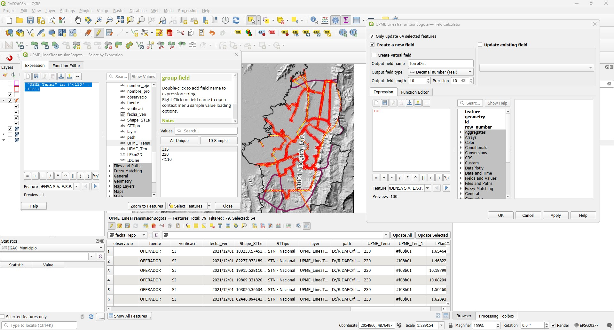

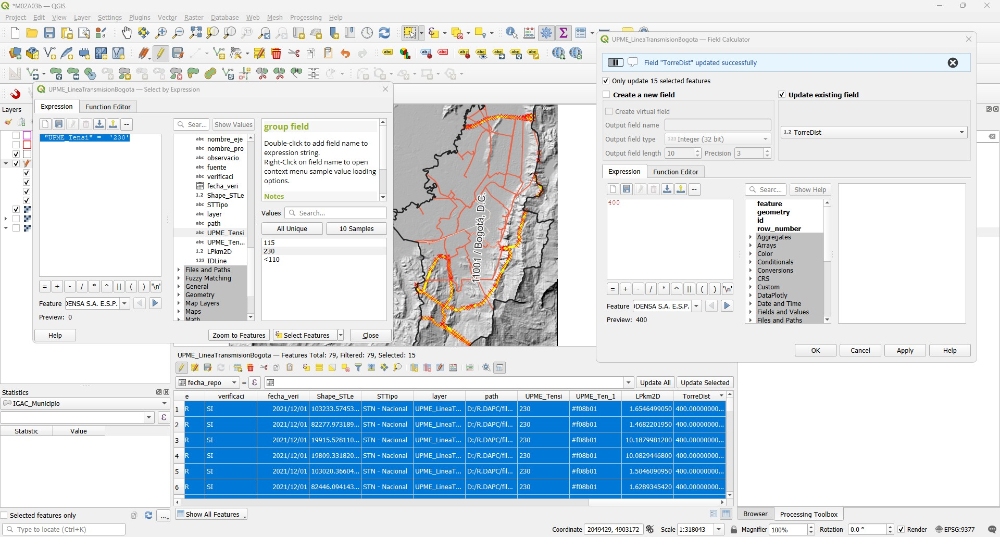

5. Utilizando la herramienta _Processing Toolbox / Vector Geometry / Split lines by maximum length_, divida cada tramo a partir del campo de atributos `TorreDist`, Guarde la capa resultante como _/shp/UPME_LineaTransmisionBogotaSplit.shp_. Abra y verifique la tabla de atributos, podrá observar que cada tramo contiene ahora múltiples segmentos. Simbolice usando flechas por segmento. 

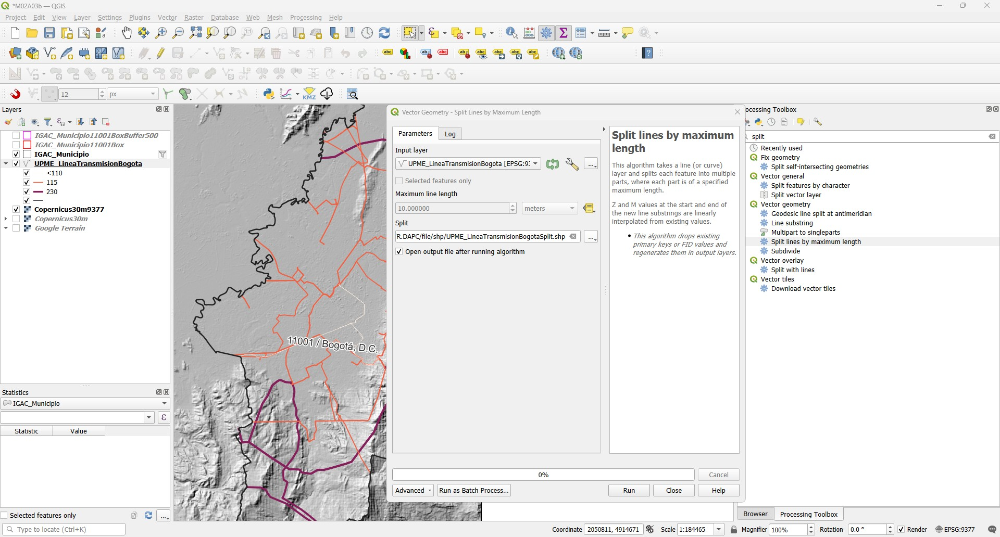

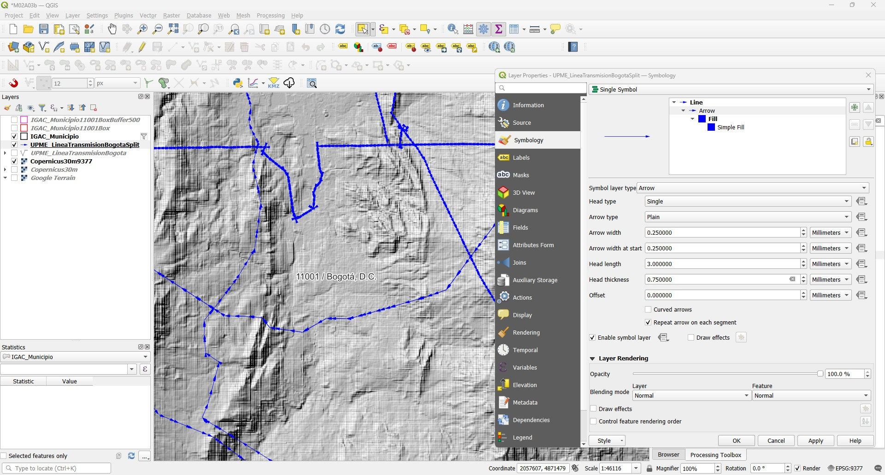

6. A través de un _Query Builder_, filtre por "nombre_tra" = 'CIRCO - TUNAL 1 230 kV' la capa segmentada. Observará que este tramo se componen de 75 segmentos entre torres a 400 metros debido a que hemos considerado este tramo como de tensión media.

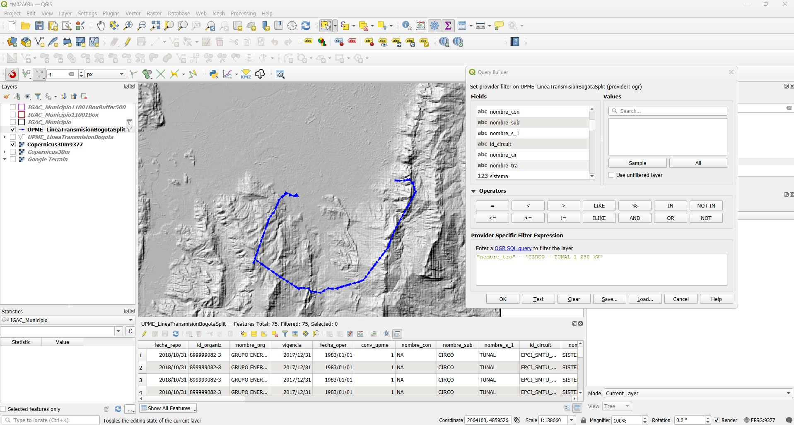

7. Utilizando la herramienta _Processing Toolbox / Vector Geometry / Extract vertices_, obtenga todos los nodos 2D que componen los segmentos del tramo filtrado. Guarde la capa resultante como _/shp/UPME_LineaTransmisionBogotaSplitNodo.shp_.

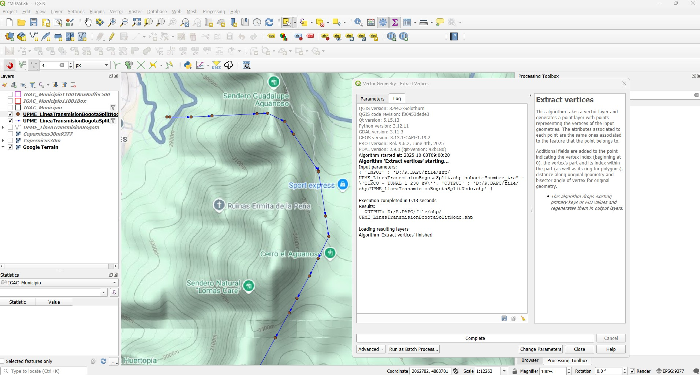

> Tenga en cuenta que en cada tramo se han obtenido los nodos iniciales y finales, debido a esto, en las localizaciones intermedias obtendremos nodos duplicados. QGIS dispone de una herramienta de eliminación de vértices duplicados, denominada _Remove duplicate vertices_, sin embargo, esta herramienta no los elimina debido a que uno corresponde al nodo final de un tramo y otro al inicial del siguiente.

8. Con la herramienta _Raster analysis / Sample raster values_, obtenga las cotas o elevaciones Z de todos los nodos a partir del DEM Copernicus30m9377.tif, utilice _COP30__ como prefijo de campo. Guarde la capa resultante como _/shp/UPME_LineaTransmisionBogotaSplitNodoZ.shp_. 

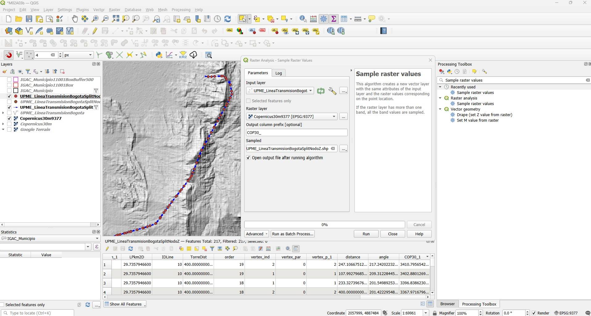

9. Con la herramienta _Vector geometry / Set Z value_, asigne el valor Z a cada nodo a partir del campo de atributos `COP30_1` para obtener nodos 3D. Guarde la capa resultante como _/shp/UPME_LineaTransmisionBogotaSplitNodoZ3D.shp_. 

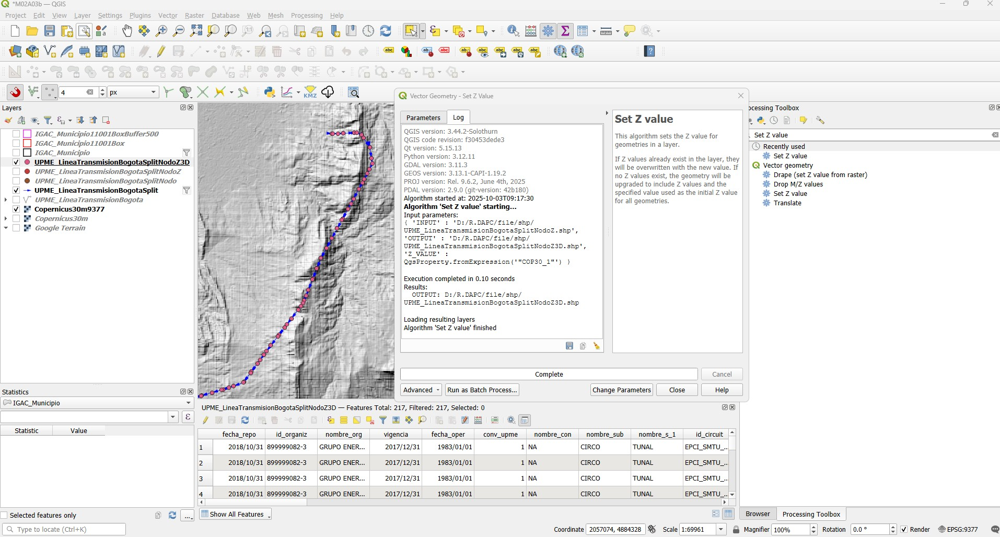

10. En la tabla de atributos de la capa _UPME_LineaTransmisionBogotaSplitNodoZ3D.shp_, cree un campo de atributos numérico entero largo con el nombre `IDNode` y con el calculador de campo asigne la propiedad `@id` para asignar un código único a cada nodo. Rotule los nodos a partir del campo de identificación de tramo e identificación de nodo con la expresión: `"IDLine"  || '-'  || "IDNode" `, podrá observar que los nodos del tramo han sido numerados consecutivamente de inicio a fin.

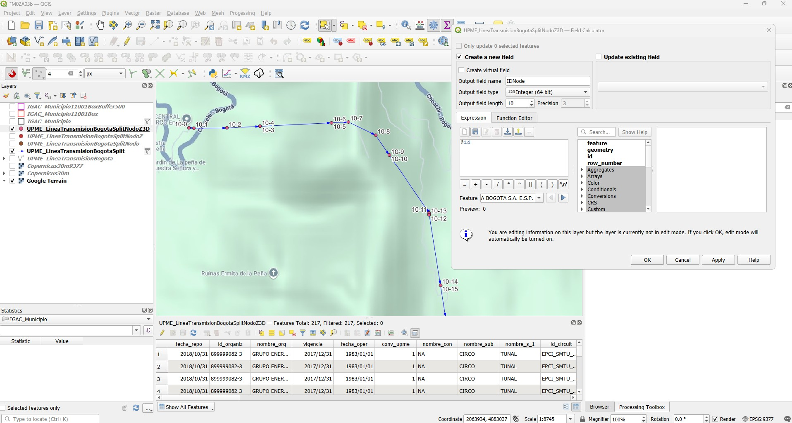

11. Con la herramienta _Vector creation / Points to path_, convierta los nodos 3D a una polilínea 3D. Guarde la capa resultante como _/shp/UPME_LineaTransmisionBogota3D.shp_. Abra la tabla de atributos, observará que la línea corresponde al identificador IDLine = 10 y que ha sido creada a partir de 217 nodos incluyendo el nodo cero.

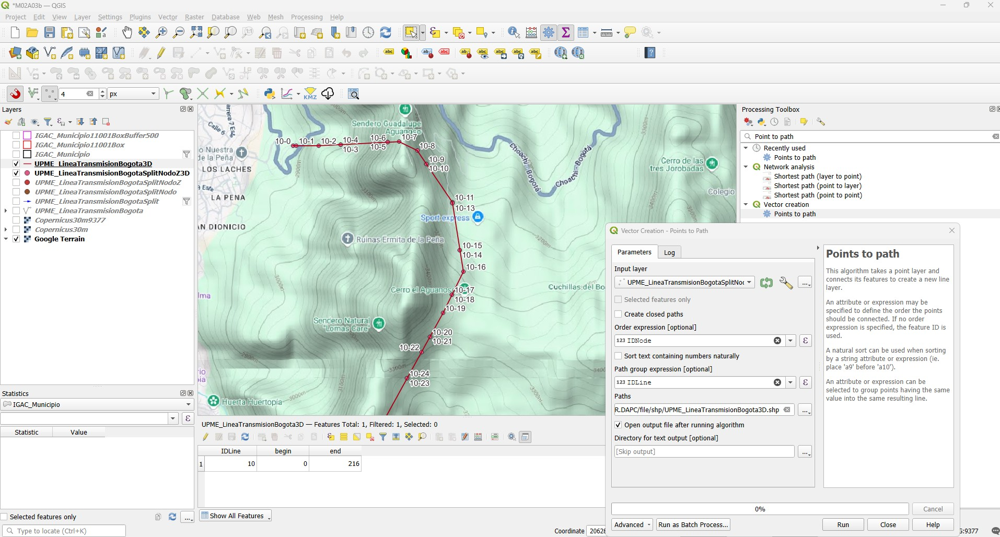

12. En la tabla de atributos cree campos numéricos reales de precisión 10 y calcule la longitud 2D, 3D y diferencia de longitudes, utilice las expresiones:

* LP2Dm: `length(@geometry)`
* LP3Dm: `length3D(@geometry)`
* LPDiffm: `length3D(@geometry)-length(@geometry)`

Obtendrá que la diferencia de longitudes 3D vs. 2D es de 582.09 metros.

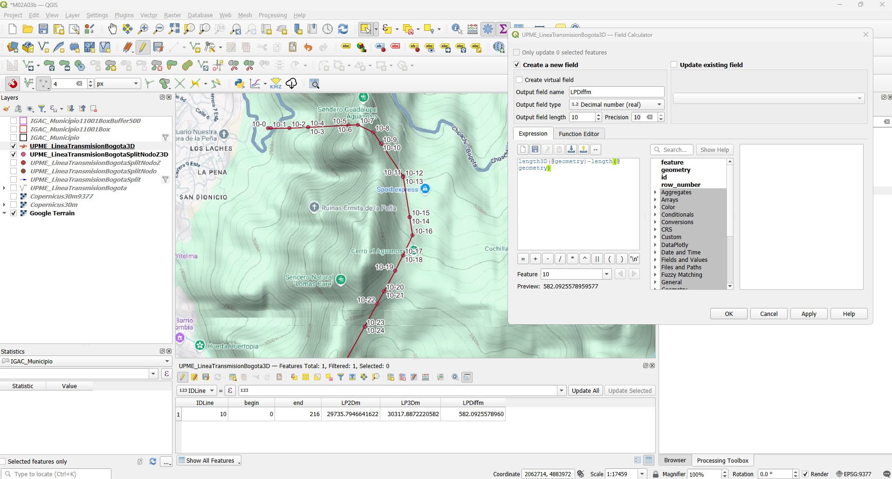

13. Con la herramienta _View / Elevation Profile_, visualice el perfil 3D del tramo denominado _CIRCO - NUEVA ESPERANZA 1 230 kV_ a partir de la línea y nodos 3D. Podrá observar los nodos son representados correctamente y que el eje de la línea visualmente es presentado discontínuo.

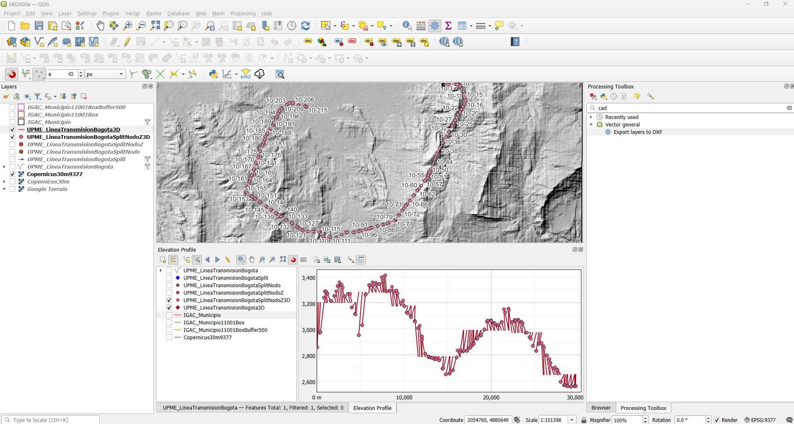

14. Con la herramienta _Vector general / Export layers to DXF_, exporte las capas _UPME_LineaTransmisionBogotaSplitNodoZ3D.shp_ y _UPME_LineaTransmisionBogota3D.shp_ usando el CRS 9377, guarde como _/cad/UPME_LineaTransmisionBogota3D.dxf_.

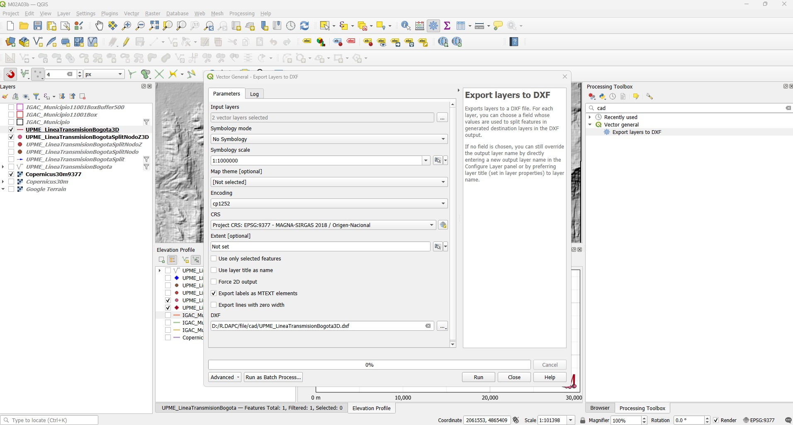

15. Desde AutoCAD, abra el archivo generado ajustando con el comando **PTYPE** la representación de visualización de puntos a 20 metros. Desde las propiedades prodrá observar que la longitud 3D de la línea corresponde a 30317.8872 metros, coincidiendo con la longitud calculada por QGIS.

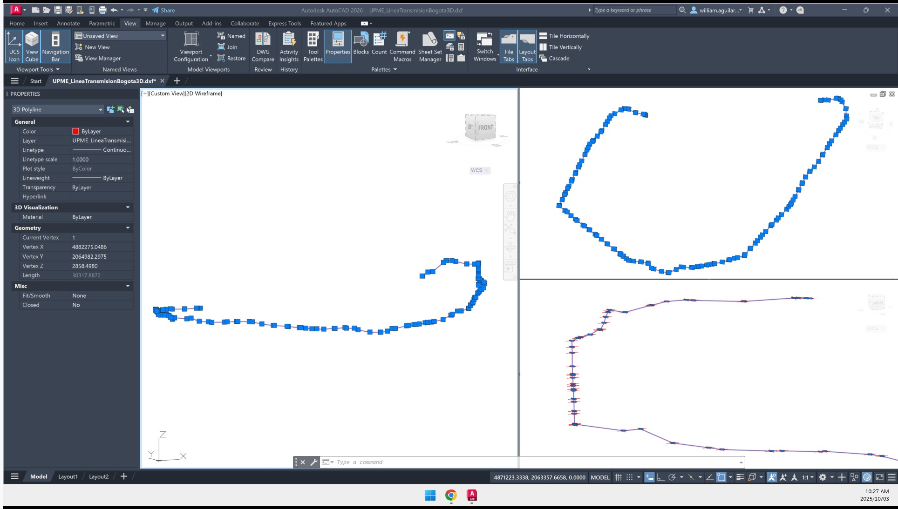

## 3. Estadísticos de elevación y curvas de nivel

1. Utilizando la herramienta _Raster analysis / Zonal statistics_, calcule los estadísticos de elevación del polígono de la ciudad de Bogotá D.C. contenido en la capa geográfica _IGAC_Municipio.shp_, a partir del modelo digital de elevación Copernicus. Podrá observar que el rango de elevaciones va de la cota 2280.55 a 4159.21 m.s.n.m. debido a que se incluyen las elevaciones correspondientes a la zona rural de la ciudad en el área de Sumapaz.

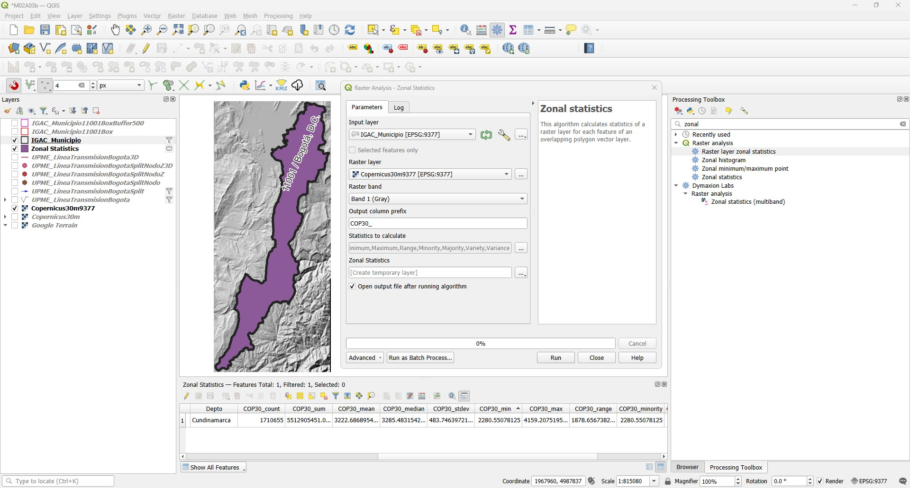

> Para calcular los estadísticos de elevación de las líneas de transmisión, cree un buffer de 0.1 metros alrededor de las líneas y luego ejecute la herramienta _Zonal statistics_. Lo anterior debido a que esta herramienta solo calcula valores a partir de polígonos. 

2. Ejecute la herramienta _GDAL / Raster extraction / Contour_, para generar curvas de nivel 3D cada 50 metros sobre toda la extensión del modelo digital de elevación Copernicus. Guarde la capa resultante como _/shp/IGAC_Municipio11001Contour.shp_.

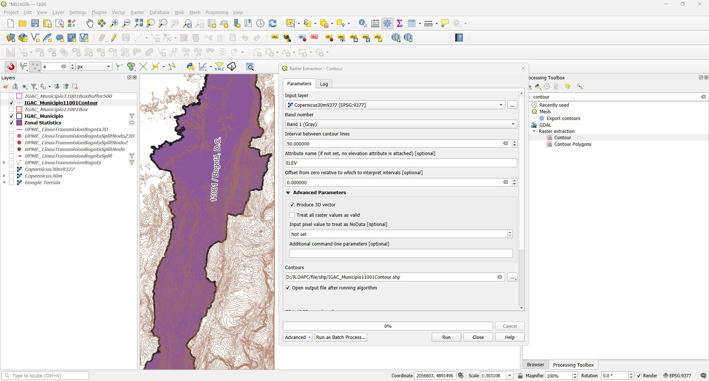

3. Ejecute la herramienta _Vector overlay / Clip_ para recortar las curvas de nivel hasta el límite del polígono municipal de Bogotá D.C. Guarde la capa resultante como _/shp/IGAC_Municipio11001ContourClip.shp_. 

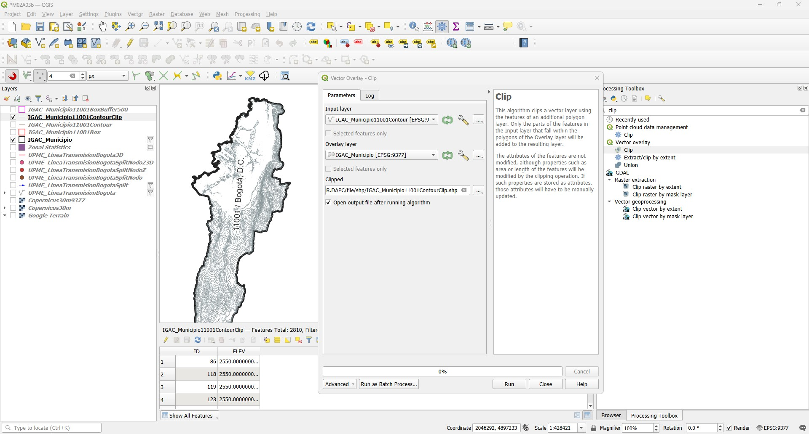

4. Simbolice por colores graduados a partir de la elevación de cada cota y para la línea de transmisión evaluada en la capa _UPME_LineaTransmisionBogota3D.shp_, identifique las curvas de nivel más próximas al punto de inicio y fin del tramo. Podrá observar que la curva cercana al punto inicial corresponde a 2850 m.s.n.m. y en el punto final 2600 m.s.n.m.

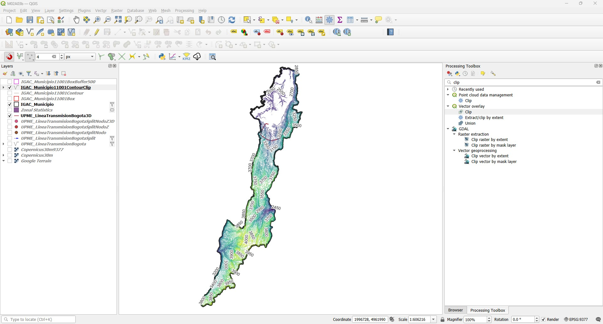

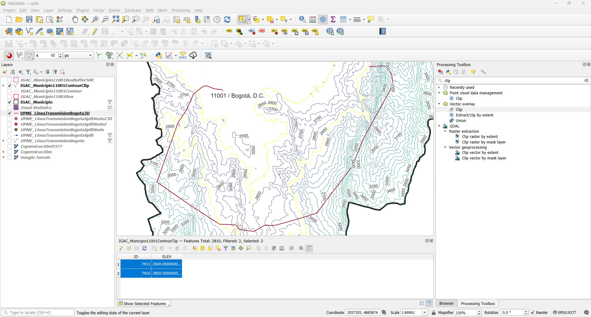

## Actividades de proyecto :triangular_ruler:

Utilizando la [Plantilla de Microsoft Word](../../file/report/R.DAPC.PlantillaInformeTecnico.docx) suministrada, cree un informe técnico mostrando las actividades desarrolladas en el orden presentado en esta actividad, junto con las consideraciones de diseño, los análisis y recomendaciones realizadas para las actividades del proyecto. Convierta a Adobe Acrobat (.pdf) y guarde en la carpeta _/report_ del repositorio de datos, nombre el archivo con el código de la actividad agregando al final la fecha de control documental en formato aaaammdd (p. ej. M01A01_20250531.pdf).

En la siguiente tabla se listan las actividades que deben ser desarrolladas y documentadas por cada grupo de proyecto o individualmente.

| Actividad | Alcance                                                                                                                                                                                                                                                                                                                                                                                                                                                                                                                                                                 |
|:----------|:------------------------------------------------------------------------------------------------------------------------------------------------------------------------------------------------------------------------------------------------------------------------------------------------------------------------------------------------------------------------------------------------------------------------------------------------------------------------------------------------------------------------------------------------------------------------|
| M02A03b   | Individual: los numerales vistos en esta actividad son evaluados individualmente a través de un quiz de conocimiento y habilidad.                                                                                                                                                                                                                                                                                                                                                                                                                                       |
| M02A03b   | Opcional en grupo: desarrolle los numerales indicados en esta actividad y presente un informe técnico detallado con capturas de pantalla de todas las herramientas utilizadas. Incluir en la carpeta /shp, las capas creadas.                                                                                                                                                                                                                                                                                                                                           |
| M02A03b   | Opcional en grupo: investigue que es la catenaria en un vano eléctrico y calcule la longitud real del cableado teniendo en cuenta la curvatura de la catenaria entre torres.                                                                                                                                                                                                                                                                                                                                                                                            |
| M02A03b   | Opcional en grupo: realice el procedimiento de estimación de longitud 3D de las líneas de transmisión utilizando 3 diferentes modelos de elevación digital DEM, p. ej., Copernicus 30m, ASTER GDEM v3 y SRTM.                                                                                                                                                                                                                                                                                                                                                           |
| M02A03b   | Opcional en grupo: en una tabla y al final del informe de avance de esta entrega, indique el detalle de las actividades realizadas por cada integrante de su grupo; utilice las siguientes columnas: `Nombre del integrante`, `Actividades realizadas`, `Tiempo dedicado en horas` (si presenta la entrega individualmente, no es necesaria la presentación de esta tabla).  Para actividades que no requieren del desarrollo de elementos de avance, indicar si realizo la lectura de la guía de clase y las lecturas indicadas al inicio en los requerimientos. | 

> Nota 1: para la revisión del proyecto final, guarde los libros cálculo de Microsoft Excel y los archivos generados en esta actividad, en las localizaciones indicadas en cada numeral.
>
> Nota 2: una vez el instructor realice la revisión y el estudiante presente las correcciones o ajustes solicitados, será necesario cargar una nueva versión de los archivos en el repositorio del proyecto, incluyendo o actualizando al final del nombre del archivo, la fecha de presentación en formato aaaammdd y manteniendo las versiones anteriores presentadas.

## Referencias

* https://onl.dnp.gov.co/transicion-energetica/Paginas/default.aspx
* https://retielectrica.com/clasificacion-de-los-niveles-de-tension-capitulo-2-articulo-12/
* [Calculemos la Catenaria de un Vano | Ejemplo de Clase Virtual Linielec](https://www.youtube.com/watch?v=AnHAPrNz7Qk)

## Control de versiones

| Versión      | Descripción        | Autor                                       | Horas |
|--------------|:-------------------|---------------------------------------------|:-----:|
| 2025.10.03   | Versión inicial.   | [rcfdtools](https://github.com/rcfdtools)   |   8   |

##

_R.DAPC es de uso libre para fines académicos, conoce nuestra licencia, cláusulas, condiciones de uso y como referenciar los contenidos publicados en este repositorio, dando [clic aquí](../../LICENSE.md)._

_¡Encontraste útil este repositorio!, apoya su difusión marcando este repositorio con una ⭐ o síguenos dando clic en el botón Follow de [rcfdtools](https://github.com/rcfdtools) en GitHub._

| [:arrow_backward: Anterior](../M02A03a/Readme.md) | [:house: Inicio](../../README.md) | [:beginner: Ayuda / Colabora](https://github.com/rcfdtools/R.DAPC/discussions/1) | [Siguiente :arrow_forward:](../M02A03c/Readme.md) |
|---------------------------------------------------|-----------------------------------|----------------------------------------------------------------------------------|---------------------------------------------------|

[^1]: 