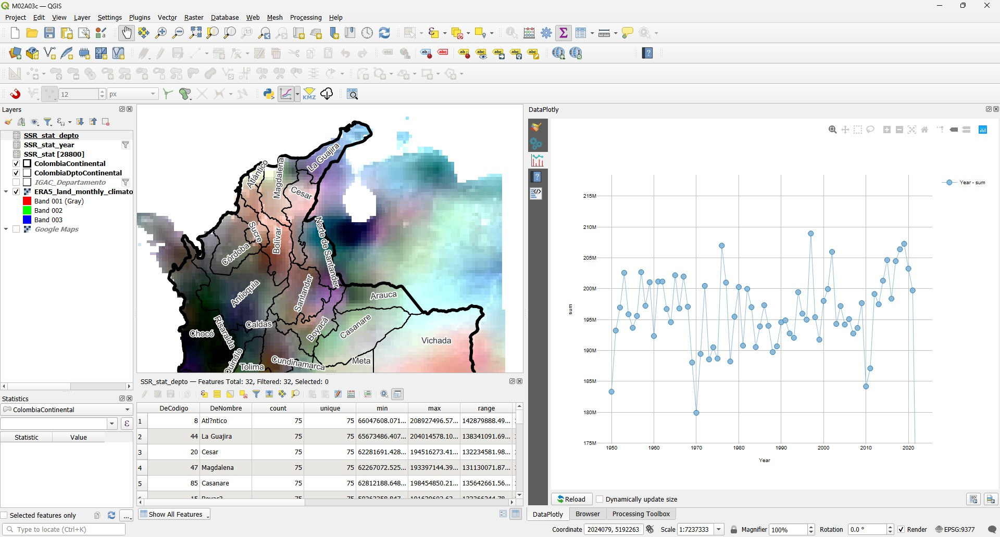
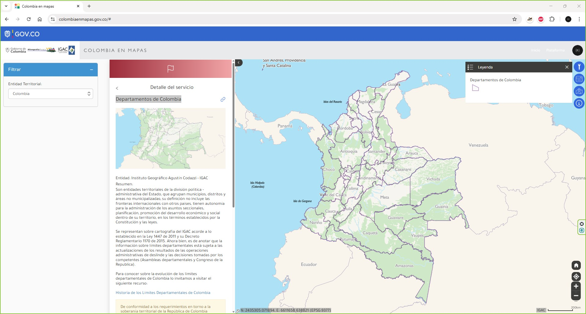
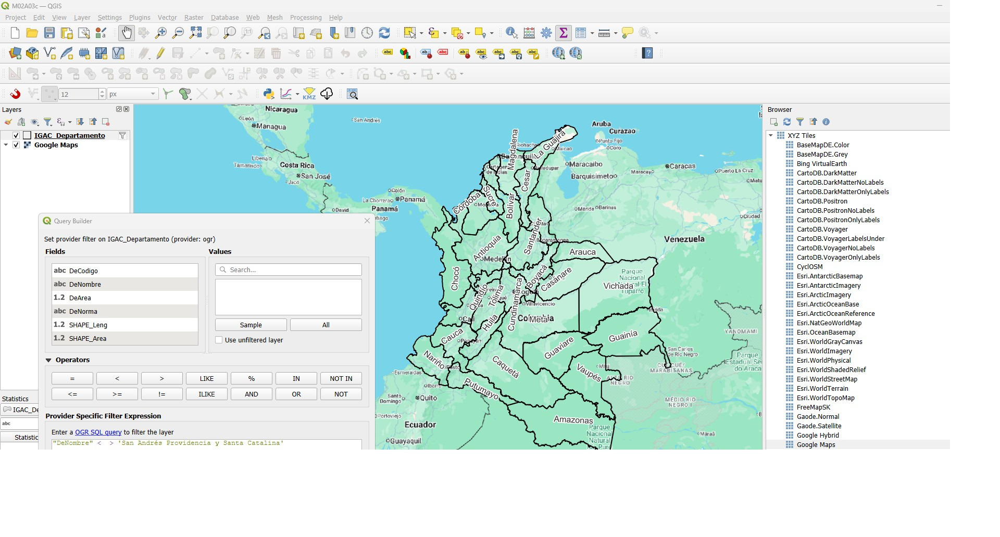

# 2.3.c. Mapas e imágenes / Análisis de potencial energético usando ERA5 Land Monthly
Keywords:  `era5` `ssr` `u10` `v10` `m02a03c`

Desde la plataforma [Copernicus](https://www.copernicus.eu/en) del [ECMWF](https://www.ecmwf.int/) y para el límite continental de Colombia en Suramérica: descargue las variables u10, v10 y ssr para el rango de años 1950 a 2024. Cargue y visualice todas las variables en un mapa. Para el límite geográfico definido y para cada variable, obtenga estadísticos zonales mes a mes y genere gráficos detallados agregados mensuales, anuales y decadales pada cada Departamento.  

## Objetivos

Al finalizar esta actividad, el estudiante:

* Elabora mapas y planos.
* Descarga datos hidro-climatológicos de re-análisis a partir de datos satelitales ERA5.

## Requerimientos

Archivos, actividades previas, lecturas y herramientas requeridas para el desarrollo de esta actividad:

| Requerimiento                                                                                             | Descripción                                                                                          |
|:----------------------------------------------------------------------------------------------------------|:-----------------------------------------------------------------------------------------------------|
| [:toolbox:Herramienta](https://qgis.org/)                                                                 | QGIS 3.44 o superior.                                                                                |  
| [:man_technologist:Cuenta de usuario _ECMWF Copernicus_](https://cds.climate.copernicus.eu/user/login)    | Cuenta de usuario requerida para descarga de datos satelitales hidro-climatológicos mundiales ERA5.  |  
| [:round_pushpin:IGAC_Departamento.shp](../../file/data/IGAC/IGAC_Departamento_20251023.zip)               | Municipios de Colombia obtenidos de https://www.colombiaenmapas.gov.co/.                             |
| [:round_pushpin:ERA5 Land Colombia.nc](../../file/data/ERA5/)                                             | Datos satelitales hidro-climatológicos mundiales ERA5 de [Copernicus](https://www.copernicus.eu/en)  |

> :blue_heart: El repositorio de proyecto deberá mantenerse durante la duración del curso, estableciendo permisos de escritura para los integrantes de su grupo y lectura para el instructor.
>
> Para los diferentes avances de proyecto, es necesario guardar y publicar las diferentes versiones generadas del (los) libro (s) de Microsoft Excel, reportes o informes y dibujos generados, agregando al final la fecha de control documental en formato aaaammdd, p. ej., _M01A01_20250710.dwg_.

## 1. Obtención de límites geográficos

1. Desde el portal https://www.colombiaenmapas.gov.co, descargue la capa de Departamentos de Colombia, guarde como [/file/data/IGAC/IGAC_Departamento.zip](../../file/data/IGAC/IGAC_Departamento_20251023.zip) y descomprima en la carpeta _/shp_.

2. En un proyecto nuevo de QGIS, cargue la capa de _/shp/IGAC_Departamento.shp_ y excluya San Andrés con la expresión: `"DeNombre" <  > 'San Andrés Providencia y Santa Catalina'`. Rotúle con el nombre del departamento, guarde el mapa como _/map/M02A03c.qgz_.

> Para mejorar la visualización de los datos, agregue el mapa XYZ de Google Maps desde la url https://mt1.google.com/vt/lyrs=m&x={x}&y={y}&z={z}

3. Exportar como [/shp/ColombiaDptoContinental.shp](../../file/shp/ColombiaDptoContinental.zip). Con el calculador de campo, calcular el área geodésica como AGm2. 

## Actividades de proyecto :triangular_ruler:

Utilizando la [Plantilla de Microsoft Word](../../file/report/R.DAPC.PlantillaInformeTecnico.docx) suministrada, cree un informe técnico mostrando las actividades desarrolladas en el orden presentado en esta actividad, junto con las consideraciones de diseño, los análisis y recomendaciones realizadas para las actividades del proyecto. Convierta a Adobe Acrobat (.pdf) y guarde en la carpeta _/report_ del repositorio de datos, nombre el archivo con el código de la actividad agregando al final la fecha de control documental en formato aaaammdd (p. ej. M01A01_20250531.pdf).

En la siguiente tabla se listan las actividades que deben ser desarrolladas y documentadas por cada grupo de proyecto o individualmente.

| Actividad | Alcance                                                                                                                                                                                                                                                                                                                                                                                                                                                                                                                                                                 |
|:----------|:------------------------------------------------------------------------------------------------------------------------------------------------------------------------------------------------------------------------------------------------------------------------------------------------------------------------------------------------------------------------------------------------------------------------------------------------------------------------------------------------------------------------------------------------------------------------|
| M02A03c   | Individual: los numerales vistos en esta actividad son evaluados individualmente a través de un quiz de conocimiento y habilidad.                                                                                                                                                                                                                                                                                                                                                                                                                                       |
| M02A03c   | Opcional en grupo: desarrolle los numerales indicados en esta actividad y presente un informe técnico detallado con capturas de pantalla de todas las herramientas utilizadas. Incluir en la carpeta /shp, las capas creadas.                                                                                                                                                                                                                                                                                                                                           |
| M02A03c   | Opcional en grupo: aplique los conceptos aprendido para crear un script que permita analizar la velocidad del viento a partir de las variables u10 y v10. Presente un análisis detallado por Departamento.                                                                                                                                                                                                                                                                                                                                                              |
| M02A03c  | Opcional en grupo: en una tabla y al final del informe de avance de esta entrega, indique el detalle de las actividades realizadas por cada integrante de su grupo; utilice las siguientes columnas: `Nombre del integrante`, `Actividades realizadas`, `Tiempo dedicado en horas` (si presenta la entrega individualmente, no es necesaria la presentación de esta tabla).  Para actividades que no requieren del desarrollo de elementos de avance, indicar si realizo la lectura de la guía de clase y las lecturas indicadas al inicio en los requerimientos. | 

> Nota 1: para la revisión del proyecto final, guarde los libros cálculo de Microsoft Excel y los archivos generados en esta actividad, en las localizaciones indicadas en cada numeral.
>
> Nota 2: una vez el instructor realice la revisión y el estudiante presente las correcciones o ajustes solicitados, será necesario cargar una nueva versión de los archivos en el repositorio del proyecto, incluyendo o actualizando al final del nombre del archivo, la fecha de presentación en formato aaaammdd y manteniendo las versiones anteriores presentadas.

## Referencias

* https://data.europa.eu/data/datasets/d08cd288-a2c5-4c8d-a621-eedc33fab449?locale=es
* https://www.ecmwf.int/en/forecasts/dataset/ecmwf-reanalysis-v5

## Control de versiones

| Versión    | Descripción        | Autor                                       | Horas |
|------------|:-------------------|---------------------------------------------|:-----:|
| 2025.10.24 | Versión inicial.   | [rcfdtools](https://github.com/rcfdtools)   |   8   |

##

_R.DAPC es de uso libre para fines académicos, conoce nuestra licencia, cláusulas, condiciones de uso y como referenciar los contenidos publicados en este repositorio, dando [clic aquí](../../LICENSE.md)._

_¡Encontraste útil este repositorio!, apoya su difusión marcando este repositorio con una ⭐ o síguenos dando clic en el botón Follow de [rcfdtools](https://github.com/rcfdtools) en GitHub._

| [:arrow_backward: Anterior](../M02A03b/Readme.md) | [:house: Inicio](../../README.md) | [:beginner: Ayuda / Colabora](https://github.com/rcfdtools/R.DAPC/discussions/1) | [Siguiente :arrow_forward:](../M02A04/Readme.md) |
|----------------------------------------------------|-----------------------------------|----------------------------------------------------------------------------------|----------------------------------------------------|

[^1]: 