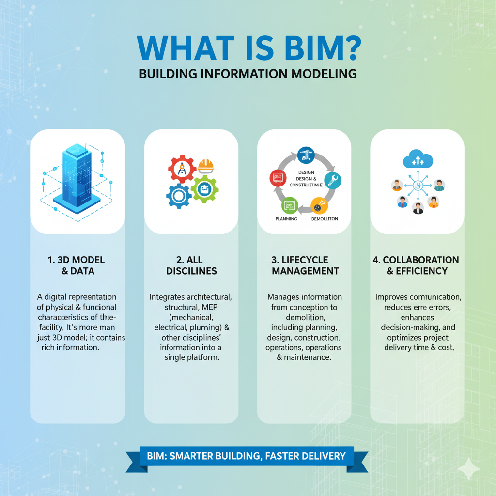

# 3.1. Introducción
Keywords:  `bim` `bim-dimension` `m03a01`

Conceptos de la metodología BIM. Generalidades del trabajo colaborativo. Taller conceptual. 

  Generado con: <a href="https://gemini.google.com/app/d70eb0accab3b715">https://gemini.google.com</a>  

## Objetivos

Al finalizar esta actividad, el estudiante:

* Comprende los conceptos y fundamentos básicos de la metodología BIM.
* Identifica las dimensiones del modelo BIM. 

## Requerimientos

Archivos, actividades previas, lecturas y herramientas requeridas para el desarrollo de esta actividad:

| Requerimiento                                                                               | Descripción                                         |
|:--------------------------------------------------------------------------------------------|:----------------------------------------------------|
| [:toolbox:Herramienta](https://www.autodesk.com/products/revit)                             | Autodesk Revit 2026 o superior (english version).   |  
| [:round_pushpin:DAPC_ProyectoCAD.dwg](../../file/cad/DAPC_ProyectoCAD_2025_02_Grupo1.dwg)   | Proyecto CAD (tomado del Grupo 01 edición 2025-01.  |

> :blue_heart: El repositorio de proyecto deberá mantenerse durante la duración del curso, estableciendo permisos de escritura para los integrantes de su grupo y lectura para el instructor.
>
> Para los diferentes avances de proyecto, es necesario guardar y publicar las diferentes versiones generadas del (los) libro (s) de Microsoft Excel, reportes o informes y dibujos generados, agregando al final la fecha de control documental en formato aaaammdd, p. ej., _M01A01_20250710.dwg_.

## 0. ¿Qué es BIM?

BIM son las siglas de Building Information Modeling (Modelado de Información de Construcción). Es un proceso inteligente de gestión de proyecto (PM ó project management) basado en modelos 3D que dota a los profesionales de la arquitectura, ingeniería y construcción (AEC) de la información y herramientas necesarias para planificar, diseñar, construir y gestionar edificios e infraestructuras de manera más eficiente.

BIM es una metodología de trabajo colaborativo para el diseño, construcción y operación de un proyecto, se basa en modelos 3D paramétricos y bases de datos que permiten un flujo de trabajo eficiente y el intercambio de información entre disciplinas.

El ciclo de vida de un proyecto BIM puede contener:

* Diseño
  * Programación
  * Diseño conceptual
  * Diseño detallado
  * Análisis
  * Documentación
* Construcción
  * Fabricación
  * Construcción (4D-Tiempo, 5D-Costos)
  * Logística de construcción
* Operación
  * Operación y mantenimiento
  * Renovación o remodelación

Esta metodología también puede ser aplicada a proyectos ya construídos, donde se requiere gestionar todos los sistemas existentes; para ello, es requerido el levantamiento detallado de información usando sistemas no invasivos, p. ej., usando tecnología laser LIDAR y escáneres de elementos estructurales de refuerzo.

Con respecto al nivel de detalle o LOD (Level of Development), en la aplicación de la metodología BIM, se define el nivel de detalle que posee cada elemento del modelo que hace parte de un componente, sistema constructivo o montaje del edificio. Los niveles LOD se clasifican cómo:

| Nivel   | Alcance                                                      | Datos gráfico                                                                                                                                                                                  | Datos no gráficos |
|---------|--------------------------------------------------------------|------------------------------------------------------------------------------------------------------------------------------------------------------------------------------------------------|-------------------|
| LOD-100 | Modelo con información general                               | Existencia de elementos (representación simbólica). Ubicación aproximada.                                                                                                                  |                   |
| LOD-200 | Modelo con información básica aproximada                     | Existencia de elementos. Cantidades, espesor y dimensiones aproximadas.                                                                                                                    |                   |
| LOD-300 | Modelo con información detallada                             | Cantidades, espesores y dimensiones específicas. Materiales. Representación de la composición de elementos.                                                                            |                   |
| LOD-400 | Modelo con información detallada y coordinada                | Cantidades, espesores y dimensiones específicas. Materiales. Representación de la composición e intersección de elementos y soportes. Fabricación, ensamblaje e instalación.       |                   |
| LOD-500 | Modelo con información detallada de la fabricación y montaje | Cantidades, espesores y dimensiones específicas. Materiales. Representación de la composición e intersección de elementos y soportes. Información gráfica conforme a lo ejecutado. |                   |

19:31

## 1. Componentes Clave de BIM

BIM va mucho más allá de ser simplemente un software o un modelo 3D. Es una metodología de trabajo colaborativa que implica varios aspectos fundamentales:

* Modelo 3D: Es una representación digital que no solo muestra la geometría (forma y tamaño), sino que también contiene datos inteligentes sobre los elementos constructivos (materiales, especificaciones, costos, información del fabricante, propiedades térmicas, etc.).
* Información (la "I" de BIM): Este es el componente más crucial. El modelo es una base de datos centralizada que se utiliza para generar toda la documentación del proyecto (planos 2D, listados de materiales, presupuestos, etc.).
* Colaboración: Permite que diferentes disciplinas, tales como arquitectos, ingenieros estructurales, ingenieros MEP (Mecánica, Eléctrica y Fontanería), contratistas, trabajen sobre un único modelo coordinado, lo que reduce los errores y las inconsistencias durante el diseño y la construcción.

## 2. Las Dimensiones del BIM

A menudo se habla de BIM en términos de "dimensiones" que representan la riqueza de la información añadida al modelo, tales como:

| Dimensión / Enfoque            | Alcance                                                                                                                                                   |
|:-------------------------------|:----------------------------------------------------------------------------------------------------------------------------------------------------------|
| 1D / Idea                      | Idea o concepto general del proyecto.                                                                                                                     |
| 2D / Boceto                    | Boceto o planimetría del modelo identificando dimensiones principales.                                                                                    |
| 3D / Geometría                 | La geometría tridimensional (forma, espacio, materiales, sistemas, equipos electromecánicos, componentes, mobiliario).                                    |
| 4D / Tiempo                    | El tiempo o planificación (scheduling). Relaciona los elementos del modelo con el cronograma de construcción.                                             |
| 5D / Costo                     | Los costos (cost estimating). Permite la extracción automática de cantidades y la generación de presupuestos precisos.                                    |
| 6D / Sostenibilidad            | La sostenibilidad (sustainability). Analiza el rendimiento energético y ambiental del edificio.                                                           |
| 7D / Gestión de archivos       | La gestión del ciclo de vida (facility management). Utiliza el modelo y su información para la operación y mantenimiento del edificio una vez construido. |
| 8D / Seguridad                 | Dimensión conceptual que se enfoca en la Seguridad y la prevención de riesgos laborales en la fase de construcción.                                       |
| 9D / Construcción sin pérdidas | Dimensión conceptual relacionada con la Construcción sin pérdidas (Lean Construction).                                                                    |
| 10D / Industrialización        | Dimensión conceptual asociada con la Industrialización de la construcción.                                                                                |

## 3. Beneficios Principales

La implementación de la metodología BIM ofrece las ventajas significativas:

| Ventaja                           | Descripción                                                                                                                                                                                                             |
|:----------------------------------|:------------------------------------------------------------------------------------------------------------------------------------------------------------------------------------------------------------------------|
| Mejor Coordinación                | Detección temprana de conflictos o "choques o interferencias" (clash detection) entre las instalaciones, estructuras y arquitectura antes de que comiencen las obras, lo que minimiza los costosos cambios en el sitio. |
| Visualización Mejorada            | Permite una mejor comprensión del proyecto por parte de todos los involucrados, incluyendo el cliente. Recorridos visuales 3D sobre el modelos, planos y vistas en planta, vistas de corte, vistas detalladas.          |
| Extracción de Información Rápida  | Generación rápida y precisa de mediciones y presupuestos.                                                                                                                                                               |
| Gestión del Ciclo de Vida         | La información del modelo puede ser transferida a los gestores de las instalaciones para facilitar el mantenimiento y las renovaciones futuras.                                                                         |

## 4. Herramientas BIM

Existen múltiples herramientas para la aplicación de la tecnología BIM, algunas de ellas son:

| Herramienta BIM                                                                 | Descipción                                                                                                                                                                                                                                                                                                                                                                                                                                                                                                                                                                                                                                                                                                                                                                                                                                                                                                                                                                                                                                                                                                               |
|---------------------------------------------------------------------------------|--------------------------------------------------------------------------------------------------------------------------------------------------------------------------------------------------------------------------------------------------------------------------------------------------------------------------------------------------------------------------------------------------------------------------------------------------------------------------------------------------------------------------------------------------------------------------------------------------------------------------------------------------------------------------------------------------------------------------------------------------------------------------------------------------------------------------------------------------------------------------------------------------------------------------------------------------------------------------------------------------------------------------------------------------------------------------------------------------------------------------|
| [Autodesk Revit](https://www.autodesk.com/latam/products/revit)                 | Revit es un conocido programa de construcción BIM que pretende resolver diferentes problemas arquitectónicos y de diseño. Fue desarrollado por Autodesk y es una de las soluciones más populares del sector. Muchos especialistas diferentes pueden aprovechar la lista de funciones de Revit, incluidos arquitectos, diseñadores, especialistas en mecánica, electricidad y fontanería (MEP), contratistas, etc. El programa en sí ofrece un enfoque inteligente de las distintas fases del proceso de construcción a través de modelos.  Este programa es exclusivo de Microsoft Windows y puede reducir significativamente los problemas de falta de comunicación al gestionar las distintas partes del proceso dentro del mismo sistema. Este mismo sistema también potencia los esfuerzos generales de coordinación, y con él se pueden simular los visuales de diferentes proyectos. Dado que Revit utiliza un modelo BIM 4D, también puede hacer un seguimiento de todo el ciclo de vida de un proyecto de construcción, desde los primeros conceptos hasta el mantenimiento periódico y/o la demolición. |
| [Graphisoft Archicad ](https://www.graphisoft.com/plans-and-products/archicad/) | Archicad es un programa BIM 3D cuyos objetivos principales son el diseño y el modelado. Fue desarrollado por Graphisoft, y puede funcionar tanto con sistemas de escritorio MS Windows como Mac. Todas las funciones de Archicad están pensadas para ser lo más útiles posible a efectos de visualización, tanto en el aspecto estético como en el tecnológico. Es una combinación de potentes capacidades BIM y herramientas de diseño intuitivas con un rendimiento impresionante y una serie de características poco convencionales.  Archicad también suele considerarse el primer ejemplo de solución BIM disponible comercialmente, capaz de trabajar con geometría tanto 2D como 3D si es necesario. Su variedad de funciones de visualización y BIM lo hacen útil para cualquier empresa de construcción o arquitectura, y por eso Archicad es uno de los ejemplos de programa BIM más fáciles de usar para principiantes del mercado.                                                                                                                                                                   |
| [Trimble Sketchup](https://sketchup.trimble.com/es)                             | SketchUp es una herramienta de modelado fácil de usar que permite a los usuarios transformar líneas y formas regulares en diversas formas 3D. No es necesario hacerlo todo desde cero gracias a la colección de modelos 3D incorporada. El modelado conceptual rápido y la visualización son sus principales casos de uso en entornos BIM, aunque SketchUp no sea una solución BIM en toda regla.  SketchUp puede incluir distintas herramientas. Se puede acceder a la herramienta de modelado 3D gratuita normal desde un navegador web. La solución Pro, más completa, tiene su propio cliente de escritorio y puede ofrecer opciones más versátiles para sus proyectos 3D. Y, por último, SketchUp Studio le permite analizar los distintos parámetros reales de sus modelos y creaciones antes de construirlos.                                                                                                                                                                                                                                                                                             |
| [Allplan](https://www.allplan.com/es/sobre-allplan/)                                                           | ALLPLAN es un proveedor global de software de diseño BIM para el sector AEC. Abordamos todo el proceso "Design to Build" desde el concepto inicial hasta el diseño detallado final para la prefabricación y la construcción. Las competencias de ALLPLAN incluyen: ALLPLAN Infrastructure, nuestro equipo especializado para el desarrollo y soporte de requisitos de puentes e infraestructuras, y ALLPLAN Precast, nuestro equipo especializado para el desarrollo y soporte de requisitos de diseño y fabricación de elementos prefabricados.                                                                                                                                                                                                                                                                                                                                                                                                                                                                                                                                                                         |
| [Bentley OpenBuildings Designer](https://www.bentley.com/software/openbuildings-designer/)                                                  | OpenBuildings es un software multidisciplinario de diseño de edificios que permite flujos de trabajo de modelado de información de edificios (BIM, por sus siglas en inglés) para generar modelos ricos en información para el diseño, el análisis, la simulación y la documentación de edificios. Incorpora diseño computacional y servicios energéticos para la evaluación del desempeño de edificios. OpenBuildings lo sumerge en un entorno de modelado 3D y proporciona contexto del sitio de construcción con referencias de modelos de realidad. Con OpenBuildings Designer, puede optimizar los diseños, cumplir con plazos ajustados y evitar errores.                                                                                                                                                                                                                                                                                                                                                                                                                                                          |
| [BricsCAD BIM](https://www.bricsys.com/bricscad)                                                                    | Herramienta de diseño CAD que permite crear un modelo conceptual, refinarlo y documentarlo para luego construirlo. Incorpora la metodología BIM en sus procesos derivados.                                                                                                                                                                                                                                                                                                                                                                                                                                                                                                                                                                                                                                                                                                                                                                                                                                                                                                                                               |

## Actividades de proyecto :triangular_ruler:

Utilizando la [Plantilla de Microsoft Word](../../file/report/R.DAPC.PlantillaInformeTecnico.docx) suministrada, cree un informe técnico mostrando las actividades desarrolladas en el orden presentado en esta actividad, junto con las consideraciones de diseño, los análisis y recomendaciones realizadas para las actividades del proyecto. Convierta a Adobe Acrobat (.pdf) y guarde en la carpeta _/report_ del repositorio de datos, nombre el archivo con el código de la actividad agregando al final la fecha de control documental en formato aaaammdd (p. ej. M01A01_20250531.pdf).

En la siguiente tabla se listan las actividades que deben ser desarrolladas y documentadas por cada grupo de proyecto o individualmente.

| Actividad | Alcance                                                                                                                                                                                                                                                                                                                                                                                                                                                                                                                                                                 |
|:----------|:------------------------------------------------------------------------------------------------------------------------------------------------------------------------------------------------------------------------------------------------------------------------------------------------------------------------------------------------------------------------------------------------------------------------------------------------------------------------------------------------------------------------------------------------------------------------|
| M03A01    | Individual: los numerales vistos en esta actividad son evaluados individualmente a través de un quiz de conocimiento y habilidad.                                                                                                                                                                                                                                                                                                                                                                                                                                       |
| M03A01    | Obligatorio en grupo: en una tabla y al final del informe de avance de esta entrega, indique el detalle de las actividades realizadas por cada integrante de su grupo; utilice las siguientes columnas: `Nombre del integrante`, `Actividades realizadas`, `Tiempo dedicado en horas` (si presenta la entrega individualmente, no es necesaria la presentación de esta tabla).  Para actividades que no requieren del desarrollo de elementos de avance, indicar si realizo la lectura de la guía de clase y las lecturas indicadas al inicio en los requerimientos. | 

> Nota 1: para la revisión del proyecto final, guarde los libros cálculo de Microsoft Excel y los archivos generados en esta actividad, en las localizaciones indicadas en cada numeral.
>
> Nota 2: una vez el instructor realice la revisión y el estudiante presente las correcciones o ajustes solicitados, será necesario cargar una nueva versión de los archivos en el repositorio del proyecto, incluyendo o actualizando al final del nombre del archivo, la fecha de presentación en formato aaaammdd y manteniendo las versiones anteriores presentadas.

## Referencias

* https://www.autodesk.com/latam/products/bim-collaborate/overview
* https://www.graphisoft.com/es/try-archicad/explore-what-is-bim
* https://www.concrelab.com/deteccion-de-aceros
* https://revizto.com/es/programas-platformas-bim/
* [Centro - ¿Cómo generar un proyecto a través de la metodología BIM?](https://www.youtube.com/watch?v=uc1RjoR9HT0)
* [EALDE Business School - Cómo funcionan las 7 dimensiones de BIM para proyectos de construcción](https://www.youtube.com/watch?v=9eplIw2siwM)

## Control de versiones

| Versión    | Descripción        | Autor                                       | Horas |
|------------|:-------------------|---------------------------------------------|:-----:|
| 2025.10.16 | Versión inicial.   | [rcfdtools](https://github.com/rcfdtools)   |   4   |

##

_R.DAPC es de uso libre para fines académicos, conoce nuestra licencia, cláusulas, condiciones de uso y como referenciar los contenidos publicados en este repositorio, dando [clic aquí](../../LICENSE.md)._

_¡Encontraste útil este repositorio!, apoya su difusión marcando este repositorio con una ⭐ o síguenos dando clic en el botón Follow de [rcfdtools](https://github.com/rcfdtools) en GitHub._

| [:arrow_backward: Anterior](../M02A04/Readme.md) | [:house: Inicio](../../README.md) | [:beginner: Ayuda / Colabora](https://github.com/rcfdtools/R.DAPC/discussions/1) | [Siguiente :arrow_forward:](../M03A02/Readme.md) |
|---------------------------------------------------|-----------------------------------|----------------------------------------------------------------------------------|----------------------------------------------------|

[^1]: https://www.nti-group.com/es/blog/es/revit-que-es-novedades-autodesk