

# 3.2. Herramientas para la aplicación de la metodología BIM. Introducción al software Revit
Keywords:  `revit` `bim` `units` `options` `levels` `link-cad` `import-cad` `m03a02`

Uso de plantillas (templates). Fundamentos del software Revit. Configuración de Revit (Options). Creación de vista de plantas (Plan views), Niveles de fondo (Underlay). 

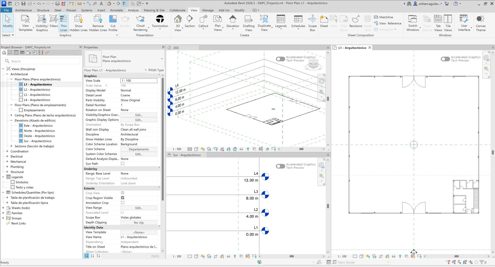

## Objetivos

Al finalizar esta actividad, el estudiante:

* Entiende los conceptos Revit de Disciplinas / Categorías / Familias / Tipos.
* Conoce la configuración básica del software Revit.
* Instala librerías.
* Vincular o importar archivos de referencia de dibujo CAD.
* Crear niveles.

## Requerimientos

Archivos, actividades previas, lecturas y herramientas requeridas para el desarrollo de esta actividad:

| Requerimiento                                                                               | Descripción                                         |
|:--------------------------------------------------------------------------------------------|:----------------------------------------------------|
| [:toolbox:Herramienta](https://www.autodesk.com/products/revit)                             | Autodesk Revit 2026 o superior (english version).   |  
| [:round_pushpin:DAPC_ProyectoCAD.dwg](../../file/cad/DAPC_ProyectoCAD_2025_02_Grupo1.dwg)   | Proyecto CAD (Tomado del Grupo 01 edición 2025-02). |

> Para los diferentes avances de proyecto, es necesario guardar y publicar las diferentes versiones generadas del (los) libro (s) de Microsoft Excel, reportes o informes y dibujos generados, agregando al final la fecha de control documental en formato aaaammdd, p. ej., _M01A01_20250710.dwg_.

## 0. ¿Qué es Autodesk Revit?

Revit es un software de Autodesk para el diseño y la documentación que usa la metodología de Modelado de Información de Construcción (BIM) para crear edificios y su infraestructura. Funciona con objetos inteligentes en 3D, y cualquier cambio en una parte del proyecto se actualiza automáticamente en todas las vistas y documentos relacionados, permitiendo una mayor coordinación en el diseño arquitectónico, ingeniería y construcción. [^1] 

Funciones y ventajas principales:

* Diseño con objetos inteligentes: en lugar de solo dibujar, creas elementos constructivos como muros, puertas y ventanas que contienen información detallada sobre ellos. 
* Coordinación automática: al ser paramétrico, un cambio en un elemento se actualiza al instante en todas las vistas (plantas, secciones, alzados) y en la documentación asociada. 
* Plataforma multidisciplinaria: integra las disciplinas de arquitectura, ingeniería estructural, mecánica y eléctrica (MEP) en un solo entorno de trabajo, facilitando la colaboración. 
* Generación de documentación: permite crear planos, dibujos, cronogramas y presupuestos detallados a partir del modelo 3D. 
* Simulación y visualización: facilita el renderizado de modelos y la creación de recorridos virtuales para visualizar el proyecto de forma más realista. 

Aplicaciones:

* Diseño arquitectónico: crea diseños conceptuales y documenta edificios. 
* Ingeniería civil y estructural: modela y analiza estructuras de concreto y acero. 
* Ingeniería MEP: permite modelar las instalaciones mecánicas, eléctricas y de fontanería. 
* Coordinación del proyecto: permite la colaboración entre diferentes equipos de trabajo. 

En resumen, Revit es una herramienta esencial para profesionales de la construcción que buscan un flujo de trabajo más eficiente, desde el diseño inicial hasta la gestión del proyecto, al trabajar con información inteligente en un modelo 3D colaborativo. 

## 1. Instalación de librerías

Luego de instalar el aplicativo y antes de iniciar a trabajar con Autodesk Revit, puede descargar e instalar las librerías en español que contienen las diferentes familias de objetos que son necesarias para la creación de modelos. Desde el enlace https://manage.autodesk.com/products/rvt, ingrese al administrador de productos y servicios de Autodesk y para el software Revit, descargue las librerías denominadas:

* Spanish Content for Revit 2026: RVTCPESP.exe
* Generic International - Spanish Content for Autodesk Revit 2026: RVTCPGENESP.exe

> Tenga en cuenta que el idioma de la interfaz de usuario de Autodesk Revit puede ser Inglés y el idioma de las librerías puede ser usado en cualquier idioma.

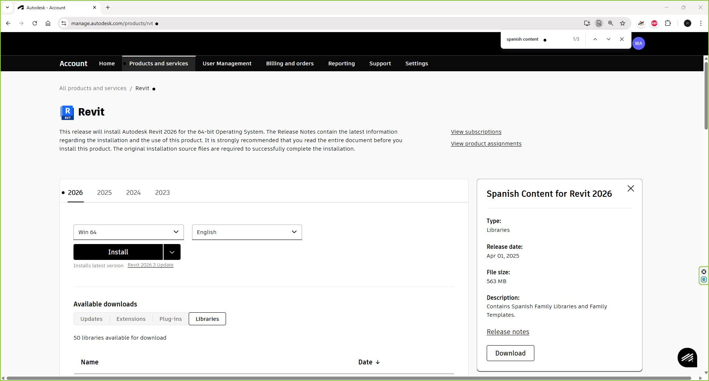

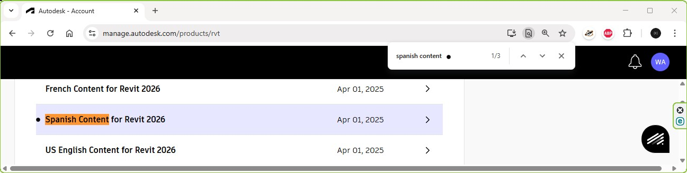

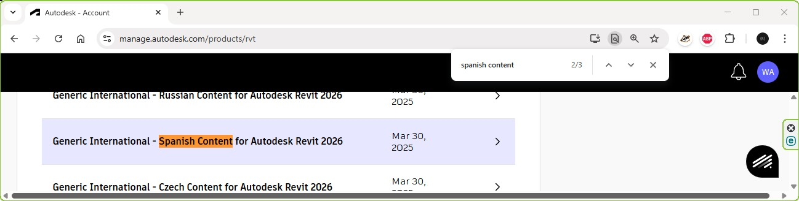

Desde la carpeta de descargas de su sistema operativo, instale los dos paquetes de librerías descargados. En caso de que ya estén instalados, aparecerá la siguiente ventana.

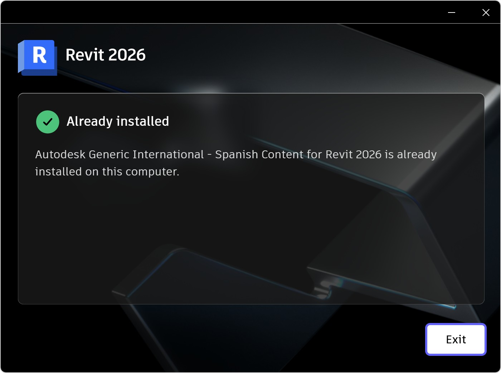

## 2. Uso de plantillas y configuración general

Autodesk Revit, permite la creación de proyectos a partir de plantillas por disciplina o multidisciplina.

1. En la ventana de inicio de Revit, de clic en el botón _New..._ y seleccione la plantilla _c:/ProgramData/Autodesk/RVT 2026/Templates/Spanish_INTL/Default-Multi-Discipline_MetricESP.rte_. Guarde el proyecto como _/file/cad/DAPC_Proyecto.rvt_.

> Tenga presente que los archivos de plantilla o template tienen la extensión `.rte` y los proyectos de Revit la extensión `.rvt`.

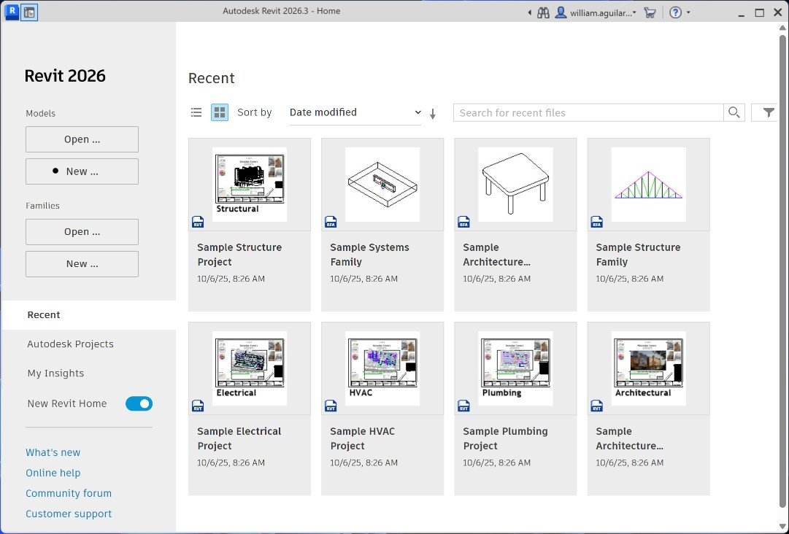

Dentro del proyecto Revit, podrá observar que a la izquierda se encuentra localizado el _Project Browser_ que contiene las vistas para las siguientes disciplinas:

* Architectural
* Coordination
* Electrical
* Mechanical
* Plumbing
* Structural

También podrá observar que por defecto se despliega en la ventana de trabajo o _ViewPort_, la vista arquitectónica _L1 - Arquitectónico_.

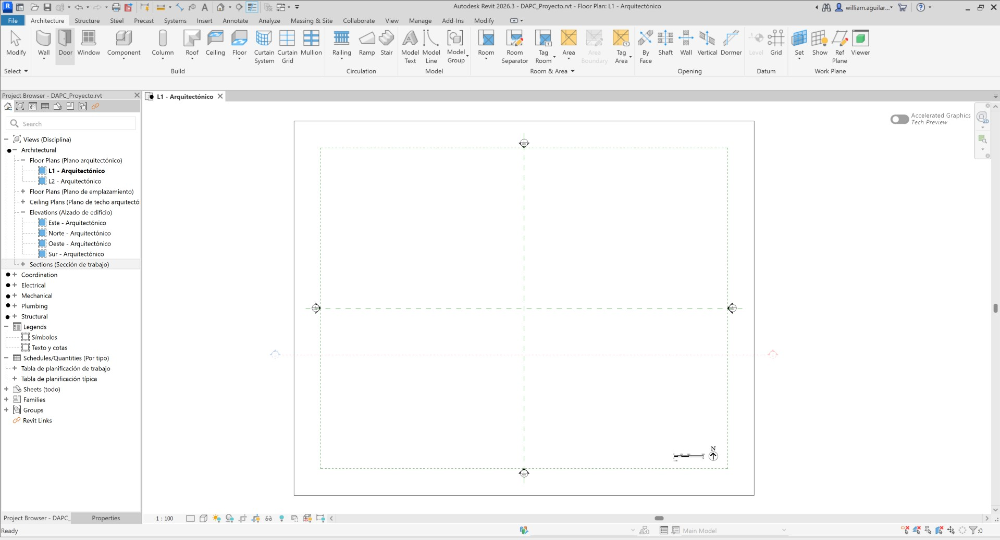

2. En el menú _File / Options_, consulte las opciones de configuración por defecto, en la pestaña _Hardware_, active la opción _Use hardware acceleration_ si dispone de tarjeta de video dedicada.

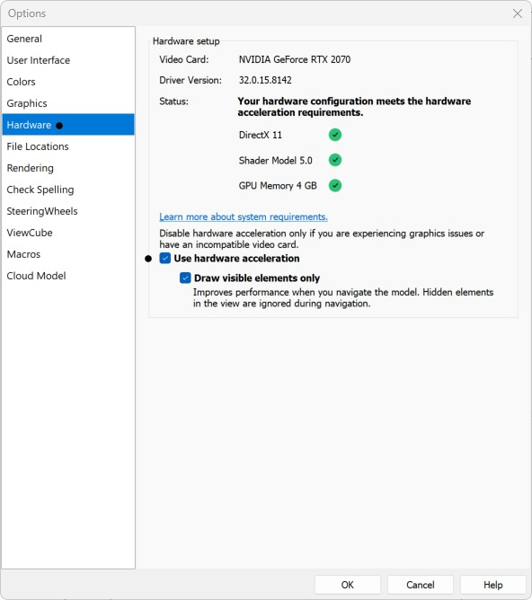

Consulte y ajuste las rutas de almacenamiento de archivos para que por defecto Revit utilice las siguientes localizaciones:

* Project templates / Metric Multi-discipline: _C:\ProgramData\Autodesk\RVT 2026\Templates\Spanish_INTL\Default-Multi-Discipline_MetricESP.rte_
* Default path for family template files: _C:\ProgramData\Autodesk\RVT 2026\Family Templates_

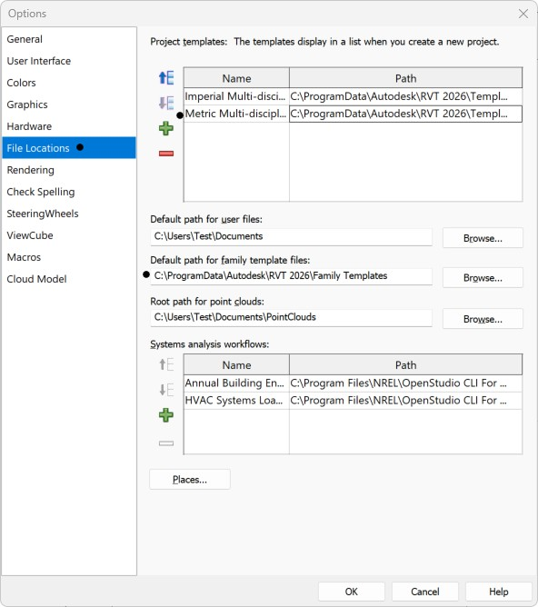

3. Desde el menú _Manage / Settings / Project Units_ o con el comando **UN**, ajuste la configuración de unidades comunes (Common) del proyecto estableciendo:

* Distance: metros con dos decimales mostrando símbolo (m).
* Length: metros con dos decimales mostrando símbolo (m).

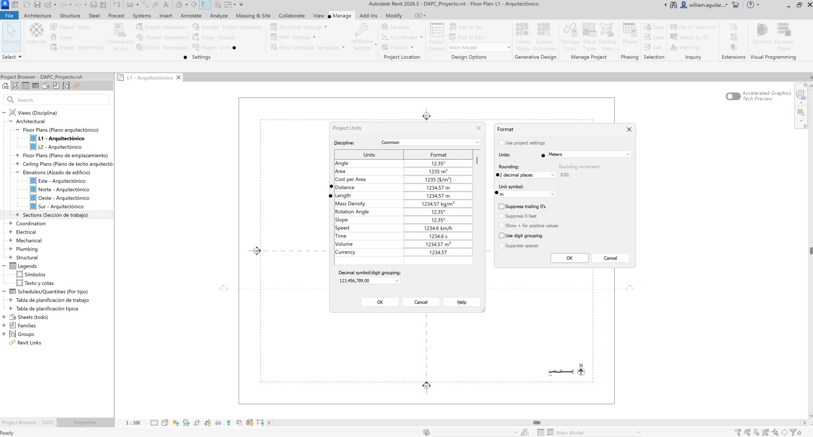

## 3. Vinculación o importación de archivos de referencia CAD 

Para el dibujo de objetos 3D en Revit, se pueden utilizar como referencia archivos de dibujo CAD. Existen los siguientes dos procedimientos genéricos:

* Link CAD: permite vincular archivos externos permitiendo actualizar cambios desde el dibujo original, al compartir el proyecto, también es necesario compartir los archivos CAD.
* Import CAD: permite importar los objetos CAD dentro del proyecto de Revit, por lo cual, al compartir el proyecto, no es necesario compartir los archivos de referencia. Los elementos importados no pueden ser actualizados automáticamente desde la fuente original, estos deben importados nuevamente al proyecto.

1. En el menú _Insert / Link / Link CAD_, seleccione y vincule el archivo _/cad/DAPC_ProyectoCAD.dwg_, seleccionando las opciones de colores en _Blanco y Negro_, todas las capas, unidades de importación en metros, posicionamiento de origen y sobre el nivel arquitectónico L1.

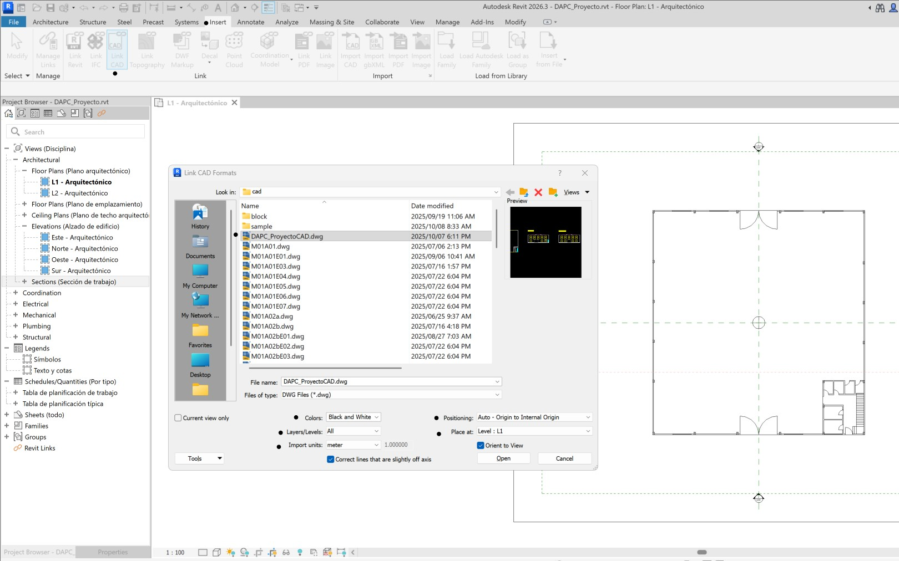

> Es recomendado que la planta principal del proyecto CAD, esté centrada en el origen de coordenadas 0,0 para que al ser insertada, su visualización este en el orogen de coordenadas de Revit.  

2. Desde el menú _View / Create / 3D View / Default 3D view_, o desde la cinta de opciones superior de Revit, abra la vista 3D del proyecto. Podrá observar que se muestran todos los elementos de dibujo contenidos en el archivo CAD.

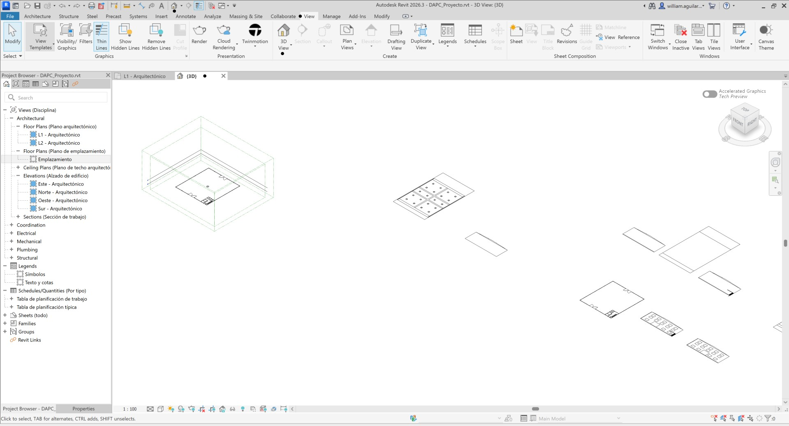

3. Para la actualización de archivos CAD vinculados, acceda en el menú _Insert / Manage / Manage Links_, seleccione el archivo a actualizar y de clic en el botón _Reload_. 

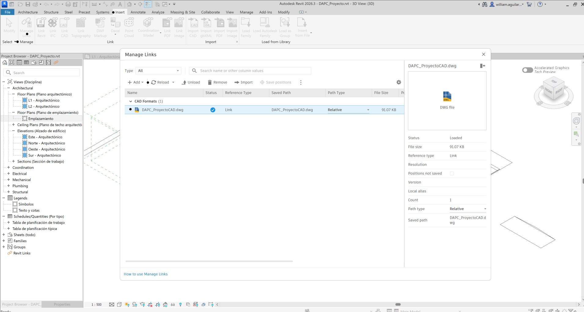

## 4. Creación de niveles 

Para el desarrollo del proyecto CAD, establecimos 12 metros de la altura de la bodega industrial con un mezanine localizado a 4 metros por encima del nivel de referencia del suelo. De acuerdo a estos parámetros, la bodega puede ser construída usando pórticos de 4 metros de altura, para lo cual son requeridos 4 niveles. 

1. Con la rueda del apuntador, acérquese a la vista de cubo 3D, podrá observar que por defecto Revit ha creado dos niveles de referencia o pisos con separaciones de 3.6 metros de altura.

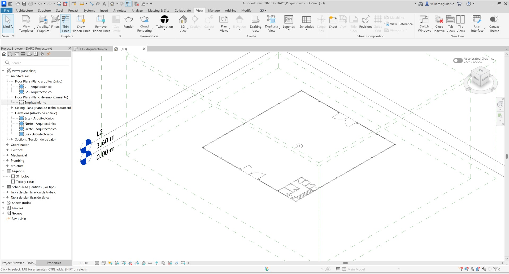

2. En la vista _L1 - Arquitectónico_ de clic en el botón de vista de alzado _Sur - Arquitectónico_, o abra esta vista desde el _Project Browser_. Desde el menú _View / Windows / Tile Views_, visualice acopladas todas las ventanas de trabajo de las diferentes vistas. Esta acción puede ser realizada con el comando **WT** y restablecida a la vista de pestañas con el comando **TW** o el botón _View / Windows / Tab Views_.

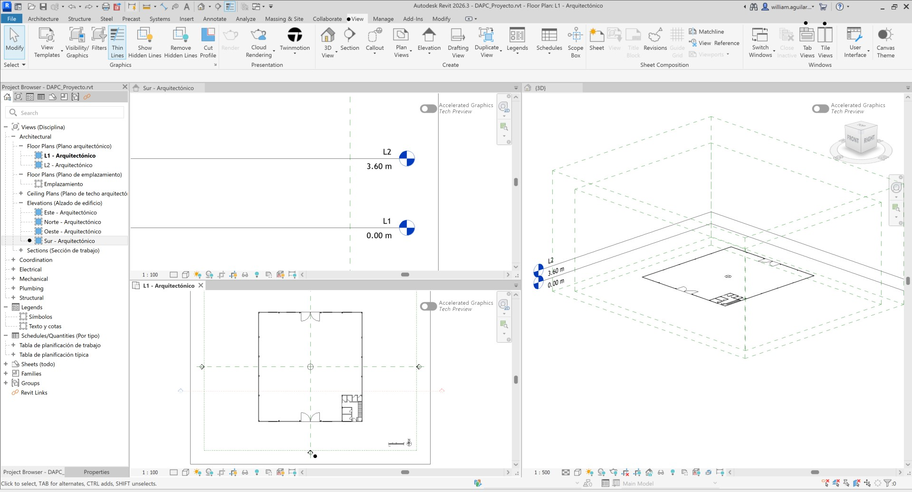

3. En la vista _Sur - Arquitectónico_, de clic en el valor L2 correspondiente a 3.60 m y ajuste a 4.00 m. Podrá observar que en la vista 3D se visualiza la selección de este plano.

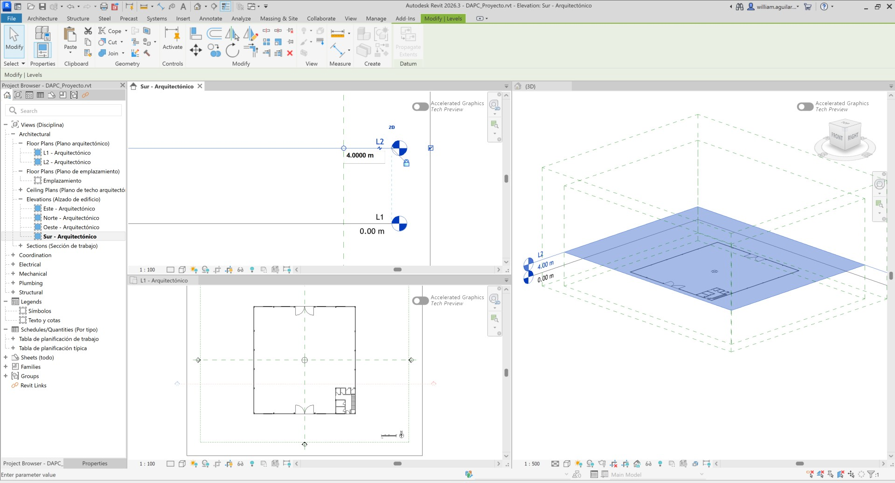

4. Desde el menú _Architecture / Datum / Level_ o copiando desde el menú _Modify / Levels_ uno de los niveles existentes, cree los niveles L3 y L4 cuya altura total será de 12 metros. Observará que los niveles L1 y L2 se visualizan en color azul indicando que ya existen en el _Project Browser_, y que los niveles L3 y L4 son mostrados en color negro indicando que aún no se han incluido estas vistas en el árbol de visualización de proyecto.

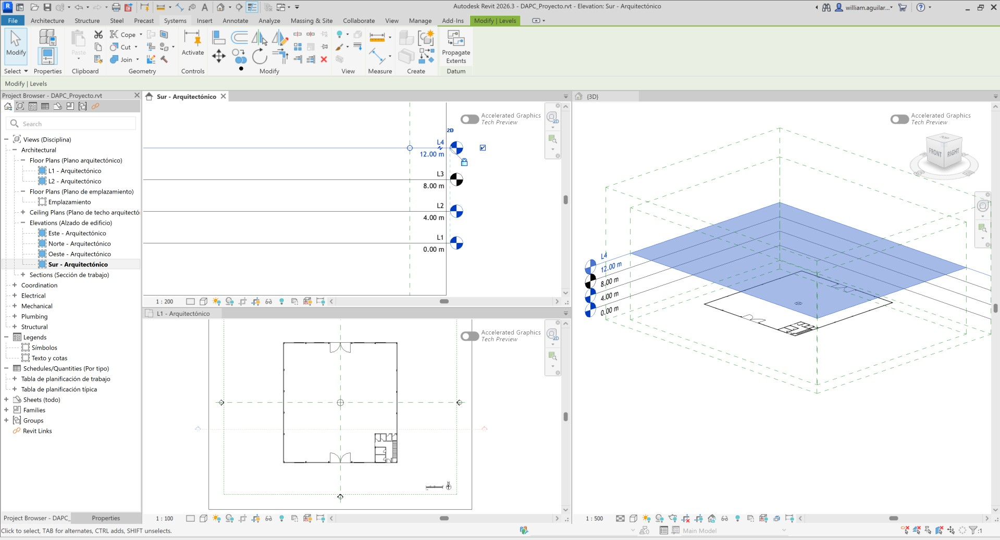

5. Para agregar los niveles creados a las vistas del _Project Browser_, en el menú _View / Create / Plan Views / Floor Plan_ seleccione estas vistas. En el árbol de vistas, renombre como _L3 - Arquitectónico_ y _L4 - Arquitectónico_.

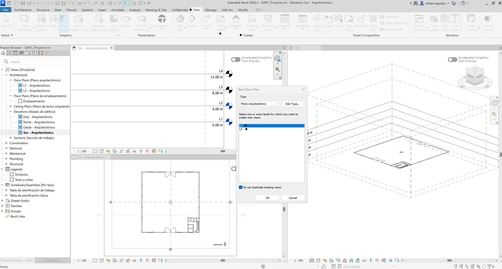

A partir de este momento, dispone de un archivo de proyecto de Revit listo para la creación de elementos.

## Actividades de proyecto (opcional no calificable) :triangular_ruler:

Utilizando la [Plantilla de Microsoft Word](../../file/report/R.DAPC.PlantillaInformeTecnico.docx) suministrada, cree un informe técnico mostrando las actividades desarrolladas en el orden presentado en esta actividad, junto con las consideraciones de diseño, los análisis y recomendaciones realizadas para las actividades del proyecto. Convierta a Adobe Acrobat (.pdf) y guarde en la carpeta _/report_ del repositorio de datos, nombre el archivo con el código de la actividad agregando al final la fecha de control documental en formato aaaammdd (p. ej. M01A01_20250531.pdf).

En la siguiente tabla se listan las actividades que deben ser desarrolladas y documentadas por cada grupo de proyecto o individualmente.

| Actividad | Alcance                                                                                                                                                                                                                                                                                                                                                                                                                                                                                                                                                        |
|:----------|:---------------------------------------------------------------------------------------------------------------------------------------------------------------------------------------------------------------------------------------------------------------------------------------------------------------------------------------------------------------------------------------------------------------------------------------------------------------------------------------------------------------------------------------------------------------|
| M03A02    | Individual: los numerales vistos en esta actividad son evaluados individualmente a través de un quiz de conocimiento y habilidad.                                                                                                                                                                                                                                                                                                                                                                                                                              |
| M03A02    | En grupo: desarrolle los numerales indicados en esta actividad y presente un informe técnico detallado, con capturas de pantalla de todas las herramientas utilizadas para el dibujo en Autodesk Revit, del proyecto de la bodega diseñada en el Módulo 1 de Dibujo asistido por computadora con AutoCAD.                                                                                                                                                                                                                                                      |
| M03A02    | En grupo: en una tabla y al final del informe de avance de esta entrega, indique el detalle de las actividades realizadas por cada integrante de su grupo; utilice las siguientes columnas: `Nombre del integrante`, `Actividades realizadas`, `Tiempo dedicado en horas` (si presenta la entrega individualmente, no es necesaria la presentación de esta tabla).  Para actividades que no requieren del desarrollo de elementos de avance, indicar si realizo la lectura de la guía de clase y las lecturas indicadas al inicio en los requerimientos. | 

> Nota 1: para la revisión del proyecto final, guarde los libros cálculo de Microsoft Excel y los archivos generados en esta actividad, en las localizaciones indicadas en cada numeral.
>
> Nota 2: una vez el instructor realice la revisión y el estudiante presente las correcciones o ajustes solicitados, será necesario cargar una nueva versión de los archivos en el repositorio del proyecto, incluyendo o actualizando al final del nombre del archivo, la fecha de presentación en formato aaaammdd y manteniendo las versiones anteriores presentadas.

## Referencias

* https://help.autodesk.com/view/RVT/2026/ESP/
* https://help.autodesk.com/view/RVT/2026/ESP/?guid=GUID-7F8CFFA4-22CB-43CA-84EA-332A27A0A0F0

Solución para reparar el Project Browser de Revit 2026 cuando este aparece vacío:

* https://www.autodesk.com/support/technical/article/caas/sfdcarticles/sfdcarticles/How-to-reset-the-Autodesk-Revit-ribbon-toolbar-and-browser-to-default-settings.html
* https://knowledge.autodesk.com/support/revit-products/learn-explore/caas/sfdcarticles/sfdcarticles/How-to-Disable-Add-Ins-for-Revit-Products.html?_gl=1*xwbmzp*_gcl_aw*R0NMLjE3NjA2MjI1OTguQ2p3S0NBandyOExIQmhCS0Vpd0F5NDd1VXNMdkM5YS1tVlBHWjVPMThfZXpLWmgtWkFmRTF0Z3FPWHhxZ1RBSUZ0al8zb1NqOW5fYWV4b0NwU3NRQXZEX0J3RQ..*_ga*MTYwNDE5ODc4OS4xNzUzMjMxODc5*_ga_NZSJ72N6RX*czE3NjM1Njk0MDQkbzEzJGcxJHQxNzYzNTY5NDUxJGoxMyRsMCRoMA..
* https://help.autodesk.com/view/RVT/2025/ENU/?guid=GUID-97276239-B101-4ECE-B30A-3CCD7174EEC4

## Control de versiones

| Versión    | Descripción        | Autor                                       | Horas |
|------------|:-------------------|---------------------------------------------|:-----:|
| 2025.10.08 | Versión inicial.   | [rcfdtools](https://github.com/rcfdtools)   |   5   |

##

_R.DAPC es de uso libre para fines académicos, conoce nuestra licencia, cláusulas, condiciones de uso y como referenciar los contenidos publicados en este repositorio, dando [clic aquí](../../LICENSE.md)._

_¡Encontraste útil este repositorio!, apoya su difusión marcando este repositorio con una ⭐ o síguenos dando clic en el botón Follow de [rcfdtools](https://github.com/rcfdtools) en GitHub._

| [◄ Anterior](../M03A01/Readme.md) | [:house: Inicio](../../README.md) | [:beginner: Ayuda / Colabora](https://github.com/rcfdtools/R.DAPC/discussions/1) | [Siguiente ►](../M03A03a/Readme.md) |
|----------------------------------------------------|-----------------------------------|----------------------------------------------------------------------------------|---------------------------------------------------|

[^1]: https://www.nti-group.com/es/blog/es/revit-que-es-novedades-autodesk