# 3.4. Familias de Revit - Eléctrico
Keywords:  `bim` `discipline` `categories` `families` `type` `2d` `3d` `electrical` `m03a04`

Concepto de familias de Revit. Creación de perfiles. Creación de planos de trabajo. Convertir líneas en símbolos (Convert lines) y Controles de visibilidad.

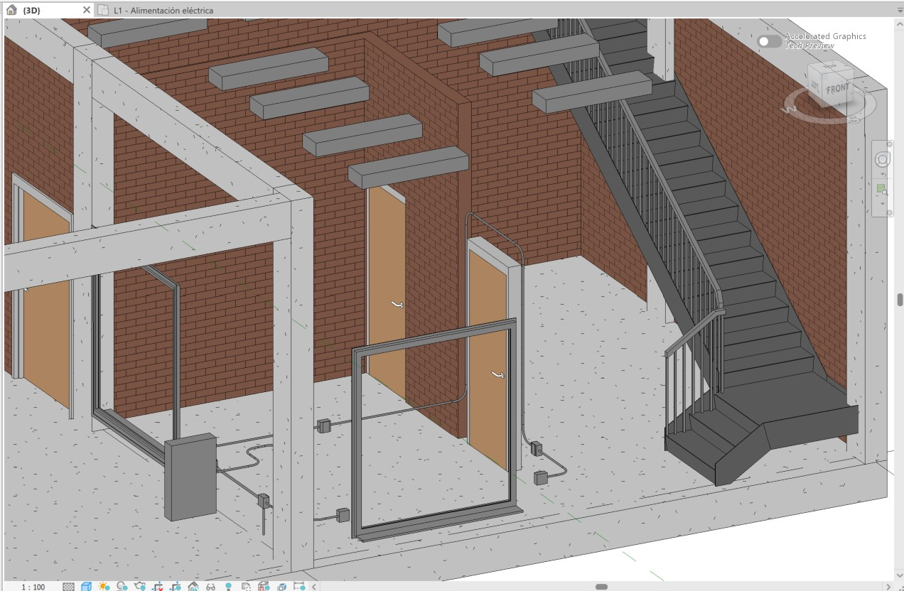

## Objetivos

Al finalizar esta actividad, el estudiante:

* Conoce los fundamentos de las familias de Revit. 
* Crea planos de trabajo en Revit. 

## Requerimientos

Archivos, actividades previas, lecturas y herramientas requeridas para el desarrollo de esta actividad:

| Requerimiento                                                      | Descripción                                        |
|:-------------------------------------------------------------------|:---------------------------------------------------|
| [:toolbox:Herramienta](https://www.autodesk.com/products/revit)    | Autodesk Revit 2026 o superior (english version).  |  

> :blue_heart: El repositorio de proyecto deberá mantenerse durante la duración del curso, estableciendo permisos de escritura para los integrantes de su grupo y lectura para el instructor.
>
> Para los diferentes avances de proyecto, es necesario guardar y publicar las diferentes versiones generadas del (los) libro (s) de Microsoft Excel, reportes o informes y dibujos generados, agregando al final la fecha de control documental en formato aaaammdd, p. ej., _M01A01_20250710.dwg_.

## 0. Configuración de componentes eléctricos

Antes de iniciar con la localización de los elementos eléctricos correspondientes a dispositivos, circuitos de cableado y conductos, es necesario definir la configuración del sistema eléctrico, para ello, en el menú _Systems / Electrical_, de clic en el expansor de opciones o ingrese el comando **ES**. 

> Tenga en cuenta que la configuración eléctrica debe ser ajustada a la norma técnica eléctrica específica de cada país.

1. En la pestaña _General_, defina el estilo de representación eléctrica, p. ej., colocando la descripción del voltaje del conector, el número de polos y la carga. Para el nombrado de las fases, puede definir por ejemplo A, B, C y para el secuenciamiento, utilice valores numéricos de 1 a n.  

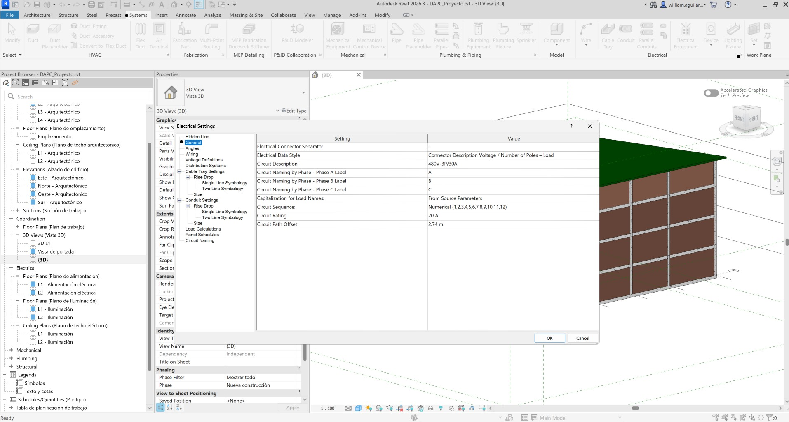

2. En la pestaña _Angles_, defina los ángulos de los empalmes de conductos a través de códos eléctricos. Por defecto, el valor establecido es usando cualquier ángulo. Active la opción de ángulos específicos y establezca los valores mostrados en la ilustración.

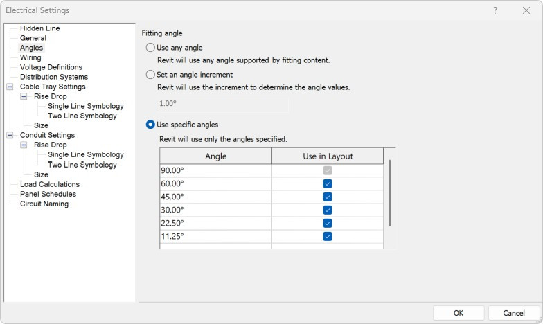

3. En la pestaña _Voltaje Definitions_, defina los tipos de voltajes a utilizar en las redes eléctricas del proyecto. Por defecto, Revit incluye voltajes nominales de 120, 208, 240, 277 y 480 Voltios. Tenga en cuenta que en Colombia, los voltajes que regularmente se usan son 110, 115, 220, 230, 500 V.

> Para este ejercicio, utilizaremos los valores que por defecto presenta Revit.

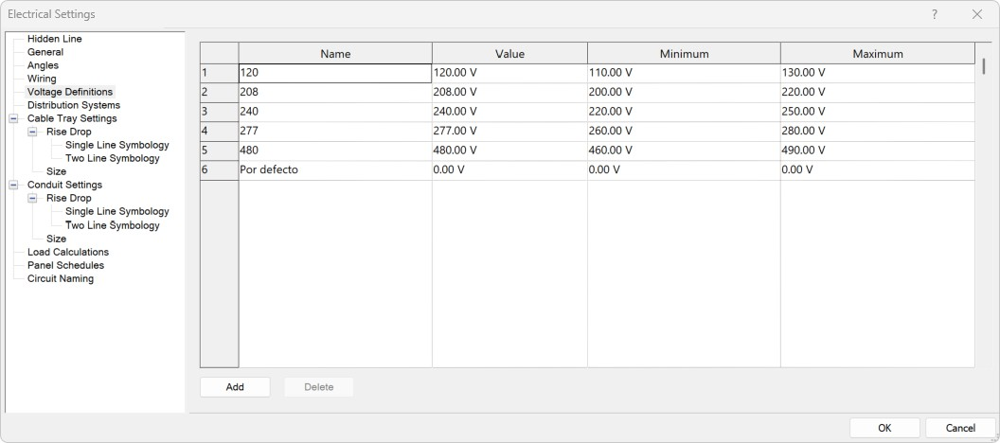

4. En la pestaña _Distribution Systems_, podrá encontrar los sistemas de distribución a emplear en el trazado del cableado eléctrico.

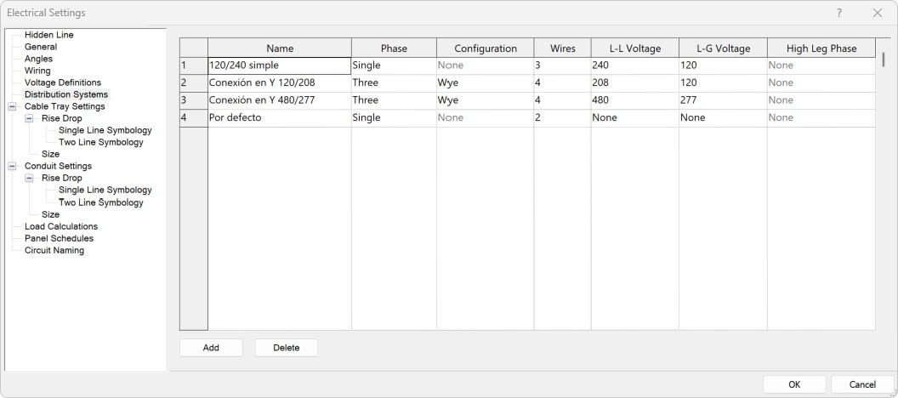

5. En la pestaña _Cable Tray Settings / Size_, podrá encontrar los tamaños estándar de bandejas de cableado, de 25 a 900 mm.

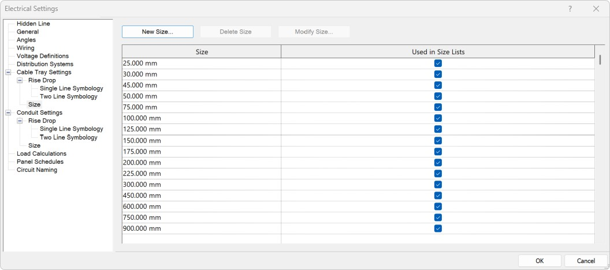

6. En la pestaña _Conduit Settings / Size_, podrá encontrar los tamaños estándar de los conductos eléctricos de 16 a 103 mm.

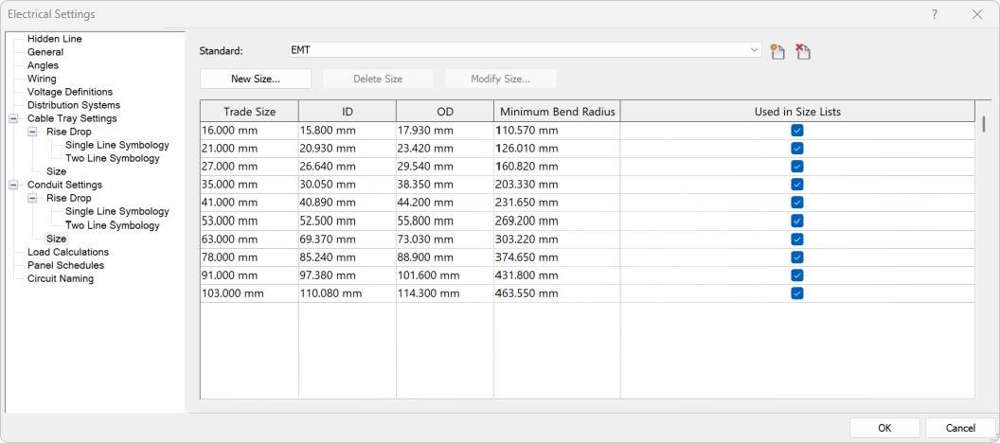

## 1. Localización de luminarias, tablero eléctrico y circuito

En la pestaña _Systems_, encontrará el grupo de opciones _Electrical_, correspondiente a elementos de alambrado, bandejas de cableado, conductos simples, conductos paralelos, equipos electrónicos y dispositivos.

> Tenga en cuenta que las tuberías o _Pipes_, hacen parte de los elementos de plomería redes de distribución de agua potable o de desagues, y que los elementos denominados _Conduit_ pertenecen a la disciplina eléctrica.

1. En el panel lateral izquierdo _Project Browser_, active la vista de Plano de techo eléctrico o Ceiling denominada _L1 - Iluminación_. Por defecto se muestran las vistas de los dos primeros niveles y para el proyecto de la bodega, hemos establecido 4 niveles. Acérquese a la zona de oficinas.

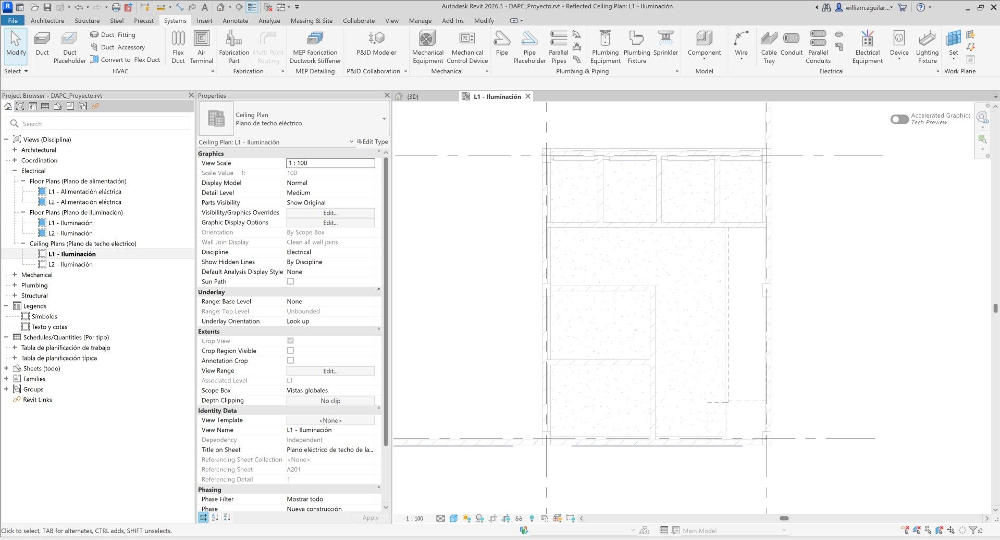

2. Desde el menú _Systems / Model / Component_ o con el comando **CM**, cargue la familia _/Spanish_INTL/Iluminación/MEP/Interno/M_Luminarias de superficie lisas.rfa_ (_/English/US/Lighting/MEP/Internal/Plain Surface Lighting Fixture.rfa_).

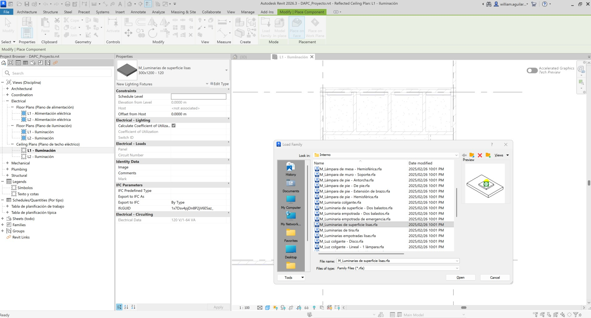

3. En la ventana de propiedades de componentes, busque la familia de luminarias y seleccione la de superficie lisa de _300x1200 - 120_, correspondiente a una lámpara de 30 cm por 1.2 metros para voltaje de 120 V.

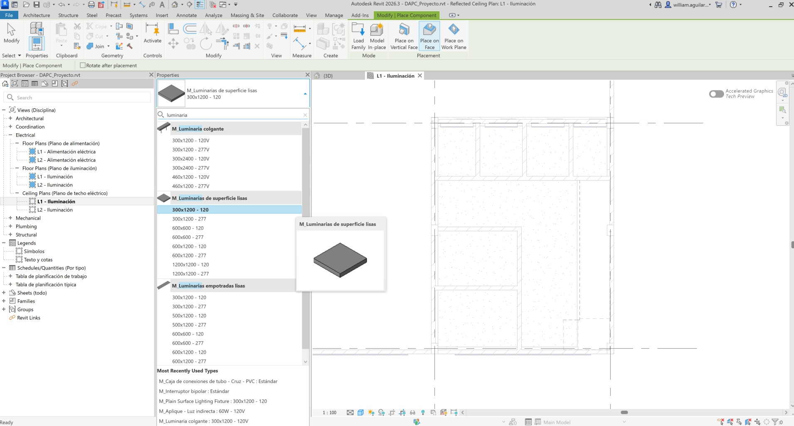

4. Realice la distribución de las luminarias en el espacio de las oficinas y baños.

> Utilizando la herramienta _Aligned Dimension_ disponible en la cinta de opciones superior o el comando **DI**, dibuje el dimensionamiento a los ejes centrales de lámpara a ejes centrales de columnas, y con la herramienta Equal, distribuya uniformemente las luminarias en cada espacio.

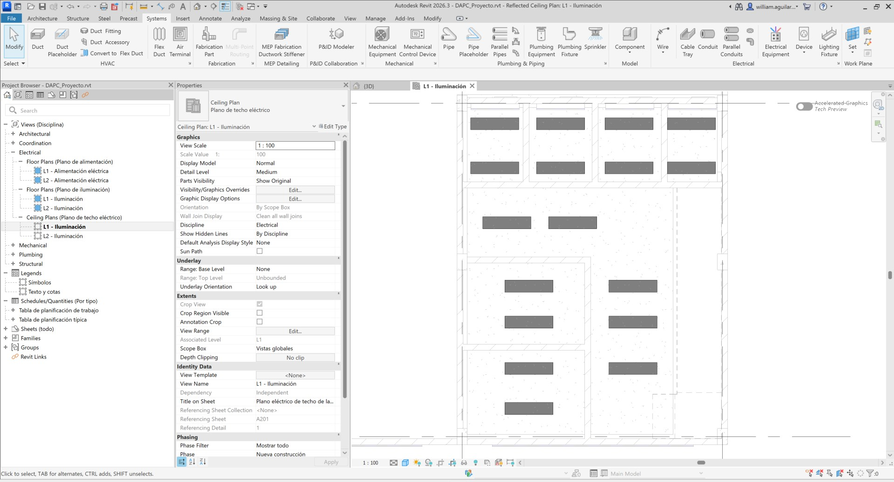

5. En la vista 3D, oculte la placa, la cubierta y algunos muros para visualizar la localización de las luminarias.

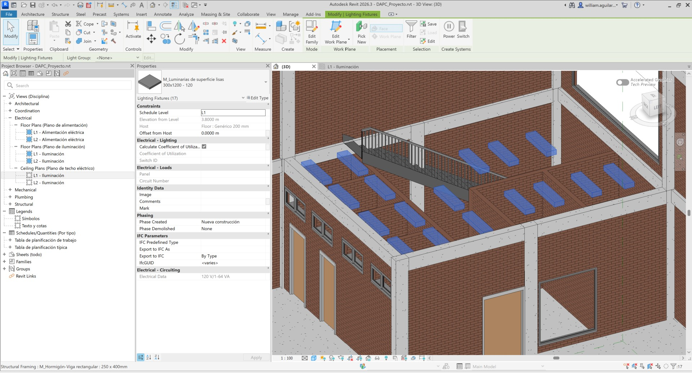

6. Antes de crear el circuito, con el comando **CM**, acceda a la ventana de creación de componentes e incorpore la familia _/Spanish_INTL/Eléctrico/MEP/Energía Eléctrica/Distribución/M_Cuadro de control de accesorios e iluminación - 208V MLO.rfa_ (_/English/US/Electrical/MEP/Electric Power/Distribution/M_Lighting and Appliance Panelboard - 208V MLO.rfa_)

Los dos tipos de tableros de control por defecto para accesorios de iluminación son:

* MCB: Miniature Circuit Breaker (panel eléctrico con sistema de interrupción automática por sobrecarga)
* MLO: Main Lug Only (panel eléctrico o subpanel diseñado para distribuir la potencia de los circuitos y sin un interruptor principal)

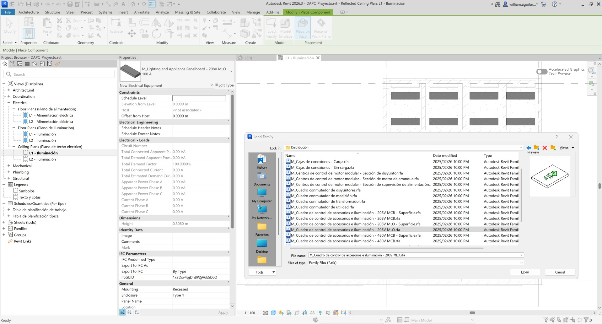

7. Abra la vista _Electrical / L1 - Alimentación eléctrica_ y Localice un panel eléctrico de iluminación MLO de 225 A en el muro de la fachada principal.

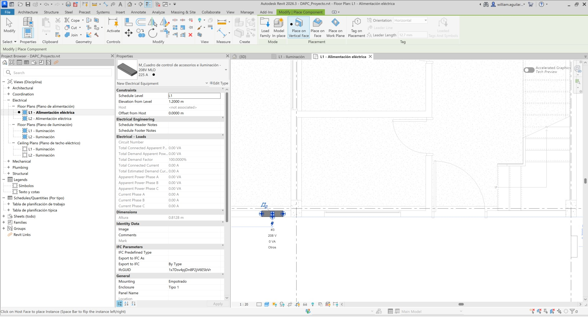

8. En la vista _L1 - Iluminación_, seleccione todas las luminarias. En el menú _Modify | Lighting Fixtures / Create Systems / Power_, cree el circuito eléctrico de iluminación conectando al panel eléctrico y con cableado _Chamfered Wire_. Automáticamente Revit trazará el circuito.  

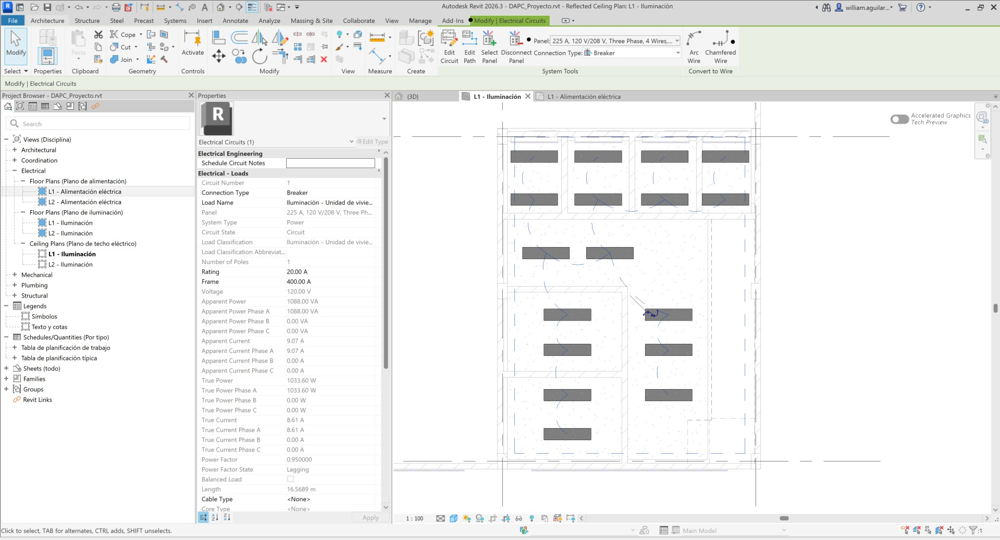

Una vez terminada la definición del circuito, podrá visualizar el esquema de cableado. 

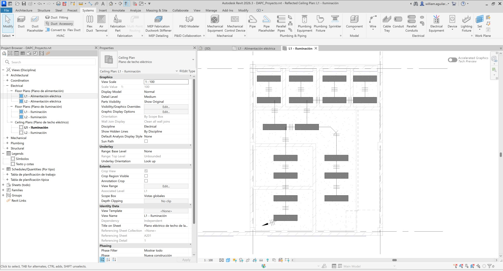

9. En la vista L1 - Alimentación eléctrica, consulte las propiedades del tablero eléctrico, podrá observar que para el ejemplo, el voltaje total aparente (VA) de todas las lámparas conectadas es de 1088 VA.

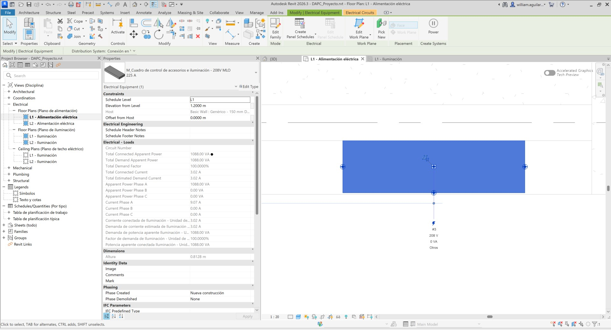

> Tenga en cuenta que el trazado del circuito no crea las tuberías de conexión entre las luminarias y el tablero.
>
> Investigue, incorpore y conecte al circuito de iluminación, los interruptores requeridos.

## 2. Localización de tomacorrientes

1. Desde la ventana de componentes (comando **CM**), agregue la familia de tomacorrientes _/Spanish_INTL/Eléctrico/MEP/Energía Eléctrica/Terminales/M_Toma doble.rfa_ (_/English/US/Electrical/MEP/Electric Power/Terminals/M_Duplex Receptacle.rfa_)

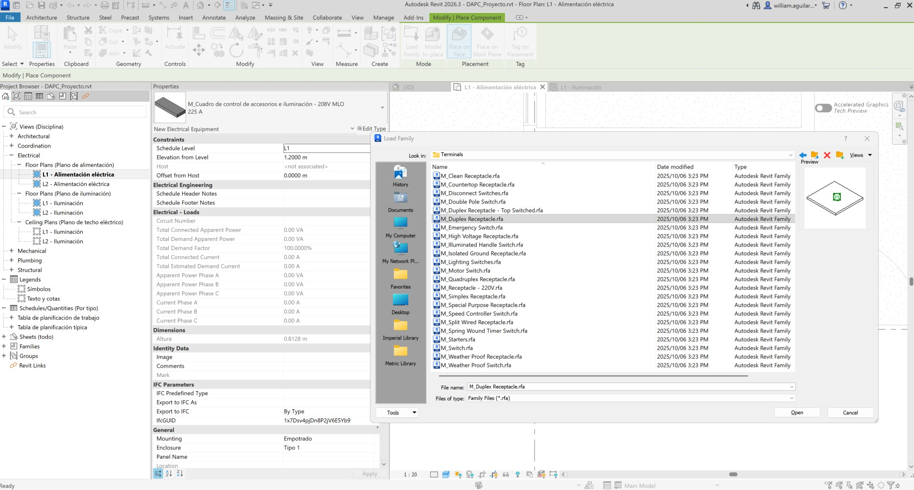

2. Incorpore al plano de planta _L1 - Alimentación eléctrica_, los tomacorrientes estándar de pared requeridos en las oficinas. Por defecto, serán localizados a 0.46 m con respecto a la placa de piso.

> El ejemplo de clase incluye las tomacorrientes de una de las oficinas, para su proyecto, incluya todas las tomas reqieridas. 

Tipos:
* Standard: (tomacorriente regular sin protección de choques eléctricos) 
* GFCI: Ground Fault Circuit Interrupter (tomacorriente con protección de choques eléctricos fatales)

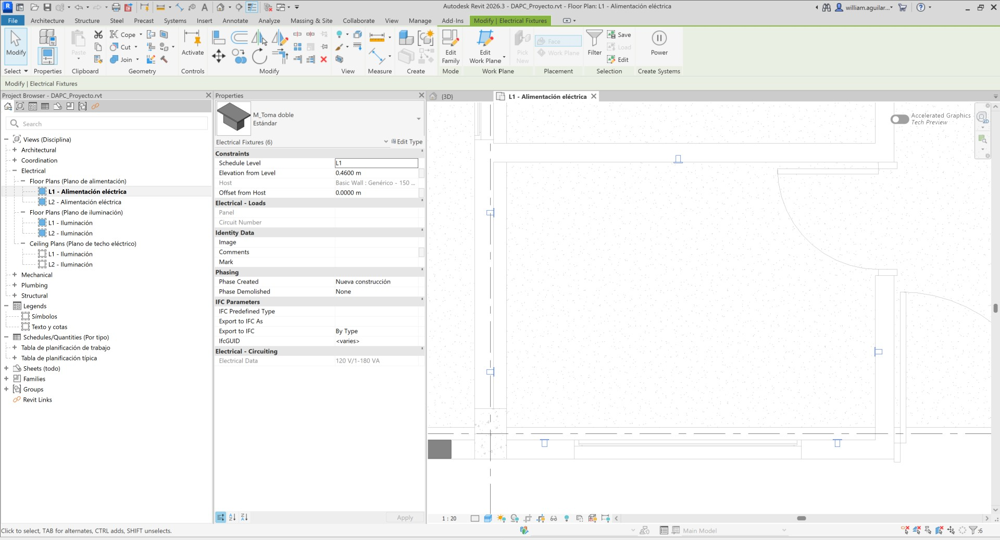

3. Realice una visualización en la vista 3D, oculte algunos muros para que pueda visualizar los elementos.

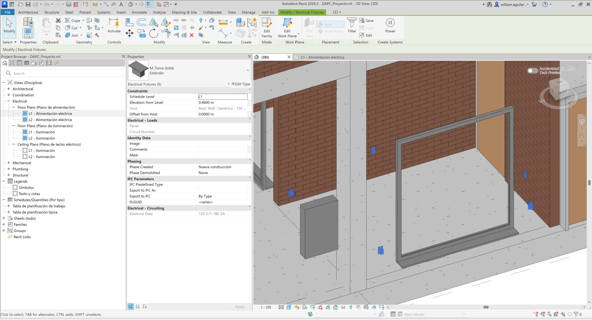

4. En la vista _L1 - Alimentación eléctrica_, seleccione todas las tomas y cree un circuito conectando a la caja eléctrica principal. Consulte el tablero, podrá observar que el voltaje aparente ha cambiado de 1088 VA a 2140.73 VA.

> Para verificar la conectividad del circuito, localice el puntero del mouse sobre una de las líneas del circuito (sin hacer clic o seleccionar el elemento), y luego oprima la tecla <kbd>TAB</kbd>.

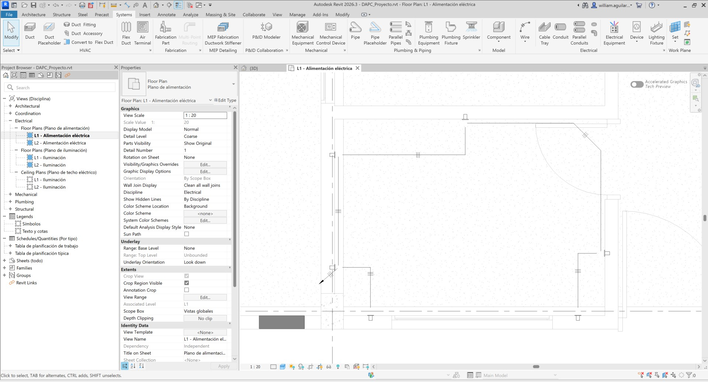

## 3. Dibujo 3D de tuberías

Una vez se ha resuelto la distribución de los circuitos de iluminación cmy de tomacorrientes, es necesario realizar el trazado de las tuberías de conducción, para lo que es necesario incorporar cajas de conexión. 

1. Desde la ventana de componentes (comando **CM**), agregue la familia de tomacorrientes _/Spanish_INTL/Tubo/Uniones/RNC/M_Caja de conexiones de tubo - Cruz - PVC.rfa_ (_/English/US/Conduit/Fittings/RNC/M_Conduit Junction Box - Cross - PVC.rfa_)

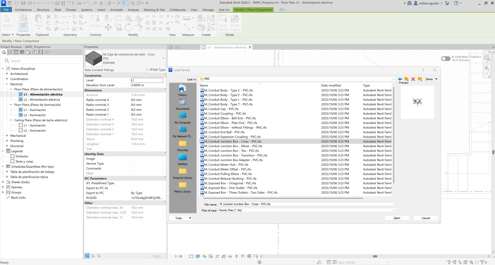

2. En la vista _L1 - Alimentación elétrica_, incorpore las cajas de conexión a una altura de 0.46 m y rote y ajuste su posición para que se alinee con cada tomacorriente.

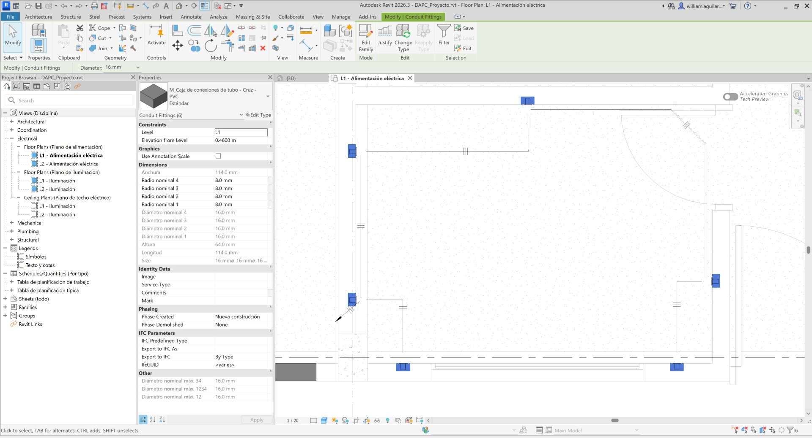

3. Visualice en 3D.

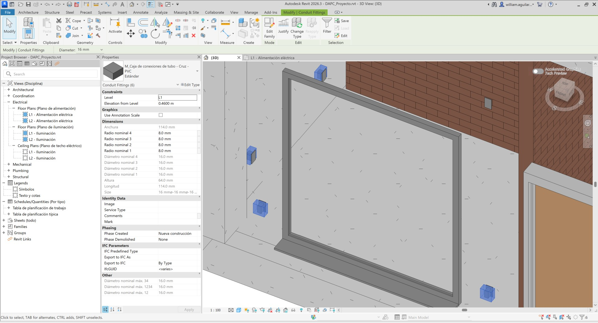

4. Utilizando la herramienta de conductos, realice las conexiones entre cajas.

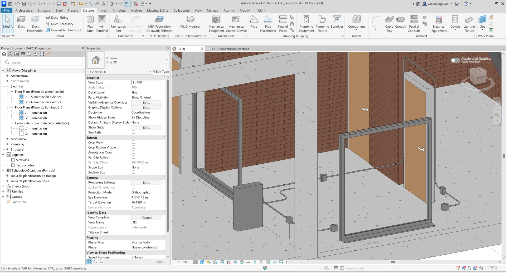

> Realice el mismo procedimiento anterior para el circuito de iluminación.

## Actividades de proyecto :triangular_ruler:

Utilizando la [Plantilla de Microsoft Word](../../file/report/R.DAPC.PlantillaInformeTecnico.docx) suministrada, cree un informe técnico mostrando las actividades desarrolladas en el orden presentado en esta actividad, junto con las consideraciones de diseño, los análisis y recomendaciones realizadas para las actividades del proyecto. Convierta a Adobe Acrobat (.pdf) y guarde en la carpeta _/report_ del repositorio de datos, nombre el archivo con el código de la actividad agregando al final la fecha de control documental en formato aaaammdd (p. ej. M01A01_20250531.pdf).

En la siguiente tabla se listan las actividades que deben ser desarrolladas y documentadas por cada grupo de proyecto o individualmente.

| Actividad | Alcance                                                                                                                                                                                                                                                                                                                                                                                                                                                                                                                                                                 |
|:----------|:------------------------------------------------------------------------------------------------------------------------------------------------------------------------------------------------------------------------------------------------------------------------------------------------------------------------------------------------------------------------------------------------------------------------------------------------------------------------------------------------------------------------------------------------------------------------|
| M02A04    | Individual: los numerales vistos en esta actividad son evaluados individualmente a través de un quiz de conocimiento y habilidad.                                                                                                                                                                                                                                                                                                                                                                                                                                       |
| M02A04    | Opcional en grupo: desarrolle los numerales indicados en esta actividad y presente un informe técnico detallado, con capturas de pantalla de todas las herramientas utilizadas para el dibujo en Autodesk Revit, del proyecto de la bodega diseñada en el Módulo 1 de Dibujo asistido por computadora con AutoCAD.                                                                                                                                                                                                                                                      |
| M02A04    | Opcional en grupo: en una tabla y al final del informe de avance de esta entrega, indique el detalle de las actividades realizadas por cada integrante de su grupo; utilice las siguientes columnas: `Nombre del integrante`, `Actividades realizadas`, `Tiempo dedicado en horas` (si presenta la entrega individualmente, no es necesaria la presentación de esta tabla).  Para actividades que no requieren del desarrollo de elementos de avance, indicar si realizo la lectura de la guía de clase y las lecturas indicadas al inicio en los requerimientos. | 

> Nota 1: para la revisión del proyecto final, guarde los libros cálculo de Microsoft Excel y los archivos generados en esta actividad, en las localizaciones indicadas en cada numeral.
>
> Nota 2: una vez el instructor realice la revisión y el estudiante presente las correcciones o ajustes solicitados, será necesario cargar una nueva versión de los archivos en el repositorio del proyecto, incluyendo o actualizando al final del nombre del archivo, la fecha de presentación en formato aaaammdd y manteniendo las versiones anteriores presentadas.

## Referencias

* https://www.autodesk.com/latam/products/bim-collaborate/overview
* https://www.graphisoft.com/es/try-archicad/explore-what-is-bim
* https://www.concrelab.com/deteccion-de-aceros
* https://revizto.com/es/programas-platformas-bim/
* [Centro - ¿Cómo generar un proyecto a través de la metodología BIM?](https://www.youtube.com/watch?v=uc1RjoR9HT0)

## Control de versiones

| Versión    | Descripción        | Autor                                       | Horas |
|------------|:-------------------|---------------------------------------------|:-----:|
| 2025.10.31 | Versión inicial.   | [rcfdtools](https://github.com/rcfdtools)   |  8   |

##

_R.DAPC es de uso libre para fines académicos, conoce nuestra licencia, cláusulas, condiciones de uso y como referenciar los contenidos publicados en este repositorio, dando [clic aquí](../../LICENSE.md)._

_¡Encontraste útil este repositorio!, apoya su difusión marcando este repositorio con una ⭐ o síguenos dando clic en el botón Follow de [rcfdtools](https://github.com/rcfdtools) en GitHub._

| [:arrow_backward: Anterior](../M03A03b/Readme.md) | [:house: Inicio](../../README.md) | [:beginner: Ayuda / Colabora](https://github.com/rcfdtools/R.DAPC/discussions/1) | [Siguiente :arrow_forward:](../M03A05/Readme.md) |
|----------------------------------------------------|-----------------------------------|----------------------------------------------------------------------------------|---------------------------------------------------|

[^1]: 