# Ejercicios entregables a desarrollar

> En el cuadro, la columna _P_ corresponde a actividades de proyecto.

## :globe_with_meridians:Módulo 1: Dibujo asistido por computadora con AutoCAD

| Ejercicio   | Descripción                                                                                                                                                                                                                                                                                                                                                                                     | Figura                                                                                       | P |
|:------------|:------------------------------------------------------------------------------------------------------------------------------------------------------------------------------------------------------------------------------------------------------------------------------------------------------------------------------------------------------------------------------------------------|----------------------------------------------------------------------------------------------|:-:|
| M01A00E01   | Aplicando los conceptos aprendidos absolutas y relativas, dibuje manualmente la siguiente figura con coordenadas absolutas de origen (250,250).                                                                                                                                                                                                                                                 |                  |   | 
| M01A00E02A  | Parte A: aplicando los conceptos aprendidos, cree secuencias de comandos (una con posiciones absolutas, otra con posiciones relativas y una final con ángulos) para la construcción de la figura presentada en el Ejercicio M01A00E01, pero con nodo de inicio en (X,Y) igual a los 2 últimos dígitos de su código de alumno.                                                                   |                  |   | 
| M01A00E02B  | Parte B: utilizando secuencias de comandos, cree los siguientes elementos: 1. Triángulo rectángulo de 50 metros de base por 20 metros de alto con orígen en la coordenada absoluta indicada, 2. Triángulo equilátero de 50 metros de lado con orígen en la coordenada absoluta indicada, 3. Triángulo rectángulo con área de 200 m² y con orígen en la coordenada absoluta indicada.            |                                                                                              |   | 
| M01A00E03   | Para practicar las herramientas de dibujo asistido, construiremos en clase el siguiente dibujo isométrico a partir de líneas, dibujaremos las vistas proyectadas y vistas planas lateral derecha, superior, frontal y posterior, calcularemos las áreas de cada cara proyectada y el volúmen total del sólido.                                                                                  | 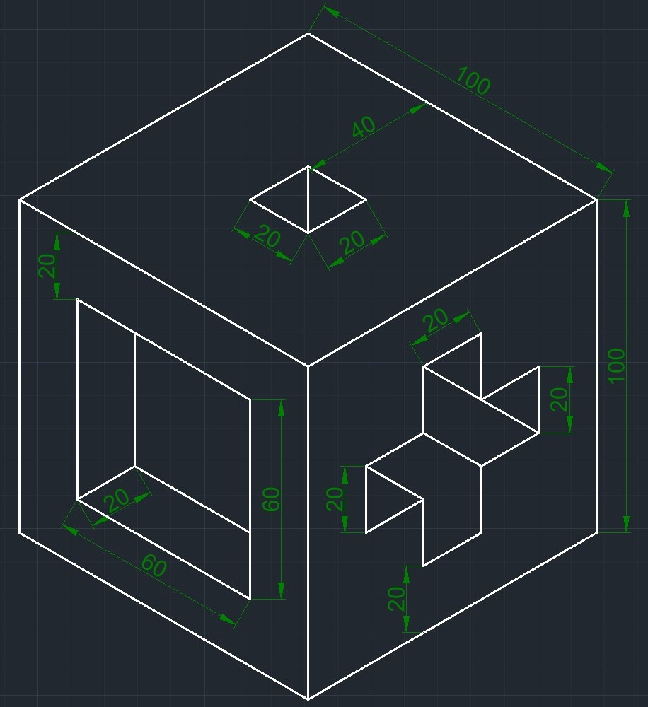                |   |
| M01A00E04   | Dibuje el siguiente dibujo isométrico a partir de líneas y dibuje las vistas proyectadas y planas lateral derecha, superior, frontal y posterior, calcule las áreas de cada cara proyectada y el volúmen total del sólido.                                                                                                                                                                      | 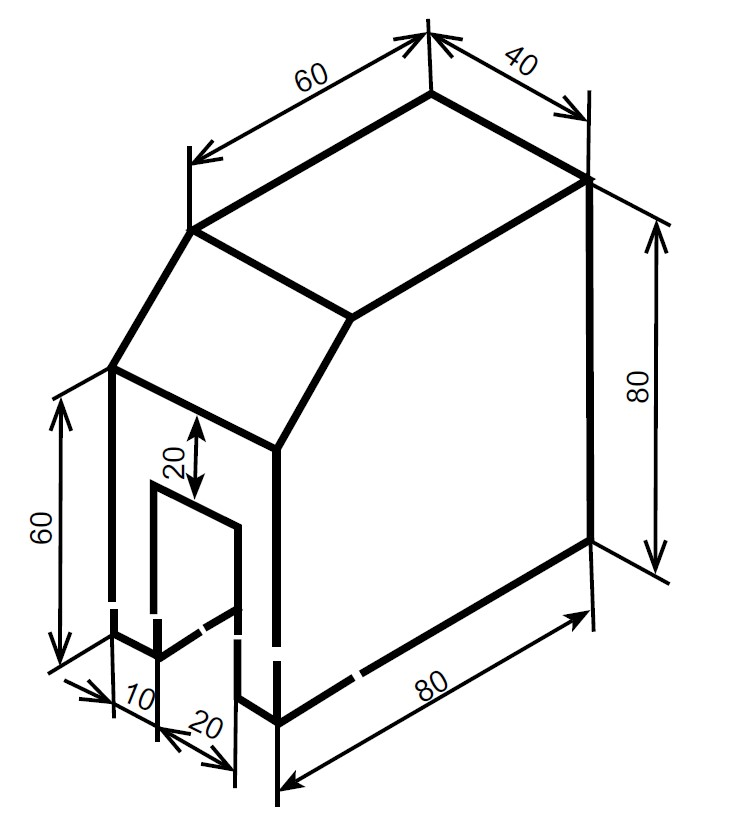                 |   |
| M01A00E05   | Dibuje el siguiente dibujo isométrico a partir de líneas y dibuje las vistas proyectadas y planas lateral derecha, superior, frontal y posterior, calcule las áreas de cada cara proyectada y el volúmen total del sólido.                                                                                                                                                                      | 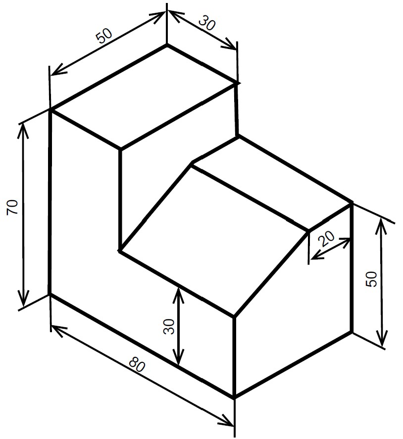                 |   |
| M01A00E06   | Dibuje el siguiente dibujo isométrico a partir de líneas y dibuje las vistas proyectadas y planas lateral derecha, superior, frontal y posterior, calcule las áreas de cada cara proyectada y el volúmen total del sólido.                                                                                                                                                                      | 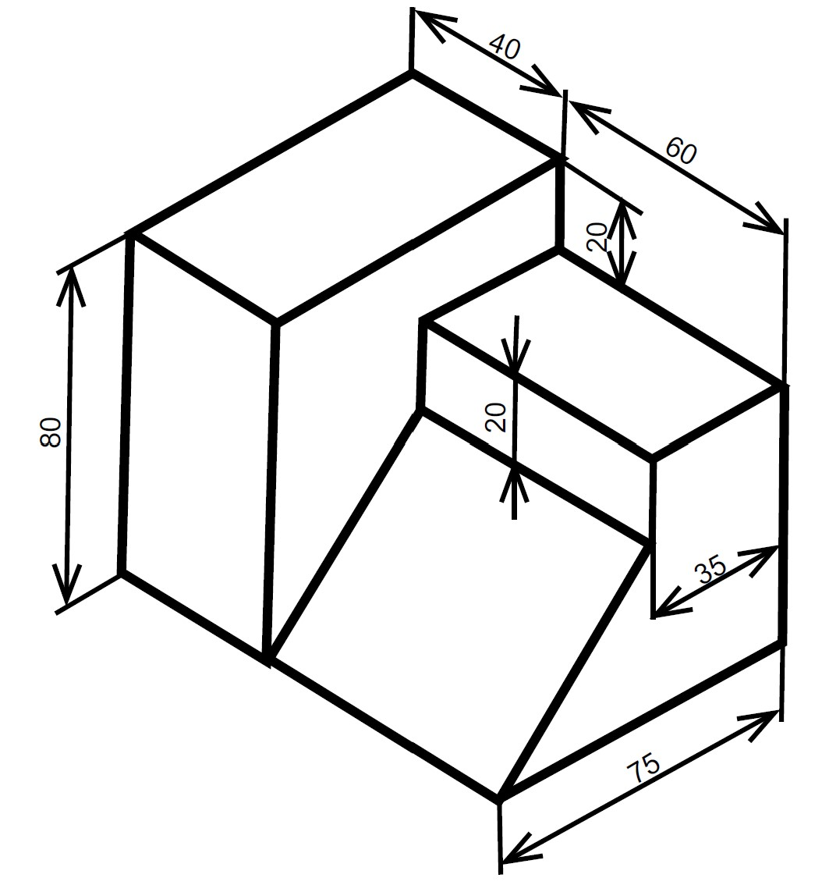                 |   |
| M01A00E07   | Dibuje el siguiente dibujo isométrico de una escalera a partir de líneas y dibuje las vistas proyectadas y planas lateral derecha, superior, frontal y posterior. El espesor del material de la escalera es 2.5.                                                                                                                                                                                | 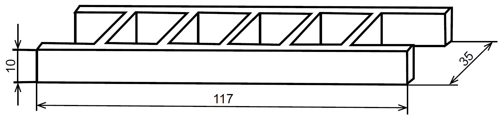                 |   |
| M01A01aE01  | En el archivo _M01A01a.dwg_, cree las capas establecidas en el catálogo [DAPC_AIALayerName.xlsx](../file/table/DAPC_AIALayerName.xlsx) para el curso DACP. En las descripciones incluya el nombre de la disciplina un guion y la descripción, p. ej., _Arquitectura - Área_                                                                                                                     |                                                                                              | ✓ | 
| M01A01bE01  | Para practicar las herramientas vistas en esta actividad, construiremos en clase el siguiente dibujo isométrico a partir de líneas, círculos y arcos, inscrita en una circunferencia de diámetro 10 metros.                                                                                                                                                                                     | 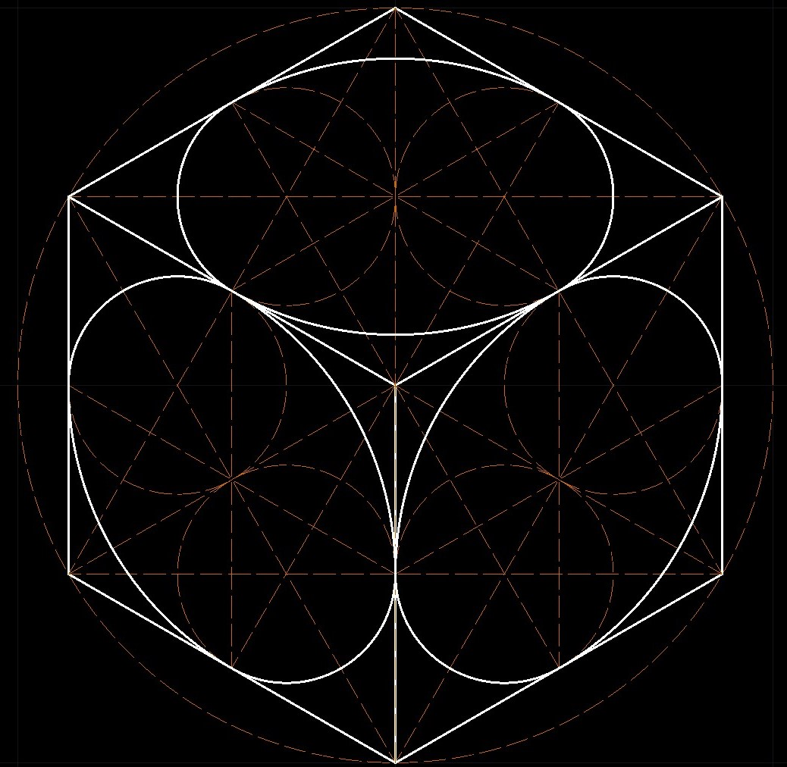              |   | 
| M01A01bE02  | Dibuje la llave de tuercas presentada en la ilustración.                                                                                                                                                                                                                                                                                                                                        | 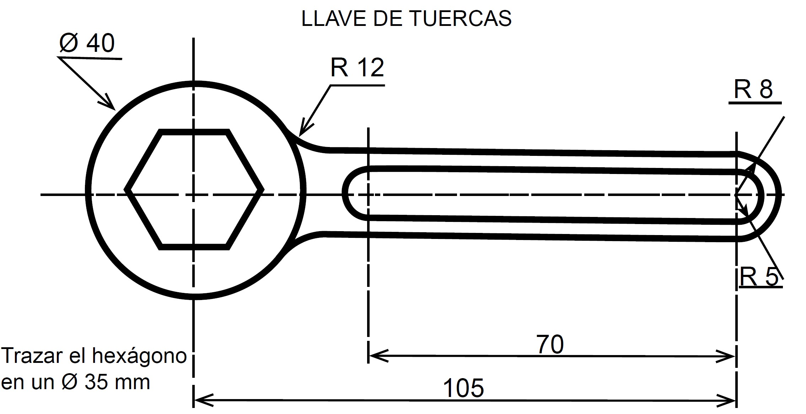               |   | 
| M01A01bE03  | Dibuje las siguientes formas geométricas con simetría axial mostradas en la ilustración, establezca libremente las dimensiones de cada figura.                                                                                                                                                                                                                                                  | 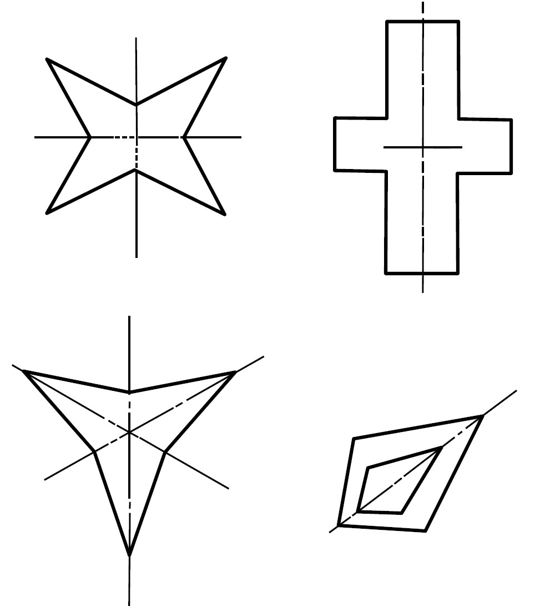               |   | 
| M01A01bE04  | Dibuje el siguiente elemento isométrico correspondiente a la cabeza de un martillo.                                                                                                                                                                                                                                                                                                             |                |   | 
| M01A01bE05  | Dibuje el siguiente elemento isométrico correspondiente a un contra pasador.                                                                                                                                                                                                                                                                                                                    |                |   | 
| M01A01bE06  | Dibuje el siguiente elemento isométrico correspondiente a un tabique o ladrillo con perforaciones, en la cara frontal utilice la herramienta Mirror.                                                                                                                                                                                                                                            | 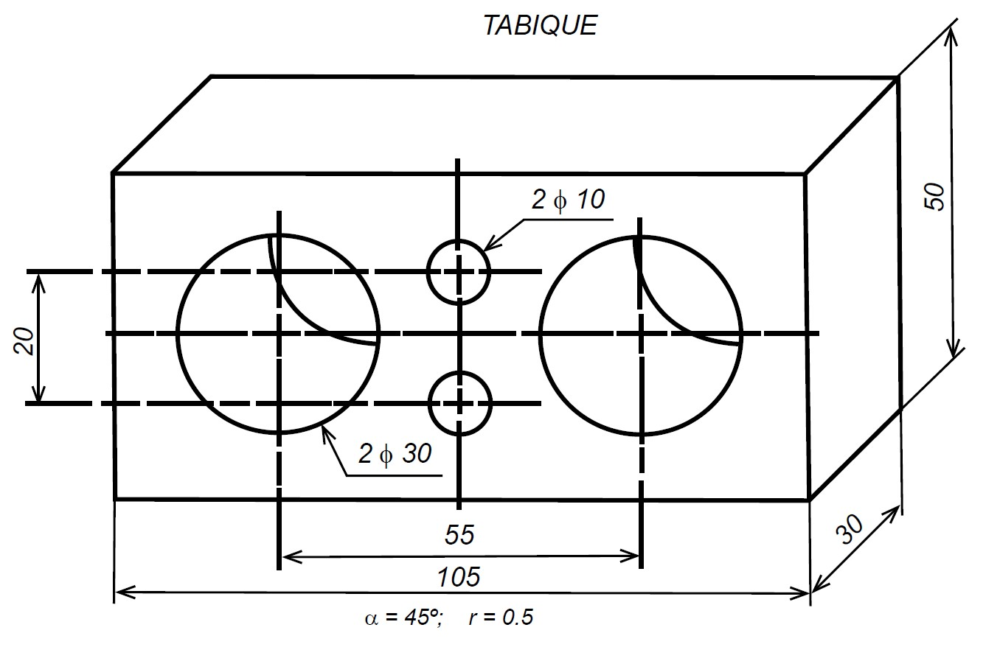               |   | 
| M01A01bE07  | Dibuje el siguiente elemento isométrico correspondiente a pieza mecánica con perforaciones.                                                                                                                                                                                                                                                                                                     | 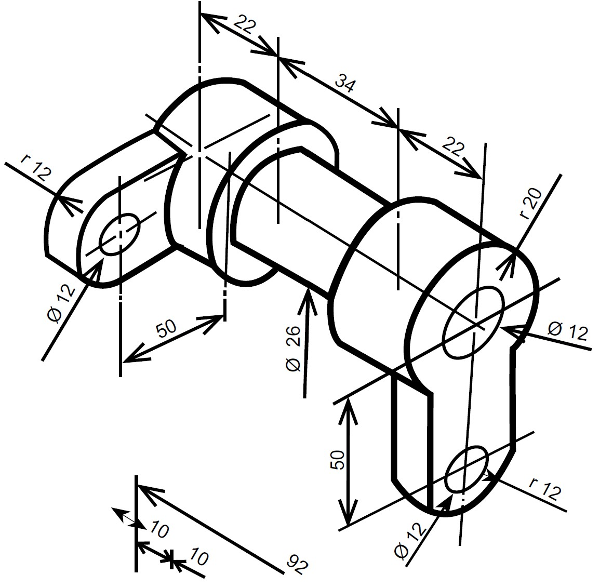               |   | 
| M01A01bE08  | Dibuje el siguiente elemento isométrico correspondiente a pieza mecánica con perforaciones.                                                                                                                                                                                                                                                                                                     | 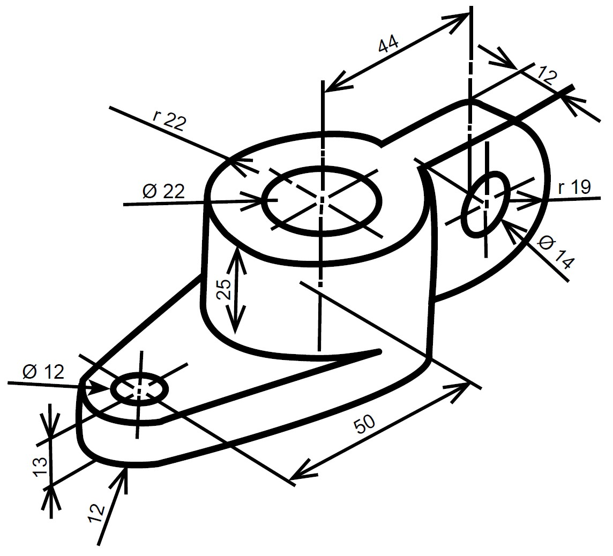               |   | 
| M01A01bE09  | Creando un array de 10 líneas horizontales por 10 líneas verticales y trazando líneas, cree el logo de la UECIJG. El ancho y alto de la figura debe corresponder a los 3 últimos dígitos de su código de estudiante.                                                                                                                                                                            |               |   | 
| M01A01cE00  | A partir de coordenadas de localización del centroide de una elipse y la longitud de los semiejes, generar las coordenadas de localización en 100 puntos sobre la elipse, trazar la polilínea en AutoCAD y luego suavizarla. Utilizando los parámetros de cálculo, trace con la herramienta **ELLIPSE**, la elipse compuesta por arcos y compare su longitud con la trazada a partir de puntos. |         |   | 
| M01A01cE01  | Trace las líneas constructivas y dibuje óvalos en AutoCAD a partir de arcos circulares, conociendo: eje mayor, eje menor, los dos ejes.                                                                                                                                                                                                                                                         |                                                                                              |   | 
| M01A01cE02  | Trace las líneas constructivas y dibuje ovoides en AutoCAD a partir de arcos circulares, conociendo: eje mayor, eje menor, los dos ejes.                                                                                                                                                                                                                                                        |                                                                                              |   | 
| M01A01cE03A | Parte A: utilizando los conceptos aprendidos acerca de óvalos, cree un libro formulado en Excel para el trazado de una superelipse, el tamaño y localización de la figura es de libre elección.                                                                                                                                                                                                 |                                                                                              |   | 
| M01A01cE03B | Parte B: investigue la forma geométrica que tienen las pistas de atletismo y realice el trazado de su eje interno en AutoCAD, luego y utilizando la herramienta OFFSET, trace 8 líneas paralelas externas que le permitirán obtener 8 carriles y calcule la longitud de sus ejes centrales.                                                                                                     |                                                                                              |   | 
| M01A01cE04  | Utilizando los conceptos aprendidos acerca de parábolas, trace una parábola cuya longitud horizontal corresponda a los 3 últimos dígitos de su código de alumno y con longitud vertical correspondiente al 40% de la longitud horizontal. La elección del punto de orígen es libre.                                                                                                             | 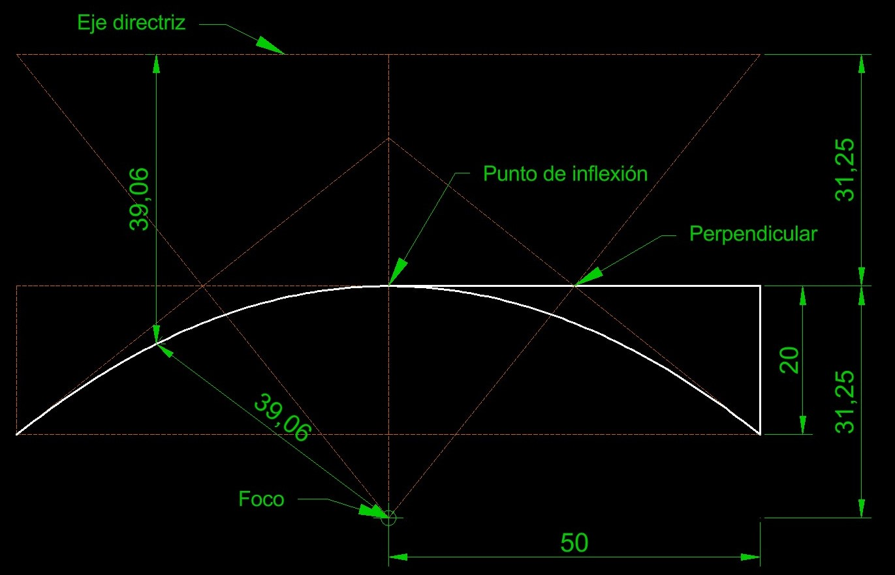        |   |
| M01A01cE05  | Utilizando los conceptos aprendidos de hipérbolas, trace una hipérbola cuya longitud horizontal o eje real corresponda a los 3 últimos dígitos de su código de alumno y con longitud vertical o eje imaginario correspondiente 2.25 veces la longitud horizontal. La elección del punto de orígen es libre.                                                                                     | 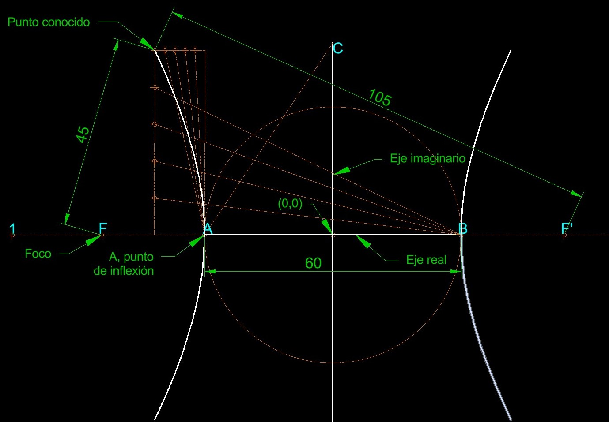       |   |
| M01A01cE06  | Utilizando los conceptos aprendidos, dibuje las funciones trigonométricas en x de 0 a π (0 a 360 grados) con orígen en (0,0). Luego, encuentre la escala proporcional de ajuste para que la longitud horizontal de las funciones trazadas, sea igual a los últimos 3 dígitos de su código de alumno, y escale las funciones a este tamaño.                                                      | 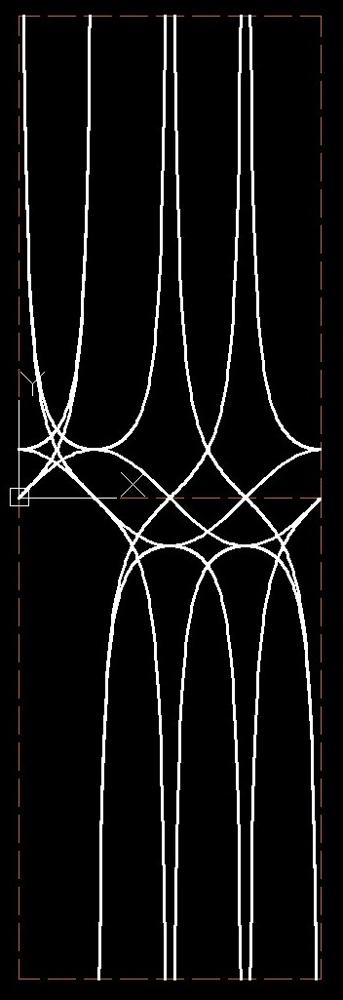 |   |

## :globe_with_meridians:Módulo 2: Sistemas de información geográfica

## :globe_with_meridians:Módulo 3: Metodología de modelado de información para la construcción (BIM) con REVIT